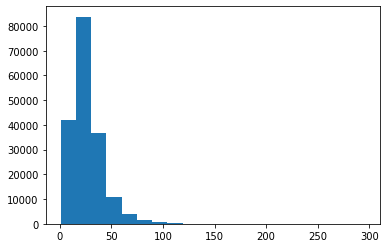
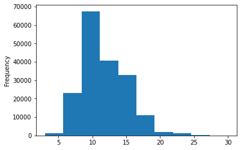
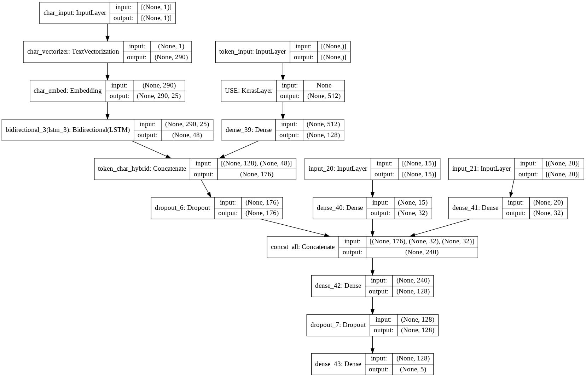
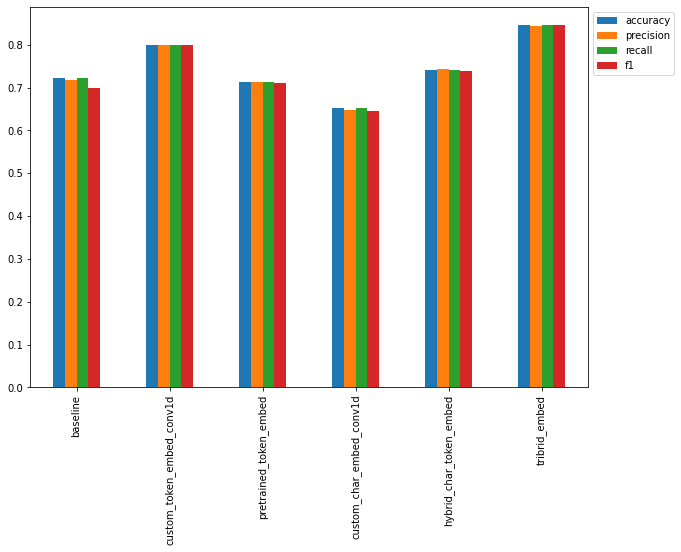
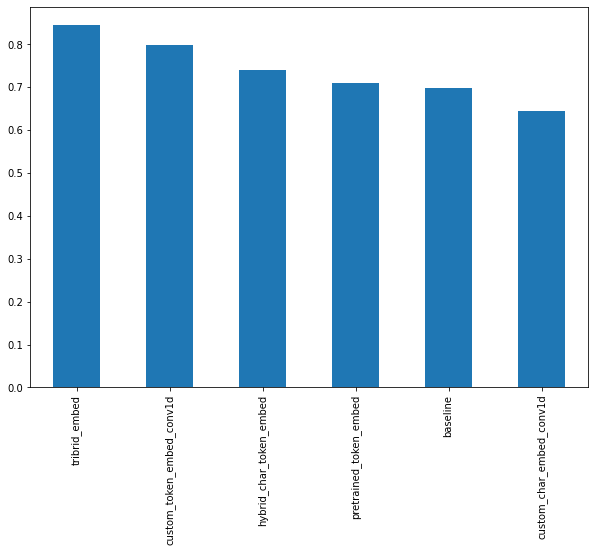

# Organizing Medical Abstracts using Natural Language Processing

The purpose of this notebook is to replicate an NLP model from [Neural networks for joint sentence classification in medical paper abstracts](https://arxiv.org/pdf/1612.05251.pdf) to make reading medical abstracts easier through labelling sentences into 5 categories:

* Background
* Objective
* Methods
* Results
* Conclusion

### Model Input
For example, can we train an NLP model which takes the following input (note: the following sample has had all numerical symbols replaced with "@"):

To investigate the efficacy of @ weeks of daily low-dose oral prednisolone in improving pain , mobility , and systemic low-grade inflammation in the short term and whether the effect would be sustained at @ weeks in older adults with moderate to severe knee osteoarthritis ( OA ). A total of @ patients with primary knee OA were randomized @:@ ; @ received @ mg/day of prednisolone and @ received placebo for @ weeks. Outcome measures included pain reduction and improvement in function scores and systemic inflammation markers. Pain was assessed using the visual analog pain scale ( @-@ mm ). Secondary outcome measures included the Western Ontario and McMaster Universities Osteoarthritis Index scores , patient global assessment ( PGA ) of the severity of knee OA , and @-min walk distance ( @MWD )., Serum levels of interleukin @ ( IL-@ ) , IL-@ , tumor necrosis factor ( TNF ) - , and high-sensitivity C-reactive protein ( hsCRP ) were measured. There was a clinically relevant reduction in the intervention group compared to the placebo group for knee pain , physical function , PGA , and @MWD at @ weeks. The mean difference between treatment arms ( @ % CI ) was @ ( @-@ @ ) , p < @ ; @ ( @-@ @ ) , p < @ ; @ ( @-@ @ ) , p < @ ; and @ ( @-@ @ ) , p < @ , respectively. Further , there was a clinically relevant reduction in the serum levels of IL-@ , IL-@ , TNF - , and hsCRP at @ weeks in the intervention group when compared to the placebo group. These differences remained significant at @ weeks. The Outcome Measures in Rheumatology Clinical Trials-Osteoarthritis Research Society International responder rate was @ % in the intervention group and @ % in the placebo group ( p < @ ). Low-dose oral prednisolone had both a short-term and a longer sustained effect resulting in less knee pain , better physical function , and attenuation of systemic inflammation in older patients with knee OA ( ClinicalTrials.gov identifier NCT@ ).

### Model output
And returns the following output:

['###24293578\n',

 'OBJECTIVE\tTo investigate the efficacy of @ weeks of daily low-dose oral prednisolone in improving pain , mobility , and systemic low-grade inflammation in the short term and whether the effect would be sustained at @ weeks in older adults with moderate to severe knee osteoarthritis ( OA ) .\n',

 'METHODS\tA total of @ patients with primary knee OA were randomized @:@ ; @ received @ mg/day of prednisolone and @ received placebo for @ weeks .\n',

 'METHODS\tOutcome measures included pain reduction and improvement in function scores and systemic inflammation markers .\n',

 'METHODS\tPain was assessed using the visual analog pain scale ( @-@ mm ) .\n',

 'METHODS\tSecondary outcome measures included the Western Ontario and McMaster Universities Osteoarthritis Index scores , patient global assessment ( PGA ) of the severity of knee OA , and @-min walk distance ( @MWD ) .\n',

 'METHODS\tSerum levels of interleukin @ ( IL-@ ) , IL-@ , tumor necrosis factor ( TNF ) - , and high-sensitivity C-reactive protein ( hsCRP ) were measured .\n',

 'RESULTS\tThere was a clinically relevant reduction in the intervention group compared to the placebo group for knee pain , physical function , PGA , and @MWD at @ weeks .\n',

 'RESULTS\tThe mean difference between treatment arms ( @ % CI ) was @ ( @-@ @ ) , p < @ ; @ ( @-@ @ ) , p < @ ; @ ( @-@ @ ) , p < @ ; and @ ( @-@ @ ) , p < @ , respectively .\n',

 'RESULTS\tFurther , there was a clinically relevant reduction in the serum levels of IL-@ , IL-@ , TNF - , and hsCRP at @ weeks in the intervention group when compared to the placebo group .\n',

 'RESULTS\tThese differences remained significant at @ weeks .\n',

 'RESULTS\tThe Outcome Measures in Rheumatology Clinical Trials-Osteoarthritis Research Society International responder rate was @ % in the intervention group and @ % in the placebo group ( p < @ ) .\n',

 'CONCLUSIONS\tLow-dose oral prednisolone had both a short-term and a longer sustained effect resulting in less knee pain , better physical function , and attenuation of systemic inflammation in older patients with knee OA ( ClinicalTrials.gov identifier NCT@ ) .\n',
 '\n']


```python
!nvidia-smi -L
```

    GPU 0: Tesla K80 (UUID: GPU-251a302f-9da4-5a3a-e284-e934a3b01a03)


## Get the data
Data is from [PubMed 200k RCT: a Dataset for Sequential Sentence Classification in Medical Abstracts](https://arxiv.org/abs/1710.06071)


```python
!git clone https://github.com/Franck-Dernoncourt/pubmed-rct.git
!ls pubmed-rct
```

    Cloning into 'pubmed-rct'...
    remote: Enumerating objects: 33, done.
    remote: Counting objects: 100% (3/3), done.
    remote: Compressing objects: 100% (3/3), done.
    remote: Total 33 (delta 0), reused 0 (delta 0), pack-reused 30
    Unpacking objects: 100% (33/33), done.
    PubMed_200k_RCT
    PubMed_200k_RCT_numbers_replaced_with_at_sign
    PubMed_20k_RCT
    PubMed_20k_RCT_numbers_replaced_with_at_sign
    README.md


```python
# Check what files are in the PubMed dataset
!ls pubmed-rct/PubMed_20k_RCT_numbers_replaced_with_at_sign/
```

    dev.txt  test.txt  train.txt


It's already been split into train, test, valid sets. Nice.


```python
# Start by using the 20k dataset
data_dir = "pubmed-rct/PubMed_20k_RCT_numbers_replaced_with_at_sign/"
```


```python
# Check all of the filenames in the target directory
import os
filenames = [data_dir + filename for filename in os.listdir(data_dir)]
filenames
```


    ['pubmed-rct/PubMed_20k_RCT_numbers_replaced_with_at_sign/dev.txt',
     'pubmed-rct/PubMed_20k_RCT_numbers_replaced_with_at_sign/train.txt',
     'pubmed-rct/PubMed_20k_RCT_numbers_replaced_with_at_sign/test.txt']


## Preprocess and Visualize the Data


```python
def get_lines(filename):
  """
  Reads filename (a text filename) and returns the lines of text as a list

  See https://realpython.com/read-write-files-python/ for resource
  """
  with open(filename, "r") as f:
    return f.readlines()
```


```python
train_lines = get_lines(data_dir + 'train.txt')
train_lines[:27]
```


    ['###24293578\n',
     'OBJECTIVE\tTo investigate the efficacy of @ weeks of daily low-dose oral prednisolone in improving pain , mobility , and systemic low-grade inflammation in the short term and whether the effect would be sustained at @ weeks in older adults with moderate to severe knee osteoarthritis ( OA ) .\n',
     'METHODS\tA total of @ patients with primary knee OA were randomized @:@ ; @ received @ mg/day of prednisolone and @ received placebo for @ weeks .\n',
     'METHODS\tOutcome measures included pain reduction and improvement in function scores and systemic inflammation markers .\n',
     'METHODS\tPain was assessed using the visual analog pain scale ( @-@ mm ) .\n',
     'METHODS\tSecondary outcome measures included the Western Ontario and McMaster Universities Osteoarthritis Index scores , patient global assessment ( PGA ) of the severity of knee OA , and @-min walk distance ( @MWD ) .\n',
     'METHODS\tSerum levels of interleukin @ ( IL-@ ) , IL-@ , tumor necrosis factor ( TNF ) - , and high-sensitivity C-reactive protein ( hsCRP ) were measured .\n',
     'RESULTS\tThere was a clinically relevant reduction in the intervention group compared to the placebo group for knee pain , physical function , PGA , and @MWD at @ weeks .\n',
     'RESULTS\tThe mean difference between treatment arms ( @ % CI ) was @ ( @-@ @ ) , p < @ ; @ ( @-@ @ ) , p < @ ; @ ( @-@ @ ) , p < @ ; and @ ( @-@ @ ) , p < @ , respectively .\n',
     'RESULTS\tFurther , there was a clinically relevant reduction in the serum levels of IL-@ , IL-@ , TNF - , and hsCRP at @ weeks in the intervention group when compared to the placebo group .\n',
     'RESULTS\tThese differences remained significant at @ weeks .\n',
     'RESULTS\tThe Outcome Measures in Rheumatology Clinical Trials-Osteoarthritis Research Society International responder rate was @ % in the intervention group and @ % in the placebo group ( p < @ ) .\n',
     'CONCLUSIONS\tLow-dose oral prednisolone had both a short-term and a longer sustained effect resulting in less knee pain , better physical function , and attenuation of systemic inflammation in older patients with knee OA ( ClinicalTrials.gov identifier NCT@ ) .\n',
     '\n',
     '###24854809\n',
     'BACKGROUND\tEmotional eating is associated with overeating and the development of obesity .\n',
     'BACKGROUND\tYet , empirical evidence for individual ( trait ) differences in emotional eating and cognitive mechanisms that contribute to eating during sad mood remain equivocal .\n',
     'OBJECTIVE\tThe aim of this study was to test if attention bias for food moderates the effect of self-reported emotional eating during sad mood ( vs neutral mood ) on actual food intake .\n',
     'OBJECTIVE\tIt was expected that emotional eating is predictive of elevated attention for food and higher food intake after an experimentally induced sad mood and that attentional maintenance on food predicts food intake during a sad versus a neutral mood .\n',
     'METHODS\tParticipants ( N = @ ) were randomly assigned to one of the two experimental mood induction conditions ( sad/neutral ) .\n',
     'METHODS\tAttentional biases for high caloric foods were measured by eye tracking during a visual probe task with pictorial food and neutral stimuli .\n',
     'METHODS\tSelf-reported emotional eating was assessed with the Dutch Eating Behavior Questionnaire ( DEBQ ) and ad libitum food intake was tested by a disguised food offer .\n',
     'RESULTS\tHierarchical multivariate regression modeling showed that self-reported emotional eating did not account for changes in attention allocation for food or food intake in either condition .\n',
     'RESULTS\tYet , attention maintenance on food cues was significantly related to increased intake specifically in the neutral condition , but not in the sad mood condition .\n',
     'CONCLUSIONS\tThe current findings show that self-reported emotional eating ( based on the DEBQ ) might not validly predict who overeats when sad , at least not in a laboratory setting with healthy women .\n',
     'CONCLUSIONS\tResults further suggest that attention maintenance on food relates to eating motivation when in a neutral affective state , and might therefore be a cognitive mechanism contributing to increased food intake in general , but maybe not during sad mood .\n',
     '\n']


So the labels are separated by tabs, and each abstract is separated by a number


```python
len(train_lines)
```


    210040


Hmm... let's turn this into a list of dictionaries?

```
[{'line_number': 0,
   'target': 'BACKGROUND',
   'text': 'Emotional eating is associated with overeating and the development of obesity. \n'
   'total_lines': 11},
   ...]
```

### Preprocessing Function

Steps:

1. Remove all the '\n'
2. Split the lines by abstract ID number? Or have a while loop that resets the total_lines counter each time we see a ###? Or we can remove abstract ID's and when we see a plain '\n' then we reset the counter 
3. Split each text line by tab and put the first part into `target` and second part into `text`


```python
# let's try messing around with two abstracts
two_abstracts = train_lines[:27]
```


```python
if '#' in two_abstracts[0]:
  print('success')
```

    success


```python
two_abstracts[1].split('\t')
```


    ['OBJECTIVE',
     'To investigate the efficacy of @ weeks of daily low-dose oral prednisolone in improving pain , mobility , and systemic low-grade inflammation in the short term and whether the effect would be sustained at @ weeks in older adults with moderate to severe knee osteoarthritis ( OA ) .\n']


```python
# drafting what I think should happen in the function
list_of_dictionaries = list()
for line in two_abstracts:
  if line.startswith('###'):
    abstract = []
  elif line.startswith('\n'):
    total_lines=len(abstract)
    for i, line in enumerate(abstract):
      split_line = line.split('\t')
      target = split_line[0]
      text = split_line[1]
      dictionary = {'line_number': i,
                    'target': target,
                    'text': text,
                    'total_lines': total_lines-1}
      list_of_dictionaries.append(dictionary)
  else:
    abstract.append(line)
```


```python
list_of_dictionaries[:5]
```


    [{'line_number': 0,
      'target': 'OBJECTIVE',
      'text': 'To investigate the efficacy of @ weeks of daily low-dose oral prednisolone in improving pain , mobility , and systemic low-grade inflammation in the short term and whether the effect would be sustained at @ weeks in older adults with moderate to severe knee osteoarthritis ( OA ) .\n',
      'total_lines': 11},
     {'line_number': 1,
      'target': 'METHODS',
      'text': 'A total of @ patients with primary knee OA were randomized @:@ ; @ received @ mg/day of prednisolone and @ received placebo for @ weeks .\n',
      'total_lines': 11},
     {'line_number': 2,
      'target': 'METHODS',
      'text': 'Outcome measures included pain reduction and improvement in function scores and systemic inflammation markers .\n',
      'total_lines': 11},
     {'line_number': 3,
      'target': 'METHODS',
      'text': 'Pain was assessed using the visual analog pain scale ( @-@ mm ) .\n',
      'total_lines': 11},
     {'line_number': 4,
      'target': 'METHODS',
      'text': 'Secondary outcome measures included the Western Ontario and McMaster Universities Osteoarthritis Index scores , patient global assessment ( PGA ) of the severity of knee OA , and @-min walk distance ( @MWD ) .\n',
      'total_lines': 11}]


```python
def preprocess_text_with_line_numbers(filename):
  """Returns a list of dictionaries of abstract line data.

  Takes in filename, reads its contents and sorts through each line,
  extracting things like the target label, the text of the sentence,
  how many sentences are in the current abstract and what sentence number
  the target line is.

  Args:
      filename: a string of the target text file to read and extract line data
      from.

  Returns:
      A list of dictionaries each containing a line from an abstract,
      the lines label, the lines position in the abstract and the total number
      of lines in the abstract where the line is from. For example:

      [{"target": 'CONCLUSION',
        "text": The study couldn't have gone better, turns out people are kinder than you think",
        "line_number": 8,
        "total_lines": 8}]
  """
  input_lines = get_lines(filename) # get all lines from filename
  abstract_lines = "" # create an empty abstract
  abstract_samples = [] # create an empty list of abstracts
  
  # Loop through each line in target file
  for line in input_lines:
    if line.startswith("###"): # check to see if line is an ID line
      abstract_id = line
      abstract_lines = "" # reset abstract string
    elif line.isspace(): # instead of '\n'
      abstract_line_split = abstract_lines.splitlines() # split abstract into separate lines

      # Iterate through each line in abstract and count them at the same time
      for abstract_line_number, abstract_line in enumerate(abstract_line_split):
        line_data = {} # create empty dict to store data from line
        target_text_split = abstract_line.split("\t") # split target label from text
        line_data["target"] = target_text_split[0] # get target label
        line_data["text"] = target_text_split[1].lower() # get target text and lower it
        line_data["line_number"] = abstract_line_number # what number line does the line appear in the abstract?
        line_data["total_lines"] = len(abstract_line_split) - 1 # how many total lines are in the abstract? (start from 0)
        abstract_samples.append(line_data) # add line data to abstract samples list
    
    else: # if the above conditions aren't fulfilled, the line contains a labelled sentence
      abstract_lines += line
  
  return abstract_samples
```


```python
# Get data from file and preprocess it
%%time
train_samples = preprocess_text_with_line_numbers(data_dir + "train.txt")
val_samples = preprocess_text_with_line_numbers(data_dir + "dev.txt") # dev is another name for validation set
test_samples = preprocess_text_with_line_numbers(data_dir + "test.txt")
print(len(train_samples), len(val_samples), len(test_samples))
```

    180040 30212 30135
    CPU times: user 540 ms, sys: 121 ms, total: 661 ms
    Wall time: 668 ms


### Visualize


```python
import pandas as pd
train_df = pd.DataFrame(train_samples)
val_df = pd.DataFrame(val_samples)
test_df = pd.DataFrame(test_samples)
train_df.head(14)
```


<div>
<style scoped>
    .dataframe tbody tr th:only-of-type {
        vertical-align: middle;
    }

    .dataframe tbody tr th {
        vertical-align: top;
    }

    .dataframe thead th {
        text-align: right;
    }
</style>
<table border="1" class="dataframe">
  <thead>
    <tr style="text-align: right;">
      <th></th>
      <th>target</th>
      <th>text</th>
      <th>line_number</th>
      <th>total_lines</th>
    </tr>
  </thead>
  <tbody>
    <tr>
      <th>0</th>
      <td>OBJECTIVE</td>
      <td>to investigate the efficacy of @ weeks of dail...</td>
      <td>0</td>
      <td>11</td>
    </tr>
    <tr>
      <th>1</th>
      <td>METHODS</td>
      <td>a total of @ patients with primary knee oa wer...</td>
      <td>1</td>
      <td>11</td>
    </tr>
    <tr>
      <th>2</th>
      <td>METHODS</td>
      <td>outcome measures included pain reduction and i...</td>
      <td>2</td>
      <td>11</td>
    </tr>
    <tr>
      <th>3</th>
      <td>METHODS</td>
      <td>pain was assessed using the visual analog pain...</td>
      <td>3</td>
      <td>11</td>
    </tr>
    <tr>
      <th>4</th>
      <td>METHODS</td>
      <td>secondary outcome measures included the wester...</td>
      <td>4</td>
      <td>11</td>
    </tr>
    <tr>
      <th>5</th>
      <td>METHODS</td>
      <td>serum levels of interleukin @ ( il-@ ) , il-@ ...</td>
      <td>5</td>
      <td>11</td>
    </tr>
    <tr>
      <th>6</th>
      <td>RESULTS</td>
      <td>there was a clinically relevant reduction in t...</td>
      <td>6</td>
      <td>11</td>
    </tr>
    <tr>
      <th>7</th>
      <td>RESULTS</td>
      <td>the mean difference between treatment arms ( @...</td>
      <td>7</td>
      <td>11</td>
    </tr>
    <tr>
      <th>8</th>
      <td>RESULTS</td>
      <td>further , there was a clinically relevant redu...</td>
      <td>8</td>
      <td>11</td>
    </tr>
    <tr>
      <th>9</th>
      <td>RESULTS</td>
      <td>these differences remained significant at @ we...</td>
      <td>9</td>
      <td>11</td>
    </tr>
    <tr>
      <th>10</th>
      <td>RESULTS</td>
      <td>the outcome measures in rheumatology clinical ...</td>
      <td>10</td>
      <td>11</td>
    </tr>
    <tr>
      <th>11</th>
      <td>CONCLUSIONS</td>
      <td>low-dose oral prednisolone had both a short-te...</td>
      <td>11</td>
      <td>11</td>
    </tr>
    <tr>
      <th>12</th>
      <td>BACKGROUND</td>
      <td>emotional eating is associated with overeating...</td>
      <td>0</td>
      <td>10</td>
    </tr>
    <tr>
      <th>13</th>
      <td>BACKGROUND</td>
      <td>yet , empirical evidence for individual ( trai...</td>
      <td>1</td>
      <td>10</td>
    </tr>
  </tbody>
</table>
</div>


Is dataset balanced?


```python
train_df.target.value_counts()
```


    METHODS        59353
    RESULTS        57953
    CONCLUSIONS    27168
    BACKGROUND     21727
    OBJECTIVE      13839
    Name: target, dtype: int64


Should be somewhat okay - objective will probably have the worst accuracy


```python
train_df.total_lines.plot.hist();
```


### Get lists of sentences


```python
# Convert abstract text lines into lists 
train_sentences = train_df["text"].tolist()
val_sentences = val_df["text"].tolist()
test_sentences = test_df["text"].tolist()
len(train_sentences), len(val_sentences), len(test_sentences)
```


    (180040, 30212, 30135)


```python
train_sentences[:10]
```


    ['to investigate the efficacy of @ weeks of daily low-dose oral prednisolone in improving pain , mobility , and systemic low-grade inflammation in the short term and whether the effect would be sustained at @ weeks in older adults with moderate to severe knee osteoarthritis ( oa ) .',
     'a total of @ patients with primary knee oa were randomized @:@ ; @ received @ mg/day of prednisolone and @ received placebo for @ weeks .',
     'outcome measures included pain reduction and improvement in function scores and systemic inflammation markers .',
     'pain was assessed using the visual analog pain scale ( @-@ mm ) .',
     'secondary outcome measures included the western ontario and mcmaster universities osteoarthritis index scores , patient global assessment ( pga ) of the severity of knee oa , and @-min walk distance ( @mwd ) .',
     'serum levels of interleukin @ ( il-@ ) , il-@ , tumor necrosis factor ( tnf ) - , and high-sensitivity c-reactive protein ( hscrp ) were measured .',
     'there was a clinically relevant reduction in the intervention group compared to the placebo group for knee pain , physical function , pga , and @mwd at @ weeks .',
     'the mean difference between treatment arms ( @ % ci ) was @ ( @-@ @ ) , p < @ ; @ ( @-@ @ ) , p < @ ; @ ( @-@ @ ) , p < @ ; and @ ( @-@ @ ) , p < @ , respectively .',
     'further , there was a clinically relevant reduction in the serum levels of il-@ , il-@ , tnf - , and hscrp at @ weeks in the intervention group when compared to the placebo group .',
     'these differences remained significant at @ weeks .']


### Make numeric labels


```python
# One hot encoding
from sklearn.preprocessing import OneHotEncoder
one_hot_encoder = OneHotEncoder(sparse=False)
```


```python
# One hot encode labels
from sklearn.preprocessing import OneHotEncoder
one_hot_encoder = OneHotEncoder(sparse=False)
train_labels_one_hot = one_hot_encoder.fit_transform(train_df["target"].to_numpy().reshape(-1, 1))
val_labels_one_hot = one_hot_encoder.transform(val_df["target"].to_numpy().reshape(-1, 1))
test_labels_one_hot = one_hot_encoder.transform(test_df["target"].to_numpy().reshape(-1, 1))

# Check what training labels look like
train_labels_one_hot
```


    array([[0., 0., 0., 1., 0.],
           [0., 0., 1., 0., 0.],
           [0., 0., 1., 0., 0.],
           ...,
           [0., 0., 0., 0., 1.],
           [0., 1., 0., 0., 0.],
           [0., 1., 0., 0., 0.]])


```python
# Label encoding
from sklearn.preprocessing import LabelEncoder
label_encoder = LabelEncoder()
train_labels_encoded = label_encoder.fit_transform(train_df["target"].to_numpy())
val_labels_encoded = label_encoder.transform(val_df["target"].to_numpy())
test_labels_encoded = label_encoder.transform(test_df["target"].to_numpy())

# Check what training labels look like
train_labels_encoded
```


    array([3, 2, 2, ..., 4, 1, 1])


```python
# Get class names and number of classes from LabelEncoder instance 
num_classes = len(label_encoder.classes_)
class_names = label_encoder.classes_
num_classes, class_names
```


    (5, array(['BACKGROUND', 'CONCLUSIONS', 'METHODS', 'OBJECTIVE', 'RESULTS'],
           dtype=object))


## Baseline Model - Naive Bayes with Tfidf

Explanation of Tfidf: https://monkeylearn.com/blog/what-is-tf-idf/

Explanation of Naive Bayes: https://heartbeat.comet.ml/understanding-naive-bayes-its-applications-in-text-classification-part-1-ec9caea4baae


```python
from sklearn.feature_extraction.text import TfidfVectorizer
from sklearn.naive_bayes import MultinomialNB
from sklearn.pipeline import Pipeline

model_0 = Pipeline([
                    ('tfidf', TfidfVectorizer()),
                    ('clf', MultinomialNB()) # clf = classifier
])
```


```python
model_0.fit(train_sentences, train_labels_encoded)
```


    Pipeline(memory=None,
             steps=[('tfidf',
                     TfidfVectorizer(analyzer='word', binary=False,
                                     decode_error='strict',
                                     dtype=<class 'numpy.float64'>,
                                     encoding='utf-8', input='content',
                                     lowercase=True, max_df=1.0, max_features=None,
                                     min_df=1, ngram_range=(1, 1), norm='l2',
                                     preprocessor=None, smooth_idf=True,
                                     stop_words=None, strip_accents=None,
                                     sublinear_tf=False,
                                     token_pattern='(?u)\\b\\w\\w+\\b',
                                     tokenizer=None, use_idf=True,
                                     vocabulary=None)),
                    ('clf',
                     MultinomialNB(alpha=1.0, class_prior=None, fit_prior=True))],
             verbose=False)


```python
# Evaluate our baseline model
baseline_score = model_0.score(val_sentences, val_labels_encoded)
baseline_score # accuracy
```


    0.7218323844829869


72% accuracy is pretty good for a baseline! 


```python
baseline_preds = model_0.predict(val_sentences)
baseline_preds
```


    array([4, 1, 3, ..., 4, 4, 1])


```python
# Download helper functions script from zero-to-mastery tensorflow github
!wget https://raw.githubusercontent.com/mrdbourke/tensorflow-deep-learning/main/extras/helper_functions.py
```

    --2021-10-23 20:28:28--  https://raw.githubusercontent.com/mrdbourke/tensorflow-deep-learning/main/extras/helper_functions.py
    Resolving raw.githubusercontent.com (raw.githubusercontent.com)... 185.199.108.133, 185.199.109.133, 185.199.110.133, ...
    Connecting to raw.githubusercontent.com (raw.githubusercontent.com)|185.199.108.133|:443... connected.
    HTTP request sent, awaiting response... 200 OK
    Length: 10246 (10K) [text/plain]
    Saving to: ‘helper_functions.py’
    
    helper_functions.py 100%[===================>]  10.01K  --.-KB/s    in 0s      
    
    2021-10-23 20:28:28 (85.9 MB/s) - ‘helper_functions.py’ saved [10246/10246]
    


```python
# Import calculate_results helper function
from helper_functions import calculate_results

# Calculate baseline results
baseline_results = calculate_results(y_true=val_labels_encoded,
                                     y_pred=baseline_preds)
baseline_results
```


    {'accuracy': 72.1832384482987,
     'f1': 0.6989250353450294,
     'precision': 0.7186466952323352,
     'recall': 0.7218323844829869}


## Model 1: Conv1D with token embeddings

### Tokenization


```python
import tensorflow as tf
from tensorflow.keras.layers.experimental.preprocessing import TextVectorization

# use the default textvectorization parameter
text_vectorizer = TextVectorization(max_tokens=None, 
                                    standardize="lower_and_strip_punctuation",
                                    split='whitespace',
                                    ngrams=None, 
                                    output_mode='int',
                                    output_sequence_length=None # limit the length of sentence
                                    #pad_to_max_tokens=True # pad with 0s in shorter sentences?
                                    )
```


```python
# Find average number of tokens (words) in training sentences
round(sum([len(i.split()) for i in train_sentences])/len(train_sentences))
```


    26


```python
# set up text vectorization variables
max_vocab_length = 10000 # get the top 10000 most common words
max_length = 26 # max length our sequences will be (e.g. how many words from a sentence will model see)

text_vectorizer = TextVectorization(max_tokens=max_vocab_length,
                                    output_mode='int',
                                    output_sequence_length=max_length)
```


```python
# Fit the text vectorizer to training text
text_vectorizer.adapt(train_sentences)
```


```python
# Choose a random sentence from training dataset and tokenize it
import random
random_sentence = random.choice(train_sentences)
print(f"Original text:\n {random_sentence}\
        \n\nVectorized version:")
text_vectorizer([random_sentence])
```

    Original text:
     ( funded by the population health research institute and others ; clinicaltrials.gov number , nct@ ; current controlled trials number , isrctn@ . )        
    
    Vectorized version:


    <tf.Tensor: shape=(1, 26), dtype=int64, numpy=
    array([[1644,   22,    2,  278,   97,  285, 1608,    3, 1854,  275,  154,
             176,  359,  106,  233,  154,  811,    0,    0,    0,    0,    0,
               0,    0,    0,    0]])>


```python
# Get the unique words in the vocab
words_in_vocab = text_vectorizer.get_vocabulary()
words_in_vocab[:5], words_in_vocab[-5:] 
```


    (['', '[UNK]', 'the', 'and', 'of'],
     ['ethnically', 'ethambutol', 'ert', 'epicardial', 'ephedrine'])


### Embedding


```python
from tensorflow.keras import layers

embedding = layers.Embedding(input_dim=max_vocab_length,
                             output_dim=128, #tensors best at working with things in pairs of 8
                             embeddings_initializer='uniform',
                             input_length=max_length)
```

Make sure embeddings work


```python
# Get a random sentence from training set
random_sentence = random.choice(train_sentences)
print(f"Original text:\n{random_sentence}\
      \n\nEmbedded version:")

# Embed the random sentence (turn it into numerical representation)
sample_embed = embedding(text_vectorizer([random_sentence]))
sample_embed
```

    Original text:
    the use of if-then plans might improve compliance with elastic wear when compared with routine clinical instructions .      
    
    Embedded version:


    <tf.Tensor: shape=(1, 26, 128), dtype=float32, numpy=
    array([[[-2.4674034e-02, -3.3922985e-02, -2.5583183e-02, ...,
              1.2832489e-02,  2.0244684e-02, -4.2964578e-02],
            [-7.9702586e-05,  6.3677803e-03, -1.1369362e-03, ...,
              6.6122636e-03,  1.5330199e-02, -2.6554395e-02],
            [-1.9929601e-02, -3.1192457e-02,  2.6923418e-04, ...,
              1.7899606e-02, -4.4475187e-02, -2.6590750e-04],
            ...,
            [-2.7836574e-02, -2.6257062e-02,  2.4737287e-02, ...,
              3.9593223e-02, -2.7609099e-02,  2.7641740e-02],
            [-2.7836574e-02, -2.6257062e-02,  2.4737287e-02, ...,
              3.9593223e-02, -2.7609099e-02,  2.7641740e-02],
            [-2.7836574e-02, -2.6257062e-02,  2.4737287e-02, ...,
              3.9593223e-02, -2.7609099e-02,  2.7641740e-02]]], dtype=float32)>


### Set up model


```python
# create a tensorboard callback (need to create a new one for each model)
from helper_functions import create_tensorboard_callback

# create a directory to save TensorBoard logs
SAVE_DIR = 'model_logs'
```


```python
inputs = layers.Input(shape=(1,), dtype=tf.string)
x = text_vectorizer(inputs)
x = embedding(x)
x = layers.Conv1D(filters=32, kernel_size=5, activation='relu')(x)
x = layers.GlobalMaxPool1D()(x)
outputs = layers.Dense(5, activation='softmax')(x)
model_1 = tf.keras.Model(inputs,outputs, name='Conv1D')

# Compile Conv1D model
model_1.compile(loss="categorical_crossentropy", # expects one_hot_encoding
                optimizer=tf.keras.optimizers.Adam(),
                metrics=["accuracy"])

# Get a summary of our 1D convolution model
model_1.summary()
```

    Model: "Conv1D"
    _________________________________________________________________
    Layer (type)                 Output Shape              Param #   
    =================================================================
    input_1 (InputLayer)         [(None, 1)]               0         
    _________________________________________________________________
    text_vectorization_1 (TextVe (None, 26)                0         
    _________________________________________________________________
    embedding (Embedding)        (None, 26, 128)           1280000   
    _________________________________________________________________
    conv1d (Conv1D)              (None, 22, 32)            20512     
    _________________________________________________________________
    global_max_pooling1d (Global (None, 32)                0         
    _________________________________________________________________
    dense (Dense)                (None, 5)                 165       
    =================================================================
    Total params: 1,300,677
    Trainable params: 1,300,677
    Non-trainable params: 0
    _________________________________________________________________


```python
# # Fit the model
# model_1_history = model_1.fit(train_sentences,
#                               train_labels_one_hot,
#                               epochs=5,
#                               validation_data=(val_sentences, val_labels_one_hot),
#                               callbacks=[create_tensorboard_callback(SAVE_DIR, 
#                                                                      "Conv1D")])
```

Hmm maybe input shape is incorrect? Let's put these into tf datasets


```python
# Turn our data into TensorFlow Datasets
train_dataset = tf.data.Dataset.from_tensor_slices((train_sentences, train_labels_one_hot))
valid_dataset = tf.data.Dataset.from_tensor_slices((val_sentences, val_labels_one_hot))
test_dataset = tf.data.Dataset.from_tensor_slices((test_sentences, test_labels_one_hot))
```


```python
train_dataset
```


    <TensorSliceDataset shapes: ((), (5,)), types: (tf.string, tf.float64)>


```python
# # Fit the model
# model_1_history = model_1.fit(train_dataset,
#                               epochs=5,
#                               validation_data=valid_dataset,
#                               callbacks=[create_tensorboard_callback(SAVE_DIR, 
#                                                                      "Conv1D")])
```

Oh wait it's expecting batches that's why it wants 3 dimensions

### Create tensorflow prefetched datasets

tf.data: https://www.tensorflow.org/guide/data

data performance: https://www.tensorflow.org/guide/data_performance

Also, do not shuffle the data because the sequence order matters


```python
# Take the TensorSliceDataset's and turn them into prefetched batches
train_dataset = train_dataset.batch(32).prefetch(tf.data.AUTOTUNE)
valid_dataset = valid_dataset.batch(32).prefetch(tf.data.AUTOTUNE)
test_dataset = test_dataset.batch(32).prefetch(tf.data.AUTOTUNE)

train_dataset
```


    <PrefetchDataset shapes: ((None,), (None, 5)), types: (tf.string, tf.float64)>


```python
# Fit the model
model_1_history = model_1.fit(train_dataset,
                              steps_per_epoch=int(0.1 * len(train_dataset)), # make it shorter to save time
                              epochs=3,
                              validation_data=valid_dataset,
                              validation_steps=int(0.1 * len(valid_dataset)),
                              callbacks=[create_tensorboard_callback(SAVE_DIR,"Conv1D")])
```

    Saving TensorBoard log files to: model_logs/Conv1D/20211023-202850
    Epoch 1/3
    562/562 [==============================] - 35s 10ms/step - loss: 0.8901 - accuracy: 0.6655 - val_loss: 0.6206 - val_accuracy: 0.7656
    Epoch 2/3
    562/562 [==============================] - 5s 9ms/step - loss: 0.6058 - accuracy: 0.7765 - val_loss: 0.5681 - val_accuracy: 0.7842
    Epoch 3/3
    562/562 [==============================] - 5s 9ms/step - loss: 0.5695 - accuracy: 0.7905 - val_loss: 0.5539 - val_accuracy: 0.7972


That's pretty good! I rushed through the tokenization and embeddings, so let's go back and improve those. Also notice that the model is overfitting.

### Improved Tokenization


```python
import numpy as np
```


```python
sent_lens = [len(sentence.split()) for sentence in train_sentences]
avg_sent_len = np.mean(sent_lens)
avg_sent_len
```


    26.338269273494777


```python
import matplotlib.pyplot as plt
plt.hist(sent_lens, bins=20);
```





```python
# What sent len covers 95% of examples?
output_seq_len = int(np.percentile(sent_lens, 95))
output_seq_len
```


    55


```python
# Maximum sequence length
np.max(sent_lens)
```


    296


```python
# From the dataset paper, we know the vocabulary size is 68k
max_tokens = 68000
```


```python
from tensorflow.keras.layers.experimental.preprocessing import TextVectorization

text_vectorizer = TextVectorization(max_tokens=max_tokens, # number of words in vocab
                                    output_sequence_length=output_seq_len)
```


```python
text_vectorizer.adapt(train_sentences)
```


```python
rct_20k_text_vocab = text_vectorizer.get_vocabulary()
```


```python
len(rct_20k_text_vocab)
```


    64841


```python
text_vectorizer(train_sentences[0])
```


    <tf.Tensor: shape=(55,), dtype=int64, numpy=
    array([   6,  331,    2,   79,    4,   53,    4,  161, 1127,  217, 2535,
              5,  557,   65, 1584,    3,  670, 5559,  636,    5,    2,  654,
           1137,    3,  180,    2,   70,  495,   36,  781,   15,   53,    5,
            350,  266,    7,  362,    6,  289,  517, 1430, 1743,    0,    0,
              0,    0,    0,    0,    0,    0,    0,    0,    0,    0,    0])>


### Improved Embedding Layer


```python
token_embed = layers.Embedding(input_dim=len(rct_20k_text_vocab), #length of vocabulary
                               output_dim=128,
                               mask_zero=True, #use masking to handle variable sequence lengths (will save space if we have lots of 0s in tensors)
                               name='token_embedding')
```


```python
inputs = layers.Input(shape=(1,), dtype=tf.string)
x = text_vectorizer(inputs)
x = token_embed(x)
x = layers.Conv1D(filters=32, kernel_size=5, activation='relu')(x)
x = layers.GlobalMaxPool1D()(x)
outputs = layers.Dense(5, activation='softmax')(x)
model_1 = tf.keras.Model(inputs,outputs, name='Conv1D')

# Compile Conv1D model
model_1.compile(loss="categorical_crossentropy", # expects one_hot_encoding
                optimizer=tf.keras.optimizers.Adam(),
                metrics=["accuracy"])

# Get a summary of our 1D convolution model
model_1.summary()


# Fit the model
model_1_history = model_1.fit(train_dataset,
                              steps_per_epoch=int(0.1 * len(train_dataset)), # make it shorter to save time
                              epochs=3,
                              validation_data=valid_dataset,
                              validation_steps=int(0.1 * len(valid_dataset)),
                              callbacks=[create_tensorboard_callback(SAVE_DIR,"Conv1D")])
```

    Model: "Conv1D"
    _________________________________________________________________
    Layer (type)                 Output Shape              Param #   
    =================================================================
    input_2 (InputLayer)         [(None, 1)]               0         
    _________________________________________________________________
    text_vectorization_2 (TextVe (None, 55)                0         
    _________________________________________________________________
    token_embedding (Embedding)  (None, 55, 128)           8299648   
    _________________________________________________________________
    conv1d_1 (Conv1D)            (None, 51, 32)            20512     
    _________________________________________________________________
    global_max_pooling1d_1 (Glob (None, 32)                0         
    _________________________________________________________________
    dense_1 (Dense)              (None, 5)                 165       
    =================================================================
    Total params: 8,320,325
    Trainable params: 8,320,325
    Non-trainable params: 0
    _________________________________________________________________
    Saving TensorBoard log files to: model_logs/Conv1D/20211023-203000
    Epoch 1/3
    562/562 [==============================] - 9s 15ms/step - loss: 0.8742 - accuracy: 0.6637 - val_loss: 0.6205 - val_accuracy: 0.7666
    Epoch 2/3
    562/562 [==============================] - 8s 14ms/step - loss: 0.5980 - accuracy: 0.7797 - val_loss: 0.5609 - val_accuracy: 0.7926
    Epoch 3/3
    562/562 [==============================] - 8s 14ms/step - loss: 0.5630 - accuracy: 0.7944 - val_loss: 0.5363 - val_accuracy: 0.7995


```python
model_1.evaluate(valid_dataset)
```

    945/945 [==============================] - 4s 5ms/step - loss: 0.5366 - accuracy: 0.8003


    [0.5365973711013794, 0.8003442287445068]


```python
# Make predictions
model_1_pred_probs = model_1.predict(valid_dataset)
model_1_pred_probs[:10], model_1_pred_probs.shape
```


    (array([[4.5356011e-01, 1.8339011e-01, 1.3820482e-02, 3.4326914e-01,
             5.9601841e-03],
            [3.9887631e-01, 3.4629750e-01, 8.1032846e-04, 2.5313497e-01,
             8.8086905e-04],
            [1.5182404e-01, 1.2331665e-02, 1.1331640e-03, 8.3464891e-01,
             6.2138562e-05],
            [8.7814303e-03, 5.0905799e-03, 9.3877995e-01, 3.2688093e-03,
             4.4079255e-02],
            [3.3531596e-03, 3.1587914e-02, 5.5697030e-01, 3.4295148e-03,
             4.0465912e-01],
            [1.3611651e-03, 1.8081605e-03, 5.0733221e-01, 3.1997700e-04,
             4.8917845e-01],
            [1.4299621e-04, 2.3505788e-03, 1.5105778e-01, 1.1069995e-04,
             8.4633791e-01],
            [5.8381134e-03, 1.4854255e-02, 3.4155825e-01, 4.7433656e-03,
             6.3300610e-01],
            [2.6943271e-05, 1.1172597e-03, 6.2948437e-03, 9.7845696e-06,
             9.9255121e-01],
            [1.6388346e-02, 3.5485810e-01, 1.5134475e-01, 1.2241950e-02,
             4.6516681e-01]], dtype=float32), (30212, 5))


```python
model_1_preds = tf.argmax(model_1_pred_probs, axis=1)
model_1_preds
```


    <tf.Tensor: shape=(30212,), dtype=int64, numpy=array([0, 0, 3, ..., 4, 4, 1])>


```python
model_1_results = calculate_results(y_true=val_labels_encoded,
                                    y_pred=model_1_preds)
model_1_results
```


    {'accuracy': 80.03442340791739,
     'f1': 0.7984531935000382,
     'precision': 0.7984055119927337,
     'recall': 0.8003442340791739}


Did better than our baseline, likely because there are pretty long sentences, so the deep learning model is able to learn more

## Model 2: Pretrained Universal Sentence Feature Extractor

The paper uses GloVe embeddings, but this isn't on tensorhub so let's try just using the universal sentence encoder


```python
import tensorflow_hub as hub
# create a keras layer using the Universal Sentence Encoder
sentence_encoder_layer = hub.KerasLayer('https://tfhub.dev/google/universal-sentence-encoder/4',
                                        input_shape=[], #this is blank because USE can take variable lengths
                                        dtype=tf.string,
                                        trainable=False,
                                        name = 'USE')
```


```python
inputs = layers.Input(shape=(), dtype='string')
x = sentence_encoder_layer(inputs)
x = layers.Dense(128, activation='relu')(x)
outputs = layers.Dense(num_classes, activation='softmax')(x)
model_2 = tf.keras.Model(inputs,outputs)

# Compile Conv1D model
model_2.compile(loss="categorical_crossentropy", # expects one_hot_encoding
                optimizer=tf.keras.optimizers.Adam(),
                metrics=["accuracy"])

# Get a summary of our pretrained model
model_2.summary()
```

    Model: "model"
    _________________________________________________________________
    Layer (type)                 Output Shape              Param #   
    =================================================================
    input_3 (InputLayer)         [(None,)]                 0         
    _________________________________________________________________
    USE (KerasLayer)             (None, 512)               256797824 
    _________________________________________________________________
    dense_2 (Dense)              (None, 128)               65664     
    _________________________________________________________________
    dense_3 (Dense)              (None, 5)                 645       
    =================================================================
    Total params: 256,864,133
    Trainable params: 66,309
    Non-trainable params: 256,797,824
    _________________________________________________________________


```python
# Fit the model
model_2_history = model_2.fit(train_dataset,
                              steps_per_epoch=int(0.1 * len(train_dataset)), # make it shorter to save time
                              epochs=3,
                              validation_data=valid_dataset,
                              validation_steps=int(0.1 * len(valid_dataset)),
                              callbacks=[create_tensorboard_callback(SAVE_DIR,"USE_basic")])
```

    Saving TensorBoard log files to: model_logs/USE_basic/20211023-203110
    Epoch 1/3
    562/562 [==============================] - 16s 23ms/step - loss: 0.9143 - accuracy: 0.6516 - val_loss: 0.7995 - val_accuracy: 0.6905
    Epoch 2/3
    562/562 [==============================] - 11s 19ms/step - loss: 0.7703 - accuracy: 0.7000 - val_loss: 0.7586 - val_accuracy: 0.7035
    Epoch 3/3
    562/562 [==============================] - 12s 21ms/step - loss: 0.7559 - accuracy: 0.7103 - val_loss: 0.7434 - val_accuracy: 0.7114


Hmm I have two thoughts on why it didn't perform as well as the Conv1D:

* We are working with scientific text
* Model is pretty simple

### Try the model with basically same set up as model 1 but different embedding


```python
# create a keras layer using the Universal Sentence Encoder
sentence_encoder_layer = hub.KerasLayer('https://tfhub.dev/google/universal-sentence-encoder/4',
                                        input_shape=[], #this is blank because USE can take variable lengths
                                        dtype=tf.string,
                                        trainable=False,
                                        name = 'USE')
```


```python
inputs = layers.Input(shape=(), dtype=tf.string)
x = sentence_encoder_layer(inputs)
x = layers.Reshape(target_shape=(512 , 1 ))(x)
x = layers.Conv1D(filters=32, kernel_size=5, activation='relu')(x)
x = layers.GlobalMaxPool1D()(x)
outputs = layers.Dense(5, activation='softmax')(x)
model_2_plus = tf.keras.Model(inputs,outputs, name='Conv1D_USE')

# Compile Conv1D model
model_2_plus.compile(loss="categorical_crossentropy", # expects one_hot_encoding
                optimizer=tf.keras.optimizers.Adam(),
                metrics=["accuracy"])

# Get a summary of our 1D convolution model
model_2_plus.summary()
```

    Model: "Conv1D_USE"
    _________________________________________________________________
    Layer (type)                 Output Shape              Param #   
    =================================================================
    input_4 (InputLayer)         [(None,)]                 0         
    _________________________________________________________________
    USE (KerasLayer)             (None, 512)               256797824 
    _________________________________________________________________
    reshape (Reshape)            (None, 512, 1)            0         
    _________________________________________________________________
    conv1d_2 (Conv1D)            (None, 508, 32)           192       
    _________________________________________________________________
    global_max_pooling1d_2 (Glob (None, 32)                0         
    _________________________________________________________________
    dense_4 (Dense)              (None, 5)                 165       
    =================================================================
    Total params: 256,798,181
    Trainable params: 357
    Non-trainable params: 256,797,824
    _________________________________________________________________


```python
# Fit the model
model_2_plus_history = model_2_plus.fit(train_dataset,
                              steps_per_epoch=int(0.1 * len(train_dataset)), # make it shorter to save time
                              epochs=3,
                              validation_data=valid_dataset,
                              validation_steps=int(0.1 * len(valid_dataset)),
                              callbacks=[create_tensorboard_callback(SAVE_DIR,"Conv1D_USE")])
```

    Saving TensorBoard log files to: model_logs/Conv1D_USE/20211023-203154
    Epoch 1/3
    562/562 [==============================] - 16s 24ms/step - loss: 1.4886 - accuracy: 0.3313 - val_loss: 1.4736 - val_accuracy: 0.3298
    Epoch 2/3
    562/562 [==============================] - 11s 20ms/step - loss: 1.4681 - accuracy: 0.3262 - val_loss: 1.4726 - val_accuracy: 0.3211
    Epoch 3/3
    562/562 [==============================] - 13s 22ms/step - loss: 1.4705 - accuracy: 0.3329 - val_loss: 1.4725 - val_accuracy: 0.3201


LOL it performed terribly. Maybe I should stick with having dense layers after the encoder

### Denser model


```python
sentence_encoder_layer = hub.KerasLayer('https://tfhub.dev/google/universal-sentence-encoder/4',
                                        input_shape=[], #this is blank because USE can take variable lengths
                                        dtype=tf.string,
                                        trainable=False,
                                        name = 'USE')

inputs = layers.Input(shape=(), dtype='string')
x = sentence_encoder_layer(inputs)
x = layers.Dense(128, activation='relu')(x)
x = layers.Dense(128, activation='relu')(x)
outputs = layers.Dense(num_classes, activation='softmax')(x)
model_2_denser = tf.keras.Model(inputs,outputs)

# Compile Conv1D model
model_2_denser.compile(loss="categorical_crossentropy", # expects one_hot_encoding
                optimizer=tf.keras.optimizers.Adam(),
                metrics=["accuracy"])

# Get a summary of our pretrained model
model_2_denser.summary()

# Fit the model
model_2_denser_history = model_2_denser.fit(train_dataset,
                              steps_per_epoch=int(0.1 * len(train_dataset)), # make it shorter to save time
                              epochs=3,
                              validation_data=valid_dataset,
                              validation_steps=int(0.1 * len(valid_dataset)),
                              callbacks=[create_tensorboard_callback(SAVE_DIR,"USE_denser")])
```

    Model: "model_1"
    _________________________________________________________________
    Layer (type)                 Output Shape              Param #   
    =================================================================
    input_5 (InputLayer)         [(None,)]                 0         
    _________________________________________________________________
    USE (KerasLayer)             (None, 512)               256797824 
    _________________________________________________________________
    dense_5 (Dense)              (None, 128)               65664     
    _________________________________________________________________
    dense_6 (Dense)              (None, 128)               16512     
    _________________________________________________________________
    dense_7 (Dense)              (None, 5)                 645       
    =================================================================
    Total params: 256,880,645
    Trainable params: 82,821
    Non-trainable params: 256,797,824
    _________________________________________________________________
    Saving TensorBoard log files to: model_logs/USE_denser/20211023-203242
    Epoch 1/3
    562/562 [==============================] - 16s 23ms/step - loss: 0.8827 - accuracy: 0.6550 - val_loss: 0.7639 - val_accuracy: 0.7041
    Epoch 2/3
    562/562 [==============================] - 11s 20ms/step - loss: 0.7342 - accuracy: 0.7134 - val_loss: 0.7087 - val_accuracy: 0.7251
    Epoch 3/3
    562/562 [==============================] - 12s 22ms/step - loss: 0.7065 - accuracy: 0.7265 - val_loss: 0.6783 - val_accuracy: 0.7384


```python
# Evaluate
model_2_pred_probs = model_2.predict(valid_dataset)
model_2_preds = tf.argmax(model_2_pred_probs, axis=1)
model_2_results = calculate_results(y_true=val_labels_encoded,
                                    y_pred=model_2_preds)
model_2_results
```


    {'accuracy': 71.2432146167086,
     'f1': 0.7094837586910206,
     'precision': 0.7129445045823091,
     'recall': 0.712432146167086}


## Model 3: Conv1D with character embeddings

The paper uses token+character embeddings. Let's try just character embeddings first

### Create character tokenizer


```python
','.join(list(train_sentences[0]))
```


    't,o, ,i,n,v,e,s,t,i,g,a,t,e, ,t,h,e, ,e,f,f,i,c,a,c,y, ,o,f, ,@, ,w,e,e,k,s, ,o,f, ,d,a,i,l,y, ,l,o,w,-,d,o,s,e, ,o,r,a,l, ,p,r,e,d,n,i,s,o,l,o,n,e, ,i,n, ,i,m,p,r,o,v,i,n,g, ,p,a,i,n, ,,, ,m,o,b,i,l,i,t,y, ,,, ,a,n,d, ,s,y,s,t,e,m,i,c, ,l,o,w,-,g,r,a,d,e, ,i,n,f,l,a,m,m,a,t,i,o,n, ,i,n, ,t,h,e, ,s,h,o,r,t, ,t,e,r,m, ,a,n,d, ,w,h,e,t,h,e,r, ,t,h,e, ,e,f,f,e,c,t, ,w,o,u,l,d, ,b,e, ,s,u,s,t,a,i,n,e,d, ,a,t, ,@, ,w,e,e,k,s, ,i,n, ,o,l,d,e,r, ,a,d,u,l,t,s, ,w,i,t,h, ,m,o,d,e,r,a,t,e, ,t,o, ,s,e,v,e,r,e, ,k,n,e,e, ,o,s,t,e,o,a,r,t,h,r,i,t,i,s, ,(, ,o,a, ,), ,.'


```python
# Make function to split sentences into characters
def split_chars(text):
  return " ".join(list(text))

split_chars(random_sentence)
```


    't h e   u s e   o f   i f - t h e n   p l a n s   m i g h t   i m p r o v e   c o m p l i a n c e   w i t h   e l a s t i c   w e a r   w h e n   c o m p a r e d   w i t h   r o u t i n e   c l i n i c a l   i n s t r u c t i o n s   .'


```python
# Split sequence-level data splits into character level data splits
train_chars = [split_chars(sentence) for sentence in train_sentences]
val_chars = [split_chars(sentence) for sentence in val_sentences]
test_chars = [split_chars(sentence) for sentence in test_sentences]
print(train_chars[0])
```

    t o   i n v e s t i g a t e   t h e   e f f i c a c y   o f   @   w e e k s   o f   d a i l y   l o w - d o s e   o r a l   p r e d n i s o l o n e   i n   i m p r o v i n g   p a i n   ,   m o b i l i t y   ,   a n d   s y s t e m i c   l o w - g r a d e   i n f l a m m a t i o n   i n   t h e   s h o r t   t e r m   a n d   w h e t h e r   t h e   e f f e c t   w o u l d   b e   s u s t a i n e d   a t   @   w e e k s   i n   o l d e r   a d u l t s   w i t h   m o d e r a t e   t o   s e v e r e   k n e e   o s t e o a r t h r i t i s   (   o a   )   .


```python
# What's the average character length?
char_lens = [len(sentence) for sentence in train_sentences]
mean_char_len = np.mean(char_lens)
mean_char_len
```


    149.3662574983337


```python
# Check the distribution of our sequences at character-level
import matplotlib.pyplot as plt
plt.hist(char_lens, bins=7);

```


```python
# Find what character length covers 95% of sequences
output_seq_char_len = int(np.percentile(char_lens, 95))
output_seq_char_len
```


    290


```python
# Get all keyboard characters
random.choice(train_sentences)
```


    'before treatment initiation , telaprevir-resistant variants ( t@a , t@s , or r@k in @ % -@ % of the viral population ) were detected by ds in a fraction ( @ % ) of patients for whom ps failed to detect resistance ; these variants were not necessarily detected at the time of treatment failure .'


```python
import string
alphabet = string.ascii_lowercase + string.digits + string.punctuation
alphabet
```


    'abcdefghijklmnopqrstuvwxyz0123456789!"#$%&\'()*+,-./:;<=>?@[\\]^_`{|}~'


```python
# create char-level token vectorizer instance
NUM_CHAR_TOKENS = len(alphabet) + 2 # for space and UNK
char_vectorizer = TextVectorization(max_tokens = NUM_CHAR_TOKENS, 
                                    output_sequence_length=output_seq_char_len,
                                    name='char_vectorizer')
```


```python
# Adapt
char_vectorizer.adapt(train_chars)
```


```python
# check character vocab stats
char_vocab = char_vectorizer.get_vocabulary()
print(f"number of different characters in character vocab: {len(char_vocab)}")
print(f"5 most common characters: {char_vocab[:5]}")
print(f"5 least common characters: {char_vocab[-5:]}")
```

    number of different characters in character vocab: 28
    5 most common characters: ['', '[UNK]', 'e', 't', 'i']
    5 least common characters: ['k', 'x', 'z', 'q', 'j']


```python
# Test out character vectorizer
random_train_chars = random.choice(train_chars)
print(f"Charified text:\n{random_train_chars}")
print(f"\nLength of chars: {len(random_train_chars.split())}")
vectorized_chars = char_vectorizer([random_train_chars])
print(f"\nVectorized chars:\n{vectorized_chars}")
print(f"\nLength of vectorized chars: {len(vectorized_chars[0])}")
```

    Charified text:
    r e m i s s i o n   w a s   d e f i n e d   a s   s c o r e   <   @   o n   t h e   @ - i t e m   b r i e f   s y m p t o m   i n v e n t o r y   (   b s i - @   )   a n x i e t y   a n d   s o m a t i z a t i o n   s u b s c a l e s   .
    
    Length of chars: 99
    
    Vectorized chars:
    [[ 8  2 15  4  9  9  4  7  6 20  5  9 10  2 17  4  6  2 10  5  9  9 11  7
       8  2  7  6  3 13  2  4  3  2 15 22  8  4  2 17  9 19 15 14  3  7 15  4
       6 21  2  6  3  7  8 19 22  9  4  5  6 24  4  2  3 19  5  6 10  9  7 15
       5  3  4 25  5  3  4  7  6  9 16 22  9 11  5 12  2  9  0  0  0  0  0  0
       0  0  0  0  0  0  0  0  0  0  0  0  0  0  0  0  0  0  0  0  0  0  0  0
       0  0  0  0  0  0  0  0  0  0  0  0  0  0  0  0  0  0  0  0  0  0  0  0
       0  0  0  0  0  0  0  0  0  0  0  0  0  0  0  0  0  0  0  0  0  0  0  0
       0  0  0  0  0  0  0  0  0  0  0  0  0  0  0  0  0  0  0  0  0  0  0  0
       0  0  0  0  0  0  0  0  0  0  0  0  0  0  0  0  0  0  0  0  0  0  0  0
       0  0  0  0  0  0  0  0  0  0  0  0  0  0  0  0  0  0  0  0  0  0  0  0
       0  0  0  0  0  0  0  0  0  0  0  0  0  0  0  0  0  0  0  0  0  0  0  0
       0  0  0  0  0  0  0  0  0  0  0  0  0  0  0  0  0  0  0  0  0  0  0  0
       0  0]]
    
    Length of vectorized chars: 290


```python
## Creating a character-level embedding
char_embed = layers.Embedding(input_dim=len(char_vocab),
                              output_dim=25, #this is the size of the char embedding in the paper (figure 1)
                              mask_zero=True,
                              name='char_embed')
```


```python
# Test out character embedding layer
print(f"Charified text (before vectorization and embedding):\n{random_train_chars}\n")
char_embed_example = char_embed(char_vectorizer([random_train_chars]))
print(f"Embedded chars (after vectorization and embedding):\n{char_embed_example}\n")
print(f"Character embedding shape: {char_embed_example.shape}")
```

    Charified text (before vectorization and embedding):
    r e m i s s i o n   w a s   d e f i n e d   a s   s c o r e   <   @   o n   t h e   @ - i t e m   b r i e f   s y m p t o m   i n v e n t o r y   (   b s i - @   )   a n x i e t y   a n d   s o m a t i z a t i o n   s u b s c a l e s   .
    
    Embedded chars (after vectorization and embedding):
    [[[ 0.02471251  0.02205299  0.02959187 ... -0.00851367  0.01212577
        0.01784313]
      [ 0.01846587  0.02974245  0.04111363 ... -0.01215477  0.01485033
       -0.04884307]
      [ 0.04740056  0.03704426  0.04413376 ...  0.03209256 -0.04889314
        0.0120822 ]
      ...
      [-0.02356729 -0.00874382 -0.00355866 ... -0.01476666 -0.00997654
       -0.0111505 ]
      [-0.02356729 -0.00874382 -0.00355866 ... -0.01476666 -0.00997654
       -0.0111505 ]
      [-0.02356729 -0.00874382 -0.00355866 ... -0.01476666 -0.00997654
       -0.0111505 ]]]
    
    Character embedding shape: (1, 290, 25)


### Build Model


```python
inputs = layers.Input(shape=(1,), dtype=tf.string)
x = char_vectorizer(inputs)
x = char_embed(x)
x = layers.Conv1D(filters=64, kernel_size=5, activation='relu')(x)
x = layers.GlobalMaxPool1D()(x)
outputs = layers.Dense(5, activation='softmax')(x)
model_3 = tf.keras.Model(inputs,outputs, name='Conv1D')

# Compile Conv1D model
model_3.compile(loss="categorical_crossentropy", # expects one_hot_encoding
                optimizer=tf.keras.optimizers.Adam(),
                metrics=["accuracy"])

# Get a summary of our 1D convolution model
model_3.summary()
```

    Model: "Conv1D"
    _________________________________________________________________
    Layer (type)                 Output Shape              Param #   
    =================================================================
    input_6 (InputLayer)         [(None, 1)]               0         
    _________________________________________________________________
    char_vectorizer (TextVectori (None, 290)               0         
    _________________________________________________________________
    char_embed (Embedding)       (None, 290, 25)           700       
    _________________________________________________________________
    conv1d_3 (Conv1D)            (None, 286, 64)           8064      
    _________________________________________________________________
    global_max_pooling1d_3 (Glob (None, 64)                0         
    _________________________________________________________________
    dense_8 (Dense)              (None, 5)                 325       
    =================================================================
    Total params: 9,089
    Trainable params: 9,089
    Non-trainable params: 0
    _________________________________________________________________


```python
# Need to batch the data - also can prefetch to save time
# Create char datasets
train_char_dataset = tf.data.Dataset.from_tensor_slices((train_chars, train_labels_one_hot)).batch(32).prefetch(tf.data.AUTOTUNE)
val_char_dataset = tf.data.Dataset.from_tensor_slices((val_chars, val_labels_one_hot)).batch(32).prefetch(tf.data.AUTOTUNE)

train_char_dataset
```


    <PrefetchDataset shapes: ((None,), (None, 5)), types: (tf.string, tf.float64)>


Before we fit this model, do you think that character embeddings would outperform word embeddings?


```python
# Fit the model on chars only
model_3_history = model_3.fit(train_char_dataset,
                              steps_per_epoch=int(0.1 * len(train_char_dataset)),
                              epochs=3,
                              validation_data=val_char_dataset,
                              validation_steps=int(0.1 * len(val_char_dataset)))
```

    Epoch 1/3
    562/562 [==============================] - 6s 10ms/step - loss: 1.2669 - accuracy: 0.4891 - val_loss: 1.0598 - val_accuracy: 0.5725
    Epoch 2/3
    562/562 [==============================] - 5s 10ms/step - loss: 1.0159 - accuracy: 0.5943 - val_loss: 0.9561 - val_accuracy: 0.6187
    Epoch 3/3
    562/562 [==============================] - 6s 10ms/step - loss: 0.9368 - accuracy: 0.6333 - val_loss: 0.8861 - val_accuracy: 0.6513


Character embedding model performed pretty bad, but still better than randomly guessing (a random guess would get ~20% accuracy because there are 5 classes)

It's still mindblowing that the model was able to learn from just characters! 


```python
# Make predictions with character model only
model_3_pred_probs = model_3.predict(val_char_dataset)
model_3_pred_probs

# Convert predictions to classes
model_3_preds = tf.argmax(model_3_pred_probs, axis=1)
model_3_preds

# Calculate Conv1D char only model results
model_3_results = calculate_results(y_true=val_labels_encoded,
                                        y_pred=model_3_preds)
model_3_results
```


    {'accuracy': 65.28200714947702,
     'f1': 0.64432279899778,
     'precision': 0.6475306385224634,
     'recall': 0.6528200714947703}


### Just for fun: trying without char standardization


```python
char_vectorizer = TextVectorization(max_tokens = NUM_CHAR_TOKENS, 
                                    output_sequence_length=output_seq_char_len,
                                    standardize=None,
                                  name='char_vectorizer')
```


```python
# Adapt
char_vectorizer.adapt(train_chars)
```


```python
## Creating a character-level embedding
char_embed = layers.Embedding(input_dim=len(char_vocab),
                              output_dim=25, #this is the size of the char embedding in the paper (figure 1)
                              mask_zero=True,
                              name='char_embed')
```


```python
inputs = layers.Input(shape=(1,), dtype=tf.string)
x = char_vectorizer(inputs)
x = char_embed(x)
x = layers.Conv1D(filters=64, kernel_size=5, activation='relu')(x)
x = layers.GlobalMaxPool1D()(x)
outputs = layers.Dense(5, activation='softmax')(x)
model_3 = tf.keras.Model(inputs,outputs, name='Conv1D')

# Compile Conv1D model
model_3.compile(loss="categorical_crossentropy", # expects one_hot_encoding
                optimizer=tf.keras.optimizers.Adam(),
                metrics=["accuracy"])

# Get a summary of our 1D convolution model
model_3.summary()
```

    Model: "Conv1D"
    _________________________________________________________________
    Layer (type)                 Output Shape              Param #   
    =================================================================
    input_7 (InputLayer)         [(None, 1)]               0         
    _________________________________________________________________
    char_vectorizer (TextVectori (None, 290)               0         
    _________________________________________________________________
    char_embed (Embedding)       (None, 290, 25)           700       
    _________________________________________________________________
    conv1d_4 (Conv1D)            (None, 286, 64)           8064      
    _________________________________________________________________
    global_max_pooling1d_4 (Glob (None, 64)                0         
    _________________________________________________________________
    dense_9 (Dense)              (None, 5)                 325       
    =================================================================
    Total params: 9,089
    Trainable params: 9,089
    Non-trainable params: 0
    _________________________________________________________________


```python
# Fit the model on chars only
model_3_history = model_3.fit(train_char_dataset,
                              steps_per_epoch=int(0.1 * len(train_char_dataset)),
                              epochs=3,
                              validation_data=val_char_dataset,
                              validation_steps=int(0.1 * len(val_char_dataset)))
```

    Epoch 1/3
    562/562 [==============================] - 6s 10ms/step - loss: 1.1995 - accuracy: 0.5190 - val_loss: 0.9457 - val_accuracy: 0.6373
    Epoch 2/3
    562/562 [==============================] - 5s 10ms/step - loss: 0.9032 - accuracy: 0.6426 - val_loss: 0.8520 - val_accuracy: 0.6762
    Epoch 3/3
    562/562 [==============================] - 5s 10ms/step - loss: 0.8340 - accuracy: 0.6752 - val_loss: 0.7901 - val_accuracy: 0.6945


Interesting! Why do you think it did better?

I think it did better because certain punctuation such as parentheses or colons show up more in like results sections

## Model 4: Pretrained token embeddings + character embeddings

Multimodal models

1. Create token-level embedding (model 2)
2. Create character-level embedding (model 3)
3. Combine 1 & 2 with concatenate layer (`layers.Concatenate`)
4. Add output layers (same as paper)

Here's the paper again: [Neural networks for joint sentence classification in medical paper abstracts](https://arxiv.org/pdf/1612.05251.pdf)

### Building model 


```python
# Setup token model
token_inputs = layers.Input(shape=[],dtype=tf.string,name='token_input')
token_embeddings = sentence_encoder_layer(token_inputs)
token_outputs = layers.Dense(128, activation='relu')(token_embeddings) # paper uses 300 neurons
token_model = tf.keras.Model(inputs=token_inputs, outputs=token_outputs)

# set up character model
char_inputs = layers.Input(shape=(1,), dtype=tf.string, name='char_input')
vectorized_chars = char_vectorizer(char_inputs)
character_embeddings = char_embed(vectorized_chars)
char_bi_lstm = layers.Bidirectional(layers.LSTM(24))(character_embeddings) #figure 1 says 25 - but let's use 24 for multiple of 8s (faster in tf to use multiples of 8)
char_model = tf.keras.Model(inputs=char_inputs,
                            outputs=char_bi_lstm)

# Concatenate token + char
token_char_concat = layers.Concatenate(name='token_char_hybrid')([token_model.output, char_model.output])

# Create output layers - adding in Dropout (see section 4.2 of paper) - also we are skipping the second bi-lstm layer for now
combined_dropout = layers.Dropout(0.5)(token_char_concat)
combined_dense = layers.Dense(128, activation='relu')(combined_dropout)
final_dropout = layers.Dropout(0.5)(combined_dense)
output_layer = layers.Dense(num_classes, activation='softmax')(final_dropout)

model_4 = tf.keras.Model(inputs=[token_model.input, char_model.input],
                         outputs=output_layer,
                         name='model_4_token_and_char_embeddings')
```


```python
model_4.summary() # ew let's visualize this better
```

    Model: "model_4_token_and_char_embeddings"
    __________________________________________________________________________________________________
    Layer (type)                    Output Shape         Param #     Connected to                     
    ==================================================================================================
    char_input (InputLayer)         [(None, 1)]          0                                            
    __________________________________________________________________________________________________
    token_input (InputLayer)        [(None,)]            0                                            
    __________________________________________________________________________________________________
    char_vectorizer (TextVectorizat (None, 290)          0           char_input[0][0]                 
    __________________________________________________________________________________________________
    USE (KerasLayer)                (None, 512)          256797824   token_input[0][0]                
    __________________________________________________________________________________________________
    char_embed (Embedding)          (None, 290, 25)      700         char_vectorizer[1][0]            
    __________________________________________________________________________________________________
    dense_10 (Dense)                (None, 128)          65664       USE[1][0]                        
    __________________________________________________________________________________________________
    bidirectional (Bidirectional)   (None, 48)           9600        char_embed[1][0]                 
    __________________________________________________________________________________________________
    token_char_hybrid (Concatenate) (None, 176)          0           dense_10[0][0]                   
                                                                     bidirectional[0][0]              
    __________________________________________________________________________________________________
    dropout (Dropout)               (None, 176)          0           token_char_hybrid[0][0]          
    __________________________________________________________________________________________________
    dense_11 (Dense)                (None, 128)          22656       dropout[0][0]                    
    __________________________________________________________________________________________________
    dropout_1 (Dropout)             (None, 128)          0           dense_11[0][0]                   
    __________________________________________________________________________________________________
    dense_12 (Dense)                (None, 5)            645         dropout_1[0][0]                  
    ==================================================================================================
    Total params: 256,897,089
    Trainable params: 99,265
    Non-trainable params: 256,797,824
    __________________________________________________________________________________________________


```python
# Plot hybrid token and character model
from tensorflow.keras.utils import plot_model
plot_model(model_4, show_shapes=True) # note:the None is the batch size
```


```python
model_4.compile(loss='categorical_crossentropy',
                optimizer=tf.keras.optimizers.Adam(), # paper uses SGD
                metrics=['accuracy'])
```

### Preparing data

Both of these methods work to build the dataset


```python
# create master tensorflow prefetched batched dataset
train_combined_dataset = tf.data.Dataset.from_tensor_slices(((train_sentences, train_chars), train_labels_one_hot)).batch(32).prefetch(tf.data.AUTOTUNE)
val_combined_dataset = tf.data.Dataset.from_tensor_slices(((val_sentences, val_chars), val_labels_one_hot)).batch(32).prefetch(tf.data.AUTOTUNE)

train_combined_dataset
```


    <PrefetchDataset shapes: (((None,), (None,)), (None, 5)), types: ((tf.string, tf.string), tf.float64)>


```python
# Combine chars and tokens into a dataset
train_char_token_data = tf.data.Dataset.from_tensor_slices((train_sentences, train_chars)) # make data
train_char_token_labels = tf.data.Dataset.from_tensor_slices(train_labels_one_hot) # make labels
train_char_token_dataset = tf.data.Dataset.zip((train_char_token_data, train_char_token_labels)) # combine data and labels

# Prefetch and batch train data
train_char_token_dataset = train_char_token_dataset.batch(32).prefetch(tf.data.AUTOTUNE) 

# Repeat same steps validation data
val_char_token_data = tf.data.Dataset.from_tensor_slices((val_sentences, val_chars))
val_char_token_labels = tf.data.Dataset.from_tensor_slices(val_labels_one_hot)
val_char_token_dataset = tf.data.Dataset.zip((val_char_token_data, val_char_token_labels))
val_char_token_dataset = val_char_token_dataset.batch(32).prefetch(tf.data.AUTOTUNE)
```

### Fitting a model on token and character-level sequences


```python
model_4_history = model_4.fit(train_char_token_dataset,
                              batch_size=32,
                              epochs=3,
                              validation_data=val_char_token_dataset,
                              steps_per_epoch=int(0.1*len(train_char_token_dataset)),
                              validation_steps=int(0.1*len(val_char_token_dataset)))
```

    Epoch 1/3
    562/562 [==============================] - 81s 128ms/step - loss: 0.9841 - accuracy: 0.6071 - val_loss: 0.7766 - val_accuracy: 0.6971
    Epoch 2/3
    562/562 [==============================] - 69s 122ms/step - loss: 0.7926 - accuracy: 0.6908 - val_loss: 0.7126 - val_accuracy: 0.7261
    Epoch 3/3
    562/562 [==============================] - 68s 121ms/step - loss: 0.7651 - accuracy: 0.7086 - val_loss: 0.6774 - val_accuracy: 0.7440


```python
model_4.evaluate(val_char_token_dataset)
```

    945/945 [==============================] - 50s 53ms/step - loss: 0.6838 - accuracy: 0.7418


    [0.6837720274925232, 0.7417582273483276]


```python
# Make predictions with character model only
model_4_pred_probs = model_4.predict(val_char_token_dataset)
model_4_pred_probs

# Convert predictions to classes
model_4_preds = tf.argmax(model_4_pred_probs, axis=1)
model_4_preds

# Calculate Conv1D char only model results
model_4_results = calculate_results(y_true=val_labels_encoded,
                                        y_pred=model_4_preds)
model_4_results
```


    {'accuracy': 74.17582417582418,
     'f1': 0.7390042724720391,
     'precision': 0.743936763624673,
     'recall': 0.7417582417582418}


```python
model_1_results
```


    {'accuracy': 80.03442340791739,
     'f1': 0.7984531935000382,
     'precision': 0.7984055119927337,
     'recall': 0.8003442340791739}


Why do you think it didn't perform as well as model 1? Maybe could try without a pretrained embedding layer?

## Model 5: Pretrained token embeddings + character embeddings + positional (feature) embeddings - the full model from the paper

The order of the sentences are important! For example, generally sentences in the beginning are background/objective sentences

Let's do some feature engineering to add this information into the model!

### Prepare Dataset


```python
train_df['line_number']/train_df['total_lines']
```


    0         0.000000
    1         0.090909
    2         0.181818
    3         0.272727
    4         0.363636
                ...   
    180035    0.636364
    180036    0.727273
    180037    0.818182
    180038    0.909091
    180039    1.000000
    Length: 180040, dtype: float64


```python
train_positions = train_df['line_number']/train_df['total_lines']
val_positions = val_df['line_number']/val_df['total_lines']
```


```python
train_positions_dataset = tf.data.Dataset.from_tensor_slices((train_positions, train_labels_one_hot)).batch(32).prefetch(tf.data.AUTOTUNE)
val_positions_dataset = tf.data.Dataset.from_tensor_slices((val_positions, val_labels_one_hot)).batch(32).prefetch(tf.data.AUTOTUNE)
```

### Build positional model


```python
train_positions[0].shape
```


    ()


```python
positional_model = tf.keras.Sequential([
                      tf.keras.Input(shape=(1)),
                      tf.keras.layers.Dense(100, activation='relu'),
                      tf.keras.layers.Dense(num_classes, activation='softmax')
])

positional_model.compile(loss='categorical_crossentropy',
                optimizer=tf.keras.optimizers.Adam(), # paper uses SGD
                metrics=['accuracy'])

positional_model.summary()
```

    Model: "sequential_4"
    _________________________________________________________________
    Layer (type)                 Output Shape              Param #   
    =================================================================
    dense_21 (Dense)             (None, 100)               200       
    _________________________________________________________________
    dense_22 (Dense)             (None, 5)                 505       
    =================================================================
    Total params: 705
    Trainable params: 705
    Non-trainable params: 0
    _________________________________________________________________


```python
positional_model_history = positional_model.fit(train_positions_dataset,
                     epochs=3,
                     validation_data=val_positions_dataset)
```

    Epoch 1/3
    5627/5627 [==============================] - 20s 3ms/step - loss: 0.8705 - accuracy: 0.6573 - val_loss: 0.7532 - val_accuracy: 0.6920
    Epoch 2/3
    5627/5627 [==============================] - 19s 3ms/step - loss: 0.7479 - accuracy: 0.6862 - val_loss: 0.7288 - val_accuracy: 0.6911
    Epoch 3/3
    5627/5627 [==============================] - 19s 3ms/step - loss: 0.7352 - accuracy: 0.6857 - val_loss: 0.7218 - val_accuracy: 0.6910


### Try different positional model using one-hot


```python
train_df.line_number.value_counts()
```


    0     15000
    1     15000
    2     15000
    3     15000
    4     14992
    5     14949
    6     14758
    7     14279
    8     13346
    9     11981
    10    10041
    11     7892
    12     5853
    13     4152
    14     2835
    15     1861
    16     1188
    17      751
    18      462
    19      286
    20      162
    21      101
    22       66
    23       33
    24       22
    25       14
    26        7
    27        4
    28        3
    29        1
    30        1
    Name: line_number, dtype: int64


```python
# Check distribution of line_number column
train_df.line_number.plot.hist()
```


    <matplotlib.axes._subplots.AxesSubplot at 0x7fda93b06d10>


Let's try with one hot encoding (because line 2 isn't double the size of line 1)


```python
# One-hot-encoded tensors
train_line_numbers_one_hot = tf.one_hot(train_df["line_number"].to_numpy(), depth=15)
val_line_numbers_one_hot = tf.one_hot(val_df["line_number"].to_numpy(), depth=15)
test_line_numbers_one_hot = tf.one_hot(test_df["line_number"].to_numpy(), depth=15)
```

Let's try keeping total_lines separate


```python
train_df.total_lines.plot.hist()
```


    <matplotlib.axes._subplots.AxesSubplot at 0x7fda913c0990>





```python
np.percentile(train_df.total_lines, 95)
```


    18.0


```python
# Use TensorFlow to create one-hot-encoded tensors of our "total_lines" column 
train_total_lines_one_hot = tf.one_hot(train_df["total_lines"].to_numpy(), depth=20)
val_total_lines_one_hot = tf.one_hot(val_df["total_lines"].to_numpy(), depth=20)
test_total_lines_one_hot = tf.one_hot(test_df["total_lines"].to_numpy(), depth=20)

# Check shape and samples of total lines one-hot tensor
train_total_lines_one_hot.shape, train_total_lines_one_hot[:10]
```


    (TensorShape([180040, 20]), <tf.Tensor: shape=(10, 20), dtype=float32, numpy=
     array([[0., 0., 0., 0., 0., 0., 0., 0., 0., 0., 0., 1., 0., 0., 0., 0.,
             0., 0., 0., 0.],
            [0., 0., 0., 0., 0., 0., 0., 0., 0., 0., 0., 1., 0., 0., 0., 0.,
             0., 0., 0., 0.],
            [0., 0., 0., 0., 0., 0., 0., 0., 0., 0., 0., 1., 0., 0., 0., 0.,
             0., 0., 0., 0.],
            [0., 0., 0., 0., 0., 0., 0., 0., 0., 0., 0., 1., 0., 0., 0., 0.,
             0., 0., 0., 0.],
            [0., 0., 0., 0., 0., 0., 0., 0., 0., 0., 0., 1., 0., 0., 0., 0.,
             0., 0., 0., 0.],
            [0., 0., 0., 0., 0., 0., 0., 0., 0., 0., 0., 1., 0., 0., 0., 0.,
             0., 0., 0., 0.],
            [0., 0., 0., 0., 0., 0., 0., 0., 0., 0., 0., 1., 0., 0., 0., 0.,
             0., 0., 0., 0.],
            [0., 0., 0., 0., 0., 0., 0., 0., 0., 0., 0., 1., 0., 0., 0., 0.,
             0., 0., 0., 0.],
            [0., 0., 0., 0., 0., 0., 0., 0., 0., 0., 0., 1., 0., 0., 0., 0.,
             0., 0., 0., 0.],
            [0., 0., 0., 0., 0., 0., 0., 0., 0., 0., 0., 1., 0., 0., 0., 0.,
             0., 0., 0., 0.]], dtype=float32)>)


### Simple model with just total lines to see what happens


```python
train_positions_dataset = tf.data.Dataset.from_tensor_slices((train_total_lines_one_hot, train_labels_one_hot)).batch(32).prefetch(tf.data.AUTOTUNE)
val_positions_dataset = tf.data.Dataset.from_tensor_slices((val_total_lines_one_hot, val_labels_one_hot)).batch(32).prefetch(tf.data.AUTOTUNE)
```


```python
positional_model2 = tf.keras.Sequential([
                      tf.keras.Input(shape=(20,)),
                      tf.keras.layers.Dense(100, activation='relu'),
                      tf.keras.layers.Dense(num_classes, activation='softmax')
])

positional_model2.compile(loss='categorical_crossentropy',
                optimizer=tf.keras.optimizers.Adam(), # paper uses SGD
                metrics=['accuracy'])

positional_model2.summary()
```

    Model: "sequential_9"
    _________________________________________________________________
    Layer (type)                 Output Shape              Param #   
    =================================================================
    dense_32 (Dense)             (None, 100)               2100      
    _________________________________________________________________
    dense_33 (Dense)             (None, 5)                 505       
    =================================================================
    Total params: 2,605
    Trainable params: 2,605
    Non-trainable params: 0
    _________________________________________________________________


```python
positional_model2_history = positional_model2.fit(train_positions_dataset,
                                                  epochs=3,
                                                  validation_data=val_positions_dataset)
```

    Epoch 1/3
    5627/5627 [==============================] - 20s 4ms/step - loss: 1.4668 - accuracy: 0.3331 - val_loss: 1.4639 - val_accuracy: 0.3349
    Epoch 2/3
    5627/5627 [==============================] - 19s 3ms/step - loss: 1.4648 - accuracy: 0.3351 - val_loss: 1.4634 - val_accuracy: 0.3349
    Epoch 3/3
    5627/5627 [==============================] - 19s 3ms/step - loss: 1.4643 - accuracy: 0.3356 - val_loss: 1.4632 - val_accuracy: 0.3349


### Tri-input model

1. Create token model
2. Create character-level model
3. Create line number model
4. Create total_lines model
5. Concatenate 1 & 2
6. Concatenate 3,4,5 
7. Create output layer to accept output from 6 and output label probabilities


```python
train_total_lines_one_hot.dtype
```


    tf.float32


```python
# Setup token model
token_inputs = layers.Input(shape=[],dtype=tf.string,name='token_input')
token_embeddings = sentence_encoder_layer(token_inputs)
token_outputs = layers.Dense(128, activation='relu')(token_embeddings) # paper uses 300 neurons
token_model = tf.keras.Model(inputs=token_inputs, outputs=token_outputs)

# set up character model
char_inputs = layers.Input(shape=(1,), dtype=tf.string, name='char_input')
vectorized_chars = char_vectorizer(char_inputs)
character_embeddings = char_embed(vectorized_chars)
char_bi_lstm = layers.Bidirectional(layers.LSTM(24))(character_embeddings) #figure 1 says 25 - but let's use 24 for multiple of 8s (faster in tf to use multiples of 8)
char_model = tf.keras.Model(inputs=char_inputs,
                            outputs=char_bi_lstm)

# Line number model
line_number_model = tf.keras.Sequential([
                      tf.keras.Input(shape=(15,), dtype=tf.float32),
                      tf.keras.layers.Dense(32, activation='relu')
                      #tf.keras.layers.Dense(num_classes, activation='softmax') - this goes at the end of our giant combined model
])
# Total lines model
total_lines_model = tf.keras.Sequential([
                      tf.keras.Input(shape=(20,), dtype=tf.float32),
                      tf.keras.layers.Dense(32, activation='relu')
                      #tf.keras.layers.Dense(num_classes, activation='softmax') - this goes at the end of our giant combined model
])

# Concatenate token + char
token_char_concat = layers.Concatenate(name='token_char_hybrid')([token_model.output, char_model.output])
token_char_concat_dropout = layers.Dropout(0.5)(token_char_concat)

# Concatenate token_char + line number + total_lines
token_char_lines_total_concat = layers.Concatenate(name='concat_all')([token_char_concat_dropout, line_number_model.output, total_lines_model.output])

# Create output layers - adding in Dropout (see section 4.2 of paper) - also we are skipping the second bi-lstm layer for now
combined_dense = layers.Dense(128, activation='relu')(token_char_lines_total_concat)
final_dropout = layers.Dropout(0.5)(combined_dense)
output_layer = layers.Dense(num_classes, activation='softmax')(final_dropout)

model_5 = tf.keras.Model(inputs=[token_model.input, char_model.input, line_number_model.input, total_lines_model.input],
                         outputs=output_layer,
                         name='model_5_tribrid')
```


```python
plot_model(model_5, show_shapes=True)
```





```python
# Compile the model
model_5.compile(loss=tf.keras.losses.CategoricalCrossentropy(label_smoothing=0.2), # helps to prevent overfitting
                optimizer=tf.keras.optimizers.Adam(),
                metrics=['accuracy'])
```

What is label smoothing? Stops model from predicting 100% to a certain class - instead spreading out some of the % into other classes

So instead of `[0, 0, 1]`

the model predicts `[0.01, 0.01, .98]` which helps it to generalize better!

See this article:
https://www.pyimagesearch.com/2019/12/30/label-smoothing-with-keras-tensorflow-and-deep-learning/

Note: they custom build label smoothing

### Prepare datasets


```python
# model is expecting tokens, chars, line numbers, total lines
train_tribrid_dataset = tf.data.Dataset.from_tensor_slices(((train_sentences, 
                                                               train_chars, 
                                                               train_line_numbers_one_hot, 
                                                               train_total_lines_one_hot), train_labels_one_hot)).batch(32).prefetch(tf.data.AUTOTUNE)
val_tribrid_dataset = tf.data.Dataset.from_tensor_slices(((val_sentences, 
                                                             val_chars, 
                                                             val_line_numbers_one_hot, 
                                                             val_total_lines_one_hot), val_labels_one_hot)).batch(32).prefetch(tf.data.AUTOTUNE)
```


```python
train_tribrid_dataset
```


    <PrefetchDataset shapes: (((None,), (None,), (None, 15), (None, 20)), (None, 5)), types: ((tf.string, tf.string, tf.float32, tf.float32), tf.float64)>


### Fitting and evaluating model


```python
model_5_history = model_5.fit(train_tribrid_dataset,
                              batch_size=32,
                              epochs=3,
                              validation_data=val_tribrid_dataset,
                              steps_per_epoch=int(0.1*len(train_char_token_dataset)),
                              validation_steps=int(0.1*len(val_char_token_dataset)))
```

    Epoch 1/3
    562/562 [==============================] - 83s 130ms/step - loss: 1.1057 - accuracy: 0.7095 - val_loss: 0.9559 - val_accuracy: 0.8185
    Epoch 2/3
    562/562 [==============================] - 70s 124ms/step - loss: 0.9746 - accuracy: 0.8129 - val_loss: 0.9233 - val_accuracy: 0.8414
    Epoch 3/3
    562/562 [==============================] - 69s 123ms/step - loss: 0.9544 - accuracy: 0.8225 - val_loss: 0.9084 - val_accuracy: 0.8464


```python
# Make predictions with character model only
model_5_pred_probs = model_5.predict(val_tribrid_dataset)
model_5_pred_probs

# Convert predictions to classes
model_5_preds = tf.argmax(model_5_pred_probs, axis=1)
model_5_preds

# Calculate Conv1D char only model results
model_5_results = calculate_results(y_true=val_labels_encoded,
                                        y_pred=model_5_preds)
model_5_results
```


    {'accuracy': 84.58228518469483,
     'f1': 0.8448239122661433,
     'precision': 0.8446666850792777,
     'recall': 0.8458228518469483}


```python
# It beat our best model - model 1
model_1_results
```


    {'accuracy': 80.03442340791739,
     'f1': 0.7984531935000382,
     'precision': 0.7984055119927337,
     'recall': 0.8003442340791739}


```python
# Beat our character + embedding model by like 10%
model_4_results
```


    {'accuracy': 74.17582417582418,
     'f1': 0.7390042724720391,
     'precision': 0.743936763624673,
     'recall': 0.7417582417582418}


Ideas for further experiments:

* Try different positional model setups
* Copy the paper exactly and have a second bidirectional LSTM layer
* Try GloVe instead of USE
* Tune different hyperparameters (label smoothing, increase neurons, different depths of one hot encodings, etc.)
* Try adding more layers
* Fine tune USE layer

## Comparing model results


```python
# Combine model results into a DataFrame
all_model_results = pd.DataFrame({"baseline": baseline_results,
                                  "custom_token_embed_conv1d": model_1_results,
                                  "pretrained_token_embed": model_2_results,
                                  "custom_char_embed_conv1d": model_3_results,
                                  "hybrid_char_token_embed": model_4_results,
                                  "tribrid_embed": model_5_results})
all_model_results = all_model_results.transpose()
all_model_results
```


<div>
<style scoped>
    .dataframe tbody tr th:only-of-type {
        vertical-align: middle;
    }

    .dataframe tbody tr th {
        vertical-align: top;
    }

    .dataframe thead th {
        text-align: right;
    }
</style>
<table border="1" class="dataframe">
  <thead>
    <tr style="text-align: right;">
      <th></th>
      <th>accuracy</th>
      <th>precision</th>
      <th>recall</th>
      <th>f1</th>
    </tr>
  </thead>
  <tbody>
    <tr>
      <th>baseline</th>
      <td>72.183238</td>
      <td>0.718647</td>
      <td>0.721832</td>
      <td>0.698925</td>
    </tr>
    <tr>
      <th>custom_token_embed_conv1d</th>
      <td>80.034423</td>
      <td>0.798406</td>
      <td>0.800344</td>
      <td>0.798453</td>
    </tr>
    <tr>
      <th>pretrained_token_embed</th>
      <td>71.243215</td>
      <td>0.712945</td>
      <td>0.712432</td>
      <td>0.709484</td>
    </tr>
    <tr>
      <th>custom_char_embed_conv1d</th>
      <td>65.282007</td>
      <td>0.647531</td>
      <td>0.652820</td>
      <td>0.644323</td>
    </tr>
    <tr>
      <th>hybrid_char_token_embed</th>
      <td>74.175824</td>
      <td>0.743937</td>
      <td>0.741758</td>
      <td>0.739004</td>
    </tr>
    <tr>
      <th>tribrid_embed</th>
      <td>84.582285</td>
      <td>0.844667</td>
      <td>0.845823</td>
      <td>0.844824</td>
    </tr>
  </tbody>
</table>
</div>


```python
# Reduce the accuracy to same scale as other metrics
all_model_results["accuracy"] = all_model_results["accuracy"]/100
```


```python
# Plot and compare all of the model results
all_model_results.plot(kind="bar", figsize=(10, 7)).legend(bbox_to_anchor=(1.0, 1.0));
```





Note: Could've used tensorboard to compare


```python
# Sort model results by f1-score
all_model_results.sort_values("f1", ascending=False)["f1"].plot(kind="bar", figsize=(10, 7));
```





The authors model achieves an F1-score of 90.0 on the 20k RCT dataset versus our F1-score of ~84)

There are some things to note about this difference:

* Our models (with an exception for the baseline) have been trained on 10% of the data
* We evaluated on validation set, not test set

### Saving model


```python
model_5.save('organize_medical_abstracts_best_model')
```

    WARNING:absl:Found untraced functions such as lstm_cell_10_layer_call_fn, lstm_cell_10_layer_call_and_return_conditional_losses, lstm_cell_11_layer_call_fn, lstm_cell_11_layer_call_and_return_conditional_losses, lstm_cell_10_layer_call_fn while saving (showing 5 of 10). These functions will not be directly callable after loading.


    INFO:tensorflow:Assets written to: organize_medical_abstracts_best_model/assets


    INFO:tensorflow:Assets written to: organize_medical_abstracts_best_model/assets


```python
# Load in best performing model
loaded_model = tf.keras.models.load_model('organize_medical_abstracts_best_model')
```


    ---------------------------------------------------------------------------

    ValueError                                Traceback (most recent call last)

    <ipython-input-153-949e030eb0fb> in <module>()
          1 # Load in best performing model
    ----> 2 loaded_model = tf.keras.models.load_model('organize_medical_abstracts_best_model')
    

    /usr/local/lib/python3.7/dist-packages/keras/saving/save.py in load_model(filepath, custom_objects, compile, options)
        203         filepath = path_to_string(filepath)
        204         if isinstance(filepath, str):
    --> 205           return saved_model_load.load(filepath, compile, options)
        206 
        207   raise IOError(


    /usr/local/lib/python3.7/dist-packages/keras/saving/saved_model/load.py in load(path, compile, options)
        141 
        142   # Finalize the loaded layers and remove the extra tracked dependencies.
    --> 143   keras_loader.finalize_objects()
        144   keras_loader.del_tracking()
        145 


    /usr/local/lib/python3.7/dist-packages/keras/saving/saved_model/load.py in finalize_objects(self)
        642 
        643     # Initialize graph networks, now that layer dependencies have been resolved.
    --> 644     self._reconstruct_all_models()
        645 
        646   def _unblock_model_reconstruction(self, layer_id, layer):


    /usr/local/lib/python3.7/dist-packages/keras/saving/saved_model/load.py in _reconstruct_all_models(self)
        661       all_initialized_models.add(model_id)
        662       model, layers = self.model_layer_dependencies[model_id]
    --> 663       self._reconstruct_model(model_id, model, layers)
        664       _finalize_config_layers([model])
        665 


    /usr/local/lib/python3.7/dist-packages/keras/saving/saved_model/load.py in _reconstruct_model(self, model_id, model, layers)
        707       (inputs, outputs,
        708        created_layers) = functional_lib.reconstruct_from_config(
    --> 709            config, created_layers={layer.name: layer for layer in layers})
        710       model.__init__(inputs, outputs, name=config['name'])
        711       functional_lib.connect_ancillary_layers(model, created_layers)


    /usr/local/lib/python3.7/dist-packages/keras/engine/functional.py in reconstruct_from_config(config, custom_objects, created_layers)
       1281       if layer in unprocessed_nodes:
       1282         for node_data in unprocessed_nodes.pop(layer):
    -> 1283           process_node(layer, node_data)
       1284 
       1285   input_tensors = []


    /usr/local/lib/python3.7/dist-packages/keras/engine/functional.py in process_node(layer, node_data)
       1229         input_tensors = (
       1230             base_layer_utils.unnest_if_single_tensor(input_tensors))
    -> 1231       output_tensors = layer(input_tensors, **kwargs)
       1232 
       1233       # Update node index map.


    /usr/local/lib/python3.7/dist-packages/keras/layers/wrappers.py in __call__(self, inputs, initial_state, constants, **kwargs)
        581 
        582     if initial_state is None and constants is None:
    --> 583       return super(Bidirectional, self).__call__(inputs, **kwargs)
        584 
        585     # Applies the same workaround as in `RNN.__call__`


    /usr/local/lib/python3.7/dist-packages/keras/engine/base_layer.py in __call__(self, *args, **kwargs)
        975     if _in_functional_construction_mode(self, inputs, args, kwargs, input_list):
        976       return self._functional_construction_call(inputs, args, kwargs,
    --> 977                                                 input_list)
        978 
        979     # Maintains info about the `Layer.call` stack.


    /usr/local/lib/python3.7/dist-packages/keras/engine/base_layer.py in _functional_construction_call(self, inputs, args, kwargs, input_list)
       1113       # Check input assumptions set after layer building, e.g. input shape.
       1114       outputs = self._keras_tensor_symbolic_call(
    -> 1115           inputs, input_masks, args, kwargs)
       1116 
       1117       if outputs is None:


    /usr/local/lib/python3.7/dist-packages/keras/engine/base_layer.py in _keras_tensor_symbolic_call(self, inputs, input_masks, args, kwargs)
        846       return tf.nest.map_structure(keras_tensor.KerasTensor, output_signature)
        847     else:
    --> 848       return self._infer_output_signature(inputs, args, kwargs, input_masks)
        849 
        850   def _infer_output_signature(self, inputs, args, kwargs, input_masks):


    /usr/local/lib/python3.7/dist-packages/keras/engine/base_layer.py in _infer_output_signature(self, inputs, args, kwargs, input_masks)
        886           self._maybe_build(inputs)
        887           inputs = self._maybe_cast_inputs(inputs)
    --> 888           outputs = call_fn(inputs, *args, **kwargs)
        889 
        890         self._handle_activity_regularization(inputs, outputs)


    /usr/local/lib/python3.7/dist-packages/keras/layers/wrappers.py in call(self, inputs, training, mask, initial_state, constants)
        697 
        698       y = self.forward_layer(forward_inputs,
    --> 699                              initial_state=forward_state, **kwargs)
        700       y_rev = self.backward_layer(backward_inputs,
        701                                   initial_state=backward_state, **kwargs)


    /usr/local/lib/python3.7/dist-packages/keras/layers/recurrent.py in __call__(self, inputs, initial_state, constants, **kwargs)
        657 
        658     if initial_state is None and constants is None:
    --> 659       return super(RNN, self).__call__(inputs, **kwargs)
        660 
        661     # If any of `initial_state` or `constants` are specified and are Keras


    /usr/local/lib/python3.7/dist-packages/keras/engine/base_layer.py in __call__(self, *args, **kwargs)
       1035         with autocast_variable.enable_auto_cast_variables(
       1036             self._compute_dtype_object):
    -> 1037           outputs = call_fn(inputs, *args, **kwargs)
       1038 
       1039         if self._activity_regularizer:


    /usr/local/lib/python3.7/dist-packages/keras/layers/recurrent_v2.py in call(self, inputs, mask, training, initial_state)
       1134     inputs, row_lengths = backend.convert_inputs_if_ragged(inputs)
       1135     is_ragged_input = (row_lengths is not None)
    -> 1136     self._validate_args_if_ragged(is_ragged_input, mask)
       1137 
       1138     # LSTM does not support constants. Ignore it during process.


    /usr/local/lib/python3.7/dist-packages/keras/layers/recurrent.py in _validate_args_if_ragged(self, is_ragged_input, mask)
        871     if mask is not None:
        872       raise ValueError('The mask that was passed in was ' + str(mask) +
    --> 873                        ' and cannot be applied to RaggedTensor inputs. Please '
        874                        'make sure that there is no mask passed in by upstream '
        875                        'layers.')


    ValueError: The mask that was passed in was tf.RaggedTensor(values=Tensor("Placeholder_2:0", shape=(None,), dtype=bool), row_splits=Tensor("Placeholder_3:0", shape=(None,), dtype=int64)) and cannot be applied to RaggedTensor inputs. Please make sure that there is no mask passed in by upstream layers.


```python
Hmm the problem has to do with the `mask_zero=True` we can fix it by removing that 
```

## Conclusion

Well that was a long notebook

Additional things to add:

* Looking at model's worst predictions
* Fitting on all training+valid data and then evaluating on test data
* Grabbing our own abstract and seeing how the model performs on it

Additional Future Project:

* Can we add a button that let's you evaluate if the predictions were good or bad? Then the model can learn from human evaluations
