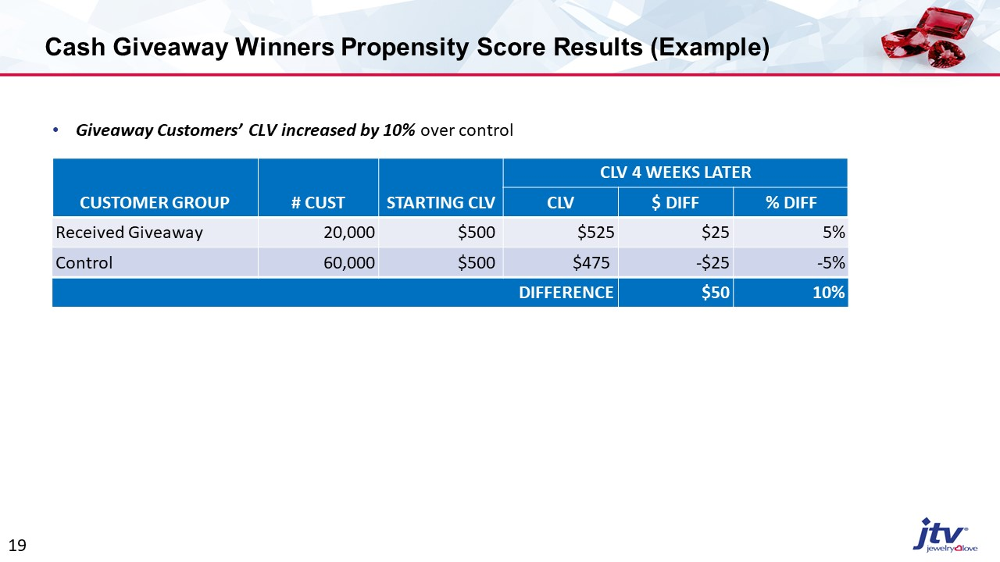
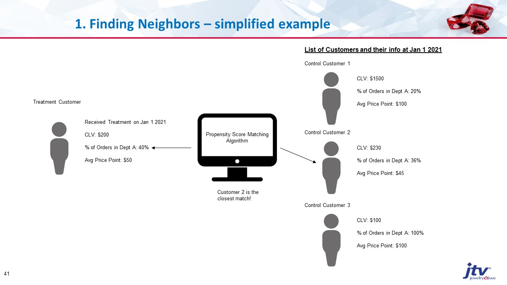
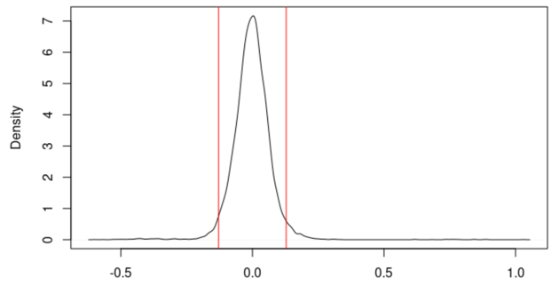

# Propensity Score Matching

*One of the most important customer analytics models I've ever used.*

## Introduction

I discovered propensity score models after I was presented a difficult question at work: was our cash giveaway worth it? 

We had been giving away tens of thousands of dollars to our customers (loading money into their accounts), and no one was tracking the results.

I recommended we work on designing an A/B test, but the executives wanted me to take a look at the historical data first to see if an experiment was even worth doing.

After talking to my coworkers about it, I decided we needed a matched pairs t-test:

1. Take customers who received the giveaway and similar 'twin' customers.
2. Compare their growth trajectories.

Although this is an observational study (can't infer causality), it was the closest I could get to simulating a true A/B test. 

I started doing some research, and I learned that my idea is essentially [propensity score matching](https://www.wallstreetmojo.com/propensity-score-matching/). 

## Propensity Score Matching Purpose

* Create control groups for A/B testing.
* Create control groups for observational studies that mimics a true A/B test.

## Case Study

After building the model (see next section for details on model development), I created a control group for the giveaway customers and examined the difference in CLV growth for the two groups. 

Turns out the giveaway was good for our customers because they grew more than their control groups.

Here's an output somewhat similar to what I got at work (data was changed because it is confidential):

Giveaway customers grew 5% while control customers shrunk 5%, resulting in a 10% difference in growth. 

With this information that the giveaways were good, executives at my company got really excited, and we started to test giveaways in all sorts of different ways.

I think the reason giveaways worked was for the following reasons:

1. We didn't give out too much cash, so when customers used that cash to make a purchase, we already more than covered our costs.
2. Giveaway cash expires after a month, creating a sense of urgency and giving us more excuses to contact our customers.
3. Winning cash through giveaways is a fun and positive customer experience (for example, we would play bingo on TV and winners would get cash).

## How PSM Works

Here's an illustration of how my propensity score matching model works:

I built it using Scikit Learn's KNearestNeighbor algorithm.

The way I evaluated it was through a [permutation test](https://www.jwilber.me/permutationtest/). 

Basically, I posited that if my control customers are really good matches with my treatment customers and the treatment customers received no treatment, then both groups should have about the same growth trajectories - thus their difference in CLV growth should be around 0.

Here's the results I got:

The spread of error was about +/- 10%. The goal was to make that distribution as narrow as possible. 

## Future Improvements

For my next iteration, I want to try building a [doubly robust propensity score matching](https://www.ncbi.nlm.nih.gov/pmc/articles/PMC3070495/).

It uses an outcome regression and a propensity score model combined. As long as one of those models was built right, then the entire analysis works!

Thus, this method is more robust to outliers and errors.