April 10, 2022

# Introduction

GitBook is a powerful document editor that integrates seamlessly with Github. 

By reading this article, you will be able to set up your own Data Science portfolio website using GitBook in less than 30 minutes.

# Table of Contents

# Why Use GitBook over Other Options

**Advantages**:

* Free website hosting
* Quick setup
* Integration with Github
* Mobile friendly
* Simplicity

**Disadvantages:**

* Lacking in detailed documentation
* Have to use Markdown (not sure how to show HTML documents)
* Less customization compared to hosting your own personal website

**Use GitBook if you want to create a portfolio quickly without the hassle of having to code your own website**

# Steps

## 0. Create a Github Account

[Get Started With Github Account](https://docs.github.com/en/get-started/onboarding/getting-started-with-your-github-account)

## 1. Create a New Repository in Github

You can create it through the terminal or on the github website.

I created mine on the github website like this:
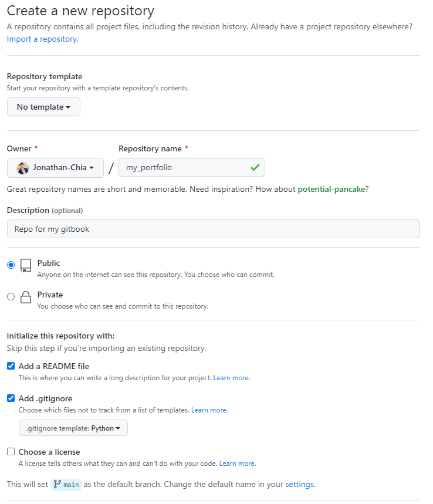

## 2. Create a GitBook Account

Go to [GitBook.com](https://www.gitbook.com/) and create a free account. You can use your github login to sign in. 

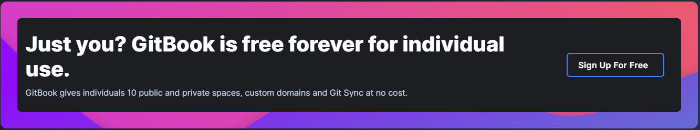

## 3. Create a Space

Click the blue + symbol on the bottom left and create a new Space.

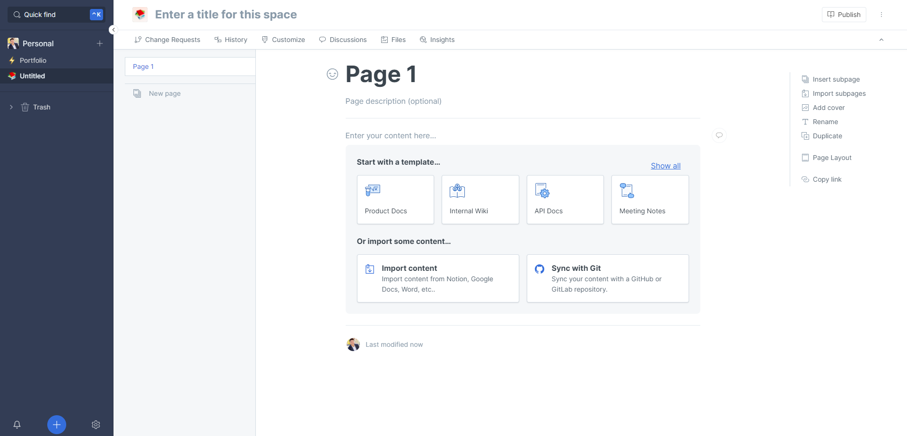

In the start with a template section, click on 'Internal Wiki'. 

Now the page will look like this:

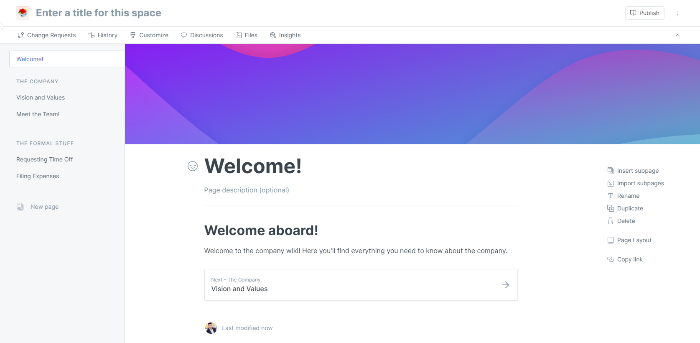

Feel free to personalize your Space by naming your Space, changing the theme, changing the symbol in the upper-left corner, etc.

## 4. Synchronize GitBook with your Github Repository

Click on the 3 dots in the top right corner and then click on 'Synchronize with Git':

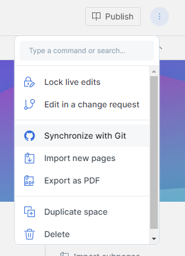

Click configure, and then click 'Connect with Github'.

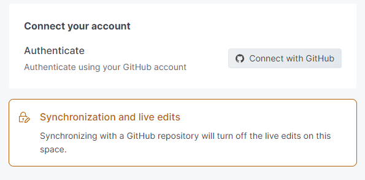

Link your new repository:

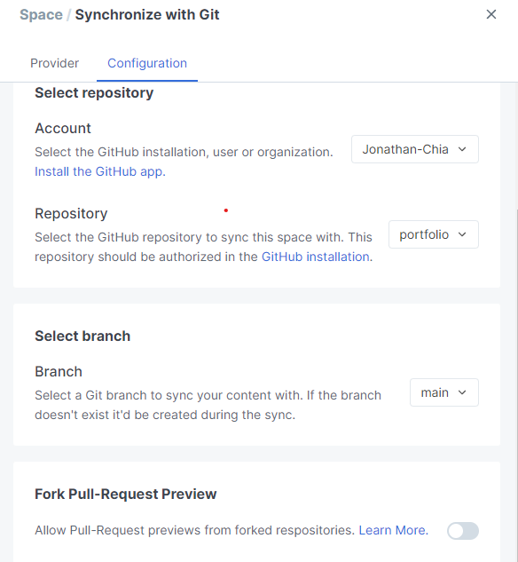

## 5. Choose Priority

There are two options. Click Github to Gitbook for now (you can change it later if you want).

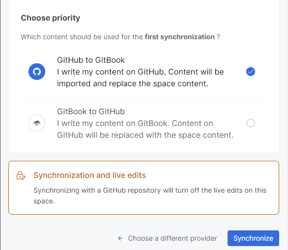

Synchronize.

## 6. Edit your ReadMe

Go to your Github Repository that you just linked to GitBook, and edit your ReadMe file. You can edit it through the Github website, or you can clone your repository to your favorite IDE and edit it in your IDE.

**Editing in Github website:**

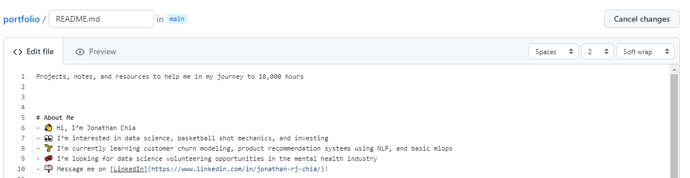

**Editing in Your Favorite IDE:**

I cloned my repository into Jupyter Lab and edit in there.

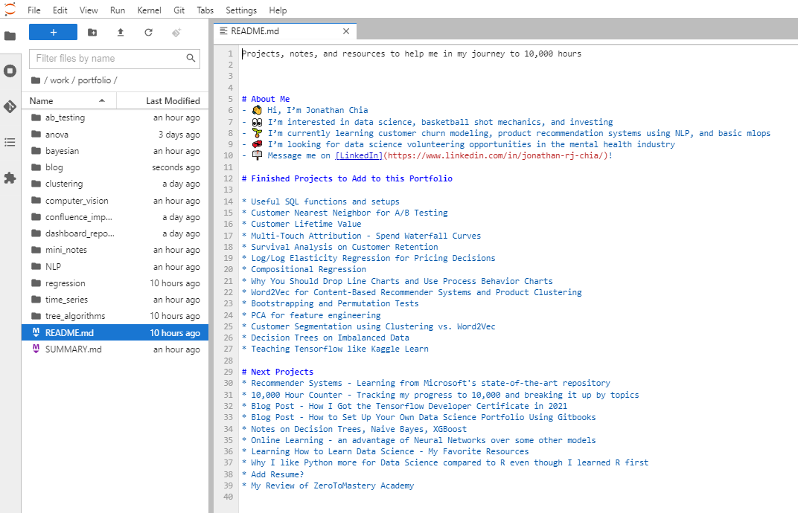

Introduce yourself and your portfolio however you would like!

## 7. Create a Summary.md file

Your Summary.md file tells GitBook how to organize your Space.

For example here is my Summary.md file:

And here is what my Space looks like:

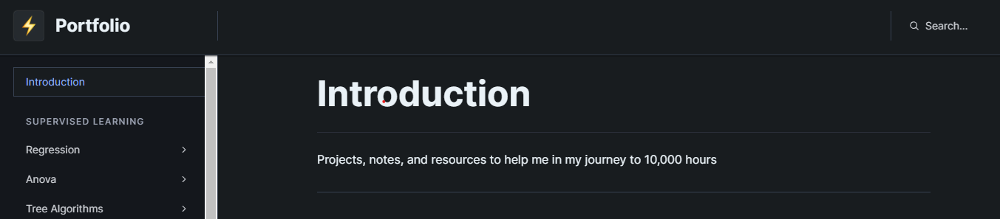

After clicking on the regression tab you can see the articles in it:

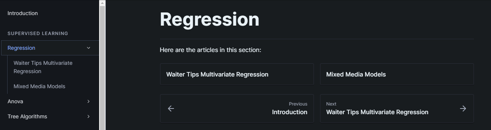

---

**Now that the framework for the website is all set up, we need to add content to link into your Summary.md!**

# Creating Content

GitBooks takes Markdown, HTML, or Word files. I'm not sure how to use HTML or Word files in GitBook, but I can help with Markdown files.

# Steps

## 0. Learn How to Use Markdown

[Getting Started With Markdown](https://www.markdownguide.org/getting-started/)

## 1. Convert Previous Projects into Markdown

Do you have any previous coding notebooks that you want to display in your portfolio? You can convert .html, .Rmd, and .ipynb files into Markdown. 

Do you have any presentations, reports, or papers that you want to display in your portfolio? You can display your documents in your Markdown files by linking them.

### Python Notebooks

