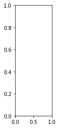

<a href="https://colab.research.google.com/github/Jonathan-Chia/portfolio/blob/main/computer_vision/food_vision.ipynb" target="_parent"></a>

# Food Vision Big

### Check GPU

Need score of 7.0+


```python
!nvidia-smi -L
```

    GPU 0: Tesla K80 (UUID: GPU-0d764f2a-1a8a-d086-659e-51365d9a7ba2)


## Get helper functions


```python
!wget https://raw.githubusercontent.com/mrdbourke/tensorflow-deep-learning/main/extras/helper_functions.py
```

    --2021-09-13 14:51:33--  https://raw.githubusercontent.com/mrdbourke/tensorflow-deep-learning/main/extras/helper_functions.py
    Resolving raw.githubusercontent.com (raw.githubusercontent.com)... 185.199.108.133, 185.199.109.133, 185.199.110.133, ...
    Connecting to raw.githubusercontent.com (raw.githubusercontent.com)|185.199.108.133|:443... connected.
    HTTP request sent, awaiting response... 200 OK
    Length: 10246 (10K) [text/plain]
    Saving to: ‘helper_functions.py’
    
    helper_functions.py 100%[===================>]  10.01K  --.-KB/s    in 0s      
    
    2021-09-13 14:51:33 (55.5 MB/s) - ‘helper_functions.py’ saved [10246/10246]
    


```python
from helper_functions import create_tensorboard_callback, plot_loss_curves, unzip_data, compare_historys, walk_through_dir
```

## Use TF Datasets


```python
import tensorflow as tf
import tensorflow_datasets as tfds
```


```python
datasets_list = tfds.list_builders()
print("food101" in datasets_list)
```

    True


```python
# will take a while
(train_data, test_data), ds_info = tfds.load(name="food101", 
                                             split=["train", "validation"],
                                             shuffle_files=True,
                                             as_supervised=True, # returns (data, label)
                                             with_info=True)
```

    Downloading and preparing dataset food101/2.0.0 (download: 4.65 GiB, generated: Unknown size, total: 4.65 GiB) to /root/tensorflow_datasets/food101/2.0.0...


    Dl Completed...: 0 url [00:00, ? url/s]


    Dl Size...: 0 MiB [00:00, ? MiB/s]


    Extraction completed...: 0 file [00:00, ? file/s]


    
    
    


    0 examples [00:00, ? examples/s]


    Shuffling and writing examples to /root/tensorflow_datasets/food101/2.0.0.incompleteY8HTLO/food101-train.tfrecord


      0%|          | 0/75750 [00:00<?, ? examples/s]


    0 examples [00:00, ? examples/s]


    Shuffling and writing examples to /root/tensorflow_datasets/food101/2.0.0.incompleteY8HTLO/food101-validation.tfrecord


      0%|          | 0/25250 [00:00<?, ? examples/s]


    Dataset food101 downloaded and prepared to /root/tensorflow_datasets/food101/2.0.0. Subsequent calls will reuse this data.


## Exploring Food 101 Data


```python
ds_info.features
```


    FeaturesDict({
        'image': Image(shape=(None, None, 3), dtype=tf.uint8),
        'label': ClassLabel(shape=(), dtype=tf.int64, num_classes=101),
    })


```python
# get class names
class_names = ds_info.features["label"].names
class_names[:10]
```


    ['apple_pie',
     'baby_back_ribs',
     'baklava',
     'beef_carpaccio',
     'beef_tartare',
     'beet_salad',
     'beignets',
     'bibimbap',
     'bread_pudding',
     'breakfast_burrito']


```python
# get one sample of train
train_one_sample = train_data.take(4)
```


```python
train_one_sample
```


    <TakeDataset shapes: ((None, None, 3), ()), types: (tf.uint8, tf.int64)>


```python
for image, label in train_one_sample:
  print(f"""
  Image Shape: {image.shape},
  Image Datatype: {image.dtype},
  Target Class: {label},
  Class name: {class_names[label.numpy()]}
  """)
```

    
      Image Shape: (512, 512, 3),
      Image Datatype: <dtype: 'uint8'>,
      Target Class: 71,
      Class name: paella
      
    
      Image Shape: (512, 512, 3),
      Image Datatype: <dtype: 'uint8'>,
      Target Class: 36,
      Class name: falafel
      
    
      Image Shape: (512, 512, 3),
      Image Datatype: <dtype: 'uint8'>,
      Target Class: 16,
      Class name: cheesecake
      
    
      Image Shape: (512, 512, 3),
      Image Datatype: <dtype: 'uint8'>,
      Target Class: 93,
      Class name: steak
      


```python
tf.reduce_min(image), tf.reduce_max(image)
```


    (<tf.Tensor: shape=(), dtype=uint8, numpy=0>,
     <tf.Tensor: shape=(), dtype=uint8, numpy=255>)


```python
import matplotlib.pyplot as plt
```


```python
train_one_sample
```


    <TakeDataset shapes: ((None, None, 3), ()), types: (tf.uint8, tf.int64)>


```python
# num_images = 4
# for i in range(num_images):
#   plt.subplot(1, 4, i+1)
#   plt.title(class_names[label[i].numpy()])
#   plt.imshow(image[i])
#   plt.axis(False);
```


    ---------------------------------------------------------------------------

    InvalidArgumentError                      Traceback (most recent call last)

    <ipython-input-15-f3205f9bd8e0> in <module>()
          2 for i in range(num_images):
          3   plt.subplot(1, 4, i+1)
    ----> 4   plt.title(class_names[label[i].numpy()])
          5   plt.imshow(image[i])
          6   plt.axis(False);


    /usr/local/lib/python3.7/dist-packages/tensorflow/python/util/dispatch.py in wrapper(*args, **kwargs)
        204     """Call target, and fall back on dispatchers if there is a TypeError."""
        205     try:
    --> 206       return target(*args, **kwargs)
        207     except (TypeError, ValueError):
        208       # Note: convert_to_eager_tensor currently raises a ValueError, not a


    /usr/local/lib/python3.7/dist-packages/tensorflow/python/ops/array_ops.py in _slice_helper(tensor, slice_spec, var)
       1050         ellipsis_mask=ellipsis_mask,
       1051         var=var,
    -> 1052         name=name)
       1053 
       1054 


    /usr/local/lib/python3.7/dist-packages/tensorflow/python/util/dispatch.py in wrapper(*args, **kwargs)
        204     """Call target, and fall back on dispatchers if there is a TypeError."""
        205     try:
    --> 206       return target(*args, **kwargs)
        207     except (TypeError, ValueError):
        208       # Note: convert_to_eager_tensor currently raises a ValueError, not a


    /usr/local/lib/python3.7/dist-packages/tensorflow/python/ops/array_ops.py in strided_slice(input_, begin, end, strides, begin_mask, end_mask, ellipsis_mask, new_axis_mask, shrink_axis_mask, var, name)
       1222       ellipsis_mask=ellipsis_mask,
       1223       new_axis_mask=new_axis_mask,
    -> 1224       shrink_axis_mask=shrink_axis_mask)
       1225 
       1226   parent_name = name


    /usr/local/lib/python3.7/dist-packages/tensorflow/python/ops/gen_array_ops.py in strided_slice(input, begin, end, strides, begin_mask, end_mask, ellipsis_mask, new_axis_mask, shrink_axis_mask, name)
      10509       return _result
      10510     except _core._NotOkStatusException as e:
    > 10511       _ops.raise_from_not_ok_status(e, name)
      10512     except _core._FallbackException:
      10513       pass


    /usr/local/lib/python3.7/dist-packages/tensorflow/python/framework/ops.py in raise_from_not_ok_status(e, name)
       6939   message = e.message + (" name: " + name if name is not None else "")
       6940   # pylint: disable=protected-access
    -> 6941   six.raise_from(core._status_to_exception(e.code, message), None)
       6942   # pylint: enable=protected-access
       6943 


    /usr/local/lib/python3.7/dist-packages/six.py in raise_from(value, from_value)


    InvalidArgumentError: Index out of range using input dim 0; input has only 0 dims [Op:StridedSlice] name: strided_slice/


    

    


## Preprocessing functions

Problems with this data
* uint8
* different size images
* not scaled


```python
# Make a function for preprocessing images
def preprocess_img(image, label, img_shape=224):
  """
  Converts image datatype from 'uint8' -> 'float32' and reshapes image to
  [img_shape, img_shape, color_channels]
  """
  image = tf.image.resize(image, [img_shape, img_shape]) # reshape to img_shape
  return tf.cast(image, tf.float32), label # return (float32_image, label) tuple
```


```python
# Preprocess a single sample image and check the outputs
preprocessed_img = preprocess_img(image, label)[0]
print(f"Image before preprocessing:\n {image[:2]}...,\nShape: {image.shape},\nDatatype: {image.dtype}\n")
print(f"Image after preprocessing:\n {preprocessed_img[:2]}...,\nShape: {preprocessed_img.shape},\nDatatype: {preprocessed_img.dtype}")
```


    ---------------------------------------------------------------------------

    NameError                                 Traceback (most recent call last)

    <ipython-input-13-d38d891740cd> in <module>()
          1 # Preprocess a single sample image and check the outputs
    ----> 2 preprocessed_img = preprocess_img(image, label)[0]
          3 print(f"Image before preprocessing:\n {image[:2]}...,\nShape: {image.shape},\nDatatype: {image.dtype}\n")
          4 print(f"Image after preprocessing:\n {preprocessed_img[:2]}...,\nShape: {preprocessed_img.shape},\nDatatype: {preprocessed_img.dtype}")


    NameError: name 'image' is not defined


## Batch and Prepare Datasets

From tensorflow best practices


```python
train_data, len(train_data)
```


    (<_OptionsDataset shapes: ((None, None, 3), ()), types: (tf.uint8, tf.int64)>,
     75750)


```python
tf.data.AUTOTUNE
```


    -1


```python
# Map preprocessing function to training data + parallelize
train_data = train_data.map(map_func=preprocess_img, num_parallel_calls=tf.data.AUTOTUNE)
# Shuffle train_data and turn it into batches and prefetch it (load it faster)
train_data = train_data.shuffle(buffer_size=1000).batch(batch_size=32).prefetch(buffer_size=tf.data.AUTOTUNE)

# Map preprocessing function to testing data
test_data = test_data.map(map_func=preprocess_img, num_parallel_calls=tf.data.AUTOTUNE).batch(32).prefetch(tf.data.AUTOTUNE).cache() # prefetch loads the next batch in advance to save time, cache makes it easy to load test_data quick
```


```python
train_data, test_data
```


    (<PrefetchDataset shapes: ((None, 224, 224, 3), (None,)), types: (tf.float32, tf.int64)>,
     <CacheDataset shapes: ((None, 224, 224, 3), (None,)), types: (tf.float32, tf.int64)>)


## Create modelling callbacks


```python
checkpoint_path = 'model_checkpoints/cp.ckpt'
model_checkpoint_callback = tf.keras.callbacks.ModelCheckpoint(checkpoint_path, 
                                                               save_best_only=True, 
                                                               save_weights_only=True,
                                                               monitor='val_accuracy',
                                                               verbose=0)

#early_stopping_callback = tf.keras.callbacks.EarlyStopping()
```


```python
tf.__version__
```


    '2.6.0'


## Mixed Precision


```python
from tensorflow.keras import mixed_precision
mixed_precision.set_global_policy("mixed_float16")
```

    WARNING:tensorflow:Mixed precision compatibility check (mixed_float16): WARNING
    Your GPU may run slowly with dtype policy mixed_float16 because it does not have compute capability of at least 7.0. Your GPU:
      Tesla K80, compute capability 3.7
    See https://developer.nvidia.com/cuda-gpus for a list of GPUs and their compute capabilities.
    If you will use compatible GPU(s) not attached to this host, e.g. by running a multi-worker model, you can ignore this warning. This message will only be logged once


    WARNING:tensorflow:Mixed precision compatibility check (mixed_float16): WARNING
    Your GPU may run slowly with dtype policy mixed_float16 because it does not have compute capability of at least 7.0. Your GPU:
      Tesla K80, compute capability 3.7
    See https://developer.nvidia.com/cuda-gpus for a list of GPUs and their compute capabilities.
    If you will use compatible GPU(s) not attached to this host, e.g. by running a multi-worker model, you can ignore this warning. This message will only be logged once


## Build feature extraction model


```python
label
```


    <tf.Tensor: shape=(), dtype=int64, numpy=93>


```python
from tensorflow.keras import layers
from tensorflow.keras.layers.experimental import preprocessing

input_shape = (224,224,3)
base_model = tf.keras.applications.EfficientNetB0(include_top=False)
base_model.trainable = False

# Create functional model
inputs = layers.Input(shape=input_shape, name='input_layer')
#x = preprocessing.rescaling(1./255)(x)
x = base_model(inputs, training=False)
x = layers.GlobalAveragePooling2D()(x)
x = layers.Dense(len(class_names))(x)
outputs = layers.Activation('softmax', dtype=tf.float32, name='softmax_float32')(x)

model = tf.keras.Model(inputs, outputs)

model.compile(loss='sparse_categorical_crossentropy', # because labels in int form not one-hot
              optimizer=tf.keras.optimizers.Adam(),
              metrics=['accuracy'])
```


```python
model.summary()
```

    Model: "model"
    _________________________________________________________________
    Layer (type)                 Output Shape              Param #   
    =================================================================
    input_layer (InputLayer)     [(None, 224, 224, 3)]     0         
    _________________________________________________________________
    efficientnetb0 (Functional)  (None, None, None, 1280)  4049571   
    _________________________________________________________________
    global_average_pooling2d_2 ( (None, 1280)              0         
    _________________________________________________________________
    dense_1 (Dense)              (None, 101)               129381    
    _________________________________________________________________
    softmax_float32 (Activation) (None, 101)               0         
    =================================================================
    Total params: 4,178,952
    Trainable params: 129,381
    Non-trainable params: 4,049,571
    _________________________________________________________________


## Check if we are using mixed precision


```python
# Check the dtype_policy attributes of layers in our model
for layer in model.layers:
  print(layer.name, layer.trainable, layer.dtype, layer.dtype_policy) # Check the dtype policy of layers
```

    input_layer True float32 <Policy "float32">
    efficientnetb0 False float32 <Policy "mixed_float16">
    global_average_pooling2d_2 True float32 <Policy "mixed_float16">
    dense_1 True float32 <Policy "mixed_float16">
    softmax_float32 True float32 <Policy "float32">


```python
# Check dtype of layers in base_model
for layer in model.layers[1].layers:
  print(layer.name, layer.trainable, layer.dtype, layer.dtype_policy)
```

    input_3 False float32 <Policy "float32">
    rescaling_2 False float32 <Policy "mixed_float16">
    normalization_2 False float32 <Policy "mixed_float16">
    stem_conv_pad False float32 <Policy "mixed_float16">
    stem_conv False float32 <Policy "mixed_float16">
    stem_bn False float32 <Policy "mixed_float16">
    stem_activation False float32 <Policy "mixed_float16">
    block1a_dwconv False float32 <Policy "mixed_float16">
    block1a_bn False float32 <Policy "mixed_float16">
    block1a_activation False float32 <Policy "mixed_float16">
    block1a_se_squeeze False float32 <Policy "mixed_float16">
    block1a_se_reshape False float32 <Policy "mixed_float16">
    block1a_se_reduce False float32 <Policy "mixed_float16">
    block1a_se_expand False float32 <Policy "mixed_float16">
    block1a_se_excite False float32 <Policy "mixed_float16">
    block1a_project_conv False float32 <Policy "mixed_float16">
    block1a_project_bn False float32 <Policy "mixed_float16">
    block2a_expand_conv False float32 <Policy "mixed_float16">
    block2a_expand_bn False float32 <Policy "mixed_float16">
    block2a_expand_activation False float32 <Policy "mixed_float16">
    block2a_dwconv_pad False float32 <Policy "mixed_float16">
    block2a_dwconv False float32 <Policy "mixed_float16">
    block2a_bn False float32 <Policy "mixed_float16">
    block2a_activation False float32 <Policy "mixed_float16">
    block2a_se_squeeze False float32 <Policy "mixed_float16">
    block2a_se_reshape False float32 <Policy "mixed_float16">
    block2a_se_reduce False float32 <Policy "mixed_float16">
    block2a_se_expand False float32 <Policy "mixed_float16">
    block2a_se_excite False float32 <Policy "mixed_float16">
    block2a_project_conv False float32 <Policy "mixed_float16">
    block2a_project_bn False float32 <Policy "mixed_float16">
    block2b_expand_conv False float32 <Policy "mixed_float16">
    block2b_expand_bn False float32 <Policy "mixed_float16">
    block2b_expand_activation False float32 <Policy "mixed_float16">
    block2b_dwconv False float32 <Policy "mixed_float16">
    block2b_bn False float32 <Policy "mixed_float16">
    block2b_activation False float32 <Policy "mixed_float16">
    block2b_se_squeeze False float32 <Policy "mixed_float16">
    block2b_se_reshape False float32 <Policy "mixed_float16">
    block2b_se_reduce False float32 <Policy "mixed_float16">
    block2b_se_expand False float32 <Policy "mixed_float16">
    block2b_se_excite False float32 <Policy "mixed_float16">
    block2b_project_conv False float32 <Policy "mixed_float16">
    block2b_project_bn False float32 <Policy "mixed_float16">
    block2b_drop False float32 <Policy "mixed_float16">
    block2b_add False float32 <Policy "mixed_float16">
    block3a_expand_conv False float32 <Policy "mixed_float16">
    block3a_expand_bn False float32 <Policy "mixed_float16">
    block3a_expand_activation False float32 <Policy "mixed_float16">
    block3a_dwconv_pad False float32 <Policy "mixed_float16">
    block3a_dwconv False float32 <Policy "mixed_float16">
    block3a_bn False float32 <Policy "mixed_float16">
    block3a_activation False float32 <Policy "mixed_float16">
    block3a_se_squeeze False float32 <Policy "mixed_float16">
    block3a_se_reshape False float32 <Policy "mixed_float16">
    block3a_se_reduce False float32 <Policy "mixed_float16">
    block3a_se_expand False float32 <Policy "mixed_float16">
    block3a_se_excite False float32 <Policy "mixed_float16">
    block3a_project_conv False float32 <Policy "mixed_float16">
    block3a_project_bn False float32 <Policy "mixed_float16">
    block3b_expand_conv False float32 <Policy "mixed_float16">
    block3b_expand_bn False float32 <Policy "mixed_float16">
    block3b_expand_activation False float32 <Policy "mixed_float16">
    block3b_dwconv False float32 <Policy "mixed_float16">
    block3b_bn False float32 <Policy "mixed_float16">
    block3b_activation False float32 <Policy "mixed_float16">
    block3b_se_squeeze False float32 <Policy "mixed_float16">
    block3b_se_reshape False float32 <Policy "mixed_float16">
    block3b_se_reduce False float32 <Policy "mixed_float16">
    block3b_se_expand False float32 <Policy "mixed_float16">
    block3b_se_excite False float32 <Policy "mixed_float16">
    block3b_project_conv False float32 <Policy "mixed_float16">
    block3b_project_bn False float32 <Policy "mixed_float16">
    block3b_drop False float32 <Policy "mixed_float16">
    block3b_add False float32 <Policy "mixed_float16">
    block4a_expand_conv False float32 <Policy "mixed_float16">
    block4a_expand_bn False float32 <Policy "mixed_float16">
    block4a_expand_activation False float32 <Policy "mixed_float16">
    block4a_dwconv_pad False float32 <Policy "mixed_float16">
    block4a_dwconv False float32 <Policy "mixed_float16">
    block4a_bn False float32 <Policy "mixed_float16">
    block4a_activation False float32 <Policy "mixed_float16">
    block4a_se_squeeze False float32 <Policy "mixed_float16">
    block4a_se_reshape False float32 <Policy "mixed_float16">
    block4a_se_reduce False float32 <Policy "mixed_float16">
    block4a_se_expand False float32 <Policy "mixed_float16">
    block4a_se_excite False float32 <Policy "mixed_float16">
    block4a_project_conv False float32 <Policy "mixed_float16">
    block4a_project_bn False float32 <Policy "mixed_float16">
    block4b_expand_conv False float32 <Policy "mixed_float16">
    block4b_expand_bn False float32 <Policy "mixed_float16">
    block4b_expand_activation False float32 <Policy "mixed_float16">
    block4b_dwconv False float32 <Policy "mixed_float16">
    block4b_bn False float32 <Policy "mixed_float16">
    block4b_activation False float32 <Policy "mixed_float16">
    block4b_se_squeeze False float32 <Policy "mixed_float16">
    block4b_se_reshape False float32 <Policy "mixed_float16">
    block4b_se_reduce False float32 <Policy "mixed_float16">
    block4b_se_expand False float32 <Policy "mixed_float16">
    block4b_se_excite False float32 <Policy "mixed_float16">
    block4b_project_conv False float32 <Policy "mixed_float16">
    block4b_project_bn False float32 <Policy "mixed_float16">
    block4b_drop False float32 <Policy "mixed_float16">
    block4b_add False float32 <Policy "mixed_float16">
    block4c_expand_conv False float32 <Policy "mixed_float16">
    block4c_expand_bn False float32 <Policy "mixed_float16">
    block4c_expand_activation False float32 <Policy "mixed_float16">
    block4c_dwconv False float32 <Policy "mixed_float16">
    block4c_bn False float32 <Policy "mixed_float16">
    block4c_activation False float32 <Policy "mixed_float16">
    block4c_se_squeeze False float32 <Policy "mixed_float16">
    block4c_se_reshape False float32 <Policy "mixed_float16">
    block4c_se_reduce False float32 <Policy "mixed_float16">
    block4c_se_expand False float32 <Policy "mixed_float16">
    block4c_se_excite False float32 <Policy "mixed_float16">
    block4c_project_conv False float32 <Policy "mixed_float16">
    block4c_project_bn False float32 <Policy "mixed_float16">
    block4c_drop False float32 <Policy "mixed_float16">
    block4c_add False float32 <Policy "mixed_float16">
    block5a_expand_conv False float32 <Policy "mixed_float16">
    block5a_expand_bn False float32 <Policy "mixed_float16">
    block5a_expand_activation False float32 <Policy "mixed_float16">
    block5a_dwconv False float32 <Policy "mixed_float16">
    block5a_bn False float32 <Policy "mixed_float16">
    block5a_activation False float32 <Policy "mixed_float16">
    block5a_se_squeeze False float32 <Policy "mixed_float16">
    block5a_se_reshape False float32 <Policy "mixed_float16">
    block5a_se_reduce False float32 <Policy "mixed_float16">
    block5a_se_expand False float32 <Policy "mixed_float16">
    block5a_se_excite False float32 <Policy "mixed_float16">
    block5a_project_conv False float32 <Policy "mixed_float16">
    block5a_project_bn False float32 <Policy "mixed_float16">
    block5b_expand_conv False float32 <Policy "mixed_float16">
    block5b_expand_bn False float32 <Policy "mixed_float16">
    block5b_expand_activation False float32 <Policy "mixed_float16">
    block5b_dwconv False float32 <Policy "mixed_float16">
    block5b_bn False float32 <Policy "mixed_float16">
    block5b_activation False float32 <Policy "mixed_float16">
    block5b_se_squeeze False float32 <Policy "mixed_float16">
    block5b_se_reshape False float32 <Policy "mixed_float16">
    block5b_se_reduce False float32 <Policy "mixed_float16">
    block5b_se_expand False float32 <Policy "mixed_float16">
    block5b_se_excite False float32 <Policy "mixed_float16">
    block5b_project_conv False float32 <Policy "mixed_float16">
    block5b_project_bn False float32 <Policy "mixed_float16">
    block5b_drop False float32 <Policy "mixed_float16">
    block5b_add False float32 <Policy "mixed_float16">
    block5c_expand_conv False float32 <Policy "mixed_float16">
    block5c_expand_bn False float32 <Policy "mixed_float16">
    block5c_expand_activation False float32 <Policy "mixed_float16">
    block5c_dwconv False float32 <Policy "mixed_float16">
    block5c_bn False float32 <Policy "mixed_float16">
    block5c_activation False float32 <Policy "mixed_float16">
    block5c_se_squeeze False float32 <Policy "mixed_float16">
    block5c_se_reshape False float32 <Policy "mixed_float16">
    block5c_se_reduce False float32 <Policy "mixed_float16">
    block5c_se_expand False float32 <Policy "mixed_float16">
    block5c_se_excite False float32 <Policy "mixed_float16">
    block5c_project_conv False float32 <Policy "mixed_float16">
    block5c_project_bn False float32 <Policy "mixed_float16">
    block5c_drop False float32 <Policy "mixed_float16">
    block5c_add False float32 <Policy "mixed_float16">
    block6a_expand_conv False float32 <Policy "mixed_float16">
    block6a_expand_bn False float32 <Policy "mixed_float16">
    block6a_expand_activation False float32 <Policy "mixed_float16">
    block6a_dwconv_pad False float32 <Policy "mixed_float16">
    block6a_dwconv False float32 <Policy "mixed_float16">
    block6a_bn False float32 <Policy "mixed_float16">
    block6a_activation False float32 <Policy "mixed_float16">
    block6a_se_squeeze False float32 <Policy "mixed_float16">
    block6a_se_reshape False float32 <Policy "mixed_float16">
    block6a_se_reduce False float32 <Policy "mixed_float16">
    block6a_se_expand False float32 <Policy "mixed_float16">
    block6a_se_excite False float32 <Policy "mixed_float16">
    block6a_project_conv False float32 <Policy "mixed_float16">
    block6a_project_bn False float32 <Policy "mixed_float16">
    block6b_expand_conv False float32 <Policy "mixed_float16">
    block6b_expand_bn False float32 <Policy "mixed_float16">
    block6b_expand_activation False float32 <Policy "mixed_float16">
    block6b_dwconv False float32 <Policy "mixed_float16">
    block6b_bn False float32 <Policy "mixed_float16">
    block6b_activation False float32 <Policy "mixed_float16">
    block6b_se_squeeze False float32 <Policy "mixed_float16">
    block6b_se_reshape False float32 <Policy "mixed_float16">
    block6b_se_reduce False float32 <Policy "mixed_float16">
    block6b_se_expand False float32 <Policy "mixed_float16">
    block6b_se_excite False float32 <Policy "mixed_float16">
    block6b_project_conv False float32 <Policy "mixed_float16">
    block6b_project_bn False float32 <Policy "mixed_float16">
    block6b_drop False float32 <Policy "mixed_float16">
    block6b_add False float32 <Policy "mixed_float16">
    block6c_expand_conv False float32 <Policy "mixed_float16">
    block6c_expand_bn False float32 <Policy "mixed_float16">
    block6c_expand_activation False float32 <Policy "mixed_float16">
    block6c_dwconv False float32 <Policy "mixed_float16">
    block6c_bn False float32 <Policy "mixed_float16">
    block6c_activation False float32 <Policy "mixed_float16">
    block6c_se_squeeze False float32 <Policy "mixed_float16">
    block6c_se_reshape False float32 <Policy "mixed_float16">
    block6c_se_reduce False float32 <Policy "mixed_float16">
    block6c_se_expand False float32 <Policy "mixed_float16">
    block6c_se_excite False float32 <Policy "mixed_float16">
    block6c_project_conv False float32 <Policy "mixed_float16">
    block6c_project_bn False float32 <Policy "mixed_float16">
    block6c_drop False float32 <Policy "mixed_float16">
    block6c_add False float32 <Policy "mixed_float16">
    block6d_expand_conv False float32 <Policy "mixed_float16">
    block6d_expand_bn False float32 <Policy "mixed_float16">
    block6d_expand_activation False float32 <Policy "mixed_float16">
    block6d_dwconv False float32 <Policy "mixed_float16">
    block6d_bn False float32 <Policy "mixed_float16">
    block6d_activation False float32 <Policy "mixed_float16">
    block6d_se_squeeze False float32 <Policy "mixed_float16">
    block6d_se_reshape False float32 <Policy "mixed_float16">
    block6d_se_reduce False float32 <Policy "mixed_float16">
    block6d_se_expand False float32 <Policy "mixed_float16">
    block6d_se_excite False float32 <Policy "mixed_float16">
    block6d_project_conv False float32 <Policy "mixed_float16">
    block6d_project_bn False float32 <Policy "mixed_float16">
    block6d_drop False float32 <Policy "mixed_float16">
    block6d_add False float32 <Policy "mixed_float16">
    block7a_expand_conv False float32 <Policy "mixed_float16">
    block7a_expand_bn False float32 <Policy "mixed_float16">
    block7a_expand_activation False float32 <Policy "mixed_float16">
    block7a_dwconv False float32 <Policy "mixed_float16">
    block7a_bn False float32 <Policy "mixed_float16">
    block7a_activation False float32 <Policy "mixed_float16">
    block7a_se_squeeze False float32 <Policy "mixed_float16">
    block7a_se_reshape False float32 <Policy "mixed_float16">
    block7a_se_reduce False float32 <Policy "mixed_float16">
    block7a_se_expand False float32 <Policy "mixed_float16">
    block7a_se_excite False float32 <Policy "mixed_float16">
    block7a_project_conv False float32 <Policy "mixed_float16">
    block7a_project_bn False float32 <Policy "mixed_float16">
    top_conv False float32 <Policy "mixed_float16">
    top_bn False float32 <Policy "mixed_float16">
    top_activation False float32 <Policy "mixed_float16">


```python
# mixed_precision.set_global_policy('float32')
```


```python
history_101_food_classes_feature_extract = model.fit(train_data,
                                                    batch_size=32,
                                                    epochs=3,
                                                    callbacks=[create_tensorboard_callback("training_logs", 
                                                                                          "efficientnetb0_101_classes_all_data_feature_extract"), 
                                                              model_checkpoint_callback],
                                                    steps_per_epoch=len(train_data), 
                                                    validation_data = test_data,
                                                    validation_steps=int(.15 * len(test_data)))
```

    Saving TensorBoard log files to: training_logs/efficientnetb0_101_classes_all_data_feature_extract/20210912-031220
    Epoch 1/3


    /usr/local/lib/python3.7/dist-packages/keras/utils/generic_utils.py:497: CustomMaskWarning: Custom mask layers require a config and must override get_config. When loading, the custom mask layer must be passed to the custom_objects argument.
      category=CustomMaskWarning)


    2368/2368 [==============================] - 316s 116ms/step - loss: 1.8208 - accuracy: 0.5585 - val_loss: 1.2297 - val_accuracy: 0.6751
    WARNING:tensorflow:Can save best model only with val_acc available, skipping.


    WARNING:tensorflow:Can save best model only with val_acc available, skipping.


    Epoch 2/3
    2368/2368 [==============================] - 266s 111ms/step - loss: 1.2925 - accuracy: 0.6672 - val_loss: 1.1345 - val_accuracy: 0.6947
    WARNING:tensorflow:Can save best model only with val_acc available, skipping.


    WARNING:tensorflow:Can save best model only with val_acc available, skipping.


    Epoch 3/3
    2368/2368 [==============================] - 265s 108ms/step - loss: 1.1423 - accuracy: 0.7029 - val_loss: 1.0964 - val_accuracy: 0.7060
    WARNING:tensorflow:Can save best model only with val_acc available, skipping.


    WARNING:tensorflow:Can save best model only with val_acc available, skipping.


```python
# Evaluate model (unsaved version) on whole test dataset
results_feature_extract_model = model.evaluate(test_data)
results_feature_extract_model
```

Hmm it didn't save my model - maybe because I didn't write out 'val_accuracy'


```python
# Can I save it now? 
model.save_weights(checkpoint_path)
```


```python
# how to move the saved stuff to my drive??
```


```python
model.save("drive/My Drive/tensorflow_course/101_food_class_saved_big_dog_model")
```

    INFO:tensorflow:Assets written to: drive/My Drive/tensorflow_course/101_food_class_saved_big_dog_model/assets


    INFO:tensorflow:Assets written to: drive/My Drive/tensorflow_course/101_food_class_saved_big_dog_model/assets
    /usr/local/lib/python3.7/dist-packages/keras/utils/generic_utils.py:497: CustomMaskWarning: Custom mask layers require a config and must override get_config. When loading, the custom mask layer must be passed to the custom_objects argument.
      category=CustomMaskWarning)


## Loading model in


```python
import tensorflow as tf

saved_model_path = "drive/My Drive/tensorflow_course/101_food_class_saved_big_dog_model"
model = tf.keras.models.load_model(saved_model_path)
```

    WARNING:tensorflow:Mixed precision compatibility check (mixed_float16): WARNING
    Your GPU may run slowly with dtype policy mixed_float16 because it does not have compute capability of at least 7.0. Your GPU:
      Tesla K80, compute capability 3.7
    See https://developer.nvidia.com/cuda-gpus for a list of GPUs and their compute capabilities.
    If you will use compatible GPU(s) not attached to this host, e.g. by running a multi-worker model, you can ignore this warning. This message will only be logged once


    WARNING:tensorflow:Mixed precision compatibility check (mixed_float16): WARNING
    Your GPU may run slowly with dtype policy mixed_float16 because it does not have compute capability of at least 7.0. Your GPU:
      Tesla K80, compute capability 3.7
    See https://developer.nvidia.com/cuda-gpus for a list of GPUs and their compute capabilities.
    If you will use compatible GPU(s) not attached to this host, e.g. by running a multi-worker model, you can ignore this warning. This message will only be logged once
    WARNING:absl:Importing a function (__inference_block4a_se_reduce_layer_call_and_return_conditional_losses_55412) with ops with unsaved custom gradients. Will likely fail if a gradient is requested.
    WARNING:absl:Importing a function (__inference_block7a_activation_layer_call_and_return_conditional_losses_57001) with ops with unsaved custom gradients. Will likely fail if a gradient is requested.
    WARNING:absl:Importing a function (__inference_block6b_activation_layer_call_and_return_conditional_losses_93824) with ops with unsaved custom gradients. Will likely fail if a gradient is requested.
    WARNING:absl:Importing a function (__inference_block6c_expand_activation_layer_call_and_return_conditional_losses_56643) with ops with unsaved custom gradients. Will likely fail if a gradient is requested.
    WARNING:absl:Importing a function (__inference_block5a_se_reduce_layer_call_and_return_conditional_losses_92316) with ops with unsaved custom gradients. Will likely fail if a gradient is requested.
    WARNING:absl:Importing a function (__inference_block6c_expand_activation_layer_call_and_return_conditional_losses_94142) with ops with unsaved custom gradients. Will likely fail if a gradient is requested.
    WARNING:absl:Importing a function (__inference_block5c_se_reduce_layer_call_and_return_conditional_losses_56217) with ops with unsaved custom gradients. Will likely fail if a gradient is requested.
    WARNING:absl:Importing a function (__inference_block3a_se_reduce_layer_call_and_return_conditional_losses_90328) with ops with unsaved custom gradients. Will likely fail if a gradient is requested.
    WARNING:absl:Importing a function (__inference_block3b_expand_activation_layer_call_and_return_conditional_losses_90531) with ops with unsaved custom gradients. Will likely fail if a gradient is requested.
    WARNING:absl:Importing a function (__inference_block4c_expand_activation_layer_call_and_return_conditional_losses_91742) with ops with unsaved custom gradients. Will likely fail if a gradient is requested.
    WARNING:absl:Importing a function (__inference_block2b_expand_activation_layer_call_and_return_conditional_losses_54845) with ops with unsaved custom gradients. Will likely fail if a gradient is requested.
    WARNING:absl:Importing a function (__inference_block3a_activation_layer_call_and_return_conditional_losses_90260) with ops with unsaved custom gradients. Will likely fail if a gradient is requested.
    WARNING:absl:Importing a function (__inference_block4c_expand_activation_layer_call_and_return_conditional_losses_55664) with ops with unsaved custom gradients. Will likely fail if a gradient is requested.
    WARNING:absl:Importing a function (__inference_block6c_se_reduce_layer_call_and_return_conditional_losses_94304) with ops with unsaved custom gradients. Will likely fail if a gradient is requested.
    WARNING:absl:Importing a function (__inference_block2b_activation_layer_call_and_return_conditional_losses_89826) with ops with unsaved custom gradients. Will likely fail if a gradient is requested.
    WARNING:absl:Importing a function (__inference_block6a_activation_layer_call_and_return_conditional_losses_56348) with ops with unsaved custom gradients. Will likely fail if a gradient is requested.
    WARNING:absl:Importing a function (__inference_block4a_se_reduce_layer_call_and_return_conditional_losses_91127) with ops with unsaved custom gradients. Will likely fail if a gradient is requested.
    WARNING:absl:Importing a function (__inference_stem_activation_layer_call_and_return_conditional_losses_88980) with ops with unsaved custom gradients. Will likely fail if a gradient is requested.
    WARNING:absl:Importing a function (__inference_block6d_se_reduce_layer_call_and_return_conditional_losses_56877) with ops with unsaved custom gradients. Will likely fail if a gradient is requested.
    WARNING:absl:Importing a function (__inference_block5b_se_reduce_layer_call_and_return_conditional_losses_92681) with ops with unsaved custom gradients. Will likely fail if a gradient is requested.
    WARNING:absl:Importing a function (__inference_block3b_activation_layer_call_and_return_conditional_losses_55195) with ops with unsaved custom gradients. Will likely fail if a gradient is requested.
    WARNING:absl:Importing a function (__inference_block6a_se_reduce_layer_call_and_return_conditional_losses_56391) with ops with unsaved custom gradients. Will likely fail if a gradient is requested.
    WARNING:absl:Importing a function (__inference_block2a_activation_layer_call_and_return_conditional_losses_89461) with ops with unsaved custom gradients. Will likely fail if a gradient is requested.
    WARNING:absl:Importing a function (__inference_block4a_activation_layer_call_and_return_conditional_losses_91059) with ops with unsaved custom gradients. Will likely fail if a gradient is requested.
    WARNING:absl:Importing a function (__inference_block1a_se_reduce_layer_call_and_return_conditional_losses_89142) with ops with unsaved custom gradients. Will likely fail if a gradient is requested.
    WARNING:absl:Importing a function (__inference_block5a_activation_layer_call_and_return_conditional_losses_92248) with ops with unsaved custom gradients. Will likely fail if a gradient is requested.
    WARNING:absl:Importing a function (__inference_block2b_activation_layer_call_and_return_conditional_losses_54869) with ops with unsaved custom gradients. Will likely fail if a gradient is requested.
    WARNING:absl:Importing a function (__inference_block2a_expand_activation_layer_call_and_return_conditional_losses_89345) with ops with unsaved custom gradients. Will likely fail if a gradient is requested.
    WARNING:absl:Importing a function (__inference_block4a_activation_layer_call_and_return_conditional_losses_55369) with ops with unsaved custom gradients. Will likely fail if a gradient is requested.
    WARNING:absl:Importing a function (__inference_block6c_se_reduce_layer_call_and_return_conditional_losses_56710) with ops with unsaved custom gradients. Will likely fail if a gradient is requested.
    WARNING:absl:Importing a function (__inference_block5b_expand_activation_layer_call_and_return_conditional_losses_55983) with ops with unsaved custom gradients. Will likely fail if a gradient is requested.
    WARNING:absl:Importing a function (__inference_block2b_expand_activation_layer_call_and_return_conditional_losses_89732) with ops with unsaved custom gradients. Will likely fail if a gradient is requested.
    WARNING:absl:Importing a function (__inference_block5c_activation_layer_call_and_return_conditional_losses_56174) with ops with unsaved custom gradients. Will likely fail if a gradient is requested.
    WARNING:absl:Importing a function (__inference_block3a_activation_layer_call_and_return_conditional_losses_55043) with ops with unsaved custom gradients. Will likely fail if a gradient is requested.
    WARNING:absl:Importing a function (__inference_block1a_se_reduce_layer_call_and_return_conditional_losses_54601) with ops with unsaved custom gradients. Will likely fail if a gradient is requested.
    WARNING:absl:Importing a function (__inference_block6c_activation_layer_call_and_return_conditional_losses_56667) with ops with unsaved custom gradients. Will likely fail if a gradient is requested.
    WARNING:absl:Importing a function (__inference_efficientnetb0_layer_call_and_return_conditional_losses_65448) with ops with unsaved custom gradients. Will likely fail if a gradient is requested.
    WARNING:absl:Importing a function (__inference_block7a_expand_activation_layer_call_and_return_conditional_losses_56977) with ops with unsaved custom gradients. Will likely fail if a gradient is requested.
    WARNING:absl:Importing a function (__inference_block6d_se_reduce_layer_call_and_return_conditional_losses_94716) with ops with unsaved custom gradients. Will likely fail if a gradient is requested.
    WARNING:absl:Importing a function (__inference_efficientnetb0_layer_call_and_return_conditional_losses_69256) with ops with unsaved custom gradients. Will likely fail if a gradient is requested.
    WARNING:absl:Importing a function (__inference_block5a_activation_layer_call_and_return_conditional_losses_55855) with ops with unsaved custom gradients. Will likely fail if a gradient is requested.
    WARNING:absl:Importing a function (__inference_block6a_activation_layer_call_and_return_conditional_losses_93459) with ops with unsaved custom gradients. Will likely fail if a gradient is requested.
    WARNING:absl:Importing a function (__inference_block7a_se_reduce_layer_call_and_return_conditional_losses_57044) with ops with unsaved custom gradients. Will likely fail if a gradient is requested.
    WARNING:absl:Importing a function (__inference_block5a_expand_activation_layer_call_and_return_conditional_losses_55831) with ops with unsaved custom gradients. Will likely fail if a gradient is requested.
    WARNING:absl:Importing a function (__inference_block2a_se_reduce_layer_call_and_return_conditional_losses_54760) with ops with unsaved custom gradients. Will likely fail if a gradient is requested.
    WARNING:absl:Importing a function (__inference_block1a_activation_layer_call_and_return_conditional_losses_54558) with ops with unsaved custom gradients. Will likely fail if a gradient is requested.
    WARNING:absl:Importing a function (__inference_model_layer_call_and_return_conditional_losses_77328) with ops with unsaved custom gradients. Will likely fail if a gradient is requested.
    WARNING:absl:Importing a function (__inference_block3b_se_reduce_layer_call_and_return_conditional_losses_90693) with ops with unsaved custom gradients. Will likely fail if a gradient is requested.
    WARNING:absl:Importing a function (__inference_block6b_activation_layer_call_and_return_conditional_losses_56500) with ops with unsaved custom gradients. Will likely fail if a gradient is requested.
    WARNING:absl:Importing a function (__inference_block3b_expand_activation_layer_call_and_return_conditional_losses_55171) with ops with unsaved custom gradients. Will likely fail if a gradient is requested.
    WARNING:absl:Importing a function (__inference_top_activation_layer_call_and_return_conditional_losses_95331) with ops with unsaved custom gradients. Will likely fail if a gradient is requested.
    WARNING:absl:Importing a function (__inference_block6b_se_reduce_layer_call_and_return_conditional_losses_93892) with ops with unsaved custom gradients. Will likely fail if a gradient is requested.
    WARNING:absl:Importing a function (__inference_block4b_expand_activation_layer_call_and_return_conditional_losses_55497) with ops with unsaved custom gradients. Will likely fail if a gradient is requested.
    WARNING:absl:Importing a function (__inference_top_activation_layer_call_and_return_conditional_losses_57129) with ops with unsaved custom gradients. Will likely fail if a gradient is requested.
    WARNING:absl:Importing a function (__inference_block3a_expand_activation_layer_call_and_return_conditional_losses_55012) with ops with unsaved custom gradients. Will likely fail if a gradient is requested.
    WARNING:absl:Importing a function (__inference_block6a_expand_activation_layer_call_and_return_conditional_losses_93343) with ops with unsaved custom gradients. Will likely fail if a gradient is requested.
    WARNING:absl:Importing a function (__inference_efficientnetb0_layer_call_and_return_conditional_losses_83320) with ops with unsaved custom gradients. Will likely fail if a gradient is requested.
    WARNING:absl:Importing a function (__inference_model_layer_call_and_return_conditional_losses_79076) with ops with unsaved custom gradients. Will likely fail if a gradient is requested.
    WARNING:absl:Importing a function (__inference_block4a_expand_activation_layer_call_and_return_conditional_losses_90943) with ops with unsaved custom gradients. Will likely fail if a gradient is requested.
    WARNING:absl:Importing a function (__inference_block4c_activation_layer_call_and_return_conditional_losses_91836) with ops with unsaved custom gradients. Will likely fail if a gradient is requested.
    WARNING:absl:Importing a function (__inference_block5a_expand_activation_layer_call_and_return_conditional_losses_92154) with ops with unsaved custom gradients. Will likely fail if a gradient is requested.
    WARNING:absl:Importing a function (__inference_block4b_se_reduce_layer_call_and_return_conditional_losses_55564) with ops with unsaved custom gradients. Will likely fail if a gradient is requested.
    WARNING:absl:Importing a function (__inference_block5c_activation_layer_call_and_return_conditional_losses_93025) with ops with unsaved custom gradients. Will likely fail if a gradient is requested.
    WARNING:absl:Importing a function (__inference__wrapped_model_47213) with ops with unsaved custom gradients. Will likely fail if a gradient is requested.
    WARNING:absl:Importing a function (__inference_block6d_activation_layer_call_and_return_conditional_losses_56834) with ops with unsaved custom gradients. Will likely fail if a gradient is requested.
    WARNING:absl:Importing a function (__inference_block3b_se_reduce_layer_call_and_return_conditional_losses_55238) with ops with unsaved custom gradients. Will likely fail if a gradient is requested.
    WARNING:absl:Importing a function (__inference_block4c_se_reduce_layer_call_and_return_conditional_losses_55731) with ops with unsaved custom gradients. Will likely fail if a gradient is requested.
    WARNING:absl:Importing a function (__inference_block2a_expand_activation_layer_call_and_return_conditional_losses_54686) with ops with unsaved custom gradients. Will likely fail if a gradient is requested.
    WARNING:absl:Importing a function (__inference_block4a_expand_activation_layer_call_and_return_conditional_losses_55338) with ops with unsaved custom gradients. Will likely fail if a gradient is requested.
    WARNING:absl:Importing a function (__inference_efficientnetb0_layer_call_and_return_conditional_losses_85191) with ops with unsaved custom gradients. Will likely fail if a gradient is requested.
    WARNING:absl:Importing a function (__inference_block6a_expand_activation_layer_call_and_return_conditional_losses_56317) with ops with unsaved custom gradients. Will likely fail if a gradient is requested.
    WARNING:absl:Importing a function (__inference_block6b_se_reduce_layer_call_and_return_conditional_losses_56543) with ops with unsaved custom gradients. Will likely fail if a gradient is requested.
    WARNING:absl:Importing a function (__inference_block3a_se_reduce_layer_call_and_return_conditional_losses_55086) with ops with unsaved custom gradients. Will likely fail if a gradient is requested.
    WARNING:absl:Importing a function (__inference_block5b_se_reduce_layer_call_and_return_conditional_losses_56050) with ops with unsaved custom gradients. Will likely fail if a gradient is requested.
    WARNING:absl:Importing a function (__inference_block7a_expand_activation_layer_call_and_return_conditional_losses_94966) with ops with unsaved custom gradients. Will likely fail if a gradient is requested.
    WARNING:absl:Importing a function (__inference_block3a_expand_activation_layer_call_and_return_conditional_losses_90144) with ops with unsaved custom gradients. Will likely fail if a gradient is requested.
    WARNING:absl:Importing a function (__inference_block6c_activation_layer_call_and_return_conditional_losses_94236) with ops with unsaved custom gradients. Will likely fail if a gradient is requested.
    WARNING:absl:Importing a function (__inference_block2b_se_reduce_layer_call_and_return_conditional_losses_54912) with ops with unsaved custom gradients. Will likely fail if a gradient is requested.
    WARNING:absl:Importing a function (__inference_block6d_expand_activation_layer_call_and_return_conditional_losses_56810) with ops with unsaved custom gradients. Will likely fail if a gradient is requested.
    WARNING:absl:Importing a function (__inference_efficientnetb0_layer_call_and_return_conditional_losses_88798) with ops with unsaved custom gradients. Will likely fail if a gradient is requested.
    WARNING:absl:Importing a function (__inference_block4c_activation_layer_call_and_return_conditional_losses_55688) with ops with unsaved custom gradients. Will likely fail if a gradient is requested.
    WARNING:absl:Importing a function (__inference_block5b_activation_layer_call_and_return_conditional_losses_56007) with ops with unsaved custom gradients. Will likely fail if a gradient is requested.
    WARNING:absl:Importing a function (__inference_block5b_expand_activation_layer_call_and_return_conditional_losses_92519) with ops with unsaved custom gradients. Will likely fail if a gradient is requested.
    WARNING:absl:Importing a function (__inference_stem_activation_layer_call_and_return_conditional_losses_54534) with ops with unsaved custom gradients. Will likely fail if a gradient is requested.
    WARNING:absl:Importing a function (__inference_block2a_se_reduce_layer_call_and_return_conditional_losses_89529) with ops with unsaved custom gradients. Will likely fail if a gradient is requested.
    WARNING:absl:Importing a function (__inference_block4b_activation_layer_call_and_return_conditional_losses_91424) with ops with unsaved custom gradients. Will likely fail if a gradient is requested.
    WARNING:absl:Importing a function (__inference_block5c_expand_activation_layer_call_and_return_conditional_losses_56150) with ops with unsaved custom gradients. Will likely fail if a gradient is requested.
    WARNING:absl:Importing a function (__inference_efficientnetb0_layer_call_and_return_conditional_losses_86927) with ops with unsaved custom gradients. Will likely fail if a gradient is requested.
    WARNING:absl:Importing a function (__inference_block6b_expand_activation_layer_call_and_return_conditional_losses_93730) with ops with unsaved custom gradients. Will likely fail if a gradient is requested.
    WARNING:absl:Importing a function (__inference_block5b_activation_layer_call_and_return_conditional_losses_92613) with ops with unsaved custom gradients. Will likely fail if a gradient is requested.
    WARNING:absl:Importing a function (__inference_block6d_expand_activation_layer_call_and_return_conditional_losses_94554) with ops with unsaved custom gradients. Will likely fail if a gradient is requested.
    WARNING:absl:Importing a function (__inference_block5c_se_reduce_layer_call_and_return_conditional_losses_93093) with ops with unsaved custom gradients. Will likely fail if a gradient is requested.
    WARNING:absl:Importing a function (__inference_block6a_se_reduce_layer_call_and_return_conditional_losses_93527) with ops with unsaved custom gradients. Will likely fail if a gradient is requested.
    WARNING:absl:Importing a function (__inference_block4c_se_reduce_layer_call_and_return_conditional_losses_91904) with ops with unsaved custom gradients. Will likely fail if a gradient is requested.
    WARNING:absl:Importing a function (__inference_block1a_activation_layer_call_and_return_conditional_losses_89074) with ops with unsaved custom gradients. Will likely fail if a gradient is requested.
    WARNING:absl:Importing a function (__inference_block7a_se_reduce_layer_call_and_return_conditional_losses_95128) with ops with unsaved custom gradients. Will likely fail if a gradient is requested.
    WARNING:absl:Importing a function (__inference_block2b_se_reduce_layer_call_and_return_conditional_losses_89894) with ops with unsaved custom gradients. Will likely fail if a gradient is requested.
    WARNING:absl:Importing a function (__inference_block6b_expand_activation_layer_call_and_return_conditional_losses_56476) with ops with unsaved custom gradients. Will likely fail if a gradient is requested.
    WARNING:absl:Importing a function (__inference_block2a_activation_layer_call_and_return_conditional_losses_54717) with ops with unsaved custom gradients. Will likely fail if a gradient is requested.
    WARNING:absl:Importing a function (__inference_block4b_se_reduce_layer_call_and_return_conditional_losses_91492) with ops with unsaved custom gradients. Will likely fail if a gradient is requested.
    WARNING:absl:Importing a function (__inference_block4b_expand_activation_layer_call_and_return_conditional_losses_91330) with ops with unsaved custom gradients. Will likely fail if a gradient is requested.
    WARNING:absl:Importing a function (__inference_block4b_activation_layer_call_and_return_conditional_losses_55521) with ops with unsaved custom gradients. Will likely fail if a gradient is requested.
    WARNING:absl:Importing a function (__inference_block3b_activation_layer_call_and_return_conditional_losses_90625) with ops with unsaved custom gradients. Will likely fail if a gradient is requested.
    WARNING:absl:Importing a function (__inference_block5a_se_reduce_layer_call_and_return_conditional_losses_55898) with ops with unsaved custom gradients. Will likely fail if a gradient is requested.
    WARNING:absl:Importing a function (__inference_block7a_activation_layer_call_and_return_conditional_losses_95060) with ops with unsaved custom gradients. Will likely fail if a gradient is requested.
    WARNING:absl:Importing a function (__inference_block5c_expand_activation_layer_call_and_return_conditional_losses_92931) with ops with unsaved custom gradients. Will likely fail if a gradient is requested.
    WARNING:absl:Importing a function (__inference_block6d_activation_layer_call_and_return_conditional_losses_94648) with ops with unsaved custom gradients. Will likely fail if a gradient is requested.


```python
# this is breaking cuz it uses too much ram to evaluate
# results_feature_extract_model = model.evaluate(test_data)
# results_feature_extract_model
```

    435/790 [===============>..............] - ETA: 39s - loss: 1.0853 - accuracy: 0.7067

## preparing layers - unfreezing


```python
for layer in model.layers:
  print(layer.name, layer.trainable)
```

    input_layer True
    efficientnetb0 False
    global_average_pooling2d_2 True
    dense_1 True
    softmax_float32 True


```python
# Unfreeze layers in efficient net
for layer in model.layers:
  layer.trainable = True

# # Refreeze every layer except for the last 5
# for layer in model.layers[1].layers[:-5]:
#   layer.trainable = False
```


```python
for layer in model.layers:
  print(layer.name, layer.trainable)
```

    input_layer True
    efficientnetb0 True
    global_average_pooling2d_2 True
    dense_1 True
    softmax_float32 True


```python
for layer in model.layers:
  print(layer.name, layer.trainable, layer.dtype, layer.dtype_policy) # Check the dtype policy of layers
```

    input_layer True float32 <Policy "float32">
    efficientnetb0 True float32 <Policy "mixed_float16">
    global_average_pooling2d_2 True float32 <Policy "mixed_float16">
    dense_1 True float32 <Policy "mixed_float16">
    softmax_float32 True float32 <Policy "float32">


## set up callbacks


```python
checkpoint_path = 'model_checkpoints/cp.ckpt'
model_checkpoint_callback = tf.keras.callbacks.ModelCheckpoint(checkpoint_path, 
                                                               save_best_only=True, 
                                                               save_weights_only=True,
                                                               monitor='val_loss',
                                                               verbose=0)

early_stopping_callback = tf.keras.callbacks.EarlyStopping(monitor='val_loss',
                                                           patience=3)

# Creating learning rate reduction callback
reduce_lr = tf.keras.callbacks.ReduceLROnPlateau(monitor="val_loss",  
                                                 factor=0.2, # multiply the learning rate by 0.2 (reduce by 5x)
                                                 patience=2,
                                                 verbose=1, # print out when learning rate goes down 
                                                 min_lr=1e-7)
```

## Compile


```python
model.compile(loss='sparse_categorical_crossentropy',
              optimizer=tf.keras.optimizers.Adam(learning_rate=.0001),
              metrics=['accuracy'])
```


```python
model.summary()
```

    Model: "model"
    _________________________________________________________________
    Layer (type)                 Output Shape              Param #   
    =================================================================
    input_layer (InputLayer)     [(None, 224, 224, 3)]     0         
    _________________________________________________________________
    efficientnetb0 (Functional)  (None, None, None, 1280)  4049571   
    _________________________________________________________________
    global_average_pooling2d_2 ( (None, 1280)              0         
    _________________________________________________________________
    dense_1 (Dense)              (None, 101)               129381    
    _________________________________________________________________
    softmax_float32 (Activation) (None, 101)               0         
    =================================================================
    Total params: 4,178,952
    Trainable params: 4,136,929
    Non-trainable params: 42,023
    _________________________________________________________________


```python
history_fine_tuned = model.fit(train_data,
          batch_size=32,
          validation_data=test_data,
          validation_steps=int(.15*len(test_data)),
          steps_per_epoch=len(train_data),
          epochs=100,
          callbacks=[create_tensorboard_callback('training_logs','fine_tuned_from_beginning'),
                     model_checkpoint_callback,
                     early_stopping_callback,
                     reduce_lr])
```

    Saving TensorBoard log files to: training_logs/fine_tuned_from_beginning/20210913-151043
    Epoch 1/100


    /usr/local/lib/python3.7/dist-packages/keras/utils/generic_utils.py:497: CustomMaskWarning: Custom mask layers require a config and must override get_config. When loading, the custom mask layer must be passed to the custom_objects argument.
      category=CustomMaskWarning)


    2368/2368 [==============================] - 1218s 490ms/step - loss: 0.9236 - accuracy: 0.7514 - val_loss: 0.8290 - val_accuracy: 0.7691
    Epoch 2/100
    2368/2368 [==============================] - 1137s 479ms/step - loss: 0.5761 - accuracy: 0.8397 - val_loss: 0.7667 - val_accuracy: 0.7942
    Epoch 3/100
    2368/2368 [==============================] - 1145s 480ms/step - loss: 0.3310 - accuracy: 0.9067 - val_loss: 0.8595 - val_accuracy: 0.7842
    Epoch 4/100
     883/2368 [==========>...................] - ETA: 11:45 - loss: 0.1548 - accuracy: 0.9550


```python
model.save('drive/My Drive/tensorflow_course/101_food_class_saved_final_big_dog_model')
```

    INFO:tensorflow:Assets written to: drive/My Drive/tensorflow_course/101_food_class_saved_final_big_dog_model/assets


    INFO:tensorflow:Assets written to: drive/My Drive/tensorflow_course/101_food_class_saved_final_big_dog_model/assets
    /usr/local/lib/python3.7/dist-packages/keras/utils/generic_utils.py:497: CustomMaskWarning: Custom mask layers require a config and must override get_config. When loading, the custom mask layer must be passed to the custom_objects argument.
      category=CustomMaskWarning)


## View on TensorBoard


```python
# Upload TensorBoard dev records
!tensorboard dev upload --logdir ./tensorflow_hub/ \
  --name "Comparing base food 101 vs fine-tuned food 101" \
  --description "blah" \
  --one_shot
```

    2021-09-14 14:58:29.218128: I tensorflow/stream_executor/cuda/cuda_gpu_executor.cc:937] successful NUMA node read from SysFS had negative value (-1), but there must be at least one NUMA node, so returning NUMA node zero
    2021-09-14 14:58:29.783502: I tensorflow/stream_executor/cuda/cuda_gpu_executor.cc:937] successful NUMA node read from SysFS had negative value (-1), but there must be at least one NUMA node, so returning NUMA node zero
    2021-09-14 14:58:29.784549: I tensorflow/stream_executor/cuda/cuda_gpu_executor.cc:937] successful NUMA node read from SysFS had negative value (-1), but there must be at least one NUMA node, so returning NUMA node zero
    
    ***** TensorBoard Uploader *****
    
    This will upload your TensorBoard logs to https://tensorboard.dev/ from
    the following directory:
    
    ./tensorflow_hub/
    
    This TensorBoard will be visible to everyone. Do not upload sensitive
    data.
    
    Your use of this service is subject to Google's Terms of Service
    <https://policies.google.com/terms> and Privacy Policy
    <https://policies.google.com/privacy>, and TensorBoard.dev's Terms of Service
    <https://tensorboard.dev/policy/terms/>.
    
    This notice will not be shown again while you are logged into the uploader.
    To log out, run `tensorboard dev auth revoke`.
    
    Continue? (yes/NO) yes
    
    Please visit this URL to authorize this application: https://accounts.google.com/o/oauth2/auth?response_type=code&client_id=373649185512-8v619h5kft38l4456nm2dj4ubeqsrvh6.apps.googleusercontent.com&redirect_uri=urn%3Aietf%3Awg%3Aoauth%3A2.0%3Aoob&scope=openid+https%3A%2F%2Fwww.googleapis.com%2Fauth%2Fuserinfo.email&state=wzAqX2QAFFf9TlOQXA6oTeW4ynJSRz&prompt=consent&access_type=offline
    Enter the authorization code: 4/1AX4XfWgsKwmfeitHxjj5ZrNJmq5P_E-Pj4y7TedZ21HUl2Qgk8-akf4djUw
    
    ./tensorflow_hub/: No such directory.
    User specified `one_shot` mode with an unavailable logdir. Exiting without creating an experiment.


## Plot loss curves


```python
plot_loss_curves(history_fine_tuned)
```

## Evaluate model performance


```python
pred_probs = model.predict(test_data, verbose=1) # set verbosity to see how long it will take
```


```python
# Get the class predicitons of each label
pred_classes = pred_probs.argmax(axis=1)

# How do they look?
pred_classes[:10]
```


```python
# Note: This might take a minute or so due to unravelling 790 batches
y_labels = []
for images, labels in test_data.unbatch(): # unbatch the test data and get images and labels
  y_labels.append(labels.numpy().argmax()) # append the index which has the largest value (labels are one-hot)
y_labels[:10] # check what they look like (unshuffled)
```


```python
len(y_labels)
```


```python
# Get accuracy score by comparing predicted classes to ground truth labels
from sklearn.metrics import accuracy_score
sklearn_accuracy = accuracy_score(y_labels, pred_classes)
sklearn_accuracy
```


```python

# Does the evaluate method compare to the Scikit-Learn measured accuracy?
import numpy as np
print(f"Close? {np.isclose(loaded_accuracy, sklearn_accuracy)} | Difference: {loaded_accuracy - sklearn_accuracy}")
```


```python
import itertools
import matplotlib.pyplot as plt
import numpy as np
from sklearn.metrics import confusion_matrix

# Plot a confusion matrix with all predictions, ground truth labels and 101 classes
make_confusion_matrix(y_true=y_labels,
                      y_pred=pred_classes,
                      classes=class_names,
                      figsize=(100, 100),
                      text_size=20,
                      norm=False,
                      savefig=True)
```


```python
# Get a dictionary of the classification report
classification_report_dict = classification_report(y_labels, pred_classes, output_dict=True)
```


```python
# Create empty dictionary
class_f1_scores = {}
# Loop through classification report items
for k, v in classification_report_dict.items():
  if k == "accuracy": # stop once we get to accuracy key
    break
  else:
    # Append class names and f1-scores to new dictionary
    class_f1_scores[class_names[int(k)]] = v["f1-score"]
class_f1_scores
```


```python
# Turn f1-scores into dataframe for visualization
import pandas as pd
f1_scores = pd.DataFrame({"class_name": list(class_f1_scores.keys()),
                          "f1-score": list(class_f1_scores.values())}).sort_values("f1-score", ascending=False)
f1_scores
```


```python

import matplotlib.pyplot as plt

fig, ax = plt.subplots(figsize=(12, 25))
scores = ax.barh(range(len(f1_scores)), f1_scores["f1-score"].values)
ax.set_yticks(range(len(f1_scores)))
ax.set_yticklabels(list(f1_scores["class_name"]))
ax.set_xlabel("f1-score")
ax.set_title("F1-Scores for 10 Different Classes")
ax.invert_yaxis(); # reverse the order

def autolabel(rects): # Modified version of: https://matplotlib.org/examples/api/barchart_demo.html
  """
  Attach a text label above each bar displaying its height (it's value).
  """
  for rect in rects:
    width = rect.get_width()
    ax.text(1.03*width, rect.get_y() + rect.get_height()/1.5,
            f"{width:.2f}",
            ha='center', va='bottom')

autolabel(scores)
```

## Find the most wrong predictions


```python

```
