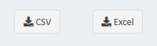
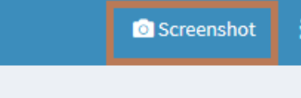
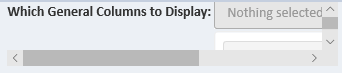
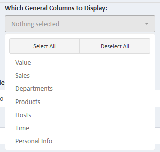
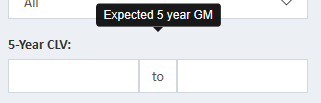
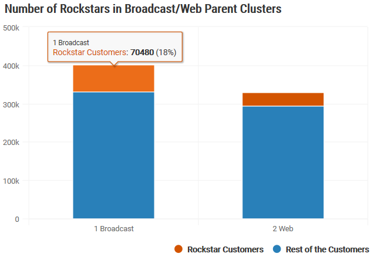
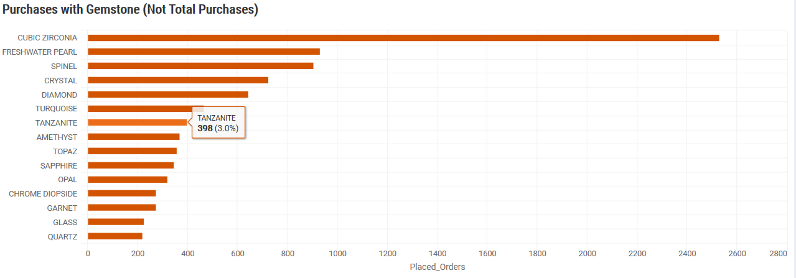
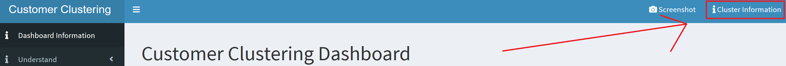
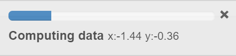

Shiny Dashboarding - Useful Code
======================================================

Created by Chia, Jonathan, last modified on Apr 09, 2022

For making production ready shiny dashboards - table of contents in no particular order

Note: this article assumes reader already has a basic shiny understanding


*   [Why Use Shiny?](#WhyUseShiny?)
*   [Setup Dashboard URL](#SetupDashboardURL)
*   [Login/Authentication](#Login/Authentication)
    *   [IMPORTANT NOTE:](#IMPORTANTNOTE:)
*   [Display Markdown/HTML Documents](#DisplayMarkdown/HTMLDocuments)
*   [Email DataTable as CSV/Excel within Company through SMTP](#EmailDataTableasCSV/ExcelwithinCompanythroughSMTP)
*   [Download DataTable as CSV/Excel](#DownloadDataTableasCSV/Excel)
*   [Create Report Compiler Tab](#CreateReportCompilerTab)
    *   [Screenshot Button](#ScreenshotButton)
    *   [Report Tab](#ReportTab)
*   [DataTable Formatting Function Examples](#DataTableFormattingFunctionExamples)
    *   [Number Formatting](#NumberFormatting)
    *   [Border Formatting](#BorderFormatting)
    *   [Conditional Formatting](#ConditionalFormatting)
    *   [Notes:](#Notes:)
*   [Shiny Widgets - Dropdown, Sweet Alerts, PickerInput, SwitchInput, etc.](#ShinyWidgets-Dropdown,SweetAlerts,PickerInput,SwitchInput,etc.)
*   [When to use Column() vs. SplitLayout()](#WhentouseColumn()vs.SplitLayout())
*   [Adding Tool Tips](#AddingToolTips)
*   [Useful Database Connection Functions](#UsefulDatabaseConnectionFunctions)
*   [Highchart Visualization Tips](#HighchartVisualizationTips)
    *   [Non-Standard Evaluation (NSE) of columns](#Non-StandardEvaluation(NSE)ofcolumns)
    *   [Tool Tips](#ToolTips)
    *   [SUPER USEFUL WEBSITE](#SUPERUSEFULWEBSITE)
*   [Information Button on Header](#InformationButtononHeader)
*   [TabsetPanels()](#TabsetPanels())
*   [Good Color Schemes](#GoodColorSchemes)
*   [Icons](#Icons)
*   [Progress Loading Bars](#ProgressLoadingBars)
*   [Dashboard Logs](#DashboardLogs)
*   [Pool Package and Handling Connections](#PoolPackageandHandlingConnections)
    *   [Best Solution](#BestSolution)
    *   [Current Solution](#CurrentSolution)
*   [Show/Hide Tabset Panels](#Show/HideTabsetPanels)
*   [Dbplyr](#Dbplyr)
*   [Value Box Headers](#ValueBoxHeaders)
*   [Force Update/Restart of the Application](#ForceUpdate/RestartoftheApplication)
*   [Shiny Reports using R Markdown](#ShinyReportsusingRMarkdown)
*   [DataTable Row Last Clicked/Row Selected](#DataTableRowLastClicked/RowSelected)
*   [SQL Queries and preventing SQL Injections](#SQLQueriesandpreventingSQLInjections)
*   [Related articles](#Relatedarticles)

# Why Use Shiny?
------------------

1.  Shiny is a simple extension of R
2.  Shiny provides detailed customization but an easy framework

# Setup Dashboard URL
-----------------------

1.  Log into bi-rstudio - you will create your dashboard on this server so people in the company can access through a URL link
    
2.  Create a _ShinyApps_ folder in your home directory
    
3.  
4.  In your _Shiny Apps_ folder, create a folder for your dashboard - here we named it _mydashboard_
5.  
6.  Now people can access your dashboard through [http://bi-rstudio:3838/yourusername/mydashboard/](http://bi-rstudio:3838/jonchi1/customer_segmentation_dashboard/) 
7.  Finally, in the _mydashboard_ folder, create a R file named "app.R"

The URL link only works if you have a folder named ShinyApps, a dashboard folder, and then an app.R file.

# Login/Authentication
------------------------

For better security, create an authentication page for the dashboard 


UI

```r
require(shinymanager)

# this inactivity function will close the dashboard after enough idle time

inactivity <- "function idleTimer() {
	var t = setTimeout(logout, 120000);window.onmousemove = resetTimer; // catches mouse 
	movementswindow.onmousedown = resetTimer; // catches mouse 
	movementswindow.onclick = resetTimer;     // catches mouse 
	clickswindow.onscroll = resetTimer;    // catches scrollingwindow.onkeypress = resetTimer;  //catches keyboard 
	actionsfunction logout() {window.close();  //close the window
}
function resetTimer() {
	clearTimeout(t);t = setTimeout(logout, 120000);  // time is in milliseconds (1000 is 1 second)
}
}
idleTimer();"

ui <- shinymanager::secure_app(tags_top = tags$img(src = "https://upload.wikimedia.org/wikipedia/commons/9/9a/JTV_Logo.png", width = 200), 
			       tags_bottom = tags$div(tags$p("Username: JTV Email (lowercase)",    
			       tags$p("For access to this dashboard, please  contact ",     
 			       tags$a(href = paste("mailto:",cfg$user$manager_email,"?Subject=Shiny%20Manager",sep=""), target = "_top", cfg$user$manager_name)))),
			       head_auth = tags$script(inactivity),  
			       dashboardPage(header, sidebar, body))
```

Server

```r
credentials_df <- data.frame(user = c("joebob@jtv.com", "exampleuser@jtv.com"),    
 					password = c("123", "123"),    comment = c("user"),    stringsAsFactors = FALSE)

result_auth <- shinymanager::secure_server(check_credentials = check_credentials(credentials_df))    

output$res_auth <- renderPrint({ reactiveValuesToList(result_auth) })
```
  

Tip: For credentials_df, create it using config file

```r
credentials_df <- data.frame(user = c(cfg$user1, cfg$user2), 
			     password = c(cfg$password1, cfg$password2))
```

## **IMPORTANT NOTE:**

observe() function will not work because of the authentication page unless you use the below code:

```r
observe({    
	if(is.null(input$shinymanager_where) || (!is.null(input$shinymanager_where) && input$shinymanager_where %in% "application")){
		# insert code here
	}
})
```

Additionally, sometimes observeEvent() function will trigger at initialization because of the authentication page. Set init = FALSE to avoid this issue:

```r
observeEvent(input$actionbutton, init = FALSE, {
	# insert code here
})
```
  

  

# Display Markdown/HTML Documents
-----------------------------------

Markdown documents can be very good for explanation pages in dashboards.

markdown/html in shiny: [https://shiny.rstudio.com/gallery/including-html-text-and-markdown-files.html](https://shiny.rstudio.com/gallery/including-html-text-and-markdown-files.html)

markdown cheat sheet: [https://www.markdownguide.org/cheat-sheet/](https://www.markdownguide.org/cheat-sheet/)

  

# Email DataTable as CSV/Excel within Company through SMTP
------------------------------------------------------------

Create an email button:


Clicking the green email button reveals this dropdown:


  

UI

```r
require(shinyWidgets)
require(shinyAce)

dropdownButton(tags$h3("Send Email with List as Attachment"),                                                                            
		splitLayout(radioButtons('format', 'Attach List As:', c('CSV', 'Excel'), inline = TRUE),
		actionButton('send', "Send", icon = icon("envelope"))),                                                                            
		textInput("to", "To:", value=""),                                                                            
		textInput("cc", "Cc:", value=""),                                                                            
		textInput("subject", "Subject:", value=NULL),
		shinyAce::aceEditor("message", value=" ", height = "200px"),                                                                            
		tags$body("Instructions: to send to multiple people, place commas in between emails"),                                                                            
		tags$body("For example: joe@jtv.com, bob@jtv.com"),                                                                            
		tags$body("Note: email is sent from the email that you logged in with"),                                                                            
		status = 'success',                                                                            
		up = TRUE,                                                                            
		icon=icon('envelope'))
```

Server

```r
require(mailR)

observeEvent(input$send, {        
	withProgress(message = 'Emailing', value = 0, {      
		incProgress(1/3, detail = "Compiling List")            
		if (input$format == "Excel") {        
		path <- paste0('temp_files/filtered_customer_list_', session$token, '.xlsx')        
		xlsx::write.xlsx(values$df, path, row.names = FALSE)      }   # values$df is the datatable as seen in the above picture    

		if (input$format == "CSV") {        
		path <- paste0('temp_files/filtered_customer_list_', session$token, '.csv')        
		data.table::fwrite(values$df, path)      }                  

		incProgress(1/3, detail = "Writing Email")      
		user <- reactiveValuesToList(result_auth)$user      

		if (input$cc == "") {        
		send.mail(from = user,                  
				to = input$to,                  
				# cc = input$cc,                  
				# bcc = input$bcc,                  
				subject = input$subject,                  
				body = input$message,                  
				smtp = list(host.name = -----, port = --),                  
				authenticate = FALSE,                  
				send = TRUE,                  
				attach.files = path)      
		} else {        
		send.mail(from = user,                  
				to = input$to,                  
				cc = input$cc,                  
				# bcc = input$bcc,                  
				subject = input$subject,                  
				body = input$message,                  
				smtp = list(host.name = -----, port = --),                  
				authenticate = FALSE,                  
				send = TRUE,                  
				attach.files = path)      }            

		incProgress(1/3, detail = "Finished")    })            

	        system(paste("rm -f", path))  })
```

# Download DataTable as CSV/Excel
-----------------------------------



UI

```r
column(1, downloadButton('csv', "CSV")),                             
column(1, downloadButton('excel', "Excel")),
```
  

Server

```r
# NOTE: values$df is the dataframe you want to download

output$csv <- downloadHandler(        
		# This function returns a string which tells the client browser what name to use when saving the file.    
		filename = function() {      
		paste("customer-filtered-", Sys.Date(), ".csv", sep="")    },        

		# This function should write data to a file given to it by the argument 'file'.    
		content = function(file) {      
		# Write to a file specified by the 'file' argument      
		write.table(values$df, file,  row.names = FALSE)    }  )      


output$excel <- downloadHandler(        
		filename = function() {      
		paste("customer-filtered-", Sys.Date(), ".xlsx", sep="")    },    

		content = function(file) {            
		xlsx::write.xlsx(values$df, file, row.names = FALSE)    }  )
```
  

# Create Report Compiler Tab
------------------------------

Users can compile a report in word/html using screenshots through this tab


  

How to build:

1.  Create screenshot button
2.  Create report compiling tab

  

### Screenshot Button

Adds screenshot button to top right corner of the dashboard



UI

  
```r
header <- dashboardHeader(title = "Cool Title",                            
		tags$li(class = 'dropdown', actionLink("screenshot", "Screenshot", icon = icon("camera")))
)
```

Server

```r
require(shinyscreenshot) 
observeEvent(input$screenshot, {                         # will save the screenshots into a temp directory                      screenshot(filename = paste0('dashboard_screenshot_', Sys.Date())) })
```

### **Report Tab**

UI

```r
build_report_page <- fluidPage(  
# App title ----  
titlePanel("Compile Reports using Screenshots"),  
sidebarLayout(    
	sidebarPanel(      
			fileInput("file1", "File Uploader", multiple = TRUE, accept = c(".png"), buttonLabel = "Upload"), 
			tags$hr(), 

			helpText("Type an executive summary here:"),      
			shinyAce::aceEditor("markdowninput", value="Please use any **markdown** syntax", height = "75px", mode = "markdown", showLineNumbers = FALSE),      
			tags$hr(),      

			splitLayout(        
					downloadButton('build_report',"Download Report",class="butt"),        
					actionButton("preview", "Preview Report", style="color: #E6EBEF; background-color: steelblue")      ),      
					tags$head(tags$style(".butt{background-color:steelblue;} .butt{color: #e6ebef;}")),      
					radioButtons('format_report', 'Document format', c('Word', 'HTML'), inline = TRUE),    ),        

	mainPanel(      
			# Output: Data file ----      
			uiOutput("markdown")    )      ))
```

Server

```r
output$htmlmarkdown <- reactive({ note_in_html(input$markdowninput) })    

observeEvent(input$preview, {    
				src <- normalizePath('doc/documents/report_compiler_md.Rmd')    
				owd <- setwd(tempdir())    
				on.exit(setwd(owd))    

				file.copy(src, 'report_compiler_md.Rmd', overwrite = TRUE)    
				out <- knitr::knit('report_compiler_md.Rmd')     
				values$src <- normalizePath(out)  })    

output$markdown <- renderUI({    
				if (input$preview > 0) {      
					file <- values$src    
				} else {      
					file <- 'doc/documents/blank_report_compiler.md'    
				}    

				includeMarkdown(file)  })    


output$build_report = downloadHandler(        
				filename<- function(){            
					paste("Customer_Segmentation_Report",Sys.Date(),switch(input$format_report, HTML = '.html', Word = '.docx'),sep = "")},                

				content = function(file) {            
					if (input$format_report=="HTML"){                
						withProgress(message = 'Download in progress', detail = 'This may take a while...', value = 0, {                                                                                      
							src <- normalizePath('doc/documents/report_compiler_html.Rmd')                                                                     
							# temporarily switch to the temp dir, in case you do not have write permission to the current working directory                                              
							owd <- setwd(tempdir())                                              
							on.exit(setwd(owd))                                              

							file.copy(src, 'report_compiler_html.Rmd', overwrite = TRUE)                       
							# images will already be in tmp directory so .Rmd file can reference them                                              
							library(rmarkdown)                                              
							out <- render('report_compiler_html.Rmd', html_document())                                              
							file.rename(out, file) 
						})                
							### below is the end of pdf content              
					}else{                
						withProgress(message = 'Download in progress',  detail = 'This may take a while...', value = 0, {                                              
					        	src <- normalizePath('doc/documents/report_compiler_word.Rmd')                                                                     
							owd <- setwd(tempdir())                                              
							on.exit(setwd(owd))                                              
							file.copy(src, 'report_compiler_word.Rmd', overwrite = TRUE)                                                          
							library(rmarkdown)                                              
							out <- render('report_compiler_word.Rmd', word_document())                                              
							file.rename(out, file)                                            
						})              
					}                    
})
```

Documents - YOU WILL NEED THESE FILES

_report_compiler_md.Rmd_

```r
--- 
title: "Customer Segmentation Report"
date: "`r format(Sys.time(), '%d %B, %Y')`"
output: md_document
---

```{r setup, include=FALSE}
knitr::opts_chunk$set(echo = F)
```

```{r, echo = FALSE}
knitr::asis_output(input$markdowninput)
```

```{r, echo = FALSE}
mydirectory <- list.files(include.dirs=TRUE)
myimages<-list.files(mydirectory[1], pattern = ".png", full.names = TRUE)
knitr::include_graphics(myimages)
```
```
  

_report_compiler_html.Rmd_ - same as above but with output: html_document

_report_compiler_word.Rmd_ - same as above but with output: word_document

  

# DataTable Formatting Function Examples
------------------------------------------

DataTable formatting is an absolute pain and takes forever. Below are some functions I use to make life easier:

### **Number Formatting**

Function

```r
# applies number formatting to DataTable (currency, rounding, percentages)
#
# @param DataTable: a DataTable object# @param perc_columns: vector of column names that need percentage formatting
# @param num_columns: vector of column names that need to be rounded
# @param currency_columns: vector of column names that need dollar formatting
#
# @return DataTable with percentages rounded to 2 decimal places and currency/numbers rounded to 0 decimal places
formatstyle_number <- function(DataTable, perc_columns, num_columns, currency_columns) {  
	if (!FALSE %in% perc_columns) {    
		for (i in perc_columns) {      DataTable <- DataTable %>% formatPercentage(., i, 2)    }  
	}  
	if (!FALSE %in% num_columns) {    
		for (i in num_columns) {      DataTable <- DataTable %>% formatCurrency(., i, "", digits = 0)    }  
	}  
	if (!FALSE %in% currency_columns) {    
		for (i in currency_columns) {      DataTable <- DataTable %>% formatCurrency(., i, "$", digits = 0)    }  
	}  

	DataTable
}
```

Server Example

```r
output$table <- renderDataTable({
	datatable(df) %>% formatstyle_number(., c('Return Rate', 'Cancel Rate', 'Percent Temporary Discount'), c('Total Orders'), c('Gross Margin', 'CLV 5'))
})
```

Server without function

```r
output$table <- renderDataTable({
	datatable(df) %>% 
		formatPercentage(., 'Return Rate', 2) %>%
		formatPercentage(., 'Cancel Rate', 2) %>%
		formatPercentage(., 'Percent Temporary Discount', 2) %>%
		formatCurrency(., 'Total Orders', "", digits = 0) %>%
		formatCurrency(., 'Gross Margin', "$", digits = 0) %>%
		formatCurrency(., 'CLV 5', "$", digits = 0)
})
```
  

### Border Formatting

Function

```r
# Adds vertical lines into the table for column separation
#
# @param left_columns: vector of column names to place vertical borders on left of
# @param right: column name of column to place vertical border at the right of
#
# @return DataTable with vertical line borders
formatstyle_border_vertical <- function(DataTable, left_columns, right) {  
	for (i in left_columns) {    
		DataTable <- DataTable %>% formatStyle(., i, `border-left` = "solid 2px #000")  
	}  
	
	DataTable %>% formatStyle(., right, `border-right` = "solid 2px #000")
}
```
  

### Conditional Formatting

The below function is more complicated. Ask Jonathan or Tyki for an explanation if it is confusing.

Function

```r
# applies conditional color formatting to a DataTable
#
#
# @param DataTable: a DataTable object
# @param columns: vector of column names to be formatted
# @param is_total: TRUE formats the "total" row. FALSE for DataTables without "total" row
# @param colors: vector of colors in hex format - must be odd number of colors
#
# @return a DataTable with columns that are colored based on quantiles of numbers in column
formatstyle_color <- function(DataTable, columns, colors) {  
	if (is_total == TRUE) {    
		for (i in columns) {      
			DataTable <- DataTable %>%         
				formatStyle(., i, backgroundColor = styleInterval(DataTable$x$data[-nrow(DataTable$x$data), ] %>% 
											pull(i) %>% 
											quantile(prob = seq(0, 1, by = 1/length(colors))[-c(1, length(colors)+1)]),
										  colors)
				) %>%      
				formatStyle(., 1:ncol(DataTable$x$data), 
						valueColumns = 1,                     
						backgroundColor = styleEqual("Total", "white"))    
		}  
	} else {    
		for (i in columns) {      
			DataTable <- DataTable %>% 
				formatStyle(., i, backgroundColor = styleInterval(DataTable$x$data %>% 
											pull(i) %>% 
											quantile(prob = seq(0, 1, by = 1/length(colors))[-c(1, length(colors)+1)],na.rm=TRUE), 
									         colors)
				)    
		}  
	}  

	DataTable

}
```
  

### Notes:

Datatable$x$data references the dataframe that was put into the datatable() function

Reference: [https://rstudio.github.io/DT/functions.html](https://rstudio.github.io/DT/functions.html) 

Build your own functions using the same strategies from these formulas

  

# Shiny Widgets - Dropdown, Sweet Alerts, PickerInput, SwitchInput, etc.
--------------------------------------------------------------------------

This package provides improved UI widgets such as pickerInput(), dropdownButton(), and sweet alerts

[https://dreamrs.github.io/shinyWidgets/index.html](https://dreamrs.github.io/shinyWidgets/index.html)


# When to use Column() vs. SplitLayout()
------------------------------------------

SplitLayout() automatically places UI widgets equally spread apart, so it's **easier to use**

UI - sliderinput will take up half of the screen and plot output will take up the other half

```r
fluidRow(   
	splitLayout(      
		sliderInput("obs", "Number of observations:", min = 1, max = 1000, value = 500),        
		plotOutput("distPlot")
		)
	)
```
  

Column() gives you full control of UI widget location, so it gives **more detailed fine-tuning**

UI - slider input takes up 1/3 of the screen and plot output takes up 2/3

```r
 fluidRow(    
	column(4,      
		sliderInput("obs", "Number of observations:", min = 1, max = 1000, value = 500)    ),    
	column(8,      
		plotOutput("distPlot")    )
	)

# The grid width of the column (must be between 1 and 12)
```

**IMPORTANT NOTE: use column() if selectInput() dropdown doesn't dropdown fully**

Using SplitLayout()



Using column()



  

# Adding Tool Tips
--------------------

Put tool tips over/under widgets



  

UI

```r
require(shinyBS)

fluidRow(
numericRangeInput("clv_5", "5-Year CLV:", value = c(NA,NA)),
bsTooltip('clv_5', "Expected 5 year GM", placement = "top")
)

# IMPORTANT: be careful not to have apostrophes in the tooltip or it will not show. 
# For example: 
# 	bsTooltip('clv_5', "Customer's 5 year GM", placement = "top")   --  this is incorrect
```
  

# Useful Database Connection Functions
----------------------------------------

Connection

```r
con <- dbConnect(odbc::odbc(),                          
			uid = ----,                           
			pwd = ----,                          
			"OracleODBC")
```
  

Close connection at end of app

```r
session$onSessionEnded(function() {dbDisconnect(con)})
```
  

Write data.frame() to Oracle

```r
DBI::dbWriteTable(con, "TABLE_NAME", df, append = FALSE, overwrite = FALSE, temporary = FALSE)
```
  

Append data to global temporary table in oracle 

```r
# note: dbWriteTable('temporary = TRUE') does not work with odbc package 
# you have to create a global temporary table in oracle and then append data onto that table using dbWriteTable

dbWriteTable(con, 'GLOBAL_TEMP_TABLE_NAME', df, append=TRUE)
```
  

Lazy Load table from oracle into R - see DBPLYR section for more details

```r
lazy_table <- dbplyr::tbl(con,sql("USER.EXAMPLE_TABLE"))
```
  

# Highchart Visualization Tips
--------------------------------

**I highly recommend using highcharts for best-in-class tooltips and visualizations**

[https://jkunst.com/highcharter/](https://jkunst.com/highcharter/)

Example:



  

### Non-Standard Evaluation (NSE) of columns

Problem:

```r
bar_chart <- function(df, variable_name_str) {
	hchart(df, 'bar', hcaes(x = variable_name_str, y = 'Placed_Orders'))
	
}

bar_chart(df, 'gemstone')

# This function doesn't work because it thinks x is 'variable_name_str' instead of 'gemstone'
```

Solution:

```r
bar_chart <- function(df, variable_name_str) {  
column <- sym(variable_name_str)  
hchart(df, 'bar', hcaes(x = !!column, y = 'Placed_Orders'))
}
```

This solution should work in other scenarios outside of highchart visualizations as well

  

### Tool Tips

_Below is an example of a tooltip. The dataframe has three columns: Gemstone, Placed_Orders, and Percent_Placed_Orders_

To add a tooltip, all you need is point.Variable_Name

```r
hc_tooltip(pointFormat = "Placed Orders: {point.Placed_Orders}")
```

Another example with number formatting and adding a percentage sign to the end of percent_placed_orders:

```r
hchart(df, 'bar', hcaes(x = 'Gemstone', y = 'Placed_Orders')) %>%    
	hc_tooltip(pointFormat = '<b>{point.Placed_Orders:.f}</b> ({point.Percent_Placed_Orders:.1f}%)<br/>') %>%    
	hc_add_theme(hc_theme_smpl())
```



### SUPER USEFUL WEBSITE

[https://www.tmbish.me/lab/highcharter-cookbook/](https://www.tmbish.me/lab/highcharter-cookbook/)

  

# Information Button on Header
--------------------------------

After clicking the top right information button, display a markdown document in a modal window



UI

```r
header <- dashboardHeader(title = "title", tags$li(actionLink("openModal", label = "Information", icon = icon("info")), class = "dropdown")) 
```

Server

```r
observeEvent(input$openModal, {    
	showModal(      
		modalDialog(        
			includeMarkdown(filepath_to_markdown_doc), easyClose = TRUE, size = 'l'
		))  
})
```

# TabsetPanels()
------------------

Tabset Panels are really help to organize dashboards. For example:


[https://shiny.rstudio.com/gallery/tabsets.html](https://shiny.rstudio.com/gallery/tabsets.html)

# Good Color Schemes
----------------------

To find good color gradients, see this website:

[https://learnui.design/tools/data-color-picker.html](https://learnui.design/tools/data-color-picker.html)

  

(Can also use this to find colors for conditional formatting)

# Icons
---------

For anytime you use icon=icon() in actionButtons, actionLinks, sidebar tabs, etc.


[https://fontawesome.com/icons?d=gallery](https://fontawesome.com/icons?d=gallery)

# Progress Loading Bars
-------------------------

Helps executives not get frustrated with wait times when you perform high-intensive computations



[https://shiny.rstudio.com/gallery/progress-bar-example.html](https://shiny.rstudio.com/gallery/progress-bar-example.html)

# Dashboard Logs
------------------

Sends log information to table in database. Big thanks to Gable for the code on this:

Server

```r
# Create Log Table in Database
# log <- data.frame(stringsAsFactors = FALSE,
#                   TIME_STAMP = as.character(paste("'", Sys.time(), "'", sep = "")),
#                   DASHBOARD = "'BEGIN_LOG'",
#                   USER = "'BEGIN_LOG'",
#                   SESSION_ID = "'BEGIN_LOG'",
#                   INPUT = "'BEGIN_LOG'")
# 
# dbWriteTable(connection, "DASHBOARD_LOG", log, append = FALSE, overwrite = TRUE)

observeEvent(input$tabs, {    # When tab is changed it will trigger
	session <- as.character(session$token)    
	user <- reactiveValuesToList(result_auth)$user    
	values$log <-  data.frame(      
			stringsAsFactors = FALSE,      
			SESSION_ID = paste("'", as.character(session), "'", sep = ""),      
			DASHBOARD = "'SEGMENTATION'",      
			USER = paste("'", as.character(user), "'", sep = ""),      
			INPUT = paste("'", input$tabs, "'", sep = ""),      
			TIME_STAMP = as.character(paste("'", Sys.time(), "'", sep = ""))    )        

	qry <- sqlAppendTable(con, "DASHBOARD_LOG", values$log, row.names = FALSE)    
	res <- dbSendStatement(con, qry)    
	dbClearResult(res)      
})
```
  

UI - input$tabs comes from the id in the sidebar

```r
sidebarMenu(id = "tabs",              
	menuItem("Dashboard Information", tabName = "about", icon=icon("info"))
)
```
  

# Pool Package and Handling Connections
-----------------------------------------

### **Best Solution**

The pool package is the best way to handle complex dashboards with multiple connections; however, I haven't had any success with pool and odbc package

```r
# Couldn't get this to work
# library(pool)
# pool <- dbPool(drv=odbc::odbc(),
#                driver=OracleODBC,
#                server=#####,
#                uid=#####,
#                pwd=#####,
#                port=##### )
```

[https://shiny.rstudio.com/articles/overview.html](https://shiny.rstudio.com/articles/overview.html)

### Current Solution

Initialize one connection at beginning of server and then close it at the end of the session

```r
server <- function(input, output, session) {
	# initialize connection to database  
	con <- dbConnect(odbc::odbc(),                           
	uid = ####,                           
	pwd = ####,                          
	"OracleODBC")

	#Code

	
	session$onSessionEnded(function() {DBI::dbDisconnect(con)})
}
```
  

  

  

# Show/Hide Tabset Panels
---------------------------

Here is an example for how to show/hide tabset panels using a switch input button:


UI

```r
switchInput("minimizetab", label = "Show Filters", value = TRUE, onLabel = "YES", offLabel = "NO")

tabsetPanel(id = 'filtertabs', 
	tabPanel("Main Filters", #code),
	tabPanel("Financial Filters", #code),
	tabPanel("Department Filters", #code),
	tabPanel("Product Filters", #code),
	tabPanel("Host Filters", #code),
	tabPanel("Time Filters", #code),
	tabPanel("Advanced Filtering", #code)
)
```

Here are the tabsetpanels - they will be hidden if the switch input is clicked


Server

```r
observeEvent(input$minimizetab, {      
	if (input$minimizetab == TRUE) {        
		showTab(inputId = "filtertabs", target = "Main Filters")# notice target references the title not the id       
		showTab(inputId = "filtertabs", target = "Financial Filters")        
		showTab(inputId = "filtertabs", target = "Department Filters")        
		showTab(inputId = "filtertabs", target = "Product Filters")        
		showTab(inputId = "filtertabs", target = "Host Filters")        
		showTab(inputId = "filtertabs", target = "Time Filters")        
		showTab(inputId = 'filtertabs', target = "Advanced Filtering")      
	} else {        
		hideTab(inputId = "filtertabs", target = "Main Filters")        
		hideTab(inputId = "filtertabs", target = "Financial Filters")        
		hideTab(inputId = "filtertabs", target = "Department Filters")        
		hideTab(inputId = "filtertabs", target = "Product Filters")        
		hideTab(inputId = "filtertabs", target = "Host Filters")        
		hideTab(inputId = "filtertabs", target = "Time Filters")        
		hideTab(inputId = "filtertabs", target = "Advanced Filtering")      }      
})
```
  

# Dbplyr
----------

_"dbplyr is the database backend for [dplyr](https://dplyr.tidyverse.org/). It allows you to use remote database tables as if they are in-memory data frames by automatically converting dplyr code into SQL."_

*   **[https://dbplyr.tidyverse.org/](https://dbplyr.tidyverse.org/)**

  

Dbplyr is useful when working with tables that are way too big to download into R.

# Value Box Headers
---------------------


Headers can have subtext, icons, and different colors

UI

```r
fluidPage(    
valueBoxOutput(outputId = "intro_header", width = 12)
)
```

Server

```r
output$intro_header <- renderValueBox({
	valueBox(tags$p("Customer Clustering Dashboard", 
	style = cfg$format$server$font$size), 
	paste0("Date Last Updated: ", 
		format(file.info("filepath.Rdata")$mtime, "%Y-%m-%d")),  
	width = 2, 
	color = "navy"
)})

# For icons, you can add 'icon = icon("text")' to the valuebox
```


# Force Update/Restart of the Application
-------------------------------------------

**Problem:** after updating data/code in the dashboard, the application doesn't update if someone has the dashboard open on one of their browser tabs - even if they are logged out/timed out. 

**Solution:**

Create a blank text file named 'restart.txt' in the application directory. This will start a 'new R process to run the "new" (restarted) Shiny Application for this and future users'.

  
Old sessions will remain unchanged until old user refreshes/relogs in. This shouldn't be a problem though because dashboard can be build to time out (see table of contents)   
   
Make a bash file that runs 'touch restart.txt' to restart the app every day at a specific time. The Shiny Server updates based on the modified time of the 'restart.txt' file.  
   
Documentation: [http://rstudio.github.io/shiny-server/os/0.4.0/#restarting-an-application](http://rstudio.github.io/shiny-server/os/0.4.0/#restarting-an-application)

  

  

  

  

# Shiny Reports using R Markdown
----------------------------------

[https://github.com/davidruvolo51/shinyAppTutorials/tree/main/rmarkdown-app](https://github.com/davidruvolo51/shinyAppTutorials/tree/main/rmarkdown-app)

[https://shiny.rstudio.com/articles/generating-reports.html](https://shiny.rstudio.com/articles/generating-reports.html)

  

I believe this is the solution to automating executive dashboard reports. If you want to see an example, check out the executive_report folder in the executive dashboard.

  

To add:

# DataTable Row Last Clicked/Row Selected
-------------------------------------------

# SQL Queries and preventing SQL Injections
---------------------------------------------

    

  

Attachments:
------------

 [image2021-1-29_16-40-4.png](attachments/95650173/95650174.png) (image/png)  
 [image2021-1-29_16-39-48.png](attachments/95650173/95650175.png) (image/png)  
 [image2021-1-29_16-38-46.png](attachments/95650173/95650176.png) (image/png)  
 [image2021-1-12_21-11-38.png](attachments/95650173/95650177.png) (image/png)  
 [image2021-1-12_20-19-26.png](attachments/95650173/95650178.png) (image/png)  
 [image2021-1-12_20-18-42.png](attachments/95650173/95650179.png) (image/png)  
 [image2021-1-12_20-18-29.png](attachments/95650173/95650180.png) (image/png)  
 [Shiny Dashboard - Useful Code.url](attachments/95650173/95650181.url) (application/octet-stream)  
 [image2021-1-12_19-36-38.png](attachments/95650173/95650182.png) (image/png)  
 [image2021-1-12_19-35-38.png](attachments/95650173/95650183.png) (image/png)  
 [image2021-1-12_19-28-12.png](attachments/95650173/95650184.png) (image/png)  
 [image2021-1-12_19-26-53.png](attachments/95650173/95650185.png) (image/png)  
 [image2021-1-12_19-16-54.png](attachments/95650173/95650186.png) (image/png)  
 [image2021-1-12_17-28-27.png](attachments/95650173/95650187.png) (image/png)  
 [image2021-1-11_19-34-11.png](attachments/95650173/95650188.png) (image/png)  
 [image2021-1-11_19-19-13.png](attachments/95650173/95650189.png) (image/png)  
 [image2021-1-11_11-30-21.png](attachments/95650173/95650190.png) (image/png)  
 [image2021-1-11_9-7-37.png](attachments/95650173/95650191.png) (image/png)  
 [image2021-1-11_9-5-51.png](attachments/95650173/95650192.png) (image/png)  
 [image2021-1-11_8-59-51.png](attachments/95650173/95650193.png) (image/png)  
 [image2021-1-11_7-52-3.png](attachments/95650173/95650194.png) (image/png)  
 [image2021-1-11_7-51-10.png](attachments/95650173/95650195.png) (image/png)  
 [image2021-1-11_7-50-29.png](attachments/95650173/95650196.png) (image/png)  
 [image2021-1-11_7-42-54.png](attachments/95650173/95650197.png) (image/png)  
 [image2020-12-29_14-28-6.png](attachments/95650173/95650198.png) (image/png)  
 [image2020-12-28_18-54-49.png](attachments/95650173/95650199.png) (image/png)  
 [image2020-12-28_18-53-56.png](attachments/95650173/95650200.png) (image/png)  
 [image2020-12-28_18-27-36.png](attachments/95650173/95650201.png) (image/png)  
 [image2020-12-28_18-26-37.png](attachments/95650173/95650202.png) (image/png)  
 [image2020-12-28_18-26-26.png](attachments/95650173/95650203.png) (image/png)  
 [image2020-12-28_18-4-41.png](attachments/95650173/95650204.png) (image/png)  
 [image2020-12-28_17-56-53.png](attachments/95650173/95650205.png) (image/png)  
 [image2022-4-9_16-34-5.png](attachments/95650173/95650207.png) (image/png)  
 [image2022-4-9_16-40-35.png](attachments/95650173/95650208.png) (image/png)  

Document generated by Confluence on Apr 09, 2022 16:54

[Atlassian](http://www.atlassian.com/)