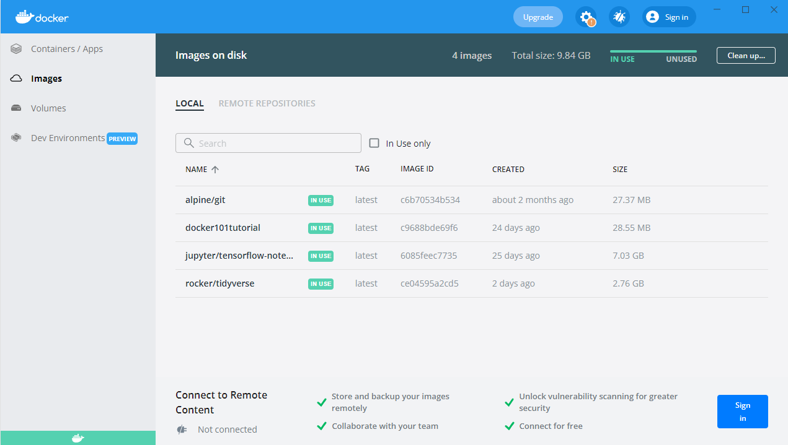
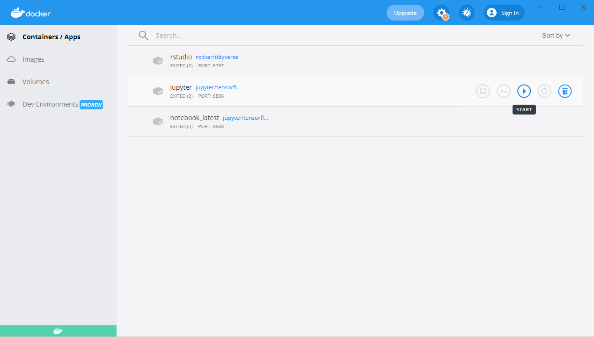
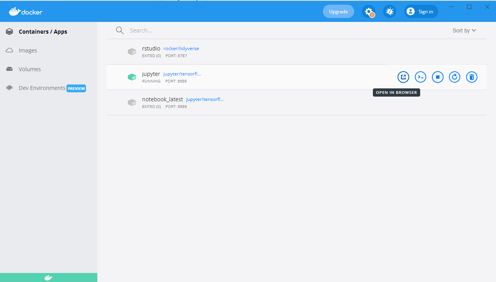
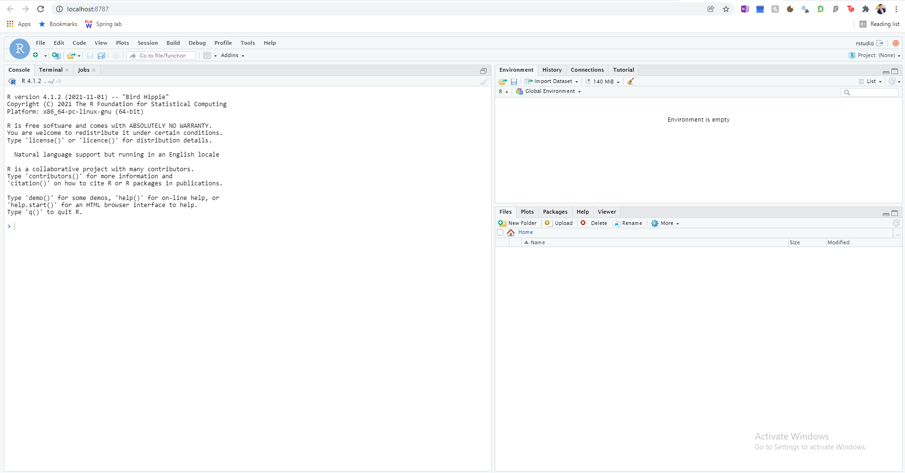

Using Docker to Install Jupyter Notebook and R Studio
==============================================================================

Created by Chia, Jonathan, last modified on Apr 09, 2022

**With 2 lines of code you can:**

*   **Set up Jupyter Notebook preloaded with tensorflow, numpy, pandas, sklearn, etc.**

*   **Set up R Studio preloaded with tidyverse packages**

* [Steps](#steps)
  * [Install Docker](#install)
  * [Pull Docker Image](#pull)
  * [Run Docker Image](#run)
  * [Start the Container](#start_container)
  * [Sign On](#sign_on)
* [Next Steps](#next_steps)
  * [Environment Setup](#environments)
  * [Install Additional Packages](#additional_packages)
  * [Install Additional Packages through Docker File](#additional_packages_docker)
* [Additional Resources](#additional_resources)

# Steps <a name="steps"></a>
======

## 1. Install Docker <a name="install"></a>
-----------------

Download Docker Desktop

[https://www.docker.com/get-started](https://www.docker.com/get-started)

  

You will see three different tabs:

Containers - virtualized run-time environment where users can isolate applications from the underlying system. Basically **where you run the template**.

Images - an immutable (unchangeable) file that contains the source code, libraries, dependencies, tools, and other files needed for an application to run. Basically a **template.**

Volumes - this is where the data is stored.

  

[https://phoenixnap.com/kb/docker-image-vs-container](https://phoenixnap.com/kb/docker-image-vs-container)

[https://docs.docker.com/storage/volumes/](https://docs.docker.com/storage/volumes/)

  

Note: You will probably need to enable 'virtualization' in your BIOS. May also need to install linux subsystem in windows. 

## 2. Pull Docker Image <a name="pull"></a>
---------------------

Open up your command line (in windows you can open up windows powershell)

  

Run the Following Code

R Studio:

```linux
docker pull rocker/tidyverse
```

Jupyter Lab:

```linux
docker pull jupyter/tensorflow-notebook
```

You should now see _rocker/tidyverse_ or _jupyter/tensorflow-notebook_ in your _Images_:



  

## 3. Run Docker Image <a name="run"></a>
--------------------

Now we need to run the image to create a container:

R Studio:

```linux
docker run -p 8787:8787 -v r_volume:/app -e PASSWORD=rstudio --name rstudio rocker/tidyverse
```

-p tells it to run in the browser

-v names the volume

--name names the container

Jupyter Lab:

```linux
docker run -p 8888:8888 --name jupyter -v jupyter_volume:/app -e JUPYTER_ENABLE_LAB=yes -it jupyter/tensorflow-notebook
```

-v names the volume and sets it up

-it makes it interactive

Now the data will be stored in _Volumes_:
-----------------------------------------


--------------------------------------

## 4. Start the Container <a name="start_container"></a>
-----------------------

Click the _Play_ button:
------------------------


--------------------------------------

And then click _Open in Browser:_
---------------------------------


----------------------------------------

## 5. Sign On <a name="sign_on"></a>
-----------

Jupyter: 

If Jupyter Lab asks for a token, look at the command line and you'll see it in one of the outputs.

  

R Studio:

Username: rstudio

Password: rstudio

  

If everything was set up correctly, you should see these screens:
-----------------------------------------------------------------

Jupyter Lab:


  

R Studio:



# Next Steps <a name="next_steps"></a>
===========

## 1. Set up Environments: <a name="environments"></a>
--------------------

Set up your environments.

  

## 2. Installing Additional Packages: <a name="additional_packages"></a>
-------------------------------

Jupyter Lab:

Use pip install in the jupyter lab terminal

  

R Studio:

Use install.packages()

  

I believe the packages are saved in the volume.

## 3. Additional Package Installation through Docker Files: <a name="additional_packages_docker"></a>
-----------------------------------------------------

If you want the container to start with certain packages you can use a Docker File to do that.

  

Don't have an article for this yet, but see here:

[https://davetang.org/muse/2021/04/24/running-rstudio-server-with-docker/](https://davetang.org/muse/2021/04/24/running-rstudio-server-with-docker/)

[https://towardsdatascience.com/how-to-run-jupyter-notebook-on-docker-7c9748ed209f](https://towardsdatascience.com/how-to-run-jupyter-notebook-on-docker-7c9748ed209f)

  

  

  

  

  

# Additional Resources <a name="additional_resources"></a>

See this link:

[https://jupyter-docker-stacks.readthedocs.io/en/latest/](https://jupyter-docker-stacks.readthedocs.io/en/latest/)

  

Docker Tutorial for R:

[https://jsta.github.io/r-docker-tutorial/02-Launching-Docker.html](https://jsta.github.io/r-docker-tutorial/02-Launching-Docker.html)


---
Document generated by Confluence on Apr 09, 2022 16:54

[Atlassian](http://www.atlassian.com/)
