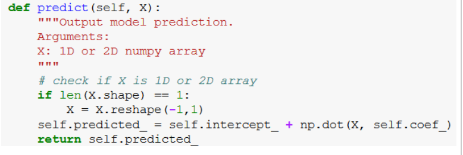

OOP - Object Oriented Programming
==========================================================

Created by Chia, Jonathan on Apr 09, 2022

# Introduction

Some notes on OOP.

See: [https://www.kdnuggets.com/2019/08/object-oriented-programming-data-scientists-estimator.html](https://www.kdnuggets.com/2019/08/object-oriented-programming-data-scientists-estimator.html)

  

## **Difference between _self_ and other variables**

Notice here how output _predicted__ gets saved into _self_. 

The difference between X and _self_ is that X is a variable that comes in, whereas _self_ is a variable that is saved and used throughout the whole class. _self.predicted__ can be used in other defs 

Notice the _self.intercept__ and _self.coef__. Instead of starting the def with predict(coef_, intercept_, X), I can start the def with just predict(self, X).

  

  

  

---

Document generated by Confluence on Apr 09, 2022 16:54

[Atlassian](http://www.atlassian.com/)
