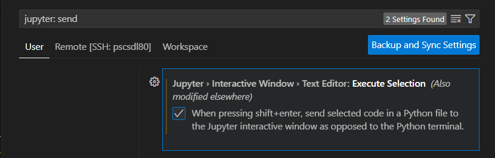

# Useful Articles

# Data Science in VS Code

# SQL

* Run SQL in Jupyter Notebooks (https://towardsdatascience.com/heres-how-to-run-sql-in-jupyter-notebooks-f26eb90f3259)

# Regression

* Multicollinearity (https://towardsdatascience.com/multicollinearity-problem-or-not-d4bd7a9cfb91)

# Propensity Score Matching

* compare models (https://medium.com/swlh/estimate-multiple-propensity-models-and-compare-their-performance-using-a-model-agnostic-cb07413dbb31)

# Causal Inference

* Why important to learn (https://medium.com/@leihua-ye/why-data-scientists-should-learn-causal-inference-a70c4ffb4809)

# Media Mix Modelling

* Robyn (https://towardsdatascience.com/automated-marketing-mix-modeling-with-facebooks-robyn-fd79e60b489d)
* PYMC Marketing:
    * https://www.pymc-marketing.io/en/stable/
    * https://www.pymc-marketing.io/en/stable/notebooks/mmm/mmm_example.html#id1
    * https://www.youtube.com/watch?v=9shZeqKG3M0&t=1s
    * https://www.intuitivebayes.com/
    * https://bambinos.github.io/bambi/
    * https://github.com/pymc-devs/pymc-resources/tree/main/Rethinking_2
