<a href="https://colab.research.google.com/github/Jonathan-Chia/portfolio/blob/main/time_series/forecasting_bitcoin_prices.ipynb" target="_parent"></a>

# Predicting Bitcoin Prices using Deep Learning Time Series

Practicing Deep Learning Time Series Forecasting on BitCoin Data

From ZeroToMastery Tensorflow Course


```python
!nvidia-smi -L
```

    GPU 0: Tesla K80 (UUID: GPU-3d431c8e-89fd-3326-713b-0dfee7b92355)

# Table of Contents

* [Get Data](#data)
    * [Important Time Series Patterns](#patterns)
    * [Importing Data](#import)
    * [Train Test Splits](#train_test)
    * [Plotting Function](#plotting)
    * [Modelling Experiments](#experiments)
* [Model 0: Naive Forecast](#model0)
* [Windowing Time Series](#windowing)
* [Model 1: Dense 1,7](#model1)
* [Model 2: Dense 30,1](#model2)
* [Model 3: Dense 30,7](#model3)
* [Model 4: Conv1D](#model4)
* [Model 5: LSTM](#model5)
* [Model 6: Multivariate](#model6)
* [Model 7: N-BEATS Algorithm](#model7)
* [Model 8: Ensemble Model](#model8)
* [Model 9: Predicting into Future](#model9)
* [Model 10: Turkey Data](#model10)
* [Comparing Models](#comparing)

## Get Data <a name="data"></a>

Download all historical data from here: https://www.coindesk.com/price/bitcoin/


```python
## Import time series data with pandas
import pandas as pd

df = pd.read_csv('/content/BTC_USD_2014-11-04_2021-10-25-CoinDesk.csv',
                 parse_dates=['Date'],
                 index_col=["Date"]) # put date as index
df.head()
```


<div>
<style scoped>
    .dataframe tbody tr th:only-of-type {
        vertical-align: middle;
    }

    .dataframe tbody tr th {
        vertical-align: top;
    }

    .dataframe thead th {
        text-align: right;
    }
</style>
<table border="1" class="dataframe">
  <thead>
    <tr style="text-align: right;">
      <th></th>
      <th>Currency</th>
      <th>Closing Price (USD)</th>
      <th>24h Open (USD)</th>
      <th>24h High (USD)</th>
      <th>24h Low (USD)</th>
    </tr>
    <tr>
      <th>Date</th>
      <th></th>
      <th></th>
      <th></th>
      <th></th>
      <th></th>
    </tr>
  </thead>
  <tbody>
    <tr>
      <th>2014-11-04</th>
      <td>BTC</td>
      <td>324.71833</td>
      <td>331.60083</td>
      <td>332.75133</td>
      <td>323.06333</td>
    </tr>
    <tr>
      <th>2014-11-05</th>
      <td>BTC</td>
      <td>332.45666</td>
      <td>324.71833</td>
      <td>335.81166</td>
      <td>320.93333</td>
    </tr>
    <tr>
      <th>2014-11-06</th>
      <td>BTC</td>
      <td>336.58500</td>
      <td>332.45666</td>
      <td>341.49000</td>
      <td>328.56166</td>
    </tr>
    <tr>
      <th>2014-11-07</th>
      <td>BTC</td>
      <td>346.77500</td>
      <td>336.58500</td>
      <td>351.57500</td>
      <td>336.02833</td>
    </tr>
    <tr>
      <th>2014-11-08</th>
      <td>BTC</td>
      <td>344.81166</td>
      <td>346.77500</td>
      <td>351.29500</td>
      <td>339.86000</td>
    </tr>
  </tbody>
</table>
</div>


```python
df.info()
```

    <class 'pandas.core.frame.DataFrame'>
    DatetimeIndex: 2548 entries, 2014-11-04 to 2021-10-25
    Data columns (total 5 columns):
     #   Column               Non-Null Count  Dtype  
    ---  ------               --------------  -----  
     0   Currency             2548 non-null   object 
     1   Closing Price (USD)  2548 non-null   float64
     2   24h Open (USD)       2548 non-null   float64
     3   24h High (USD)       2548 non-null   float64
     4   24h Low (USD)        2548 non-null   float64
    dtypes: float64(4), object(1)
    memory usage: 119.4+ KB


```python
# How many samples
len(df)
```


    2548


```python
df.tail()
```


<div>
<style scoped>
    .dataframe tbody tr th:only-of-type {
        vertical-align: middle;
    }

    .dataframe tbody tr th {
        vertical-align: top;
    }

    .dataframe thead th {
        text-align: right;
    }
</style>
<table border="1" class="dataframe">
  <thead>
    <tr style="text-align: right;">
      <th></th>
      <th>Currency</th>
      <th>Closing Price (USD)</th>
      <th>24h Open (USD)</th>
      <th>24h High (USD)</th>
      <th>24h Low (USD)</th>
    </tr>
    <tr>
      <th>Date</th>
      <th></th>
      <th></th>
      <th></th>
      <th></th>
      <th></th>
    </tr>
  </thead>
  <tbody>
    <tr>
      <th>2021-10-21</th>
      <td>BTC</td>
      <td>62603.575070</td>
      <td>65986.244921</td>
      <td>66635.466408</td>
      <td>62290.325376</td>
    </tr>
    <tr>
      <th>2021-10-22</th>
      <td>BTC</td>
      <td>60689.238265</td>
      <td>62192.232903</td>
      <td>63717.168947</td>
      <td>60033.928038</td>
    </tr>
    <tr>
      <th>2021-10-23</th>
      <td>BTC</td>
      <td>61124.347126</td>
      <td>60692.609117</td>
      <td>61733.585205</td>
      <td>59694.050434</td>
    </tr>
    <tr>
      <th>2021-10-24</th>
      <td>BTC</td>
      <td>60936.150851</td>
      <td>61304.790355</td>
      <td>61490.095150</td>
      <td>59553.027885</td>
    </tr>
    <tr>
      <th>2021-10-25</th>
      <td>BTC</td>
      <td>63004.381115</td>
      <td>60860.032655</td>
      <td>63661.925180</td>
      <td>60656.561825</td>
    </tr>
  </tbody>
</table>
</div>


Note: we have 2548 rows, but generally deep learning models need a lot more data to be effective

Smaller sample size is a problem that is common to time series problems

> **Note:** Seasonality = number of samples per year. This data has a seasonality of 365

## Important Time series patterns <a name="patterns"></a>

**Trend:** time series has a clear long term increase/decrease

**Seasonal:** time of year / day of week / season / etc.

**Cyclic:** has no fixed time frame


```python
# Only want closing price
bitcoin_prices = pd.DataFrame(df["Closing Price (USD)"]).rename(columns={"Closing Price (USD)": "Price"})
bitcoin_prices.head()
```


<div>
<style scoped>
    .dataframe tbody tr th:only-of-type {
        vertical-align: middle;
    }

    .dataframe tbody tr th {
        vertical-align: top;
    }

    .dataframe thead th {
        text-align: right;
    }
</style>
<table border="1" class="dataframe">
  <thead>
    <tr style="text-align: right;">
      <th></th>
      <th>Price</th>
    </tr>
    <tr>
      <th>Date</th>
      <th></th>
    </tr>
  </thead>
  <tbody>
    <tr>
      <th>2014-11-04</th>
      <td>324.71833</td>
    </tr>
    <tr>
      <th>2014-11-05</th>
      <td>332.45666</td>
    </tr>
    <tr>
      <th>2014-11-06</th>
      <td>336.58500</td>
    </tr>
    <tr>
      <th>2014-11-07</th>
      <td>346.77500</td>
    </tr>
    <tr>
      <th>2014-11-08</th>
      <td>344.81166</td>
    </tr>
  </tbody>
</table>
</div>


```python
import matplotlib.pyplot as plt
bitcoin_prices.plot(figsize=(10,7))
plt.ylabel("BTC Price")
plt.title("Price of Bitcoin from Nov 2014 to Oct 2021")
plt.legend(fontsize=14);
```


    
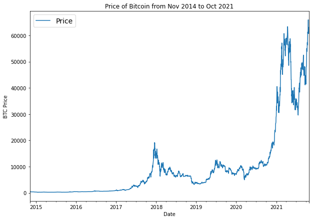
    


## Importing time series data with Python's CLV module <a name="import"></a>


```python
# Importing and formatting historical bitcoin data with Python
import csv
from datetime import datetime

timesteps = []
prices = []

with open("/content/BTC_USD_2014-11-04_2021-10-25-CoinDesk.csv", 'r') as f:
  csv_reader = csv.reader(f, delimiter=",")
  next(csv_reader) # will skip first row
  for line in csv_reader:
    timesteps.append(datetime.strptime(line[1], "%Y-%m-%d")) # get the dates as dates not strings
    prices.append(float(line[2])) # get closing price as float

# View first 10 of each
timesteps[:10], prices[:10]
```


    ([datetime.datetime(2014, 11, 4, 0, 0),
      datetime.datetime(2014, 11, 5, 0, 0),
      datetime.datetime(2014, 11, 6, 0, 0),
      datetime.datetime(2014, 11, 7, 0, 0),
      datetime.datetime(2014, 11, 8, 0, 0),
      datetime.datetime(2014, 11, 9, 0, 0),
      datetime.datetime(2014, 11, 10, 0, 0),
      datetime.datetime(2014, 11, 11, 0, 0),
      datetime.datetime(2014, 11, 12, 0, 0),
      datetime.datetime(2014, 11, 13, 0, 0)],
     [324.71833,
      332.45666,
      336.585,
      346.775,
      344.81166,
      343.065,
      358.50166,
      368.07666,
      376.99666,
      442.10666])


```python
# Plot from CSV
import matplotlib.pyplot as plt
import numpy as np
plt.figure(figsize=(10, 7))
plt.plot(timesteps, prices)
plt.title("Price of Bitcoin from Nov 2014 to Oct 2021", fontsize=16)
plt.xlabel("Date")
plt.ylabel("BTC Price");
```


    
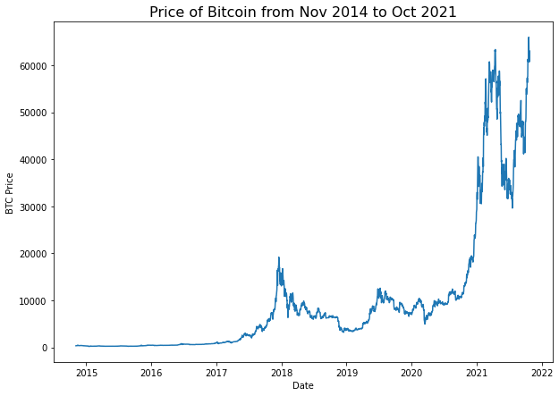
    


## Creating train test splits <a name="train_test"></a>


```python
# Create train and test splits the right way for time series data
split_size = int(0.8 * len(prices)) # 80% train, 20% test

# Create train data splits (everything before the split)
X_train, y_train = timesteps[:split_size], prices[:split_size]

# Create test data splits (everything after the split)
X_test, y_test = timesteps[split_size:], prices[split_size:]

len(X_train), len(X_test), len(y_train), len(y_test)
```


    (2038, 510, 2038, 510)


```python
# Plot train test splits
plt.figure(figsize=(10, 7))
plt.scatter(X_train, y_train, s=5, label="Train data")
plt.scatter(X_test, y_test, s=5, label="Test data")
plt.xlabel("Date")
plt.ylabel("BTC Price")
plt.legend(fontsize=14)
plt.show();
```


    
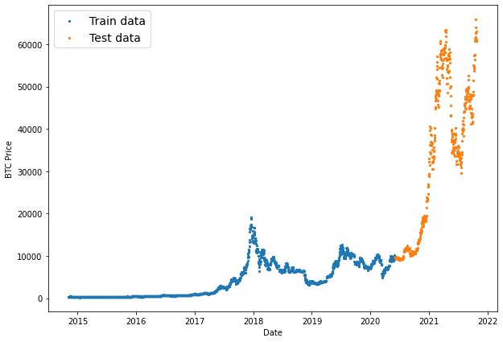
    


Side note: This article is fun read about differences in time series compared to regular machine learning

https://towardsdatascience.com/3-facts-about-time-series-forecasting-that-surprise-experienced-machine-learning-practitioners-69c18ee89387

## Create a plotting function <a name="plotting"></a>


```python
def plot_time_series(timesteps, values, format=".", start=0, end=None, label=None):
  """
  Plots timesteps against values

  Parameters
  ---------
  timesteps: array of timestep values
  values: array of values across time
  format: style of plot, default = scatter
  start: where to start the plot
  end: where to end the plot
  label: label to show on plot about values
  """
  plt.plot(timesteps[start:end], values[start:end], format, label=label)
  plt.xlabel("Time")
  plt.ylabel("BTC Price")
  if label:
    plt.legend(fontsize=14) # make label bigger
  plt.grid(True)
```


```python
# Try out our plotting function
plt.figure(figsize=(10, 7))
plot_time_series(timesteps=X_train, values=y_train, label="Train data")
plot_time_series(timesteps=X_test, values=y_test, label="Test data")
```


    
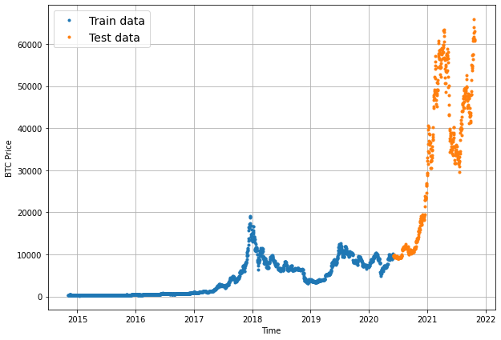
    


## Modelling Experiments <a name="experiments"></a>

0: Naive

1: Dense, horizon = 1, window = 7

2: Dense, horizon = 1, window = 30

3: Dense, horizon = 7, window = 30

4: Conv1D, 1 7

5: LSTM 1 7

6: Dense but multivariate

7: N-BEATs 1 7

8: Ensemble

9: Future prediction

10: Silly model

# Model 0: Naive Forecast <a name="model0"></a>

The formula looks like this:

$$\hat{y}_{t} = y_{t-1}$$

The prediction at time `t` will be equal to previous timestep at time `t-1`


```python
naive_forecast = y_test[:-1]

naive_forecast[:10], naive_forecast[-10:]
```


    ([9667.0607542595,
      9811.367094602,
      9659.6612981892,
      9677.0509945125,
      9737.458558786,
      9791.9278997681,
      9786.1420204782,
      9874.967047524,
      9260.8326409877,
      9464.2280968215],
     [61273.805275885,
      60744.9849380446,
      60965.4654336171,
      61707.4813118213,
      63901.0730802098,
      65972.8631297649,
      62603.5750699116,
      60689.2382648626,
      61124.3471256221,
      60936.1508514192])


```python
# Plot naive forecast
plt.figure(figsize=(10,7))
#plot_time_series(timesteps=X_train, values=y_train, label="Train data")
plot_time_series(timesteps=X_test, values=y_test,start=350,format='-', label="Test data")
plot_time_series(timesteps=X_test[1:], values=naive_forecast, start=350, format='-', label='Naive Forecast')
```


    
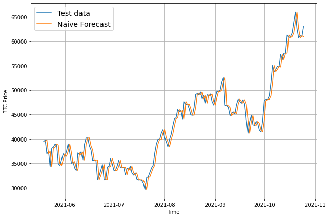
    


## Review: Different Evaluation Metrics

Regression problem so can use regression metrics:

* MAE - interpretable - forecasts lead to median
* RMSE - interpretable - forecasts lead to mean
* MASE - comparing model's performance to naive forecast
* MAPE - percentage errors can be dangerous if y=0

Essentially looking for this: how do our model's forecast compare against actual values?

See this link: https://otexts.com/fpp3/accuracy.html


```python
import tensorflow as tf

# MASE implemented courtesy of sktime - https://github.com/alan-turing-institute/sktime/blob/ee7a06843a44f4aaec7582d847e36073a9ab0566/sktime/performance_metrics/forecasting/_functions.py#L16
def mean_absolute_scaled_error(y_true, y_pred):
  """
  Implement MASE (assuming no seasonality of data).
  """
  mae = tf.reduce_mean(tf.abs(y_true - y_pred))

  # Find MAE of naive forecast (no seasonality)
  mae_naive_no_season = tf.reduce_mean(tf.abs(y_true[1:] - y_true[:-1])) # our seasonality is 1 day (hence the shifting of 1 day)

  return mae / mae_naive_no_season
```


```python
# Put all eval metrics into a function
def evaluate_preds(y_true, y_pred):
  # Make sure float32 (for metric calculations)
  y_true = tf.cast(y_true, dtype=tf.float32)
  y_pred = tf.cast(y_pred, dtype=tf.float32)

  # Calculate various metrics
  mae = tf.keras.metrics.mean_absolute_error(y_true, y_pred)
  mse = tf.keras.metrics.mean_squared_error(y_true, y_pred) # puts and emphasis on outliers (all errors get squared)
  rmse = tf.sqrt(mse)
  mape = tf.keras.metrics.mean_absolute_percentage_error(y_true, y_pred)
  mase = mean_absolute_scaled_error(y_true, y_pred)
  
  return {"mae": mae.numpy(),
          "mse": mse.numpy(),
          "rmse": rmse.numpy(),
          "mape": mape.numpy(),
          "mase": mase.numpy()}
```


```python
naive_results = evaluate_preds(y_true=y_test[1:],
               y_pred=naive_forecast)
naive_results
```


    {'mae': 924.30414,
     'mape': 2.6047938,
     'mase': 0.99834156,
     'mse': 2055079.2,
     'rmse': 1433.5548}


```python
tf.reduce_min(y_test), tf.reduce_mean(y_test), tf.reduce_max(y_test)
```


    (<tf.Tensor: shape=(), dtype=float32, numpy=9022.153>,
     <tf.Tensor: shape=(), dtype=float32, numpy=32127.76>,
     <tf.Tensor: shape=(), dtype=float32, numpy=65972.86>)


We can guess how the model is doing by looking at where the majority of values are

For example, if most values are closer to 60k, then an error of 1000 is not that bad

## Side note: Other models we could use

This notebook is focused on tensorflow, but maybe for future work can use those and compare to the final best tensorflow model

Moving average	https://machinelearningmastery.com/moving-average-smoothing-for-time-series-forecasting-python/

ARIMA (Autoregression Integrated Moving Average)	https://machinelearningmastery.com/arima-for-time-series-forecasting-with-python/

sktime (Scikit-Learn for time series)	https://github.com/alan-turing-institute/sktime

TensorFlow Decision Forests (random forest, gradient boosting trees)	https://www.tensorflow.org/decision_forests

Facebook Kats (purpose-built forecasting and time series analysis library by Facebook)	https://github.com/facebookresearch/Kats

LinkedIn Greykite (flexible, intuitive and fast forecasts)	https://github.com/linkedin/greykite

# Windowing our Time Series <a name="windowing"></a>

We window to turn our data into a supervised learning problem


```python
HORIZON = 1 # predict 1 step at a time
WINDOW_SIZE = 7 # use a week worth of timesteps to predict the horizon
```


```python
# Create function to label windowed data

def get_labelled_window(x, horizon=HORIZON):
  """
  Creates labels for windowed dataset

  If horizon=1
  input: [0,1,2,3,4,5,6,7] -> output: ([0,1,2,3,4,5,6], [7]) 
  """
  return x[:, :-horizon], x[:, -horizon:]
```


```python
# Test out the window labelling function
test_window, test_label = get_labelled_window(tf.expand_dims(tf.range(8)+1, axis=0), horizon=HORIZON)
print(f"Window: {tf.squeeze(test_window).numpy()} -> Label: {tf.squeeze(test_label).numpy()}")
```

    Window: [1 2 3 4 5 6 7] -> Label: 8


Great let's now use this basic function to iterate through all the data

For loops would take a while so we will use numpy array indexing: https://towardsdatascience.com/fast-and-robust-sliding-window-vectorization-with-numpy-3ad950ed62f5

![image.png](data:image/png;base64,iVBORw0KGgoAAAANSUhEUgAAA1MAAACiCAYAAACknpe9AAAXDElEQVR4Ae3dbVKrSBQG4NkO2zJLSbkTy41YWcX9kT1kA0yRBEMiX30EhOaZqls6GpE+/dCctxP1v9J/KqACKqACKqACKqACKqACKqACyRX473K5lP6pAQMMMMAAAwwwwAADDDAwzkCduoQpYVKYZoABBhhggAEGGGCAgQQDwlRCsST0cQldndSJAQYYYIABBhhgYA8GhClhyu4DAwwwwAADDDDAAAMMBAwIU4Gi7SFlG6PdJAYYYIABBhhggAEG+g0IU8KUXQgGGGCAAQYYYIABBhgIGBCmAkWT0PsTuvqoDwMMMMAAAwwwwMAeDAhTwpRdCAYYYIABBhhggAEGGAgYEKYCRdtDyjZGu0kMMMAAAwwwwAADDPQbEKaEKbsQDDDAAAMMMMAAAwwwEDAgTAWKJqH3J3T1UR8GGGCAAQYYYICBPRgQpoQpuxAMMMAAAwwwwAADDDAQMCBMBYq2h5RtjHaTGGCAAQYYYIABBhjoNyBMCVN2IRhggAEGGGCAAQYYYCBgQJgKFE1C70/o6qM+DDDAAAMMMMAAA3swIEwJU3YhGGCAAQYYYIABBhhgIGBAmAoUbQ8p2xjtJjHAAAMMMMAAAwww0G9AmBKm7EIwwAADDDDAAAMMMMBAwIAwFSiahN6f0NVHfRhggAEGGGCAAQb2YECYEqbsQjDAAAMMMMAAAwwwwEDAgDAVKNoeUrYx2k1igAEGGGCAAQYYYKDfgDAlTNmFYIABBhhggAEGGGCAgYABYSpQNAm9P6Grj/owwAADDDDAAAMM7MGAMCVM2YVggAEGGGCAAQYYYICBgAFhKlC0PaRsY7SbxAADDDDAAAMMMMBAvwFhSpiyC8EAAwwwwAADDDDAAAMBA8JUoGgSen9CVx/1YYABBhhggAEGGNiDAWFKmLILwQADDKzQwLn8eCvKorj/ez8NnOOpPNaPLYry8HnufPzpvXHct4/y3DH/T48rjuWp43F7aBaMUVPMAAMMtBsQptwcOxsOF037RaMu6sLAEgaqMHUoP/6N/V5VmBoOPFVAagat8+ehLEYFteFjczF2rjyOFQYYyMeAMCVMCVMMMMDACg3MEKa+jq3BqQpYx6++G/u4oKY56quhz/HBAAN5GhCmNFErbKLyvNgsouaVgRQD04ep03vHM10dIesxX8LUoxYpc+ix6sYAA/kbEKaEKWGKAQYYWKGBqcNUdbyOl+r9+ygPPT87dbkIUxrC/BtCc2yOGYgZEKY0UStsomKYLQLqxkBOBqYOUz2BSJhyH9ALMMAAA0EDwlSwcJq2nJo2Y+GZgfUZEKbWNyeuE3PCAAMMvBoQpoQpOxEMMMDACg0IU683bP+viWOAAQbWZ0CY0kStsIla34Vi8TInDCxtYOow1XM8L/NzH9ALMMAAA0EDwlSwcBqrpRsr3485BvZloCf8tK7bPT8TdX98569A99v8NFGtpqw5+1pzzLf5jhkQpiygbqIMMMDACg1MH6YuX8enP9hbNw6dIevbxXBQq4/lbawZUTd1Y4CBrRoQpr5vlhBvFbHzZpeBHA3MEKYul/JHcBp8VqqqrTDlGsvxGjMmrhmYwoAwJUytcEfaxT3Fxe0YHG3bwDxh6nKpjluURXH/1/v3pWpDwtS2LdXz6K15ZICB6Q0IU8KUMMUAAwys0MBcYSpyIxWmNGARN76GGwb2YECY0kStsImy+Oxh8TFGzvsNCFP99eFHfRhggIE1GBCmhClhigEGGFihgZeX472fBs6xevbo8fK9w+d54PHDTUj181XfLwcsjuWJk1/XdA2Nj3MYtq9GasTAeAPClJujmyMDDDDAAAMMMMAAAwwEDAhTgaJJ6+PTulqpFQMMMMAAAwwwwECuBoQpYcouBAMMMMAAAwwwwAADDAQMCFOBouWarI3LrhEDDDDAAAMMMMAAA+MNCFPClF0IBhhggAEGGGCAAQYYCBgQpgJFk9bHp3W1UisGGGCAAQYYYICBXA0IU8KUXQgGGGCAAQYYYIABBhgIGBCmAkXLNVkbl10jBhjYroGEvzP1dbz+/aihv0Xl70y5HrZ7PZg7c8fAUgaEKWHKLgQDDDCQgYEqTPX9Yd3GHwF++yhPn4dyKEw9bsRDx9a0PGqlFmrBAAP7MiBMaaIyaKL2ddFapM03A20G0gLPWZiy9rv/M8AAAxMYEKYmKKLGpq2x8TEuGGBgSQPCFG9LevO9eGOAgZsBYUqYsivBAAMMZGBAmNLYaG4ZYICB5Q0IU5qoDJqo5S8ci5WaM7A2A8IUk2sz6XyYZGAPBoQpYUqYYoABBjIwIEztoWkxRs05AwyszYAwpYnKoImysKxtYXE+TC5vQJhavuacqzkDDDAgTAlTwhQDDDCQgQFhSlOnqWOAAQaWNyBMaaIyaKKWv3AsVmrOwNoMCFNMrs2k82GSgT0YEKaEKWGKAQYYyMCAMLWHpsUYNecMMLA2A8KUJiqDJsrCsraFxfkwubwBYWr5mnOu5gwwwIAwJUwJUwwwwEAGBobC1Ln8eCvKouj49/ZRnjsdDB1bM6GhZIABBvZqQJjqvHm6KPZ6URg3+wxs0cCcgWfOY2+x1s7ZGsEAAwzUBoQpYSqDHWkXdH1Be8vCfg3MGXjmPDaz+zVr7s09AzkYEKaEKWGKAQYYyMBAFXgeL+E7fJ5/PabT++N4RXEsT5z8uqY5NE7GIAAwwEDTgDDl5ujmyAADDDDAAAMMMMAAAwEDwlSgaM006n27EwwwwAADDDDAAAMM7NOAMCVM2YVggAEGGGCAAQYYYICBgAFhKlA0Ow/73Hkw7+adAQYYYIABBhhgoGlAmBKm7EIwwAADDDDAAAMMMMBAwIAwFShaM4163+4EAwwwwAADDDDAAAP7NCBMCVN2IRhggAEGGGCAAQYYYCBgQJgKFO38eSiL779nMvS3R8b/7ZOnv2ny9lGeA+e2iV2Rr+O1flP8HZi1jvdpLouiPH7tc7dmrfOzrvM6lx9v1d8zGlhL/n2Uh+91pyiHrp9ngwPHzmKtGbnW3tef7zX8/dTZPOyvhtapda0N5sN8MLAFA38Spp5vUEVZvH2Up8/DYHOwloJWYWqokXmca3WDH25kqpo0j3kNbD03+cfxt3Kh1Q3j9uY7rdb3cT7N3a3Ja85v2jG3MscZnedLcKka78f8NSxfw83w9d06342m/vg1bp2ojzPHGlQfe7tvh2t42wh7nq/r/Whw82r42NutW0bXbRabAubDtcTA1gwsHKZuTcijKbmDmfyZiur7HMqPf/OAnLyRqcb/1Hzfzru6yef6jEZaDeeZx1ku1o65vFw0Y7PUe+bmqdtpx1oWPp80H93n1XatpB07bZ7mXWvTzmVonN2fH15ru7827Rzb5sfH1JABBhjYsoFlw1S129uxA5jWHAyhm/cGn3auwzfh03tH8OtszIfGv/7Pp9Vw/eMZswgMN2x5jHNMLbbymHan1TU99UbH8DrRrFn7eXX5STt28/sMvz/vWjv8/Ztj/sU4B9faXxw7HLCbY/N+mgX1Ui8GGFjOwGrC1LSTPu8NftpGpjrX55edfNeiJ3x+P2ajN+q0Gi53QcxX16oZ6wjNG53D+Wq1nvn+4fT68r855jGtWf9xXr2G0o6dNq/zrrVp5xIfZ7XR8eMVE081jR87bQzrse+8zQUDDDAwzsCyYepS3XhvPzMz7y9XmPcGP20j03OTFqY6fzB8axd4ZabtpZxbG8fezvfpWq+evRjx84+xGvWsA09N/W1hfzqvls8/n0PasZ+/duhGMu9am3YuwXFeA3LHhtZ3bYPH/v76oTr6fNpcq5d6McDAegwsHKbuA782JdVvr7r/63jpXxzKvDf4aRuZnpu0MJVFmLoGqcmNr2cRiV+n6x9Dfa1f53DWZxZ71oGWhrw+r3G1Tzv2uGPWczfvWpt2LoFxjn6mMXDslnlLG09dY2/VjQEGGFizgb8JU683mXu4iv+yhepG1whnHe/Hj/+MeNpGpucmLUxtPkxdm3BBarPzeAtRxf1Zxfs60/LLYqpF/vuxHetP0RvGetaB1/Xy/r36X5bWXLPSjt1/w7rXoHOMt3V4qrW2/1yaY6zeTxzn6CAVOHbLnKWN5XVs/l/9GGCAgbUaWEeYqm48VaCarOmcd7d02jDVc67C1Gab8OqCF6S2v/C3XevDP18TGXdaEGg7r+6bTNqxu4/TNq6e9WvxQJEwzqQgVY074diLj7ttXnwszbF6qRcDDMQNrCdMTRoc5r3BT93IdP6WtypgduyCbx19Wg3jwP+qTtX4ptsc2N74/6ruU3/fdqdzNNZpx2w/ry4nacdOq+G8a23auYwcZ3KQquo68tiC1KY3wNK8dV1vPq6ODOzNwKJhqjM01M9MTRYc5r3BT97IfB1bf5NUb73mvGlfm43by3XGv5QobfFIq2HasUdfxI2f3ZvyZUnVvK0qBM80zludqyZzvJVq3m8/Kzn0A//VnFfX8f3luyPWhmvdr+cy5tjjTHU57fr4aHs/rt+0Zj3t+6cdO20M8661aecyYpzXayHiY8Sxf8zpOGNpY3RM9WKAAQbWZmDxMFU1Uj8b1+pGNeWvG573Bj9HI/MjOP3hs1LV+K4N72Qvu/x54afV8OfXT3EhfTffIxr1sd+vL0j9mOOFmq85xvldj0ZQG34mrhGOWteBl3luhPrh36JXrSHT/7xOp9PruUWa8pcxfhtIa9Y7z+v7eM3vk3bs77ltPVbzuNX78661aecyMM6+IDW43g4ce1StXmvn/9PmV73UiwEG1mlg8TB1/HpuqG671FMGqarQ897g52lkXuoyY5AZuhjr5vtn6P0N4pfxvf4A++Ljrc9nSnv1Me/PpryOcUyAmLwpq89pynE2HVRN5gqemaqD11SO6uM15vD1Wdr6OhkOkc16Nd5vBtHG97mtiW2bTo+vnWcNehx/aI14fL7yNZet1PPpDzxVzeratr7t3VTpP/ajHqnn7PFqxwADDGzdwKJhauvFqs9/PY3MHBfgvTmeqimdPBxMNOa6We5toCb6Xn9Zg52Ms26Up90AWO/8570GRes+Z+CZ89jR8fq6+p7sLQsMMPCXBoSpQKObdSNz3y3PvSm9Nd9r2VGfbxHcxzjvz77lvgHQWKuyXoMa40y7Oc4ZeOY89nzXf1r9nId6McAAAxEDwlTgxn1rUOuXcg393ER1E64fW7T+oonIxM31Ndex7aApvb5EK/dnpS6Xch/jvF1juW8AXOpnGUe+rPL7ZYjXxw+tUzncQKdfa/dXwxwcGMNc/YHjssVAuwFhKhCmYGrHpC7qwgADDDDAAAMMMLAnA8KUMOXvgjDAAAMMMMAAAwwwwEDAgDAVKNqe0rax2l1igAEGGGCAAQYYYKDdgDAlTNmFYIABBhhggAEGGGCAgYABYSpQNMm8PZmri7owwAADDDDAAAMM7MmAMCVM2YVggAEGGGCAAQYYYICBgAFhKlC0PaVtY7W7xAADDDDAAAMMMMBAuwFhSpiyC8EAAwwwwAADDDDAAAMBA8JUoGiSeXsyVxd1YYABBhhggAEGGNiTAWFKmLILwQADDDDAAAMMMMAAAwEDwlSgaHtK28Zqd4kBBhhggAEGGGCAgXYDwpQwZReCAQYYYIABBhhggAEGAgaEqUDRJPP2ZK4u6sIAAwwwwAADDDCwJwPClDBlF4IBBhhggAEGGGCAAQYCBoSpQNH2lLaN1e4SAwwwwAADDDDAAAPtBoQpYcouBAMMMMAAAwwwwAADDAQMCFOBoknm7clcXdSFAQYYYIABBhhgYE8GhClhyi4EAwwwsHEDp/JYFGVRFOXh8zw4lvPn4frYojiWp8G5Tzv2nhoIY9UwM8AAA5c6S5X/KYYLggEGGGBgkwa+jvdwVJTF20d57g1I5/Lj7Ra8qvB1/BqY86RjDxyr97x87SbtmdPBzQvz6trO3UCdpoQpC6IFkQEGGNiogbRnjzwzpbnLvbkzPsYZWM6AMKV52mjztNxFYkFSawYYYIABBhhggIE2A8KUMCVMMcAAAwwwwAADDDDAQMCAMBUoWlsq9TG7FQwwwAADDDDAAAMM7MuAMCVM2YVggAEGGGCAAQYYYICBgAFhKlA0Ow772nEw3+abAQYYYIABBhhgoM2AMCVM2YVggAEGGGCAAQYYYICBgAFhKlC0tlTqY3YrGGCAAQYYYIABBhjYlwFhSpiyC8EAAwwwwAADDDDAAAMBA8JUoGh2HPa142C+zTcDDDDAAAMMMMBAmwFhSpiyC8EAAwwwwAADDDDAAAMBA8JUoGhtqdTH7FYwwAADf2ngVB6Loizu/w6f5183Baf3x/GK4lie+u4X/z7Kw8Tfn6e/9OR788cAA+MMCFN9N0ef+3Uz4kIcdyGqkzox8FsDVZjqCjzPQasOXK9vj19d59B37J9fc/48lFOEOSZ+1lZN1IQBBtZmQJgSmAQmBhhgIAMDfYHn9XPn8uPtUH78ezQl1bNQwtSjHmtrVpyPuWGAgbUaEKY0URk0URaYtS4wzovN5Qy8BqZm7V8/J0wtNy/NefC+ujPAQH4GhClhSphigAEGMjDwGpiaN+zXz/0MU9VL8zwz1ayZ9zW9DDDAwBgDwpQmKoMmysU+5mL3GE7yNvAamPrm+2eY6q9NyrEvpZ+Z6qu9z/VbUx/1YWBrBoQpYUqYYoABBjIwkBJ4hKmtNSvOV4PNAANrNSBMaaIyaKIsMGtdYJwXm8sZEKaWqzXXas0AAwzUBoQpYUqYYoABBjIwIEzVN3ZvNXkMMMDAcgaEKU1UBk3UcheMxUmtGVirAWGKzbXadF5sMpCzAWFKmBKmGGCAgQwMCFM5NyvGphlngIG1GhCmNFEZNFEWmLUuMM6LzeUMCFPL1ZprtWaAAQZqA8KUMCVMMcAAAxkYGBGmvo5lURQ//72fBsY/4tgNQ341uiarbrK8ZYGB/A0IU40bIPD5gzfH5piBXA2kBZ40B2nHFqZyNWZcadeNeqnXPgwIU8LUwI7sPi4EC555ZmDrBtICT9p8px1bmNq6Jeefdn2ol3rt24AwJUwJUwwwwEAGBqrA83gJ3+Hz/Osxnd4fxyuKY3nqc/LvozxM/P01aPtu0My/+WdgGwaEqb6bo8/9uhmxEGxjITBP5okBBhhggAEGGEg3IEwJTAITAwwwwAADDDDAAAMMBAwIU4GiSe3pqV3N1IwBBhhggAEGGGAgNwPClDBlF4IBBhhggAEGGGCAAQYCBoSpQNFyS9TGY5eIAQYYYIABBhhggIF0A8KUMGUXggEGGGCAAQYYYIABBgIGhKlA0aT29NSuZmrGAAMMMMAAAwwwkJsBYUqYsgvBAAMMMMAAAwwwwAADAQPCVKBouSVq47FLxAADDDDAAAMMMMBAugFhSpiyC8EAAwwwwAADDDDAAAMBA8JUoGhSe3pqVzM1Y4ABBhhggAEGGMjNgDAlTNmFYIABBhhggAEGGGCAgYABYSpQtNwStfHYJWKAAQYYYIABBhhgIN2AMCVM2YVggAEGGGCAAQYYYICBgAFhKlA0qT09tauZmjHAAAMMMMAAAwzkZkCYEqbsQjDAAAMMMMAAAwwwwEDAgDAVKFpuidp47BIxwAADDDDAAAMMMJBuQJgSpuxCMMAAAwwwwAADDDDAQMCAMBUomtSentrVTM0YYIABBhhggAEGcjMgTAlTdiEYYIABBhhggAEGGGAgYECYChQtt0RtPHaJGGCAAQYYYIABBhhINyBMCVN2IRhggAEGGGCAAQYYYCBgQJgKFE1qT0/taqZmDDDAAAMMMMAAA7kZEKaEKbsQDDDAAAMMMMAAAwwwEDAgTAWKlluiNh67RAwwwAADDDDAAAMMpBsQpoQpuxAMMMAAAwwwwAADDDAQMFCHqf8BwPjXVKuh9fkAAAAASUVORK5CYII=)


```python
np.arange(4)
```


    array([0, 1, 2, 3])


```python
np.expand_dims(np.arange(4), axis=0)
```


    array([[0, 1, 2, 3]])


```python
np.expand_dims(np.arange(4), axis=0).T
```


    array([[0],
           [1],
           [2],
           [3]])


```python
# Simple example of the above matrix addition
np.expand_dims(np.arange(4), axis=0).T + np.expand_dims(np.arange(8), axis=0)
```


    array([[ 0,  1,  2,  3,  4,  5,  6,  7],
           [ 1,  2,  3,  4,  5,  6,  7,  8],
           [ 2,  3,  4,  5,  6,  7,  8,  9],
           [ 3,  4,  5,  6,  7,  8,  9, 10]])


```python
import numpy as np
# Create function to view NumPy arrays as windows copying the blogpost
def make_windows(x, window_size=7, horizon=1):
  """
  Turns a 1D array into a 2D array of sequential windows of window_size.
  """
  # 1. This is array 1
  window_step = np.expand_dims(np.arange(window_size+horizon), axis=0) 
  # print(f"Window step:\n {window_step}")

  # 2. Add horizontal array and vertical array together
  window_indexes = window_step + np.expand_dims(np.arange(len(x)-(window_size+horizon-1)), axis=0).T # this is the vertical array [[0],[1],[2],...,[T]]
  # print(f"Window indexes:\n {window_indexes[:3], window_indexes[-3:], window_indexes.shape}")

  # 3. Index on the target array (time series) with 2D array of multiple window steps
  windowed_array = x[window_indexes]
  
  # 4. Get the labelled windows
  windows, labels = get_labelled_window(windowed_array, horizon=horizon)

  return windows, labels
```


```python
full_windows, full_labels = make_windows(np.array(prices), window_size=WINDOW_SIZE, horizon=HORIZON)
len(full_windows), len(full_labels)
```


    (2541, 2541)


```python
# View the first 3 windows/labels
for i in range(3):
  print(f"Window: {full_windows[i]} -> Label: {full_labels[i]}")
```

    Window: [324.71833 332.45666 336.585   346.775   344.81166 343.065   358.50166] -> Label: [368.07666]
    Window: [332.45666 336.585   346.775   344.81166 343.065   358.50166 368.07666] -> Label: [376.99666]
    Window: [336.585   346.775   344.81166 343.065   358.50166 368.07666 376.99666] -> Label: [442.10666]


## Turning windows into training and test sets


```python
full_windows[:5], full_labels[:5]
```


    (array([[324.71833, 332.45666, 336.585  , 346.775  , 344.81166, 343.065  ,
             358.50166],
            [332.45666, 336.585  , 346.775  , 344.81166, 343.065  , 358.50166,
             368.07666],
            [336.585  , 346.775  , 344.81166, 343.065  , 358.50166, 368.07666,
             376.99666],
            [346.775  , 344.81166, 343.065  , 358.50166, 368.07666, 376.99666,
             442.10666],
            [344.81166, 343.065  , 358.50166, 368.07666, 376.99666, 442.10666,
             389.00333]]), array([[368.07666],
            [376.99666],
            [442.10666],
            [389.00333],
            [394.92666]]))


```python
def make_train_test_splits(windows, labels, test_split=0.2):
  """
  Splits matching pairs of windows and labels into train and test splits
  """
  split_size = int(len(windows) * (1-test_split)) # will default to 0.8 train
  train_windows = windows[:split_size]
  train_labels = labels[:split_size]

  test_windows = windows[split_size:]
  test_labels = labels[split_size:]

  return train_windows, test_windows, train_labels, test_labels
```


```python
train_windows, test_windows, train_labels, test_labels = make_train_test_splits(full_windows, full_labels)
len(train_windows), len(test_windows), len(train_labels), len(test_labels)
```


    (2032, 509, 2032, 509)


```python
train_windows[:5], train_labels[:5]
```


    (array([[324.71833, 332.45666, 336.585  , 346.775  , 344.81166, 343.065  ,
             358.50166],
            [332.45666, 336.585  , 346.775  , 344.81166, 343.065  , 358.50166,
             368.07666],
            [336.585  , 346.775  , 344.81166, 343.065  , 358.50166, 368.07666,
             376.99666],
            [346.775  , 344.81166, 343.065  , 358.50166, 368.07666, 376.99666,
             442.10666],
            [344.81166, 343.065  , 358.50166, 368.07666, 376.99666, 442.10666,
             389.00333]]), array([[368.07666],
            [376.99666],
            [442.10666],
            [389.00333],
            [394.92666]]))


```python
# Check to see if train labels are the same (before and after window split)
np.array_equal(np.squeeze(train_labels[:-HORIZON-1]), np.array(y_train[WINDOW_SIZE:-1]))
```


    True


## Modeling Checkpoint

We want to compare the best performance/epoch of each model


```python
import os

# Create a function to implement a ModelCheckpoint callback with a specific filename 
def create_model_checkpoint(model_name, save_path="model_experiments"):
  return tf.keras.callbacks.ModelCheckpoint(filepath=os.path.join(save_path, model_name), # create filepath to save model
                                            verbose=0, # only output a limited amount of text
                                            save_best_only=True) # save only the best model to file
```

# Model 1: Dense 1, 7 <a name="model1"></a>

* Single dense layer with 128 and relu
* Output layer with linear activation (no activation)
* Adam and MAE
* Batch size 128 (data is pretty small so can do bigger batches)
* 100 epochs

Could tune the hyperparameters but that could be an extension for later


```python
import tensorflow as tf
from tensorflow.keras import layers

# Set random seed
tf.random.set_seed(42)

# Create model
model_1 = tf.keras.Sequential([
  layers.Dense(128, activation='relu'),
  layers.Dense(HORIZON)
], name='model_1_dense')

# Compile
model_1.compile(loss='mae',
                optimizer=tf.keras.optimizers.Adam(),
                metrics=['mae', "mse"])

# Fit the model

history_1 = model_1.fit(x=train_windows,
                        y=train_labels,
                        epochs=100,
                        verbose=1,
                        batch_size=128,
                        validation_data=(test_windows, test_labels),
                        callbacks=[create_model_checkpoint(model_name=model_1.name)])
```

    Epoch 1/100
    14/16 [=========================>....] - ETA: 0s - loss: 1125.1427 - mae: 1125.1427 - mse: 3623911.5000  INFO:tensorflow:Assets written to: model_experiments/model_1_dense/assets
    16/16 [==============================] - 4s 78ms/step - loss: 1052.2838 - mae: 1052.2838 - mse: 3281413.0000 - val_loss: 4038.3960 - val_mae: 4038.3960 - val_mse: 27835144.0000
    Epoch 2/100
    14/16 [=========================>....] - ETA: 0s - loss: 376.2725 - mae: 376.2725 - mse: 457702.9062INFO:tensorflow:Assets written to: model_experiments/model_1_dense/assets
    16/16 [==============================] - 1s 47ms/step - loss: 370.0820 - mae: 370.0820 - mse: 441171.4688 - val_loss: 2101.2781 - val_mae: 2101.2781 - val_mse: 8439465.0000
    Epoch 3/100
    15/16 [===========================>..] - ETA: 0s - loss: 247.7293 - mae: 247.7293 - mse: 244647.3125INFO:tensorflow:Assets written to: model_experiments/model_1_dense/assets
    16/16 [==============================] - 1s 44ms/step - loss: 248.8695 - mae: 248.8695 - mse: 246683.7969 - val_loss: 1932.4431 - val_mae: 1932.4431 - val_mse: 7341109.5000
    Epoch 4/100
    15/16 [===========================>..] - ETA: 0s - loss: 236.4443 - mae: 236.4443 - mse: 217470.1406INFO:tensorflow:Assets written to: model_experiments/model_1_dense/assets
    16/16 [==============================] - 1s 46ms/step - loss: 236.8721 - mae: 236.8721 - mse: 219932.3750 - val_loss: 1686.6390 - val_mae: 1686.6390 - val_mse: 6009384.0000
    Epoch 5/100
    13/16 [=======================>......] - ETA: 0s - loss: 225.7914 - mae: 225.7914 - mse: 214336.6094INFO:tensorflow:Assets written to: model_experiments/model_1_dense/assets
    16/16 [==============================] - 1s 51ms/step - loss: 228.8478 - mae: 228.8478 - mse: 211895.9531 - val_loss: 1581.4629 - val_mae: 1581.4629 - val_mse: 5512004.0000
    Epoch 6/100
    13/16 [=======================>......] - ETA: 0s - loss: 219.0259 - mae: 219.0259 - mse: 193449.3438INFO:tensorflow:Assets written to: model_experiments/model_1_dense/assets
    16/16 [==============================] - 1s 47ms/step - loss: 220.2377 - mae: 220.2377 - mse: 200366.5781 - val_loss: 1567.6823 - val_mae: 1567.6823 - val_mse: 5342175.5000
    Epoch 7/100
    14/16 [=========================>....] - ETA: 0s - loss: 217.9900 - mae: 217.9900 - mse: 200676.9844INFO:tensorflow:Assets written to: model_experiments/model_1_dense/assets
    16/16 [==============================] - 1s 46ms/step - loss: 214.8801 - mae: 214.8801 - mse: 192315.7188 - val_loss: 1524.3950 - val_mae: 1524.3950 - val_mse: 5073459.5000
    Epoch 8/100
    15/16 [===========================>..] - ETA: 0s - loss: 202.3831 - mae: 202.3831 - mse: 168473.8125INFO:tensorflow:Assets written to: model_experiments/model_1_dense/assets
    16/16 [==============================] - 1s 45ms/step - loss: 210.5827 - mae: 210.5827 - mse: 185379.6562 - val_loss: 1470.5625 - val_mae: 1470.5625 - val_mse: 4827353.5000
    Epoch 9/100
    14/16 [=========================>....] - ETA: 0s - loss: 206.6307 - mae: 206.6307 - mse: 180371.8594INFO:tensorflow:Assets written to: model_experiments/model_1_dense/assets
    16/16 [==============================] - 1s 45ms/step - loss: 204.5752 - mae: 204.5752 - mse: 175921.7188 - val_loss: 1414.4553 - val_mae: 1414.4553 - val_mse: 4464321.0000
    Epoch 10/100
    16/16 [==============================] - 0s 7ms/step - loss: 201.6268 - mae: 201.6268 - mse: 170200.0469 - val_loss: 1425.2523 - val_mae: 1425.2523 - val_mse: 4339175.5000
    Epoch 11/100
    15/16 [===========================>..] - ETA: 0s - loss: 195.5575 - mae: 195.5575 - mse: 161337.8906INFO:tensorflow:Assets written to: model_experiments/model_1_dense/assets
    16/16 [==============================] - 1s 45ms/step - loss: 192.8863 - mae: 192.8863 - mse: 158605.2344 - val_loss: 1356.2078 - val_mae: 1356.2078 - val_mse: 4055710.5000
    Epoch 12/100
    16/16 [==============================] - 0s 6ms/step - loss: 192.2759 - mae: 192.2759 - mse: 155920.8594 - val_loss: 1360.0175 - val_mae: 1360.0175 - val_mse: 3945523.2500
    Epoch 13/100
    15/16 [===========================>..] - ETA: 0s - loss: 185.4322 - mae: 185.4322 - mse: 144037.6719INFO:tensorflow:Assets written to: model_experiments/model_1_dense/assets
    16/16 [==============================] - 1s 48ms/step - loss: 185.7385 - mae: 185.7385 - mse: 145905.3750 - val_loss: 1321.9495 - val_mae: 1321.9495 - val_mse: 3745769.5000
    Epoch 14/100
    16/16 [==============================] - 0s 6ms/step - loss: 180.8296 - mae: 180.8296 - mse: 141572.0000 - val_loss: 1408.8519 - val_mae: 1408.8519 - val_mse: 4009162.5000
    Epoch 15/100
    15/16 [===========================>..] - ETA: 0s - loss: 180.9534 - mae: 180.9534 - mse: 137292.4219INFO:tensorflow:Assets written to: model_experiments/model_1_dense/assets
    16/16 [==============================] - 1s 45ms/step - loss: 181.0478 - mae: 181.0478 - mse: 138626.0312 - val_loss: 1252.2047 - val_mae: 1252.2047 - val_mse: 3543531.0000
    Epoch 16/100
    16/16 [==============================] - 0s 7ms/step - loss: 176.3963 - mae: 176.3963 - mse: 132472.8281 - val_loss: 1266.6610 - val_mae: 1266.6610 - val_mse: 3355603.7500
    Epoch 17/100
    14/16 [=========================>....] - ETA: 0s - loss: 173.3926 - mae: 173.3926 - mse: 131475.6250INFO:tensorflow:Assets written to: model_experiments/model_1_dense/assets
    16/16 [==============================] - 1s 43ms/step - loss: 171.4510 - mae: 171.4510 - mse: 128554.3125 - val_loss: 1240.1663 - val_mae: 1240.1663 - val_mse: 3230422.2500
    Epoch 18/100
    14/16 [=========================>....] - ETA: 0s - loss: 168.5066 - mae: 168.5066 - mse: 126398.6406INFO:tensorflow:Assets written to: model_experiments/model_1_dense/assets
    16/16 [==============================] - 1s 57ms/step - loss: 169.1706 - mae: 169.1706 - mse: 124567.4609 - val_loss: 1175.9944 - val_mae: 1175.9944 - val_mse: 3057932.5000
    Epoch 19/100
    16/16 [==============================] - ETA: 0s - loss: 164.9955 - mae: 164.9955 - mse: 119707.5156INFO:tensorflow:Assets written to: model_experiments/model_1_dense/assets
    16/16 [==============================] - 1s 45ms/step - loss: 164.9955 - mae: 164.9955 - mse: 119707.5156 - val_loss: 1159.4547 - val_mae: 1159.4547 - val_mse: 2976652.2500
    Epoch 20/100
    15/16 [===========================>..] - ETA: 0s - loss: 162.1346 - mae: 162.1346 - mse: 114131.6719INFO:tensorflow:Assets written to: model_experiments/model_1_dense/assets
    16/16 [==============================] - 1s 45ms/step - loss: 164.2351 - mae: 164.2351 - mse: 118974.2969 - val_loss: 1147.7201 - val_mae: 1147.7201 - val_mse: 2894545.7500
    Epoch 21/100
    16/16 [==============================] - 0s 7ms/step - loss: 160.2294 - mae: 160.2294 - mse: 114881.9844 - val_loss: 1214.4899 - val_mae: 1214.4899 - val_mse: 3045749.2500
    Epoch 22/100
    16/16 [==============================] - 0s 6ms/step - loss: 161.4803 - mae: 161.4803 - mse: 115629.6250 - val_loss: 1180.6323 - val_mae: 1180.6323 - val_mse: 2915320.5000
    Epoch 23/100
    15/16 [===========================>..] - ETA: 0s - loss: 160.6385 - mae: 160.6385 - mse: 114708.5078INFO:tensorflow:Assets written to: model_experiments/model_1_dense/assets
    16/16 [==============================] - 1s 45ms/step - loss: 159.1492 - mae: 159.1492 - mse: 111753.2578 - val_loss: 1110.0690 - val_mae: 1110.0690 - val_mse: 2714468.7500
    Epoch 24/100
    16/16 [==============================] - 0s 6ms/step - loss: 155.2771 - mae: 155.2771 - mse: 108248.1172 - val_loss: 1113.2184 - val_mae: 1113.2184 - val_mse: 2688186.0000
    Epoch 25/100
    15/16 [===========================>..] - ETA: 0s - loss: 156.8250 - mae: 156.8250 - mse: 108347.1250INFO:tensorflow:Assets written to: model_experiments/model_1_dense/assets
    16/16 [==============================] - 1s 45ms/step - loss: 157.5860 - mae: 157.5860 - mse: 108855.6406 - val_loss: 1078.8622 - val_mae: 1078.8622 - val_mse: 2624271.7500
    Epoch 26/100
    16/16 [==============================] - 0s 7ms/step - loss: 162.6721 - mae: 162.6721 - mse: 110743.4766 - val_loss: 1268.4597 - val_mae: 1268.4597 - val_mse: 3222643.7500
    Epoch 27/100
    13/16 [=======================>......] - ETA: 0s - loss: 158.8755 - mae: 158.8755 - mse: 108227.4062INFO:tensorflow:Assets written to: model_experiments/model_1_dense/assets
    16/16 [==============================] - 1s 46ms/step - loss: 161.1631 - mae: 161.1631 - mse: 113015.6562 - val_loss: 1066.5618 - val_mae: 1066.5618 - val_mse: 2557681.5000
    Epoch 28/100
    16/16 [==============================] - 0s 6ms/step - loss: 152.1051 - mae: 152.1051 - mse: 102798.0000 - val_loss: 1075.0272 - val_mae: 1075.0272 - val_mse: 2547176.0000
    Epoch 29/100
    15/16 [===========================>..] - ETA: 0s - loss: 146.8097 - mae: 146.8097 - mse: 99783.5078INFO:tensorflow:Assets written to: model_experiments/model_1_dense/assets
    16/16 [==============================] - 1s 46ms/step - loss: 149.1455 - mae: 149.1455 - mse: 102317.8125 - val_loss: 1049.2566 - val_mae: 1049.2566 - val_mse: 2505042.0000
    Epoch 30/100
    14/16 [=========================>....] - ETA: 0s - loss: 149.3239 - mae: 149.3239 - mse: 103105.3203INFO:tensorflow:Assets written to: model_experiments/model_1_dense/assets
    16/16 [==============================] - 1s 45ms/step - loss: 149.9327 - mae: 149.9327 - mse: 102230.4922 - val_loss: 1040.1512 - val_mae: 1040.1512 - val_mse: 2494505.7500
    Epoch 31/100
    14/16 [=========================>....] - ETA: 0s - loss: 145.9488 - mae: 145.9488 - mse: 96257.1875INFO:tensorflow:Assets written to: model_experiments/model_1_dense/assets
    16/16 [==============================] - 1s 46ms/step - loss: 147.7430 - mae: 147.7430 - mse: 101104.7500 - val_loss: 1035.3419 - val_mae: 1035.3419 - val_mse: 2456552.2500
    Epoch 32/100
    15/16 [===========================>..] - ETA: 0s - loss: 147.5689 - mae: 147.5689 - mse: 100420.4688INFO:tensorflow:Assets written to: model_experiments/model_1_dense/assets
    16/16 [==============================] - 1s 45ms/step - loss: 148.4546 - mae: 148.4546 - mse: 101211.2344 - val_loss: 1028.4969 - val_mae: 1028.4969 - val_mse: 2450137.0000
    Epoch 33/100
    14/16 [=========================>....] - ETA: 0s - loss: 146.9856 - mae: 146.9856 - mse: 97509.6172 INFO:tensorflow:Assets written to: model_experiments/model_1_dense/assets
    16/16 [==============================] - 1s 45ms/step - loss: 147.1712 - mae: 147.1712 - mse: 100658.8672 - val_loss: 1022.3632 - val_mae: 1022.3632 - val_mse: 2428050.7500
    Epoch 34/100
    12/16 [=====================>........] - ETA: 0s - loss: 143.4796 - mae: 143.4796 - mse: 101960.2500INFO:tensorflow:Assets written to: model_experiments/model_1_dense/assets
    16/16 [==============================] - 1s 46ms/step - loss: 145.7424 - mae: 145.7424 - mse: 98862.5312 - val_loss: 1022.1561 - val_mae: 1022.1561 - val_mse: 2390078.7500
    Epoch 35/100
    16/16 [==============================] - 0s 7ms/step - loss: 145.4932 - mae: 145.4932 - mse: 98751.2500 - val_loss: 1077.5400 - val_mae: 1077.5400 - val_mse: 2517487.7500
    Epoch 36/100
    13/16 [=======================>......] - ETA: 0s - loss: 148.6425 - mae: 148.6425 - mse: 104479.6172INFO:tensorflow:Assets written to: model_experiments/model_1_dense/assets
    16/16 [==============================] - 1s 44ms/step - loss: 148.6831 - mae: 148.6831 - mse: 101312.3125 - val_loss: 1010.8162 - val_mae: 1010.8162 - val_mse: 2384694.0000
    Epoch 37/100
    16/16 [==============================] - 0s 7ms/step - loss: 148.5485 - mae: 148.5485 - mse: 97635.0391 - val_loss: 1011.3127 - val_mae: 1011.3127 - val_mse: 2388210.0000
    Epoch 38/100
    16/16 [==============================] - 0s 7ms/step - loss: 152.7205 - mae: 152.7205 - mse: 99604.3672 - val_loss: 1040.7112 - val_mae: 1040.7112 - val_mse: 2407394.7500
    Epoch 39/100
    16/16 [==============================] - 0s 6ms/step - loss: 144.3329 - mae: 144.3329 - mse: 95290.5312 - val_loss: 1017.5256 - val_mae: 1017.5256 - val_mse: 2348195.0000
    Epoch 40/100
    13/16 [=======================>......] - ETA: 0s - loss: 145.3250 - mae: 145.3250 - mse: 97471.1094INFO:tensorflow:Assets written to: model_experiments/model_1_dense/assets
    16/16 [==============================] - 1s 46ms/step - loss: 142.2780 - mae: 142.2780 - mse: 94249.9062 - val_loss: 992.9414 - val_mae: 992.9414 - val_mse: 2314894.0000
    Epoch 41/100
    16/16 [==============================] - 0s 6ms/step - loss: 144.4900 - mae: 144.4900 - mse: 96034.8906 - val_loss: 1078.0189 - val_mae: 1078.0189 - val_mse: 2511313.2500
    Epoch 42/100
    15/16 [===========================>..] - ETA: 0s - loss: 144.1443 - mae: 144.1443 - mse: 95577.6484INFO:tensorflow:Assets written to: model_experiments/model_1_dense/assets
    16/16 [==============================] - 1s 44ms/step - loss: 146.1954 - mae: 146.1954 - mse: 97416.1797 - val_loss: 987.5748 - val_mae: 987.5748 - val_mse: 2284384.0000
    Epoch 43/100
    16/16 [==============================] - 0s 7ms/step - loss: 145.4785 - mae: 145.4785 - mse: 96275.2422 - val_loss: 1009.1605 - val_mae: 1009.1605 - val_mse: 2364442.7500
    Epoch 44/100
    16/16 [==============================] - 0s 6ms/step - loss: 147.1797 - mae: 147.1797 - mse: 98086.0547 - val_loss: 1105.3702 - val_mae: 1105.3702 - val_mse: 2594204.0000
    Epoch 45/100
    13/16 [=======================>......] - ETA: 0s - loss: 143.4602 - mae: 143.4602 - mse: 88536.6797INFO:tensorflow:Assets written to: model_experiments/model_1_dense/assets
    16/16 [==============================] - 1s 45ms/step - loss: 147.0417 - mae: 147.0417 - mse: 97479.0078 - val_loss: 981.8096 - val_mae: 981.8096 - val_mse: 2274694.0000
    Epoch 46/100
    15/16 [===========================>..] - ETA: 0s - loss: 140.0057 - mae: 140.0057 - mse: 91701.1094 INFO:tensorflow:Assets written to: model_experiments/model_1_dense/assets
    16/16 [==============================] - 1s 57ms/step - loss: 140.9648 - mae: 140.9648 - mse: 93108.9297 - val_loss: 980.0170 - val_mae: 980.0170 - val_mse: 2268344.0000
    Epoch 47/100
    16/16 [==============================] - 0s 8ms/step - loss: 140.0634 - mae: 140.0634 - mse: 92529.8906 - val_loss: 981.1994 - val_mae: 981.1994 - val_mse: 2248048.7500
    Epoch 48/100
    16/16 [==============================] - 0s 7ms/step - loss: 141.1929 - mae: 141.1929 - mse: 93225.9531 - val_loss: 1020.2706 - val_mae: 1020.2706 - val_mse: 2390321.2500
    Epoch 49/100
    14/16 [=========================>....] - ETA: 0s - loss: 143.5843 - mae: 143.5843 - mse: 91065.1094 INFO:tensorflow:Assets written to: model_experiments/model_1_dense/assets
    16/16 [==============================] - 1s 46ms/step - loss: 143.9884 - mae: 143.9884 - mse: 94434.5781 - val_loss: 971.7318 - val_mae: 971.7318 - val_mse: 2237890.2500
    Epoch 50/100
    16/16 [==============================] - 0s 6ms/step - loss: 150.8942 - mae: 150.8942 - mse: 99836.5391 - val_loss: 1157.8853 - val_mae: 1157.8853 - val_mse: 2759950.5000
    Epoch 51/100
    14/16 [=========================>....] - ETA: 0s - loss: 151.7400 - mae: 151.7400 - mse: 100450.4375INFO:tensorflow:Assets written to: model_experiments/model_1_dense/assets
    16/16 [==============================] - 1s 46ms/step - loss: 151.5239 - mae: 151.5239 - mse: 101250.7422 - val_loss: 968.7036 - val_mae: 968.7036 - val_mse: 2221557.7500
    Epoch 52/100
    16/16 [==============================] - 0s 6ms/step - loss: 138.7729 - mae: 138.7729 - mse: 90782.7422 - val_loss: 969.0363 - val_mae: 969.0363 - val_mse: 2219408.7500
    Epoch 53/100
    15/16 [===========================>..] - ETA: 0s - loss: 138.5810 - mae: 138.5810 - mse: 89031.8438 INFO:tensorflow:Assets written to: model_experiments/model_1_dense/assets
    16/16 [==============================] - 1s 46ms/step - loss: 139.7062 - mae: 139.7062 - mse: 91717.7266 - val_loss: 967.3604 - val_mae: 967.3604 - val_mse: 2213458.0000
    Epoch 54/100
    14/16 [=========================>....] - ETA: 0s - loss: 141.3379 - mae: 141.3379 - mse: 91776.3203 INFO:tensorflow:Assets written to: model_experiments/model_1_dense/assets
    16/16 [==============================] - 1s 45ms/step - loss: 142.2512 - mae: 142.2512 - mse: 92233.3594 - val_loss: 962.0714 - val_mae: 962.0714 - val_mse: 2203328.2500
    Epoch 55/100
    16/16 [==============================] - 0s 6ms/step - loss: 139.5733 - mae: 139.5733 - mse: 91622.0938 - val_loss: 1099.4904 - val_mae: 1099.4904 - val_mse: 2560293.7500
    Epoch 56/100
    16/16 [==============================] - 0s 7ms/step - loss: 142.3359 - mae: 142.3359 - mse: 92018.7422 - val_loss: 1096.3219 - val_mae: 1096.3219 - val_mse: 2549114.2500
    Epoch 57/100
    16/16 [==============================] - 0s 6ms/step - loss: 148.8801 - mae: 148.8801 - mse: 99092.1562 - val_loss: 1141.7053 - val_mae: 1141.7053 - val_mse: 2697140.5000
    Epoch 58/100
    16/16 [==============================] - 0s 6ms/step - loss: 147.6814 - mae: 147.6814 - mse: 95996.1094 - val_loss: 1008.5109 - val_mae: 1008.5109 - val_mse: 2301740.7500
    Epoch 59/100
    16/16 [==============================] - 0s 7ms/step - loss: 137.2294 - mae: 137.2294 - mse: 89823.7969 - val_loss: 985.8022 - val_mae: 985.8022 - val_mse: 2243133.5000
    Epoch 60/100
    16/16 [==============================] - 0s 7ms/step - loss: 138.4461 - mae: 138.4461 - mse: 89879.0625 - val_loss: 998.8140 - val_mae: 998.8140 - val_mse: 2275104.7500
    Epoch 61/100
    16/16 [==============================] - 0s 7ms/step - loss: 138.9334 - mae: 138.9334 - mse: 92423.8281 - val_loss: 1046.4457 - val_mae: 1046.4457 - val_mse: 2398038.5000
    Epoch 62/100
    16/16 [==============================] - 0s 7ms/step - loss: 138.1750 - mae: 138.1750 - mse: 90686.6328 - val_loss: 963.2917 - val_mae: 963.2917 - val_mse: 2189547.2500
    Epoch 63/100
    15/16 [===========================>..] - ETA: 0s - loss: 136.1799 - mae: 136.1799 - mse: 89750.9219INFO:tensorflow:Assets written to: model_experiments/model_1_dense/assets
    16/16 [==============================] - 1s 47ms/step - loss: 136.7343 - mae: 136.7343 - mse: 89407.0781 - val_loss: 953.9246 - val_mae: 953.9246 - val_mse: 2181251.2500
    Epoch 64/100
    16/16 [==============================] - 0s 6ms/step - loss: 136.4803 - mae: 136.4803 - mse: 88897.3047 - val_loss: 976.1436 - val_mae: 976.1436 - val_mse: 2216084.2500
    Epoch 65/100
    16/16 [==============================] - 0s 9ms/step - loss: 137.0847 - mae: 137.0847 - mse: 89570.9531 - val_loss: 980.8021 - val_mae: 980.8021 - val_mse: 2226572.0000
    Epoch 66/100
    16/16 [==============================] - 0s 7ms/step - loss: 136.3562 - mae: 136.3562 - mse: 88769.1016 - val_loss: 961.8546 - val_mae: 961.8546 - val_mse: 2182614.7500
    Epoch 67/100
    16/16 [==============================] - 0s 7ms/step - loss: 137.7614 - mae: 137.7614 - mse: 89457.9297 - val_loss: 964.5009 - val_mae: 964.5009 - val_mse: 2186731.0000
    Epoch 68/100
    16/16 [==============================] - 0s 6ms/step - loss: 143.2756 - mae: 143.2756 - mse: 92493.5703 - val_loss: 1015.8807 - val_mae: 1015.8807 - val_mse: 2312432.7500
    Epoch 69/100
    12/16 [=====================>........] - ETA: 0s - loss: 142.3913 - mae: 142.3913 - mse: 93224.7500 INFO:tensorflow:Assets written to: model_experiments/model_1_dense/assets
    16/16 [==============================] - 1s 47ms/step - loss: 139.2209 - mae: 139.2209 - mse: 89967.8750 - val_loss: 948.3441 - val_mae: 948.3441 - val_mse: 2154132.0000
    Epoch 70/100
    13/16 [=======================>......] - ETA: 0s - loss: 141.0554 - mae: 141.0554 - mse: 96066.3672INFO:tensorflow:Assets written to: model_experiments/model_1_dense/assets
    16/16 [==============================] - 1s 45ms/step - loss: 137.0358 - mae: 137.0358 - mse: 88676.4453 - val_loss: 944.1388 - val_mae: 944.1388 - val_mse: 2147949.0000
    Epoch 71/100
    16/16 [==============================] - 0s 7ms/step - loss: 137.4951 - mae: 137.4951 - mse: 89559.7891 - val_loss: 949.1281 - val_mae: 949.1281 - val_mse: 2152945.0000
    Epoch 72/100
    16/16 [==============================] - 0s 8ms/step - loss: 141.2230 - mae: 141.2230 - mse: 88946.1016 - val_loss: 988.2425 - val_mae: 988.2425 - val_mse: 2263519.2500
    Epoch 73/100
    16/16 [==============================] - 0s 7ms/step - loss: 141.0431 - mae: 141.0431 - mse: 88668.4922 - val_loss: 954.3595 - val_mae: 954.3595 - val_mse: 2159943.7500
    Epoch 74/100
    16/16 [==============================] - 0s 8ms/step - loss: 136.4250 - mae: 136.4250 - mse: 88413.8516 - val_loss: 952.0051 - val_mae: 952.0051 - val_mse: 2153421.5000
    Epoch 75/100
    14/16 [=========================>....] - ETA: 0s - loss: 145.3431 - mae: 145.3431 - mse: 96820.6875INFO:tensorflow:Assets written to: model_experiments/model_1_dense/assets
    16/16 [==============================] - 1s 46ms/step - loss: 141.5638 - mae: 141.5638 - mse: 92153.6172 - val_loss: 939.4951 - val_mae: 939.4951 - val_mse: 2129653.5000
    Epoch 76/100
    16/16 [==============================] - 0s 6ms/step - loss: 138.9685 - mae: 138.9685 - mse: 90930.5469 - val_loss: 947.6743 - val_mae: 947.6743 - val_mse: 2142410.2500
    Epoch 77/100
    16/16 [==============================] - 0s 7ms/step - loss: 135.7710 - mae: 135.7710 - mse: 88085.2969 - val_loss: 950.3411 - val_mae: 950.3411 - val_mse: 2164202.2500
    Epoch 78/100
    16/16 [==============================] - 0s 8ms/step - loss: 140.3474 - mae: 140.3474 - mse: 89952.8047 - val_loss: 957.8239 - val_mae: 957.8239 - val_mse: 2181345.5000
    Epoch 79/100
    14/16 [=========================>....] - ETA: 0s - loss: 138.0457 - mae: 138.0457 - mse: 86333.9297 INFO:tensorflow:Assets written to: model_experiments/model_1_dense/assets
    16/16 [==============================] - 1s 46ms/step - loss: 136.9556 - mae: 136.9556 - mse: 86075.8984 - val_loss: 936.6367 - val_mae: 936.6367 - val_mse: 2124193.5000
    Epoch 80/100
    16/16 [==============================] - 0s 7ms/step - loss: 136.4273 - mae: 136.4273 - mse: 88075.7188 - val_loss: 965.5436 - val_mae: 965.5436 - val_mse: 2178103.7500
    Epoch 81/100
    16/16 [==============================] - 0s 7ms/step - loss: 134.7644 - mae: 134.7644 - mse: 87283.6094 - val_loss: 967.8107 - val_mae: 967.8107 - val_mse: 2184070.5000
    Epoch 82/100
    16/16 [==============================] - 0s 6ms/step - loss: 134.1701 - mae: 134.1701 - mse: 87228.1016 - val_loss: 957.0618 - val_mae: 957.0618 - val_mse: 2158057.7500
    Epoch 83/100
    16/16 [==============================] - 0s 7ms/step - loss: 135.6599 - mae: 135.6599 - mse: 88001.3828 - val_loss: 964.8870 - val_mae: 964.8870 - val_mse: 2197043.7500
    Epoch 84/100
    16/16 [==============================] - 0s 7ms/step - loss: 140.0131 - mae: 140.0131 - mse: 89544.5625 - val_loss: 1019.5710 - val_mae: 1019.5710 - val_mse: 2350208.0000
    Epoch 85/100
    13/16 [=======================>......] - ETA: 0s - loss: 138.3011 - mae: 138.3011 - mse: 92530.0938 INFO:tensorflow:Assets written to: model_experiments/model_1_dense/assets
    16/16 [==============================] - 1s 46ms/step - loss: 134.8940 - mae: 134.8940 - mse: 88015.3672 - val_loss: 936.4964 - val_mae: 936.4964 - val_mse: 2121844.5000
    Epoch 86/100
    16/16 [==============================] - 0s 6ms/step - loss: 135.6369 - mae: 135.6369 - mse: 88435.6406 - val_loss: 942.7554 - val_mae: 942.7554 - val_mse: 2138073.5000
    Epoch 87/100
    16/16 [==============================] - 0s 7ms/step - loss: 135.0664 - mae: 135.0664 - mse: 86687.9688 - val_loss: 964.7237 - val_mae: 964.7237 - val_mse: 2174232.2500
    Epoch 88/100
    16/16 [==============================] - 0s 8ms/step - loss: 136.0079 - mae: 136.0079 - mse: 86509.4453 - val_loss: 998.5038 - val_mae: 998.5038 - val_mse: 2259588.2500
    Epoch 89/100
    16/16 [==============================] - 0s 7ms/step - loss: 142.3703 - mae: 142.3703 - mse: 91063.0625 - val_loss: 959.3842 - val_mae: 959.3842 - val_mse: 2160678.5000
    Epoch 90/100
    16/16 [==============================] - 0s 6ms/step - loss: 144.7295 - mae: 144.7295 - mse: 92511.4453 - val_loss: 947.9583 - val_mae: 947.9583 - val_mse: 2150230.7500
    Epoch 91/100
    16/16 [==============================] - 0s 7ms/step - loss: 144.4417 - mae: 144.4417 - mse: 92074.1562 - val_loss: 979.2183 - val_mae: 979.2183 - val_mse: 2233493.5000
    Epoch 92/100
    16/16 [==============================] - 0s 7ms/step - loss: 139.8674 - mae: 139.8674 - mse: 91445.4375 - val_loss: 944.9947 - val_mae: 944.9947 - val_mse: 2129126.5000
    Epoch 93/100
    16/16 [==============================] - 0s 6ms/step - loss: 139.7284 - mae: 139.7284 - mse: 90204.4844 - val_loss: 1003.3015 - val_mae: 1003.3015 - val_mse: 2271156.5000
    Epoch 94/100
    16/16 [==============================] - 0s 7ms/step - loss: 142.8270 - mae: 142.8270 - mse: 89543.1953 - val_loss: 994.1068 - val_mae: 994.1068 - val_mse: 2247293.2500
    Epoch 95/100
    14/16 [=========================>....] - ETA: 0s - loss: 139.1342 - mae: 139.1342 - mse: 88337.8203INFO:tensorflow:Assets written to: model_experiments/model_1_dense/assets
    16/16 [==============================] - 1s 45ms/step - loss: 138.3101 - mae: 138.3101 - mse: 89367.2109 - val_loss: 934.3267 - val_mae: 934.3267 - val_mse: 2109674.0000
    Epoch 96/100
    16/16 [==============================] - 0s 6ms/step - loss: 134.0352 - mae: 134.0352 - mse: 85598.4219 - val_loss: 1023.6821 - val_mae: 1023.6821 - val_mse: 2360825.7500
    Epoch 97/100
    16/16 [==============================] - 0s 7ms/step - loss: 135.8769 - mae: 135.8769 - mse: 86870.6641 - val_loss: 938.7961 - val_mae: 938.7961 - val_mse: 2113813.5000
    Epoch 98/100
    14/16 [=========================>....] - ETA: 0s - loss: 135.1390 - mae: 135.1390 - mse: 88315.8906INFO:tensorflow:Assets written to: model_experiments/model_1_dense/assets
    16/16 [==============================] - 1s 46ms/step - loss: 133.4204 - mae: 133.4204 - mse: 85778.6562 - val_loss: 933.0836 - val_mae: 933.0836 - val_mse: 2106266.2500
    Epoch 99/100
    16/16 [==============================] - 0s 8ms/step - loss: 132.9773 - mae: 132.9773 - mse: 85948.2109 - val_loss: 936.1680 - val_mae: 936.1680 - val_mse: 2108080.7500
    Epoch 100/100
    16/16 [==============================] - 0s 7ms/step - loss: 139.6587 - mae: 139.6587 - mse: 88771.3516 - val_loss: 1119.3230 - val_mae: 1119.3230 - val_mse: 2611163.2500


```python
naive_results
```


    {'mae': 924.30414,
     'mape': 2.6047938,
     'mase': 0.99834156,
     'mse': 2055079.2,
     'rmse': 1433.5548}


### Evaluate


```python
# Evaluate 
model_1.evaluate(test_windows, test_labels)
```

    16/16 [==============================] - 0s 3ms/step - loss: 1119.3231 - mae: 1119.3231 - mse: 2611163.5000


    [1119.3231201171875, 1119.3231201171875, 2611163.5]


```python
# Load in best performing model
model_1 = tf.keras.models.load_model("model_experiments/model_1_dense/")
model_1.evaluate(test_windows, test_labels)
```

    16/16 [==============================] - 0s 3ms/step - loss: 933.0836 - mae: 933.0836 - mse: 2106266.2500


    [933.0836181640625, 933.0836181640625, 2106266.25]


### Forecast on the test dataset


```python
pred_1 = model_1.predict(x = test_windows)
```


```python
len(test_labels), len(pred_1)
```


    (509, 509)


```python
tf.keras.metrics.mean_absolute_error(tf.squeeze(test_labels), tf.squeeze(pred_1))
```


    <tf.Tensor: shape=(), dtype=float32, numpy=933.08374>


```python
model_1_results = evaluate_preds(y_true=tf.squeeze(test_labels), y_pred=tf.squeeze(pred_1))
model_1_results
```


    {'mae': 933.08374,
     'mape': 2.6302116,
     'mase': 1.0078244,
     'mse': 2106266.2,
     'rmse': 1451.2981}


```python
test_windows.shape
```


    (509, 7)


```python
len(test_labels)
```


    509


```python
offset = 300
plt.figure(figsize=(10, 7))
# Account for the test_window offset and index into test_labels to ensure correct plotting
plot_time_series(timesteps=X_test[1:], values=test_labels[:, 0], start=offset, label="Test_data")
plot_time_series(timesteps=X_test[1:], values=pred_1, start=offset, format="-", label="model_1_preds")
```


    
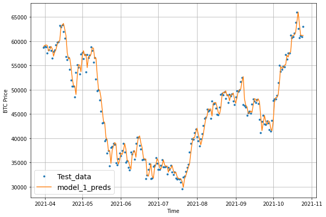
    


```python
def make_preds(model, input_data):
  """
  make predictions and squeeze results
  """
  forecast = model.predict(input_data)
  return tf.squeeze(forecast)
```

# Model 2: Dense 30, 1 <a name="model2"></a>


```python
HORIZON = 1
WINDOW_SIZE = 30
```


```python
# Make windowed data
full_windows, full_labels = make_windows(np.array(prices), window_size=WINDOW_SIZE, horizon=HORIZON)
len(full_windows), len(full_labels)
```


    (2518, 2518)


```python
train_windows, test_windows, train_labels, test_labels = make_train_test_splits(full_windows, full_labels)
len(train_windows), len(test_windows), len(train_labels), len(test_labels)
```


    (2014, 504, 2014, 504)


```python
train_windows[:1], train_labels[:1]
```


    (array([[324.71833, 332.45666, 336.585  , 346.775  , 344.81166, 343.065  ,
             358.50166, 368.07666, 376.99666, 442.10666, 389.00333, 394.92666,
             377.08   , 400.47166, 384.93   , 375.83333, 376.16   , 348.565  ,
             352.42   , 356.8    , 367.83   , 381.20666, 375.498  , 372.819  ,
             368.983  , 375.44   , 376.851  , 376.13218, 377.862  , 382.452  ]]),
     array([[376.382]]))


```python
tf.random.set_seed(42)

# Create model
model_2 = tf.keras.Sequential([
  layers.Dense(128, activation='relu'),
  layers.Dense(HORIZON)
], name='model_2_dense')

model_2.compile(loss='mae',
                optimizer=tf.keras.optimizers.Adam(),
                metrics=['mae'])

model_2.fit(train_windows, train_labels,
            epochs=100,
            batch_size=128,
            verbose=0,
            validation_data=(test_windows,test_labels),
            callbacks=[create_model_checkpoint(model_name=model_2.name)])
```

    INFO:tensorflow:Assets written to: model_experiments/model_2_dense/assets
    INFO:tensorflow:Assets written to: model_experiments/model_2_dense/assets
    INFO:tensorflow:Assets written to: model_experiments/model_2_dense/assets
    INFO:tensorflow:Assets written to: model_experiments/model_2_dense/assets
    INFO:tensorflow:Assets written to: model_experiments/model_2_dense/assets
    INFO:tensorflow:Assets written to: model_experiments/model_2_dense/assets
    INFO:tensorflow:Assets written to: model_experiments/model_2_dense/assets
    INFO:tensorflow:Assets written to: model_experiments/model_2_dense/assets
    INFO:tensorflow:Assets written to: model_experiments/model_2_dense/assets
    INFO:tensorflow:Assets written to: model_experiments/model_2_dense/assets
    INFO:tensorflow:Assets written to: model_experiments/model_2_dense/assets
    INFO:tensorflow:Assets written to: model_experiments/model_2_dense/assets
    INFO:tensorflow:Assets written to: model_experiments/model_2_dense/assets
    INFO:tensorflow:Assets written to: model_experiments/model_2_dense/assets
    INFO:tensorflow:Assets written to: model_experiments/model_2_dense/assets
    INFO:tensorflow:Assets written to: model_experiments/model_2_dense/assets
    INFO:tensorflow:Assets written to: model_experiments/model_2_dense/assets
    INFO:tensorflow:Assets written to: model_experiments/model_2_dense/assets
    INFO:tensorflow:Assets written to: model_experiments/model_2_dense/assets
    INFO:tensorflow:Assets written to: model_experiments/model_2_dense/assets
    INFO:tensorflow:Assets written to: model_experiments/model_2_dense/assets
    INFO:tensorflow:Assets written to: model_experiments/model_2_dense/assets
    INFO:tensorflow:Assets written to: model_experiments/model_2_dense/assets
    INFO:tensorflow:Assets written to: model_experiments/model_2_dense/assets
    INFO:tensorflow:Assets written to: model_experiments/model_2_dense/assets
    INFO:tensorflow:Assets written to: model_experiments/model_2_dense/assets
    INFO:tensorflow:Assets written to: model_experiments/model_2_dense/assets
    INFO:tensorflow:Assets written to: model_experiments/model_2_dense/assets
    INFO:tensorflow:Assets written to: model_experiments/model_2_dense/assets
    INFO:tensorflow:Assets written to: model_experiments/model_2_dense/assets
    INFO:tensorflow:Assets written to: model_experiments/model_2_dense/assets
    INFO:tensorflow:Assets written to: model_experiments/model_2_dense/assets
    INFO:tensorflow:Assets written to: model_experiments/model_2_dense/assets
    INFO:tensorflow:Assets written to: model_experiments/model_2_dense/assets
    INFO:tensorflow:Assets written to: model_experiments/model_2_dense/assets
    INFO:tensorflow:Assets written to: model_experiments/model_2_dense/assets


    <keras.callbacks.History at 0x7f9e7517b5d0>


## Evaluate


```python
model_2 = tf.keras.models.load_model("model_experiments/model_2_dense/")
model_2.evaluate(test_windows, test_labels)
```

    16/16 [==============================] - 0s 3ms/step - loss: 990.3993 - mae: 990.3993


    [990.3992919921875, 990.3992919921875]


```python
# Get forecast predictions
model_2_preds = make_preds(model_2,
                           input_data=test_windows)
```


```python
model_2_results = evaluate_preds(y_true=tf.squeeze(test_labels), y_pred=model_2_preds)
model_2_results
```


    {'mae': 990.3992,
     'mape': 2.788899,
     'mase': 1.059855,
     'mse': 2314995.8,
     'rmse': 1521.511}


Didn't perform as well as model 1 - could totally run a for loop with different window sizes


```python
offset = 300
plt.figure(figsize=(10, 7))
# Account for the test_window offset and index into test_labels to ensure correct plotting
plot_time_series(timesteps=X_test[-len(test_windows):], values=test_labels[:, 0], start=offset, label="Test_data")
plot_time_series(timesteps=X_test[-len(test_windows):], values=model_2_preds, start=offset, format="-", label="model_2_preds")
```


    
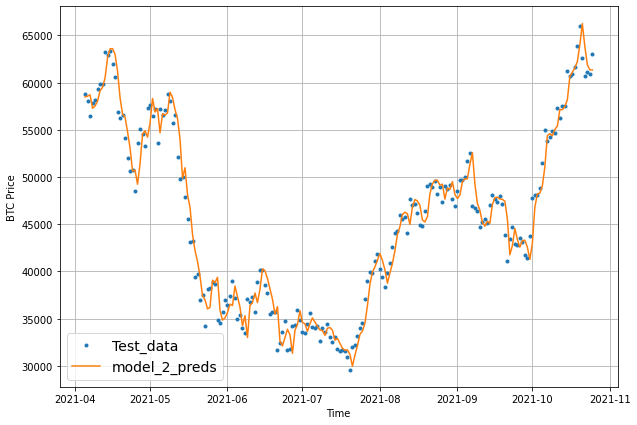
    


# Model 3: Dense 30, 7 <a name="model3"></a>


```python
HORIZON = 7
WINDOW_SIZE = 30
```


```python
# Make windowed data
full_windows, full_labels = make_windows(np.array(prices), window_size=WINDOW_SIZE, horizon=HORIZON)
len(full_windows), len(full_labels)
```


    (2512, 2512)


```python
train_windows, test_windows, train_labels, test_labels = make_train_test_splits(full_windows, full_labels)
len(train_windows), len(test_windows), len(train_labels), len(test_labels)
```


    (2009, 503, 2009, 503)


```python
train_windows[:1], train_labels[:1]
```


    (array([[324.71833, 332.45666, 336.585  , 346.775  , 344.81166, 343.065  ,
             358.50166, 368.07666, 376.99666, 442.10666, 389.00333, 394.92666,
             377.08   , 400.47166, 384.93   , 375.83333, 376.16   , 348.565  ,
             352.42   , 356.8    , 367.83   , 381.20666, 375.498  , 372.819  ,
             368.983  , 375.44   , 376.851  , 376.13218, 377.862  , 382.452  ]]),
     array([[376.382 , 368.3618, 373.414 , 373.744 , 373.155 , 357.884 ,
             348.898 ]]))


```python
tf.random.set_seed(42)

# Create model
model_3 = tf.keras.Sequential([
  layers.Dense(128, activation='relu'),
  layers.Dense(HORIZON)
], name='model_3_dense')

model_3.compile(loss='mae',
                optimizer=tf.keras.optimizers.Adam(),
                metrics=['mae'])

model_3.fit(train_windows, train_labels,
            epochs=100,
            batch_size=128,
            verbose=0,
            validation_data=(test_windows,test_labels),
            callbacks=[create_model_checkpoint(model_name=model_3.name)])
```

    INFO:tensorflow:Assets written to: model_experiments/model_3_dense/assets
    INFO:tensorflow:Assets written to: model_experiments/model_3_dense/assets
    INFO:tensorflow:Assets written to: model_experiments/model_3_dense/assets
    INFO:tensorflow:Assets written to: model_experiments/model_3_dense/assets
    INFO:tensorflow:Assets written to: model_experiments/model_3_dense/assets
    INFO:tensorflow:Assets written to: model_experiments/model_3_dense/assets
    INFO:tensorflow:Assets written to: model_experiments/model_3_dense/assets
    INFO:tensorflow:Assets written to: model_experiments/model_3_dense/assets
    INFO:tensorflow:Assets written to: model_experiments/model_3_dense/assets
    INFO:tensorflow:Assets written to: model_experiments/model_3_dense/assets
    INFO:tensorflow:Assets written to: model_experiments/model_3_dense/assets
    INFO:tensorflow:Assets written to: model_experiments/model_3_dense/assets
    INFO:tensorflow:Assets written to: model_experiments/model_3_dense/assets
    INFO:tensorflow:Assets written to: model_experiments/model_3_dense/assets
    INFO:tensorflow:Assets written to: model_experiments/model_3_dense/assets
    INFO:tensorflow:Assets written to: model_experiments/model_3_dense/assets
    INFO:tensorflow:Assets written to: model_experiments/model_3_dense/assets
    INFO:tensorflow:Assets written to: model_experiments/model_3_dense/assets
    INFO:tensorflow:Assets written to: model_experiments/model_3_dense/assets
    INFO:tensorflow:Assets written to: model_experiments/model_3_dense/assets
    INFO:tensorflow:Assets written to: model_experiments/model_3_dense/assets
    INFO:tensorflow:Assets written to: model_experiments/model_3_dense/assets
    INFO:tensorflow:Assets written to: model_experiments/model_3_dense/assets
    INFO:tensorflow:Assets written to: model_experiments/model_3_dense/assets
    INFO:tensorflow:Assets written to: model_experiments/model_3_dense/assets
    INFO:tensorflow:Assets written to: model_experiments/model_3_dense/assets
    INFO:tensorflow:Assets written to: model_experiments/model_3_dense/assets
    INFO:tensorflow:Assets written to: model_experiments/model_3_dense/assets
    INFO:tensorflow:Assets written to: model_experiments/model_3_dense/assets
    INFO:tensorflow:Assets written to: model_experiments/model_3_dense/assets
    INFO:tensorflow:Assets written to: model_experiments/model_3_dense/assets
    INFO:tensorflow:Assets written to: model_experiments/model_3_dense/assets
    INFO:tensorflow:Assets written to: model_experiments/model_3_dense/assets
    INFO:tensorflow:Assets written to: model_experiments/model_3_dense/assets


    <keras.callbacks.History at 0x7f9e7807a550>


## Evaluate


```python
model_3 = tf.keras.models.load_model("model_experiments/model_3_dense/")
model_3.evaluate(test_windows, test_labels)
```

    16/16 [==============================] - 0s 3ms/step - loss: 2047.8856 - mae: 2047.8856


    [2047.8856201171875, 2047.8856201171875]


```python
# Get forecast predictions
model_3_preds = make_preds(model_3,
                           input_data=test_windows)
```


```python
test_labels.shape, model_3_preds.shape
```


    ((503, 7), TensorShape([503, 7]))


```python
model_3_results = evaluate_preds(y_true=test_labels, y_pred=model_3_preds)
model_3_results
```


    {'mae': array([  198.34473 ,   344.33746 ,   227.27246 ,   262.179   ,
              258.46304 ,   376.8178  ,   545.6133  ,   667.0472  ,
              259.5064  ,   273.26535 ,   182.20229 ,   238.57227 ,
              204.28    ,   205.19225 ,   208.5664  ,   179.56445 ,
              174.07004 ,   172.27469 ,   249.48772 ,   324.3662  ,
              658.38574 ,   401.90836 ,   361.08316 ,   192.99959 ,
              115.62849 ,   141.73856 ,    71.96303 ,   117.711914,
              163.44824 ,   157.82701 ,   142.01186 ,    56.97977 ,
              125.28209 ,    53.725445,   156.06584 ,   256.89648 ,
              180.32156 ,   225.35645 ,   164.63184 ,   170.1988  ,
              198.65291 ,   231.8591  ,   148.79256 ,   173.79729 ,
              188.39244 ,   231.84334 ,   245.54074 ,   539.3613  ,
              627.8876  ,   803.3146  ,   872.73175 ,  1053.4825  ,
             1283.8585  ,  1223.984   ,   488.4527  ,   205.73186 ,
              224.60506 ,   190.05692 ,   327.95117 ,   450.90527 ,
              178.5466  ,   104.73912 ,   220.82799 ,   205.536   ,
              348.13364 ,   366.0572  ,   304.0113  ,   318.61996 ,
              297.5872  ,   206.25642 ,   231.82547 ,   187.90053 ,
              230.45508 ,   157.01967 ,   397.63492 ,   475.86063 ,
              734.29535 ,   459.06027 ,   455.41336 ,   338.95035 ,
              322.3609  ,   535.4078  ,   407.27106 ,   171.99791 ,
              191.34445 ,   292.96457 ,   421.27762 ,   586.0368  ,
              832.2006  ,  1162.0234  ,  1574.3854  ,  1485.5608  ,
              945.8036  ,   680.7335  ,   138.21289 ,   200.53474 ,
              109.816124,   283.66574 ,   323.6511  ,   337.11383 ,
              402.0537  ,   310.8725  ,   320.70215 ,   240.15736 ,
              197.00461 ,   297.49875 ,   482.01813 ,   426.15765 ,
              548.6476  ,   417.54785 ,   185.7867  ,   143.07674 ,
              208.96596 ,   129.89453 ,   214.2302  ,   245.90096 ,
              348.01813 ,   340.75992 ,   341.37766 ,   242.69824 ,
              151.43416 ,   154.83594 ,   262.8623  ,   344.3146  ,
              395.17188 ,   461.6091  ,   537.1222  ,   499.5226  ,
              372.60797 ,    81.39886 ,   174.20619 ,   387.56754 ,
              257.13422 ,   441.0887  ,   614.24384 ,   706.9044  ,
              922.39856 ,  1084.5853  ,  1090.9434  ,  1091.9379  ,
              360.91254 ,   261.1013  ,   248.30984 ,   255.09724 ,
              235.00168 ,   305.48145 ,   233.3086  ,   142.6183  ,
              332.70453 ,   619.629   ,   711.79034 ,   774.89636 ,
              994.37823 ,  1076.2625  ,  1027.3513  ,   425.54617 ,
              482.83762 ,   456.38254 ,   345.99707 ,   469.71652 ,
              756.25714 ,   708.012   ,   852.3648  ,   989.6528  ,
             1089.5575  ,  1644.5303  ,  1342.9972  ,   960.204   ,
              410.33176 ,   498.6638  ,   713.6239  ,   947.9819  ,
             1114.9084  ,  1148.0881  ,  1178.8998  ,   974.8368  ,
              741.6417  ,  1038.5848  ,  1141.1635  ,  1209.2333  ,
              200.67969 ,   385.05804 ,   674.4183  ,  1059.7338  ,
              663.9403  ,   821.9721  ,   786.01227 ,   603.0148  ,
              616.0787  ,   721.7525  ,  1301.8822  ,  2269.0444  ,
             2594.9653  ,  2808.096   ,  2998.5503  ,  3234.464   ,
             2263.4448  ,   902.9032  ,   520.41296 ,   982.93164 ,
             1308.087   ,  1457.373   ,  1629.0212  ,  2366.7136  ,
             2965.1985  ,  2699.2488  ,  2279.3882  ,  2441.1575  ,
             2570.7456  ,  3510.4832  ,  3328.179   ,  4058.5444  ,
             5065.7656  ,  4623.383   ,  4086.5723  ,  4456.236   ,
             3156.0378  ,  2677.4397  ,  2276.2935  ,  4508.8906  ,
             5825.0244  ,  5611.3755  ,  1661.7706  ,   845.726   ,
              867.4258  ,  2666.938   ,  3371.8198  ,  3614.1462  ,
             3292.4792  ,  3546.8093  ,  3638.3484  ,  4005.7156  ,
             1541.0896  ,  1302.4001  ,  1217.4744  ,  1369.2963  ,
             1229.257   ,  2257.268   ,  3417.4084  ,  2871.5723  ,
             2480.7087  ,  2513.466   ,  2763.73    ,  4625.2593  ,
             4782.5625  ,  4349.855   ,  4666.804   ,  6162.767   ,
             5578.535   ,  7692.2266  ,  4323.515   ,  1063.9012  ,
             1545.2483  ,  1439.0078  ,  2370.869   ,  2822.2036  ,
             3160.3398  ,  2985.384   ,  3794.0972  ,  2580.2014  ,
             3335.1987  ,  5645.238   ,  7315.0405  ,  9767.505   ,
             9322.964   ,  5195.8384  ,  3231.231   ,  2128.3137  ,
             1312.2494  ,  1766.7611  ,  3287.6228  ,  2306.319   ,
             2333.2136  ,  2844.9722  ,  3699.7417  ,  4800.5845  ,
             5849.413   ,  5997.942   ,  5407.9844  ,  4060.5083  ,
             2332.4036  ,  1375.0045  ,  1264.4559  ,  2245.563   ,
             4036.7266  ,  2309.6167  ,  2903.303   ,  3510.4856  ,
             4537.8877  ,  6121.304   ,  5190.4272  ,  5551.523   ,
             1387.3075  ,  2136.9058  ,  2498.737   ,  3573.7214  ,
             4086.5503  ,  2073.905   ,  2189.5073  ,  1139.2963  ,
              766.92914 ,  1152.5441  ,  1436.0898  ,  1400.1356  ,
             1102.2277  ,  1371.721   ,  1362.317   ,  1386.7812  ,
             1805.6608  ,  2493.904   ,  2941.188   ,  1845.8928  ,
             2140.1858  ,  2488.168   ,  3852.1536  ,  5994.5693  ,
             7607.3755  ,  9059.399   ,  8574.132   ,  6773.6094  ,
             5189.7554  ,  4926.047   ,  3062.0664  ,  2121.145   ,
             2596.2786  ,  3622.7144  ,  5636.5815  ,  3238.9714  ,
             1651.4006  ,  1597.1512  ,  1834.8834  ,  1492.7494  ,
             1455.7266  ,  1486.4135  ,  2031.476   ,  1812.0419  ,
             1687.6584  ,  2623.7695  ,  4156.2114  ,  6564.0327  ,
             8155.9546  ,  8803.975   , 11318.192   ,  9851.561   ,
             8017.621   ,  9746.167   ,  8563.351   ,  8970.545   ,
             6508.9243  ,  6760.962   ,  3445.9973  ,  3126.2214  ,
             2015.6803  ,  2641.9675  ,  2195.7456  ,  2624.8918  ,
             3300.6958  ,  3381.625   ,  4271.9404  ,  1961.774   ,
             1496.9408  ,  1526.1083  ,  1528.4347  ,  2068.452   ,
             2956.1418  ,  2970.3416  ,  3116.106   ,  1698.2333  ,
             1426.6139  ,  1770.2355  ,  3493.432   ,  1837.5988  ,
             2148.6606  ,  1192.2589  ,  2073.352   ,  1410.8516  ,
             3233.982   ,  5003.247   ,  5502.7495  ,  5344.1323  ,
             3799.816   ,  3266.5054  ,  3503.0896  ,  1119.5798  ,
             1375.6322  ,  1966.7006  ,  1187.0098  ,  1500.8019  ,
             1921.2517  ,   999.07367 ,   920.08875 ,  1811.0681  ,
             1668.466   ,  1165.034   ,   690.83875 ,   680.68304 ,
              782.0067  ,  1382.4303  ,  1013.7397  ,  1861.8976  ,
             1206.8392  ,  1241.0117  ,  1980.798   ,  2791.3293  ,
             2935.9858  ,  1723.6033  ,  2224.018   ,  1247.7949  ,
             1025.0469  ,  1316.5421  ,  1534.9941  ,  2456.0562  ,
             3958.0015  ,  4228.286   ,  4914.943   ,  5676.0522  ,
             4785.6562  ,  4855.253   ,  3566.6394  ,  1365.601   ,
              757.0882  ,  1197.4933  ,  1638.3522  ,  2444.0552  ,
             1892.9219  ,  2323.957   ,  3070.6484  ,  3792.4792  ,
             3147.5178  ,  2337.3125  ,  1435.8783  ,  1191.3075  ,
             1024.8622  ,  1149.8427  ,  1211.0117  ,   925.2601  ,
             1683.8353  ,  1875.5502  ,  1942.6495  ,  1976.1786  ,
             2096.7969  ,  2742.3337  ,  2529.3784  ,   528.9196  ,
             1278.7181  ,  2170.6467  ,  2400.2388  ,  2107.6958  ,
             1438.7428  ,   956.12054 ,  1082.9531  ,   997.81024 ,
             1333.159   ,  1813.6088  ,  2040.3822  ,  2176.8416  ,
             2053.4414  ,  2818.4353  ,  3990.8303  ,  5517.2505  ,
             7213.7144  ,  4508.144   ,  2198.616   ,  1504.3588  ,
             1150.6914  ,  1681.9755  ,  1525.1842  ,  2467.0864  ,
             1753.2338  ,  2303.058   ,  3458.7266  ,  3915.9727  ,
             4562.4736  ,  5186.7764  ,  3279.924   ,  1160.4564  ,
              977.5156  ,  1440.6864  ,  1489.6523  ,  2251.639   ,
             2537.5564  ,  3375.6067  ,  4399.5317  ,  6303.0083  ,
             6276.4653  ,  4917.6226  ,  4017.4453  ,  3827.3572  ,
             5202.6626  ,  5032.5195  ,  1562.3047  ,  1523.0033  ,
             1910.0206  ,  1785.5391  ,  2249.7036  ,  2012.0223  ,
             2554.5286  ,  2947.3333  ,  2809.2305  ,  1600.462   ,
             1735.24    ,  1548.6914  ,  1886.9342  ], dtype=float32),
     'mape': array([ 2.0409105 ,  3.5966687 ,  2.3846035 ,  2.7481534 ,  2.747307  ,
             4.0041947 ,  5.8015065 ,  7.0797234 ,  2.7551498 ,  2.9169676 ,
             1.941608  ,  2.546255  ,  2.1833947 ,  2.1878464 ,  2.225683  ,
             1.9068556 ,  1.8761367 ,  1.845595  ,  2.6970382 ,  3.5297573 ,
             7.1855345 ,  4.391867  ,  3.9610407 ,  2.1175442 ,  1.2631248 ,
             1.5533594 ,  0.789953  ,  1.293295  ,  1.7913997 ,  1.7116746 ,
             1.5376999 ,  0.6098182 ,  1.346609  ,  0.5801435 ,  1.6797042 ,
             2.7794037 ,  1.9568933 ,  2.4455276 ,  1.7867798 ,  1.8507617 ,
             2.1655111 ,  2.5257678 ,  1.6192667 ,  1.8591682 ,  2.0007024 ,
             2.4336922 ,  2.5278356 ,  5.2029967 ,  5.86003   ,  7.350724  ,
             7.8994884 ,  9.449211  , 11.39213   , 10.823228  ,  4.2928815 ,
             1.7929399 ,  1.9738612 ,  1.6804116 ,  2.8660011 ,  3.9693837 ,
             1.5590972 ,  0.90401906,  1.9032898 ,  1.7755817 ,  3.0038102 ,
             3.152892  ,  2.6241322 ,  2.7546659 ,  2.5460298 ,  1.713315  ,
             1.9174682 ,  1.5480202 ,  1.9443216 ,  1.3291662 ,  3.3576999 ,
             4.0618033 ,  6.3079076 ,  3.975036  ,  3.962695  ,  2.9549134 ,
             2.8215885 ,  4.6779375 ,  3.5526416 ,  1.4986718 ,  1.6417801 ,
             2.5823085 ,  3.8424094 ,  5.522741  ,  7.9753056 , 11.12138   ,
            15.235226  , 14.461771  ,  9.256595  ,  6.6554894 ,  1.3533186 ,
             1.9536266 ,  1.0562544 ,  2.6833112 ,  3.0139103 ,  3.1104934 ,
             3.7169588 ,  2.841987  ,  2.934643  ,  2.2072937 ,  1.833329  ,
             2.8234065 ,  4.5616555 ,  4.038537  ,  5.213386  ,  3.9686978 ,
             1.7763933 ,  1.3485821 ,  1.9433869 ,  1.2094533 ,  2.006067  ,
             2.3066087 ,  3.2691407 ,  3.2020674 ,  3.2180798 ,  2.2902763 ,
             1.4234982 ,  1.4335357 ,  2.3897367 ,  3.1134093 ,  3.4988203 ,
             4.040433  ,  4.7129726 ,  4.3660583 ,  3.2488909 ,  0.70869786,
             1.5187101 ,  3.3927531 ,  2.2474601 ,  3.6401849 ,  4.8955703 ,
             5.5116935 ,  7.110484  ,  8.36204   ,  8.390585  ,  8.274902  ,
             2.706628  ,  1.9726504 ,  1.87443   ,  1.9121913 ,  1.7235445 ,
             2.2373135 ,  1.7240627 ,  1.0321987 ,  2.2308378 ,  4.138693  ,
             4.740137  ,  5.116083  ,  6.509969  ,  7.047697  ,  6.640906  ,
             2.713436  ,  3.1119843 ,  2.8711429 ,  2.1789086 ,  2.8805835 ,
             4.513125  ,  4.1019797 ,  4.924124  ,  5.625858  ,  6.0197773 ,
             9.039097  ,  7.318673  ,  5.1672754 ,  2.1930883 ,  2.75807   ,
             4.0843906 ,  5.4146433 ,  6.330515  ,  6.518898  ,  6.7290173 ,
             5.584917  ,  4.01358   ,  5.426522  ,  5.976067  ,  6.2946773 ,
             1.0542319 ,  2.0336823 ,  3.5821457 ,  5.654707  ,  3.5833917 ,
             4.420351  ,  4.2376714 ,  3.2628787 ,  3.3360868 ,  3.6832948 ,
             6.0888963 , 10.487547  , 11.508254  , 12.206615  , 12.961777  ,
            13.961157  ,  9.694232  ,  3.8480554 ,  2.170022  ,  4.0295506 ,
             5.3007073 ,  5.6936    ,  6.2191463 ,  8.750816  , 10.779581  ,
             9.5962305 ,  7.6114736 ,  7.8555236 ,  8.174191  , 10.909031  ,
             9.837456  , 11.323862  , 13.5916815 , 11.981682  , 10.50922   ,
            11.431423  ,  8.033039  ,  6.9882803 ,  6.3726015 , 12.515625  ,
            16.24484   , 15.664029  ,  4.616887  ,  2.2658567 ,  2.3547854 ,
             7.8124776 , 10.034515  , 10.980551  , 10.185558  , 10.919814  ,
            11.356761  , 12.605284  ,  4.8053894 ,  4.06745   ,  3.692954  ,
             4.093094  ,  3.729272  ,  6.5538034 ,  9.735404  ,  7.9521775 ,
             6.7950597 ,  6.7391343 ,  7.2153134 , 11.548952  , 11.169111  ,
             9.77751   , 10.211084  , 13.406171  , 11.977131  , 16.352287  ,
             9.058758  ,  2.2204459 ,  3.0962837 ,  2.888864  ,  4.5459604 ,
             5.3408623 ,  5.8279524 ,  5.3900776 ,  7.02347   ,  4.9445014 ,
             6.46274   , 11.718033  , 15.263276  , 20.734089  , 19.76489   ,
            11.09307   ,  6.9334364 ,  4.5595746 ,  2.7395282 ,  3.5962372 ,
             6.633214  ,  4.583344  ,  4.4937057 ,  5.2629957 ,  6.7527466 ,
             8.580757  , 10.195822  , 10.2611    ,  9.275844  ,  6.9551296 ,
             3.9324408 ,  2.3676229 ,  2.1546001 ,  3.910556  ,  7.001995  ,
             4.1098228 ,  5.189389  ,  6.4119377 ,  8.408363  , 11.330194  ,
             9.620076  , 10.289664  ,  2.611399  ,  3.9229493 ,  4.3717723 ,
             6.1837955 ,  7.018744  ,  3.5511944 ,  3.748101  ,  1.9426886 ,
             1.3111055 ,  1.9951535 ,  2.4953012 ,  2.4208422 ,  1.8986394 ,
             2.3767948 ,  2.371073  ,  2.3314166 ,  2.9234915 ,  3.9891224 ,
             4.7085977 ,  2.9526165 ,  3.5060458 ,  4.1939425 ,  6.6803446 ,
            10.563861  , 13.716027  , 16.765244  , 16.172094  , 13.179675  ,
            10.133285  ,  9.630142  ,  6.029118  ,  4.172738  ,  4.8675203 ,
             6.547346  , 10.114635  ,  5.718496  ,  2.918504  ,  2.8566    ,
             3.2145638 ,  2.6727214 ,  2.6089797 ,  2.6572514 ,  3.6168218 ,
             3.134128  ,  3.0801384 ,  4.978535  ,  8.034607  , 13.003127  ,
            16.612455  , 18.73364   , 24.517635  , 22.514673  , 19.05419   ,
            23.992016  , 21.67174   , 23.663872  , 17.450253  , 18.179699  ,
             9.31843   ,  8.521563  ,  5.6955543 ,  7.45401   ,  6.1200705 ,
             7.333215  ,  9.205043  ,  9.48326   , 11.911655  ,  5.3824954 ,
             4.079406  ,  4.143833  ,  4.2748485 ,  5.9612446 ,  8.4120655 ,
             8.549851  ,  8.900564  ,  4.8705006 ,  3.9907281 ,  4.6707864 ,
             9.085865  ,  4.724092  ,  5.5293584 ,  3.1803977 ,  5.3039885 ,
             3.7732177 ,  9.304856  , 14.697075  , 16.296993  , 15.8320055 ,
            11.6358    , 10.115356  , 10.814154  ,  3.4606152 ,  4.0400305 ,
             5.7444496 ,  3.590705  ,  4.322302  ,  5.539883  ,  2.8603876 ,
             2.6533535 ,  5.3358693 ,  4.9170675 ,  3.4665222 ,  1.996088  ,
             1.963587  ,  2.33209   ,  4.142221  ,  3.0865688 ,  5.6164494 ,
             3.6786728 ,  3.8498755 ,  6.1602454 ,  8.731968  ,  9.264205  ,
             5.5800796 ,  7.1735873 ,  4.067086  ,  3.2938998 ,  4.1956086 ,
             4.6731973 ,  7.141753  , 11.036282  , 11.313997  , 12.911396  ,
            14.532192  , 11.928548  , 12.05362   ,  8.829873  ,  3.3527904 ,
             1.8891755 ,  3.0242498 ,  4.1290917 ,  6.1564865 ,  4.7068853 ,
             5.413719  ,  6.8975077 ,  8.471508  ,  7.0060015 ,  5.0862875 ,
             3.0937424 ,  2.575307  ,  2.2411168 ,  2.562805  ,  2.6790764 ,
             1.9999385 ,  3.6560953 ,  4.0793138 ,  4.226768  ,  4.1888237 ,
             4.299208  ,  5.620482  ,  5.168273  ,  1.0873759 ,  2.6516943 ,
             4.4800615 ,  4.9738936 ,  4.4172287 ,  2.9971297 ,  1.9806389 ,
             2.2549436 ,  2.0957136 ,  2.7528627 ,  3.5897672 ,  4.0447927 ,
             4.3221755 ,  4.2354136 ,  6.0061493 ,  8.639593  , 12.0095215 ,
            15.788022  ,  9.869997  ,  4.8399973 ,  3.3010283 ,  2.4443154 ,
             3.551695  ,  3.203864  ,  5.224407  ,  3.9855976 ,  5.3052225 ,
             7.933607  ,  9.066291  , 10.634617  , 12.099351  ,  7.6456466 ,
             2.7139003 ,  2.2784884 ,  3.4095955 ,  3.376904  ,  4.923179  ,
             5.473342  ,  7.1610146 ,  9.009227  , 12.562357  , 12.209492  ,
             9.295086  ,  7.428875  ,  7.028468  ,  9.477975  ,  9.069722  ,
             2.750283  ,  2.6848319 ,  3.2936757 ,  2.9969134 ,  3.7589424 ,
             3.3451118 ,  4.171559  ,  4.656481  ,  4.4283633 ,  2.5137007 ,
             2.753452  ,  2.4734402 ,  3.0146499 ], dtype=float32),
     'mase': 2.2066739,
     'mse': array([6.02635742e+04, 1.61393453e+05, 7.66824219e+04, 8.52572656e+04,
            1.13504102e+05, 1.91161656e+05, 3.52221188e+05, 4.52515719e+05,
            9.44122656e+04, 1.11110570e+05, 3.93382891e+04, 7.04189688e+04,
            6.02438984e+04, 5.82169727e+04, 5.25739766e+04, 3.70784336e+04,
            5.71524961e+04, 3.93154023e+04, 8.33688047e+04, 1.16277930e+05,
            4.46706344e+05, 1.82590453e+05, 1.56936281e+05, 5.14491250e+04,
            1.52098301e+04, 2.77714004e+04, 7.34899609e+03, 2.67268809e+04,
            4.24213828e+04, 3.64512148e+04, 3.32481367e+04, 6.56644922e+03,
            2.12645996e+04, 6.31993896e+03, 3.04794336e+04, 6.98643984e+04,
            4.47920625e+04, 6.16715625e+04, 3.04689883e+04, 3.53427383e+04,
            4.81881797e+04, 6.59483125e+04, 3.56257539e+04, 3.42030664e+04,
            4.40084180e+04, 7.06022969e+04, 9.28485391e+04, 5.90253188e+05,
            8.37575062e+05, 1.14411600e+06, 1.18824150e+06, 1.48737388e+06,
            1.88306175e+06, 1.58527488e+06, 3.05822250e+05, 7.83743203e+04,
            5.43062812e+04, 5.92518047e+04, 1.43609219e+05, 2.72906625e+05,
            5.93235273e+04, 1.57208438e+04, 6.76435000e+04, 5.95815117e+04,
            1.49439344e+05, 1.67541000e+05, 1.39870672e+05, 1.71601500e+05,
            1.29803352e+05, 6.79795625e+04, 9.28080859e+04, 7.65459844e+04,
            6.59152109e+04, 3.62826016e+04, 1.62309609e+05, 2.53965250e+05,
            5.59725250e+05, 2.90691312e+05, 2.73631469e+05, 1.52240047e+05,
            1.44111344e+05, 3.52751719e+05, 1.93066484e+05, 6.11461680e+04,
            6.82383750e+04, 1.44429750e+05, 3.28503062e+05, 5.91617562e+05,
            1.04241488e+06, 1.63229375e+06, 2.73104000e+06, 2.29322350e+06,
            9.71668438e+05, 4.84436781e+05, 3.29003008e+04, 5.46350508e+04,
            2.30860488e+04, 1.12870008e+05, 1.55262766e+05, 1.75493266e+05,
            1.89354516e+05, 1.28518211e+05, 1.14358461e+05, 6.27497773e+04,
            5.28453047e+04, 1.34363516e+05, 2.93759625e+05, 2.22686891e+05,
            3.83397938e+05, 2.32191719e+05, 8.58148828e+04, 2.80607012e+04,
            5.55600430e+04, 2.56328223e+04, 5.79876523e+04, 7.08189922e+04,
            1.42848031e+05, 1.38269891e+05, 1.51377297e+05, 8.24241719e+04,
            3.83368086e+04, 2.93569199e+04, 1.00090859e+05, 1.57954031e+05,
            2.31765500e+05, 3.22995938e+05, 3.44943562e+05, 2.80493000e+05,
            1.62750281e+05, 8.85123730e+03, 3.78679570e+04, 1.82778328e+05,
            9.81686016e+04, 3.35493219e+05, 6.61173688e+05, 8.70286062e+05,
            1.31481338e+06, 1.47086025e+06, 1.29646488e+06, 1.26271975e+06,
            1.98772984e+05, 8.17516797e+04, 1.02111164e+05, 8.55700000e+04,
            8.01586953e+04, 1.20107883e+05, 8.44372266e+04, 3.29432695e+04,
            3.80255406e+05, 7.44121875e+05, 8.93110375e+05, 8.91499688e+05,
            1.30313000e+06, 1.25025062e+06, 1.16127575e+06, 3.21425000e+05,
            2.79804469e+05, 2.48583141e+05, 1.72024266e+05, 3.31551219e+05,
            8.84960625e+05, 8.88029500e+05, 9.86135062e+05, 1.32494288e+06,
            1.62982062e+06, 3.07474275e+06, 1.97816200e+06, 1.07651500e+06,
            2.24665625e+05, 4.33981531e+05, 1.06579475e+06, 1.53990962e+06,
            1.71817088e+06, 1.91520788e+06, 2.27477275e+06, 1.72612575e+06,
            6.17495062e+05, 1.49849262e+06, 1.40931712e+06, 1.65482712e+06,
            5.61167148e+04, 2.07506922e+05, 5.91383625e+05, 1.22947000e+06,
            5.77613875e+05, 7.91609688e+05, 7.65791688e+05, 5.61649875e+05,
            6.15332875e+05, 9.85750562e+05, 3.65632075e+06, 7.78465450e+06,
            1.03309940e+07, 1.11687500e+07, 1.10862650e+07, 1.08677550e+07,
            5.25551450e+06, 9.20579375e+05, 5.17527312e+05, 1.38823088e+06,
            2.16241025e+06, 2.88264975e+06, 3.68373450e+06, 7.54384650e+06,
            1.03672720e+07, 8.58287300e+06, 8.87176100e+06, 9.79217100e+06,
            1.00405920e+07, 1.61764100e+07, 1.67255470e+07, 2.55444100e+07,
            3.66071440e+07, 3.09434220e+07, 2.25679640e+07, 2.57305700e+07,
            1.42721990e+07, 7.96055450e+06, 8.93561400e+06, 2.51467660e+07,
            3.84612560e+07, 3.36552240e+07, 3.44210850e+06, 1.41157600e+06,
            1.07750412e+06, 9.29582900e+06, 1.50594870e+07, 1.79308420e+07,
            1.55374210e+07, 1.41847140e+07, 1.58231540e+07, 1.68342580e+07,
            3.02586375e+06, 2.32551175e+06, 2.24363950e+06, 2.35121725e+06,
            2.40093825e+06, 6.62534100e+06, 1.36296910e+07, 1.16804400e+07,
            8.29417200e+06, 7.87098150e+06, 1.03223500e+07, 2.84853420e+07,
            3.69317240e+07, 3.31269120e+07, 3.46628520e+07, 4.75282880e+07,
            3.70332680e+07, 6.05394640e+07, 2.08697240e+07, 1.68151112e+06,
            4.64034750e+06, 3.61903200e+06, 8.91104600e+06, 1.08811700e+07,
            1.37434800e+07, 1.44052970e+07, 1.72384320e+07, 9.30735000e+06,
            1.26587110e+07, 4.72894440e+07, 6.52601080e+07, 1.07295224e+08,
            8.88539040e+07, 3.06110720e+07, 1.43460740e+07, 6.81347250e+06,
            2.50146275e+06, 4.12097750e+06, 1.21763830e+07, 7.79444900e+06,
            8.97457400e+06, 1.60861310e+07, 2.02304680e+07, 3.30884060e+07,
            4.56147480e+07, 4.64308280e+07, 3.31400140e+07, 1.81215660e+07,
            8.68264600e+06, 2.71753625e+06, 2.43745000e+06, 6.93750150e+06,
            1.72550740e+07, 1.02480550e+07, 1.38872460e+07, 1.91899540e+07,
            2.90499580e+07, 4.43009680e+07, 3.16381940e+07, 3.32760640e+07,
            4.68822650e+06, 6.54313900e+06, 8.00927100e+06, 1.52268590e+07,
            1.89474360e+07, 5.28554700e+06, 5.08103350e+06, 1.78393712e+06,
            7.09489062e+05, 1.69709375e+06, 3.18260925e+06, 2.26034575e+06,
            1.41440575e+06, 2.81559250e+06, 4.05267000e+06, 3.01963125e+06,
            6.00106750e+06, 1.05654980e+07, 1.21671280e+07, 4.89837700e+06,
            6.10186750e+06, 8.90079400e+06, 2.21908380e+07, 4.64206600e+07,
            6.80947280e+07, 9.32291760e+07, 8.05212240e+07, 5.48445880e+07,
            3.24067320e+07, 2.86741480e+07, 1.30346490e+07, 6.82166550e+06,
            8.55098100e+06, 1.65672780e+07, 3.33959980e+07, 1.29440640e+07,
            3.93819575e+06, 2.81149275e+06, 4.46547100e+06, 3.18340975e+06,
            3.94254750e+06, 3.88937425e+06, 4.92533700e+06, 5.61514050e+06,
            5.83295950e+06, 1.26648300e+07, 2.75646240e+07, 6.01588560e+07,
            8.31906560e+07, 9.90140560e+07, 1.41365904e+08, 1.15172344e+08,
            8.21034720e+07, 1.10768136e+08, 8.38470560e+07, 9.06310560e+07,
            4.93695440e+07, 4.92976200e+07, 1.39268340e+07, 1.29656780e+07,
            8.83610000e+06, 1.02600180e+07, 6.90018050e+06, 9.72071300e+06,
            1.30933750e+07, 1.45546770e+07, 2.08824920e+07, 5.10763150e+06,
            3.28746925e+06, 2.72773475e+06, 3.11880925e+06, 6.40201350e+06,
            1.00027050e+07, 1.18081870e+07, 1.13493510e+07, 4.44851200e+06,
            2.96390225e+06, 4.52715450e+06, 1.37967440e+07, 4.94238350e+06,
            5.87400000e+06, 2.01933662e+06, 6.01318400e+06, 2.52787150e+06,
            1.42805990e+07, 3.09676020e+07, 3.47320960e+07, 3.02570240e+07,
            1.94623740e+07, 1.32472960e+07, 1.39777670e+07, 2.25988025e+06,
            2.31521125e+06, 4.35876650e+06, 2.18231850e+06, 3.46242350e+06,
            4.47223350e+06, 1.30399862e+06, 1.26344325e+06, 4.22225650e+06,
            3.46305450e+06, 1.85592062e+06, 7.90947000e+05, 9.38050375e+05,
            8.25064688e+05, 2.43869325e+06, 2.01115288e+06, 3.84190175e+06,
            2.38604625e+06, 2.28371450e+06, 4.69497850e+06, 8.66315700e+06,
            9.48999400e+06, 4.20857750e+06, 5.66952850e+06, 2.60072575e+06,
            1.59580425e+06, 2.66830275e+06, 3.30068575e+06, 9.12381300e+06,
            2.15875740e+07, 2.59771740e+07, 3.10645800e+07, 3.96665040e+07,
            2.83818580e+07, 2.59971240e+07, 1.35758290e+07, 2.63723250e+06,
            8.90591438e+05, 1.97722288e+06, 3.71191000e+06, 8.47786500e+06,
            5.33029700e+06, 6.26918050e+06, 1.31502110e+07, 1.64368500e+07,
            1.08721780e+07, 7.07728050e+06, 2.79165250e+06, 1.81114888e+06,
            1.73915475e+06, 3.11838325e+06, 2.10635725e+06, 1.47970025e+06,
            3.64875575e+06, 5.01025250e+06, 5.61969850e+06, 4.19229775e+06,
            5.52940950e+06, 7.95149050e+06, 7.09606000e+06, 5.39287625e+05,
            2.46630825e+06, 5.64409700e+06, 6.75420950e+06, 6.48041500e+06,
            2.25266225e+06, 1.09417875e+06, 1.85317012e+06, 2.48694725e+06,
            2.95841725e+06, 4.05653325e+06, 5.76684000e+06, 6.19136900e+06,
            5.19941050e+06, 1.08823590e+07, 2.03956640e+07, 3.48016080e+07,
            5.31685400e+07, 2.18782780e+07, 7.05036700e+06, 3.43575350e+06,
            1.82266438e+06, 3.48586150e+06, 3.17687875e+06, 6.42254950e+06,
            5.62411300e+06, 8.74643400e+06, 1.67537990e+07, 1.99799860e+07,
            2.50424640e+07, 2.94314040e+07, 1.14567220e+07, 2.18096375e+06,
            1.28479362e+06, 3.01544525e+06, 4.06863175e+06, 7.66859600e+06,
            9.96111700e+06, 1.50847790e+07, 2.65057800e+07, 4.72068680e+07,
            4.61459560e+07, 3.31260300e+07, 2.37195220e+07, 1.99815940e+07,
            2.95850780e+07, 2.79226580e+07, 4.80961950e+06, 3.00543825e+06,
            4.99730550e+06, 5.79615950e+06, 6.89437600e+06, 4.72613350e+06,
            7.57346550e+06, 1.30055040e+07, 1.11136730e+07, 4.45417750e+06,
            4.37515100e+06, 3.48337075e+06, 4.15199825e+06], dtype=float32),
     'rmse': array([  245.4864 ,   401.73804,   276.91592,   291.98846,   336.90372,
              437.22037,   593.48224,   672.69293,   307.26578,   333.33252,
              198.33882,   265.36572,   245.44633,   241.28194,   229.29015,
              192.55762,   239.06589,   198.28113,   288.73657,   340.9955 ,
              668.36096,   427.30606,   396.15182,   226.824  ,   123.32815,
              166.64754,    85.72629,   163.48358,   205.96454,   190.92203,
              182.34071,    81.03363,   145.82387,    79.49805,   174.5836 ,
              264.31876,   211.64134,   248.33762,   174.5537 ,   187.99666,
              219.51805,   256.80402,   188.74785,   184.94073,   209.78185,
              265.71094,   304.7106 ,   768.27936,   915.1912 ,  1069.6337 ,
             1090.065  ,  1219.5795 ,  1372.247  ,  1259.077  ,   553.012  ,
              279.95416,   233.0371 ,   243.41695,   378.95804,   522.40466,
              243.56422,   125.38278,   260.08365,   244.09326,   386.57385,
              409.31775,   373.9929 ,   414.24814,   360.28232,   260.7289 ,
              304.64423,   276.66946,   256.73956,   190.47993,   402.87665,
              503.94965,   748.1479 ,   539.15796,   523.09796,   390.17947,
              379.61996,   593.9291 ,   439.3933 ,   247.27753,   261.22476,
              380.03915,   573.15186,   769.1668 ,  1020.9872 ,  1277.6125 ,
             1652.5858 ,  1514.3392 ,   985.7324 ,   696.01495,   181.3844 ,
              233.74142,   151.94093,   335.9613 ,   394.034  ,   418.9192 ,
              435.14886,   358.4944 ,   338.16928,   250.49905,   229.88107,
              366.5563 ,   541.996  ,   471.8971 ,   619.19135,   481.86276,
              292.94177,   167.51329,   235.71179,   160.10254,   240.80624,
              266.11838,   377.95245,   371.84662,   389.07236,   287.09613,
              195.7979 ,   171.33862,   316.3714 ,   397.4343 ,   481.42032,
              568.32733,   587.319  ,   529.6159 ,   403.4232 ,    94.08102,
              194.59691,   427.52585,   313.3187 ,   579.2178 ,   813.1259 ,
              932.89124,  1146.6532 ,  1212.7903 ,  1138.6241 ,  1123.708  ,
              445.83963,   285.92252,   319.54837,   292.5235 ,   283.1231 ,
              346.56586,   290.58084,   181.5028 ,   616.64856,   862.625  ,
              945.04517,   944.19257,  1141.5472 ,  1118.1461 ,  1077.6251 ,
              566.94354,   528.96545,   498.58112,   414.7581 ,   575.8048 ,
              940.7235 ,   942.35315,   993.0434 ,  1151.0616 ,  1276.6443 ,
             1753.4945 ,  1406.4716 ,  1037.5525 ,   473.98904,   658.7727 ,
             1032.3734 ,  1240.9309 ,  1310.7902 ,  1383.9104 ,  1508.235  ,
             1313.821  ,   785.80853,  1224.1293 ,  1187.1467 ,  1286.4009 ,
              236.88966,   455.52927,   769.01465,  1108.8147 ,   760.0091 ,
              889.72455,   875.0952 ,   749.4331 ,   784.4316 ,   992.84973,
             1912.151  ,  2790.0994 ,  3214.1863 ,  3341.968  ,  3329.6042 ,
             3296.628  ,  2292.491  ,   959.46826,   719.39374,  1178.2322 ,
             1470.5134 ,  1697.8368 ,  1919.3058 ,  2746.6064 ,  3219.8247 ,
             2929.6543 ,  2978.5505 ,  3129.2446 ,  3168.6892 ,  4021.9907 ,
             4089.688  ,  5054.148  ,  6050.384  ,  5562.681  ,  4750.575  ,
             5072.5312 ,  3777.8564 ,  2821.4456 ,  2989.25   ,  5014.655  ,
             6201.714  ,  5801.3125 ,  1855.2921 ,  1188.0977 ,  1038.029  ,
             3048.906  ,  3880.6555 ,  4234.4824 ,  3941.7537 ,  3766.2598 ,
             3977.833  ,  4102.957  ,  1739.501  ,  1524.9628 ,  1497.8783 ,
             1533.368  ,  1549.4961 ,  2573.9736 ,  3691.8413 ,  3417.666  ,
             2879.9602 ,  2805.527  ,  3212.8413 ,  5337.166  ,  6077.148  ,
             5755.598  ,  5887.5166 ,  6894.076  ,  6085.4966 ,  7780.7104 ,
             4568.3394 ,  1296.731  ,  2154.1467 ,  1902.3751 ,  2985.1375 ,
             3298.6619 ,  3707.22   ,  3795.4312 ,  4151.919  ,  3050.7952 ,
             3557.9084 ,  6876.7324 ,  8078.3726 , 10358.34   ,  9426.234  ,
             5532.7275 ,  3787.621  ,  2610.263  ,  1581.6013 ,  2030.0192 ,
             3489.4673 ,  2791.854  ,  2995.7595 ,  4010.7517 ,  4497.829  ,
             5752.2524 ,  6753.869  ,  6814.017  ,  5756.7363 ,  4256.9434 ,
             2946.633  ,  1648.4951 ,  1561.2334 ,  2633.9138 ,  4153.923  ,
             3201.2585 ,  3726.5598 ,  4380.634  ,  5389.8013 ,  6655.8975 ,
             5624.784  ,  5768.541  ,  2165.2312 ,  2557.9558 ,  2830.0654 ,
             3902.1606 ,  4352.865  ,  2299.0317 ,  2254.1147 ,  1335.6411 ,
              842.3117 ,  1302.7256 ,  1783.9869 ,  1503.4447 ,  1189.288  ,
             1677.9728 ,  2013.1245 ,  1737.7086 ,  2449.7075 ,  3250.4612 ,
             3488.141  ,  2213.2278 ,  2470.196  ,  2983.4202 ,  4710.7153 ,
             6813.271  ,  8251.952  ,  9655.526  ,  8973.362  ,  7405.713  ,
             5692.6914 ,  5354.8247 ,  3610.3533 ,  2611.8318 ,  2924.2063 ,
             4070.2922 ,  5778.9272 ,  3597.7861 ,  1984.4889 ,  1676.7507 ,
             2113.166  ,  1784.2113 ,  1985.585  ,  1972.1497 ,  2219.31   ,
             2369.629  ,  2415.152  ,  3558.768  ,  5250.202  ,  7756.2144 ,
             9120.891  ,  9950.581  , 11889.739  , 10731.838  ,  9061.097  ,
            10524.645  ,  9156.805  ,  9520.035  ,  7026.346  ,  7021.2266 ,
             3731.8672 ,  3600.7883 ,  2972.5579 ,  3203.1265 ,  2626.8193 ,
             3117.806  ,  3618.4768 ,  3815.0596 ,  4569.737  ,  2260.007  ,
             1813.1381 ,  1651.5854 ,  1766.0149 ,  2530.2202 ,  3162.7053 ,
             3436.3044 ,  3368.88   ,  2109.1497 ,  1721.5989 ,  2127.7112 ,
             3714.397  ,  2223.1472 ,  2423.6338 ,  1421.0337 ,  2452.1794 ,
             1589.9281 ,  3778.968  ,  5564.854  ,  5893.3936 ,  5500.6387 ,
             4411.618  ,  3639.6836 ,  3738.685  ,  1503.2898 ,  1521.5819 ,
             2087.766  ,  1477.2672 ,  1860.7589 ,  2114.7656 ,  1141.9276 ,
             1124.0299 ,  2054.813  ,  1860.9283 ,  1362.3218 ,   889.35205,
              968.52997,   908.33075,  1561.6315 ,  1418.1512 ,  1960.077  ,
             1544.6833 ,  1511.1964 ,  2166.79   ,  2943.324  ,  3080.5833 ,
             2051.4817 ,  2381.0774 ,  1612.6765 ,  1263.2515 ,  1633.4941 ,
             1816.779  ,  3020.5652 ,  4646.243  ,  5096.781  ,  5573.561  ,
             6298.1353 ,  5327.4624 ,  5098.7373 ,  3684.539  ,  1623.9558 ,
              943.71155,  1406.1376 ,  1926.6318 ,  2911.6775 ,  2308.7437 ,
             2503.8333 ,  3626.322  ,  4054.2388 ,  3297.2986 ,  2660.316  ,
             1670.8239 ,  1345.7893 ,  1318.7701 ,  1765.8944 ,  1451.3295 ,
             1216.4293 ,  1910.1718 ,  2238.3594 ,  2370.5903 ,  2047.5101 ,
             2351.4697 ,  2819.8386 ,  2663.843  ,   734.36206,  1570.4484 ,
             2375.731  ,  2598.8862 ,  2545.666  ,  1500.8872 ,  1046.03   ,
             1361.3119 ,  1577.006  ,  1720.005  ,  2014.0839 ,  2401.4246 ,
             2488.246  ,  2280.2214 ,  3298.842  ,  4516.156  ,  5899.289  ,
             7291.6763 ,  4677.422  ,  2655.2527 ,  1853.5786 ,  1350.0608 ,
             1867.0461 ,  1782.38   ,  2534.275  ,  2371.5212 ,  2957.4373 ,
             4093.1406 ,  4469.898  ,  5004.2446 ,  5425.072  ,  3384.778  ,
             1476.8087 ,  1133.4874 ,  1736.5038 ,  2017.0848 ,  2769.2231 ,
             3156.1238 ,  3883.9128 ,  5148.3765 ,  6870.726  ,  6793.0815 ,
             5755.5215 ,  4870.2695 ,  4470.0776 ,  5439.217  ,  5284.1895 ,
             2193.0845 ,  1733.62   ,  2235.4656 ,  2407.5215 ,  2625.7144 ,
             2173.9673 ,  2751.993  ,  3606.3147 ,  3333.7178 ,  2110.4922 ,
             2091.6863 ,  1866.379  ,  2037.6451 ], dtype=float32)}


It is getting results for each week


```python
# Need to adjust our evaluate_preds() function to work with multiple dimension outputs
def evaluate_preds(y_true, y_pred):
  # Make sure float32 (for metric calculations)
  y_true = tf.cast(y_true, dtype=tf.float32)
  y_pred = tf.cast(y_pred, dtype=tf.float32)

  # Calculate various metrics
  mae = tf.keras.metrics.mean_absolute_error(y_true, y_pred)
  mse = tf.keras.metrics.mean_squared_error(y_true, y_pred)
  rmse = tf.sqrt(mse)
  mape = tf.keras.metrics.mean_absolute_percentage_error(y_true, y_pred)
  mase = mean_absolute_scaled_error(y_true, y_pred)

  # Account for different sized metrics (for longer horizons, reduce to single number)
  if mae.ndim > 0: # if mae isn't already a scalar, reduce it to one by aggregating tensors to mean
    mae = tf.reduce_mean(mae)
    mse = tf.reduce_mean(mse)
    rmse = tf.reduce_mean(rmse)
    mape = tf.reduce_mean(mape)
    mase = tf.reduce_mean(mase)

  return {"mae": mae.numpy(),
          "mse": mse.numpy(),
          "rmse": rmse.numpy(),
          "mape": mape.numpy(),
          "mase": mase.numpy()}
```


```python
model_3_results = evaluate_preds(y_true=test_labels, y_pred=model_3_preds)
model_3_results
```


    {'mae': 2047.8856,
     'mape': 5.7667065,
     'mase': 2.2066739,
     'mse': 10158263.0,
     'rmse': 2338.8376}


```python
# There's not actually a way to visualize this because of the 7 day window, but here's one way to look at it
offset = 300
plt.figure(figsize=(10, 7))
# Account for the test_window offset and index into test_labels to ensure correct plotting
plot_time_series(timesteps=X_test[-len(test_windows):], values=tf.reduce_mean(test_labels, axis=1), start=offset, label="Test_data")
plot_time_series(timesteps=X_test[-len(test_windows):], values=tf.reduce_mean(model_3_preds, axis=1), start=offset, format="-", label="model_3_preds")
```


    
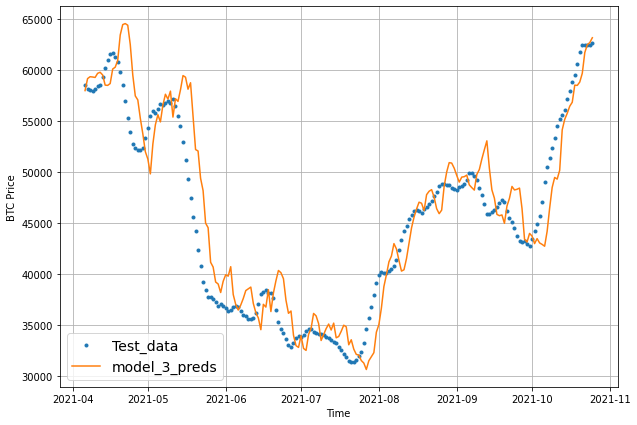
    


# Comparing our models so far


```python
pd.DataFrame({"naive": naive_results["mae"], 
              "horizon_1_window_7": model_1_results["mae"], 
              "horizon_1_window_30": model_2_results["mae"], 
              "horizon_7_window_30": model_3_results["mae"]}, index=["mae"]).plot(figsize=(10, 7), kind="bar");
```


    
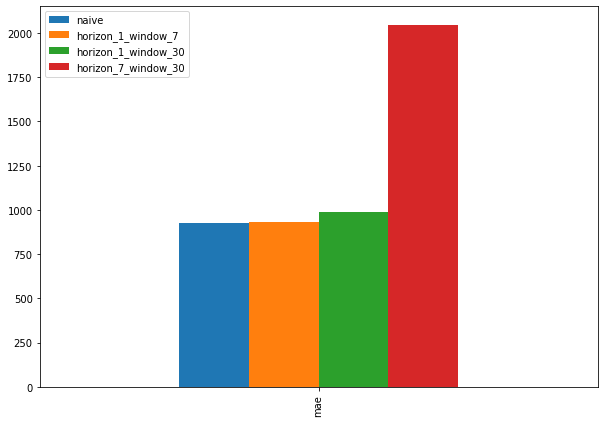
    


So why does naive model do so well?

Because of **autocorrelation** in the data. The value at t+1 is typically pretty close to value at t


https://towardsdatascience.com/how-not-to-use-machine-learning-for-time-series-forecasting-avoiding-the-pitfalls-19f9d7adf424

# Model 4: Conv 1D model <a name="model4"></a>


```python
HORIZON = 1 # predict next day
WINDOW_SIZE = 7 # use previous week worth of data
```


```python
# Create windowed dataset
full_windows, full_labels = make_windows(np.array(prices), window_size=WINDOW_SIZE, horizon=HORIZON)
len(full_windows), len(full_labels)
```


    (2541, 2541)


```python
# Create train/test splits
train_windows, test_windows, train_labels, test_labels = make_train_test_splits(full_windows, full_labels)
len(train_windows), len(test_windows), len(train_labels), len(test_labels)
```


    (2032, 509, 2032, 509)


We need an input shape of `(batch_size, timesteps, input_dim)`


```python
train_windows[0].shape
```


    (7,)


```python
# Before we pass our data to the Conv1D layer we need to reshape it in order to make sure it works
x = tf.constant(train_windows[0])
x
```


    <tf.Tensor: shape=(7,), dtype=float64, numpy=
    array([324.71833, 332.45666, 336.585  , 346.775  , 344.81166, 343.065  ,
           358.50166])>


```python
# Before we pass our data to the Conv1D layer, we have to reshape it in order to make sure it works

expand_dims_layer = layers.Lambda(lambda x: tf.expand_dims(x, axis=1)) # add an extra dimension for timesteps
print(f"Original shape: {x.shape}") # (WINDOW_SIZE)
print(f"Expanded shape: {expand_dims_layer(x).shape}") # (WINDOW_SIZE, input_dim) 
print(f"Original values with expanded shape:\n {expand_dims_layer(x)}")
```

    Original shape: (7,)
    Expanded shape: (7, 1)
    Original values with expanded shape:
     [[324.71832]
     [332.45667]
     [336.585  ]
     [346.775  ]
     [344.81165]
     [343.065  ]
     [358.50165]]


```python
# Create Conv1D
tf.random.set_seed(42)

model_4 = tf.keras.Sequential([
  expand_dims_layer,
  layers.Conv1D(filters=128, kernel_size=5, padding='causal', activation='relu'), # causal makes sure it learns in the correct temporal order
  layers.Dense(HORIZON)
], name='model_4_conv')

model_4.compile(loss='mae',
                metrics=['mae'],
                optimizer=tf.keras.optimizers.Adam())

model_4.fit(train_windows, train_labels,
            epochs=100,
            batch_size=32,
            verbose=0,
            validation_data=(test_windows,test_labels),
            callbacks=[create_model_checkpoint(model_name=model_4.name)])
```

    INFO:tensorflow:Assets written to: model_experiments/model_4_conv/assets
    INFO:tensorflow:Assets written to: model_experiments/model_4_conv/assets
    INFO:tensorflow:Assets written to: model_experiments/model_4_conv/assets
    INFO:tensorflow:Assets written to: model_experiments/model_4_conv/assets
    INFO:tensorflow:Assets written to: model_experiments/model_4_conv/assets
    INFO:tensorflow:Assets written to: model_experiments/model_4_conv/assets
    INFO:tensorflow:Assets written to: model_experiments/model_4_conv/assets
    INFO:tensorflow:Assets written to: model_experiments/model_4_conv/assets
    INFO:tensorflow:Assets written to: model_experiments/model_4_conv/assets
    INFO:tensorflow:Assets written to: model_experiments/model_4_conv/assets
    INFO:tensorflow:Assets written to: model_experiments/model_4_conv/assets
    INFO:tensorflow:Assets written to: model_experiments/model_4_conv/assets
    INFO:tensorflow:Assets written to: model_experiments/model_4_conv/assets
    INFO:tensorflow:Assets written to: model_experiments/model_4_conv/assets
    INFO:tensorflow:Assets written to: model_experiments/model_4_conv/assets
    INFO:tensorflow:Assets written to: model_experiments/model_4_conv/assets
    INFO:tensorflow:Assets written to: model_experiments/model_4_conv/assets
    INFO:tensorflow:Assets written to: model_experiments/model_4_conv/assets
    INFO:tensorflow:Assets written to: model_experiments/model_4_conv/assets
    INFO:tensorflow:Assets written to: model_experiments/model_4_conv/assets
    INFO:tensorflow:Assets written to: model_experiments/model_4_conv/assets
    INFO:tensorflow:Assets written to: model_experiments/model_4_conv/assets
    INFO:tensorflow:Assets written to: model_experiments/model_4_conv/assets
    INFO:tensorflow:Assets written to: model_experiments/model_4_conv/assets
    INFO:tensorflow:Assets written to: model_experiments/model_4_conv/assets
    INFO:tensorflow:Assets written to: model_experiments/model_4_conv/assets


    <keras.callbacks.History at 0x7f9e7a91b250>


## Evaluate


```python
model_4 = tf.keras.models.load_model("model_experiments/model_4_conv/")
model_4.evaluate(test_windows, test_labels)
```

    16/16 [==============================] - 0s 4ms/step - loss: 923.6509 - mae: 923.6509


    [923.6509399414062, 923.6509399414062]


```python
# Get forecast predictions
model_4_preds = make_preds(model_4,
                           input_data=test_windows)
```


```python
test_labels.shape, model_4_preds.shape
```


    ((509, 1), TensorShape([509]))


```python
model_4_results = evaluate_preds(y_true=tf.squeeze(test_labels), y_pred=model_4_preds)
model_4_results
```


    {'mae': 923.6509,
     'mape': 2.604802,
     'mase': 0.99763596,
     'mse': 2076426.5,
     'rmse': 1440.9811}


```python
naive_results
```


    {'mae': 924.30414,
     'mape': 2.6047938,
     'mase': 0.99834156,
     'mse': 2055079.2,
     'rmse': 1433.5548}


# Model 5: LSTM model <a name="model5"></a>


```python
HORIZON = 1 # predict next day
WINDOW_SIZE = 7 # use previous week worth of data
```


```python
# Create windowed dataset
full_windows, full_labels = make_windows(np.array(prices), window_size=WINDOW_SIZE, horizon=HORIZON)
len(full_windows), len(full_labels)
```


    (2541, 2541)


```python
# Create train/test splits
train_windows, test_windows, train_labels, test_labels = make_train_test_splits(full_windows, full_labels)
len(train_windows), len(test_windows), len(train_labels), len(test_labels)
```


    (2032, 509, 2032, 509)


```python
# Create LSTM model
tf.random.set_seed(42)

# Let's build an LSTM model with the Functional API
inputs = layers.Input(shape=(WINDOW_SIZE))
x = layers.Lambda(lambda x: tf.expand_dims(x, axis=1))(inputs) # expand input dimension to be compatible with LSTM
# print(x.shape)
# x = layers.LSTM(128, activation="relu", return_sequences=True)(x) # this layer will error if the inputs are not the right shape
x = layers.LSTM(128, activation="relu")(x) # using the tanh loss function results in a massive error
# print(x.shape)
# Add another optional dense layer (you could add more of these to see if they improve model performance)
# x = layers.Dense(32, activation="relu")(x)
output = layers.Dense(HORIZON)(x)
model_5 = tf.keras.Model(inputs=inputs, outputs=output, name="model_5_lstm")

model_5.compile(loss='mae',
                metrics=['mae'],
                optimizer=tf.keras.optimizers.Adam())

model_5.fit(train_windows, train_labels,
            epochs=100,
            batch_size=128,
            verbose=0,
            validation_data=(test_windows,test_labels),
            callbacks=[create_model_checkpoint(model_name=model_5.name)])
```

    WARNING:tensorflow:Layer lstm will not use cuDNN kernels since it doesn't meet the criteria. It will use a generic GPU kernel as fallback when running on GPU.
    INFO:tensorflow:Assets written to: model_experiments/model_5_lstm/assets


    WARNING:absl:<keras.layers.recurrent.LSTMCell object at 0x7f9e7807d210> has the same name 'LSTMCell' as a built-in Keras object. Consider renaming <class 'keras.layers.recurrent.LSTMCell'> to avoid naming conflicts when loading with `tf.keras.models.load_model`. If renaming is not possible, pass the object in the `custom_objects` parameter of the load function.


    INFO:tensorflow:Assets written to: model_experiments/model_5_lstm/assets


    INFO:tensorflow:Assets written to: model_experiments/model_5_lstm/assets
    WARNING:absl:<keras.layers.recurrent.LSTMCell object at 0x7f9e7807d210> has the same name 'LSTMCell' as a built-in Keras object. Consider renaming <class 'keras.layers.recurrent.LSTMCell'> to avoid naming conflicts when loading with `tf.keras.models.load_model`. If renaming is not possible, pass the object in the `custom_objects` parameter of the load function.


    INFO:tensorflow:Assets written to: model_experiments/model_5_lstm/assets


    INFO:tensorflow:Assets written to: model_experiments/model_5_lstm/assets
    WARNING:absl:<keras.layers.recurrent.LSTMCell object at 0x7f9e7807d210> has the same name 'LSTMCell' as a built-in Keras object. Consider renaming <class 'keras.layers.recurrent.LSTMCell'> to avoid naming conflicts when loading with `tf.keras.models.load_model`. If renaming is not possible, pass the object in the `custom_objects` parameter of the load function.


    INFO:tensorflow:Assets written to: model_experiments/model_5_lstm/assets


    INFO:tensorflow:Assets written to: model_experiments/model_5_lstm/assets
    WARNING:absl:<keras.layers.recurrent.LSTMCell object at 0x7f9e7807d210> has the same name 'LSTMCell' as a built-in Keras object. Consider renaming <class 'keras.layers.recurrent.LSTMCell'> to avoid naming conflicts when loading with `tf.keras.models.load_model`. If renaming is not possible, pass the object in the `custom_objects` parameter of the load function.


    INFO:tensorflow:Assets written to: model_experiments/model_5_lstm/assets


    INFO:tensorflow:Assets written to: model_experiments/model_5_lstm/assets
    WARNING:absl:<keras.layers.recurrent.LSTMCell object at 0x7f9e7807d210> has the same name 'LSTMCell' as a built-in Keras object. Consider renaming <class 'keras.layers.recurrent.LSTMCell'> to avoid naming conflicts when loading with `tf.keras.models.load_model`. If renaming is not possible, pass the object in the `custom_objects` parameter of the load function.


    INFO:tensorflow:Assets written to: model_experiments/model_5_lstm/assets


    INFO:tensorflow:Assets written to: model_experiments/model_5_lstm/assets
    WARNING:absl:<keras.layers.recurrent.LSTMCell object at 0x7f9e7807d210> has the same name 'LSTMCell' as a built-in Keras object. Consider renaming <class 'keras.layers.recurrent.LSTMCell'> to avoid naming conflicts when loading with `tf.keras.models.load_model`. If renaming is not possible, pass the object in the `custom_objects` parameter of the load function.


    INFO:tensorflow:Assets written to: model_experiments/model_5_lstm/assets


    INFO:tensorflow:Assets written to: model_experiments/model_5_lstm/assets
    WARNING:absl:<keras.layers.recurrent.LSTMCell object at 0x7f9e7807d210> has the same name 'LSTMCell' as a built-in Keras object. Consider renaming <class 'keras.layers.recurrent.LSTMCell'> to avoid naming conflicts when loading with `tf.keras.models.load_model`. If renaming is not possible, pass the object in the `custom_objects` parameter of the load function.


    INFO:tensorflow:Assets written to: model_experiments/model_5_lstm/assets


    INFO:tensorflow:Assets written to: model_experiments/model_5_lstm/assets
    WARNING:absl:<keras.layers.recurrent.LSTMCell object at 0x7f9e7807d210> has the same name 'LSTMCell' as a built-in Keras object. Consider renaming <class 'keras.layers.recurrent.LSTMCell'> to avoid naming conflicts when loading with `tf.keras.models.load_model`. If renaming is not possible, pass the object in the `custom_objects` parameter of the load function.


    INFO:tensorflow:Assets written to: model_experiments/model_5_lstm/assets


    INFO:tensorflow:Assets written to: model_experiments/model_5_lstm/assets
    WARNING:absl:<keras.layers.recurrent.LSTMCell object at 0x7f9e7807d210> has the same name 'LSTMCell' as a built-in Keras object. Consider renaming <class 'keras.layers.recurrent.LSTMCell'> to avoid naming conflicts when loading with `tf.keras.models.load_model`. If renaming is not possible, pass the object in the `custom_objects` parameter of the load function.


    INFO:tensorflow:Assets written to: model_experiments/model_5_lstm/assets


    INFO:tensorflow:Assets written to: model_experiments/model_5_lstm/assets
    WARNING:absl:<keras.layers.recurrent.LSTMCell object at 0x7f9e7807d210> has the same name 'LSTMCell' as a built-in Keras object. Consider renaming <class 'keras.layers.recurrent.LSTMCell'> to avoid naming conflicts when loading with `tf.keras.models.load_model`. If renaming is not possible, pass the object in the `custom_objects` parameter of the load function.


    INFO:tensorflow:Assets written to: model_experiments/model_5_lstm/assets


    INFO:tensorflow:Assets written to: model_experiments/model_5_lstm/assets
    WARNING:absl:<keras.layers.recurrent.LSTMCell object at 0x7f9e7807d210> has the same name 'LSTMCell' as a built-in Keras object. Consider renaming <class 'keras.layers.recurrent.LSTMCell'> to avoid naming conflicts when loading with `tf.keras.models.load_model`. If renaming is not possible, pass the object in the `custom_objects` parameter of the load function.


    INFO:tensorflow:Assets written to: model_experiments/model_5_lstm/assets


    INFO:tensorflow:Assets written to: model_experiments/model_5_lstm/assets
    WARNING:absl:<keras.layers.recurrent.LSTMCell object at 0x7f9e7807d210> has the same name 'LSTMCell' as a built-in Keras object. Consider renaming <class 'keras.layers.recurrent.LSTMCell'> to avoid naming conflicts when loading with `tf.keras.models.load_model`. If renaming is not possible, pass the object in the `custom_objects` parameter of the load function.


    INFO:tensorflow:Assets written to: model_experiments/model_5_lstm/assets


    INFO:tensorflow:Assets written to: model_experiments/model_5_lstm/assets
    WARNING:absl:<keras.layers.recurrent.LSTMCell object at 0x7f9e7807d210> has the same name 'LSTMCell' as a built-in Keras object. Consider renaming <class 'keras.layers.recurrent.LSTMCell'> to avoid naming conflicts when loading with `tf.keras.models.load_model`. If renaming is not possible, pass the object in the `custom_objects` parameter of the load function.


    INFO:tensorflow:Assets written to: model_experiments/model_5_lstm/assets


    INFO:tensorflow:Assets written to: model_experiments/model_5_lstm/assets
    WARNING:absl:<keras.layers.recurrent.LSTMCell object at 0x7f9e7807d210> has the same name 'LSTMCell' as a built-in Keras object. Consider renaming <class 'keras.layers.recurrent.LSTMCell'> to avoid naming conflicts when loading with `tf.keras.models.load_model`. If renaming is not possible, pass the object in the `custom_objects` parameter of the load function.


    INFO:tensorflow:Assets written to: model_experiments/model_5_lstm/assets


    INFO:tensorflow:Assets written to: model_experiments/model_5_lstm/assets
    WARNING:absl:<keras.layers.recurrent.LSTMCell object at 0x7f9e7807d210> has the same name 'LSTMCell' as a built-in Keras object. Consider renaming <class 'keras.layers.recurrent.LSTMCell'> to avoid naming conflicts when loading with `tf.keras.models.load_model`. If renaming is not possible, pass the object in the `custom_objects` parameter of the load function.


    INFO:tensorflow:Assets written to: model_experiments/model_5_lstm/assets


    INFO:tensorflow:Assets written to: model_experiments/model_5_lstm/assets
    WARNING:absl:<keras.layers.recurrent.LSTMCell object at 0x7f9e7807d210> has the same name 'LSTMCell' as a built-in Keras object. Consider renaming <class 'keras.layers.recurrent.LSTMCell'> to avoid naming conflicts when loading with `tf.keras.models.load_model`. If renaming is not possible, pass the object in the `custom_objects` parameter of the load function.


    INFO:tensorflow:Assets written to: model_experiments/model_5_lstm/assets


    INFO:tensorflow:Assets written to: model_experiments/model_5_lstm/assets
    WARNING:absl:<keras.layers.recurrent.LSTMCell object at 0x7f9e7807d210> has the same name 'LSTMCell' as a built-in Keras object. Consider renaming <class 'keras.layers.recurrent.LSTMCell'> to avoid naming conflicts when loading with `tf.keras.models.load_model`. If renaming is not possible, pass the object in the `custom_objects` parameter of the load function.


    INFO:tensorflow:Assets written to: model_experiments/model_5_lstm/assets


    INFO:tensorflow:Assets written to: model_experiments/model_5_lstm/assets
    WARNING:absl:<keras.layers.recurrent.LSTMCell object at 0x7f9e7807d210> has the same name 'LSTMCell' as a built-in Keras object. Consider renaming <class 'keras.layers.recurrent.LSTMCell'> to avoid naming conflicts when loading with `tf.keras.models.load_model`. If renaming is not possible, pass the object in the `custom_objects` parameter of the load function.


    INFO:tensorflow:Assets written to: model_experiments/model_5_lstm/assets


    INFO:tensorflow:Assets written to: model_experiments/model_5_lstm/assets
    WARNING:absl:<keras.layers.recurrent.LSTMCell object at 0x7f9e7807d210> has the same name 'LSTMCell' as a built-in Keras object. Consider renaming <class 'keras.layers.recurrent.LSTMCell'> to avoid naming conflicts when loading with `tf.keras.models.load_model`. If renaming is not possible, pass the object in the `custom_objects` parameter of the load function.


    INFO:tensorflow:Assets written to: model_experiments/model_5_lstm/assets


    INFO:tensorflow:Assets written to: model_experiments/model_5_lstm/assets
    WARNING:absl:<keras.layers.recurrent.LSTMCell object at 0x7f9e7807d210> has the same name 'LSTMCell' as a built-in Keras object. Consider renaming <class 'keras.layers.recurrent.LSTMCell'> to avoid naming conflicts when loading with `tf.keras.models.load_model`. If renaming is not possible, pass the object in the `custom_objects` parameter of the load function.


    INFO:tensorflow:Assets written to: model_experiments/model_5_lstm/assets


    INFO:tensorflow:Assets written to: model_experiments/model_5_lstm/assets
    WARNING:absl:<keras.layers.recurrent.LSTMCell object at 0x7f9e7807d210> has the same name 'LSTMCell' as a built-in Keras object. Consider renaming <class 'keras.layers.recurrent.LSTMCell'> to avoid naming conflicts when loading with `tf.keras.models.load_model`. If renaming is not possible, pass the object in the `custom_objects` parameter of the load function.


    INFO:tensorflow:Assets written to: model_experiments/model_5_lstm/assets


    INFO:tensorflow:Assets written to: model_experiments/model_5_lstm/assets
    WARNING:absl:<keras.layers.recurrent.LSTMCell object at 0x7f9e7807d210> has the same name 'LSTMCell' as a built-in Keras object. Consider renaming <class 'keras.layers.recurrent.LSTMCell'> to avoid naming conflicts when loading with `tf.keras.models.load_model`. If renaming is not possible, pass the object in the `custom_objects` parameter of the load function.


    INFO:tensorflow:Assets written to: model_experiments/model_5_lstm/assets


    INFO:tensorflow:Assets written to: model_experiments/model_5_lstm/assets
    WARNING:absl:<keras.layers.recurrent.LSTMCell object at 0x7f9e7807d210> has the same name 'LSTMCell' as a built-in Keras object. Consider renaming <class 'keras.layers.recurrent.LSTMCell'> to avoid naming conflicts when loading with `tf.keras.models.load_model`. If renaming is not possible, pass the object in the `custom_objects` parameter of the load function.


    INFO:tensorflow:Assets written to: model_experiments/model_5_lstm/assets


    INFO:tensorflow:Assets written to: model_experiments/model_5_lstm/assets
    WARNING:absl:<keras.layers.recurrent.LSTMCell object at 0x7f9e7807d210> has the same name 'LSTMCell' as a built-in Keras object. Consider renaming <class 'keras.layers.recurrent.LSTMCell'> to avoid naming conflicts when loading with `tf.keras.models.load_model`. If renaming is not possible, pass the object in the `custom_objects` parameter of the load function.


    INFO:tensorflow:Assets written to: model_experiments/model_5_lstm/assets


    INFO:tensorflow:Assets written to: model_experiments/model_5_lstm/assets
    WARNING:absl:<keras.layers.recurrent.LSTMCell object at 0x7f9e7807d210> has the same name 'LSTMCell' as a built-in Keras object. Consider renaming <class 'keras.layers.recurrent.LSTMCell'> to avoid naming conflicts when loading with `tf.keras.models.load_model`. If renaming is not possible, pass the object in the `custom_objects` parameter of the load function.


    INFO:tensorflow:Assets written to: model_experiments/model_5_lstm/assets


    INFO:tensorflow:Assets written to: model_experiments/model_5_lstm/assets
    WARNING:absl:<keras.layers.recurrent.LSTMCell object at 0x7f9e7807d210> has the same name 'LSTMCell' as a built-in Keras object. Consider renaming <class 'keras.layers.recurrent.LSTMCell'> to avoid naming conflicts when loading with `tf.keras.models.load_model`. If renaming is not possible, pass the object in the `custom_objects` parameter of the load function.


    INFO:tensorflow:Assets written to: model_experiments/model_5_lstm/assets


    INFO:tensorflow:Assets written to: model_experiments/model_5_lstm/assets
    WARNING:absl:<keras.layers.recurrent.LSTMCell object at 0x7f9e7807d210> has the same name 'LSTMCell' as a built-in Keras object. Consider renaming <class 'keras.layers.recurrent.LSTMCell'> to avoid naming conflicts when loading with `tf.keras.models.load_model`. If renaming is not possible, pass the object in the `custom_objects` parameter of the load function.


    INFO:tensorflow:Assets written to: model_experiments/model_5_lstm/assets


    INFO:tensorflow:Assets written to: model_experiments/model_5_lstm/assets
    WARNING:absl:<keras.layers.recurrent.LSTMCell object at 0x7f9e7807d210> has the same name 'LSTMCell' as a built-in Keras object. Consider renaming <class 'keras.layers.recurrent.LSTMCell'> to avoid naming conflicts when loading with `tf.keras.models.load_model`. If renaming is not possible, pass the object in the `custom_objects` parameter of the load function.


    INFO:tensorflow:Assets written to: model_experiments/model_5_lstm/assets


    INFO:tensorflow:Assets written to: model_experiments/model_5_lstm/assets
    WARNING:absl:<keras.layers.recurrent.LSTMCell object at 0x7f9e7807d210> has the same name 'LSTMCell' as a built-in Keras object. Consider renaming <class 'keras.layers.recurrent.LSTMCell'> to avoid naming conflicts when loading with `tf.keras.models.load_model`. If renaming is not possible, pass the object in the `custom_objects` parameter of the load function.


    INFO:tensorflow:Assets written to: model_experiments/model_5_lstm/assets


    INFO:tensorflow:Assets written to: model_experiments/model_5_lstm/assets
    WARNING:absl:<keras.layers.recurrent.LSTMCell object at 0x7f9e7807d210> has the same name 'LSTMCell' as a built-in Keras object. Consider renaming <class 'keras.layers.recurrent.LSTMCell'> to avoid naming conflicts when loading with `tf.keras.models.load_model`. If renaming is not possible, pass the object in the `custom_objects` parameter of the load function.


    INFO:tensorflow:Assets written to: model_experiments/model_5_lstm/assets


    INFO:tensorflow:Assets written to: model_experiments/model_5_lstm/assets
    WARNING:absl:<keras.layers.recurrent.LSTMCell object at 0x7f9e7807d210> has the same name 'LSTMCell' as a built-in Keras object. Consider renaming <class 'keras.layers.recurrent.LSTMCell'> to avoid naming conflicts when loading with `tf.keras.models.load_model`. If renaming is not possible, pass the object in the `custom_objects` parameter of the load function.


    INFO:tensorflow:Assets written to: model_experiments/model_5_lstm/assets


    INFO:tensorflow:Assets written to: model_experiments/model_5_lstm/assets
    WARNING:absl:<keras.layers.recurrent.LSTMCell object at 0x7f9e7807d210> has the same name 'LSTMCell' as a built-in Keras object. Consider renaming <class 'keras.layers.recurrent.LSTMCell'> to avoid naming conflicts when loading with `tf.keras.models.load_model`. If renaming is not possible, pass the object in the `custom_objects` parameter of the load function.


    INFO:tensorflow:Assets written to: model_experiments/model_5_lstm/assets


    INFO:tensorflow:Assets written to: model_experiments/model_5_lstm/assets
    WARNING:absl:<keras.layers.recurrent.LSTMCell object at 0x7f9e7807d210> has the same name 'LSTMCell' as a built-in Keras object. Consider renaming <class 'keras.layers.recurrent.LSTMCell'> to avoid naming conflicts when loading with `tf.keras.models.load_model`. If renaming is not possible, pass the object in the `custom_objects` parameter of the load function.


    INFO:tensorflow:Assets written to: model_experiments/model_5_lstm/assets


    INFO:tensorflow:Assets written to: model_experiments/model_5_lstm/assets
    WARNING:absl:<keras.layers.recurrent.LSTMCell object at 0x7f9e7807d210> has the same name 'LSTMCell' as a built-in Keras object. Consider renaming <class 'keras.layers.recurrent.LSTMCell'> to avoid naming conflicts when loading with `tf.keras.models.load_model`. If renaming is not possible, pass the object in the `custom_objects` parameter of the load function.


    INFO:tensorflow:Assets written to: model_experiments/model_5_lstm/assets


    INFO:tensorflow:Assets written to: model_experiments/model_5_lstm/assets
    WARNING:absl:<keras.layers.recurrent.LSTMCell object at 0x7f9e7807d210> has the same name 'LSTMCell' as a built-in Keras object. Consider renaming <class 'keras.layers.recurrent.LSTMCell'> to avoid naming conflicts when loading with `tf.keras.models.load_model`. If renaming is not possible, pass the object in the `custom_objects` parameter of the load function.


    INFO:tensorflow:Assets written to: model_experiments/model_5_lstm/assets


    INFO:tensorflow:Assets written to: model_experiments/model_5_lstm/assets
    WARNING:absl:<keras.layers.recurrent.LSTMCell object at 0x7f9e7807d210> has the same name 'LSTMCell' as a built-in Keras object. Consider renaming <class 'keras.layers.recurrent.LSTMCell'> to avoid naming conflicts when loading with `tf.keras.models.load_model`. If renaming is not possible, pass the object in the `custom_objects` parameter of the load function.


    INFO:tensorflow:Assets written to: model_experiments/model_5_lstm/assets


    INFO:tensorflow:Assets written to: model_experiments/model_5_lstm/assets
    WARNING:absl:<keras.layers.recurrent.LSTMCell object at 0x7f9e7807d210> has the same name 'LSTMCell' as a built-in Keras object. Consider renaming <class 'keras.layers.recurrent.LSTMCell'> to avoid naming conflicts when loading with `tf.keras.models.load_model`. If renaming is not possible, pass the object in the `custom_objects` parameter of the load function.


    INFO:tensorflow:Assets written to: model_experiments/model_5_lstm/assets


    INFO:tensorflow:Assets written to: model_experiments/model_5_lstm/assets
    WARNING:absl:<keras.layers.recurrent.LSTMCell object at 0x7f9e7807d210> has the same name 'LSTMCell' as a built-in Keras object. Consider renaming <class 'keras.layers.recurrent.LSTMCell'> to avoid naming conflicts when loading with `tf.keras.models.load_model`. If renaming is not possible, pass the object in the `custom_objects` parameter of the load function.


    INFO:tensorflow:Assets written to: model_experiments/model_5_lstm/assets


    INFO:tensorflow:Assets written to: model_experiments/model_5_lstm/assets
    WARNING:absl:<keras.layers.recurrent.LSTMCell object at 0x7f9e7807d210> has the same name 'LSTMCell' as a built-in Keras object. Consider renaming <class 'keras.layers.recurrent.LSTMCell'> to avoid naming conflicts when loading with `tf.keras.models.load_model`. If renaming is not possible, pass the object in the `custom_objects` parameter of the load function.


    INFO:tensorflow:Assets written to: model_experiments/model_5_lstm/assets


    INFO:tensorflow:Assets written to: model_experiments/model_5_lstm/assets
    WARNING:absl:<keras.layers.recurrent.LSTMCell object at 0x7f9e7807d210> has the same name 'LSTMCell' as a built-in Keras object. Consider renaming <class 'keras.layers.recurrent.LSTMCell'> to avoid naming conflicts when loading with `tf.keras.models.load_model`. If renaming is not possible, pass the object in the `custom_objects` parameter of the load function.


    INFO:tensorflow:Assets written to: model_experiments/model_5_lstm/assets


    INFO:tensorflow:Assets written to: model_experiments/model_5_lstm/assets
    WARNING:absl:<keras.layers.recurrent.LSTMCell object at 0x7f9e7807d210> has the same name 'LSTMCell' as a built-in Keras object. Consider renaming <class 'keras.layers.recurrent.LSTMCell'> to avoid naming conflicts when loading with `tf.keras.models.load_model`. If renaming is not possible, pass the object in the `custom_objects` parameter of the load function.


    INFO:tensorflow:Assets written to: model_experiments/model_5_lstm/assets


    INFO:tensorflow:Assets written to: model_experiments/model_5_lstm/assets
    WARNING:absl:<keras.layers.recurrent.LSTMCell object at 0x7f9e7807d210> has the same name 'LSTMCell' as a built-in Keras object. Consider renaming <class 'keras.layers.recurrent.LSTMCell'> to avoid naming conflicts when loading with `tf.keras.models.load_model`. If renaming is not possible, pass the object in the `custom_objects` parameter of the load function.


    INFO:tensorflow:Assets written to: model_experiments/model_5_lstm/assets


    INFO:tensorflow:Assets written to: model_experiments/model_5_lstm/assets
    WARNING:absl:<keras.layers.recurrent.LSTMCell object at 0x7f9e7807d210> has the same name 'LSTMCell' as a built-in Keras object. Consider renaming <class 'keras.layers.recurrent.LSTMCell'> to avoid naming conflicts when loading with `tf.keras.models.load_model`. If renaming is not possible, pass the object in the `custom_objects` parameter of the load function.


    INFO:tensorflow:Assets written to: model_experiments/model_5_lstm/assets


    INFO:tensorflow:Assets written to: model_experiments/model_5_lstm/assets
    WARNING:absl:<keras.layers.recurrent.LSTMCell object at 0x7f9e7807d210> has the same name 'LSTMCell' as a built-in Keras object. Consider renaming <class 'keras.layers.recurrent.LSTMCell'> to avoid naming conflicts when loading with `tf.keras.models.load_model`. If renaming is not possible, pass the object in the `custom_objects` parameter of the load function.


    INFO:tensorflow:Assets written to: model_experiments/model_5_lstm/assets


    INFO:tensorflow:Assets written to: model_experiments/model_5_lstm/assets
    WARNING:absl:<keras.layers.recurrent.LSTMCell object at 0x7f9e7807d210> has the same name 'LSTMCell' as a built-in Keras object. Consider renaming <class 'keras.layers.recurrent.LSTMCell'> to avoid naming conflicts when loading with `tf.keras.models.load_model`. If renaming is not possible, pass the object in the `custom_objects` parameter of the load function.


    INFO:tensorflow:Assets written to: model_experiments/model_5_lstm/assets


    INFO:tensorflow:Assets written to: model_experiments/model_5_lstm/assets
    WARNING:absl:<keras.layers.recurrent.LSTMCell object at 0x7f9e7807d210> has the same name 'LSTMCell' as a built-in Keras object. Consider renaming <class 'keras.layers.recurrent.LSTMCell'> to avoid naming conflicts when loading with `tf.keras.models.load_model`. If renaming is not possible, pass the object in the `custom_objects` parameter of the load function.


    INFO:tensorflow:Assets written to: model_experiments/model_5_lstm/assets


    INFO:tensorflow:Assets written to: model_experiments/model_5_lstm/assets
    WARNING:absl:<keras.layers.recurrent.LSTMCell object at 0x7f9e7807d210> has the same name 'LSTMCell' as a built-in Keras object. Consider renaming <class 'keras.layers.recurrent.LSTMCell'> to avoid naming conflicts when loading with `tf.keras.models.load_model`. If renaming is not possible, pass the object in the `custom_objects` parameter of the load function.


    INFO:tensorflow:Assets written to: model_experiments/model_5_lstm/assets


    INFO:tensorflow:Assets written to: model_experiments/model_5_lstm/assets
    WARNING:absl:<keras.layers.recurrent.LSTMCell object at 0x7f9e7807d210> has the same name 'LSTMCell' as a built-in Keras object. Consider renaming <class 'keras.layers.recurrent.LSTMCell'> to avoid naming conflicts when loading with `tf.keras.models.load_model`. If renaming is not possible, pass the object in the `custom_objects` parameter of the load function.


    INFO:tensorflow:Assets written to: model_experiments/model_5_lstm/assets


    INFO:tensorflow:Assets written to: model_experiments/model_5_lstm/assets
    WARNING:absl:<keras.layers.recurrent.LSTMCell object at 0x7f9e7807d210> has the same name 'LSTMCell' as a built-in Keras object. Consider renaming <class 'keras.layers.recurrent.LSTMCell'> to avoid naming conflicts when loading with `tf.keras.models.load_model`. If renaming is not possible, pass the object in the `custom_objects` parameter of the load function.


    INFO:tensorflow:Assets written to: model_experiments/model_5_lstm/assets


    INFO:tensorflow:Assets written to: model_experiments/model_5_lstm/assets
    WARNING:absl:<keras.layers.recurrent.LSTMCell object at 0x7f9e7807d210> has the same name 'LSTMCell' as a built-in Keras object. Consider renaming <class 'keras.layers.recurrent.LSTMCell'> to avoid naming conflicts when loading with `tf.keras.models.load_model`. If renaming is not possible, pass the object in the `custom_objects` parameter of the load function.


    INFO:tensorflow:Assets written to: model_experiments/model_5_lstm/assets


    INFO:tensorflow:Assets written to: model_experiments/model_5_lstm/assets
    WARNING:absl:<keras.layers.recurrent.LSTMCell object at 0x7f9e7807d210> has the same name 'LSTMCell' as a built-in Keras object. Consider renaming <class 'keras.layers.recurrent.LSTMCell'> to avoid naming conflicts when loading with `tf.keras.models.load_model`. If renaming is not possible, pass the object in the `custom_objects` parameter of the load function.


    INFO:tensorflow:Assets written to: model_experiments/model_5_lstm/assets


    INFO:tensorflow:Assets written to: model_experiments/model_5_lstm/assets
    WARNING:absl:<keras.layers.recurrent.LSTMCell object at 0x7f9e7807d210> has the same name 'LSTMCell' as a built-in Keras object. Consider renaming <class 'keras.layers.recurrent.LSTMCell'> to avoid naming conflicts when loading with `tf.keras.models.load_model`. If renaming is not possible, pass the object in the `custom_objects` parameter of the load function.


    INFO:tensorflow:Assets written to: model_experiments/model_5_lstm/assets


    INFO:tensorflow:Assets written to: model_experiments/model_5_lstm/assets
    WARNING:absl:<keras.layers.recurrent.LSTMCell object at 0x7f9e7807d210> has the same name 'LSTMCell' as a built-in Keras object. Consider renaming <class 'keras.layers.recurrent.LSTMCell'> to avoid naming conflicts when loading with `tf.keras.models.load_model`. If renaming is not possible, pass the object in the `custom_objects` parameter of the load function.


    <keras.callbacks.History at 0x7f9e77d83950>


## Evaluate


```python
model_5 = tf.keras.models.load_model("model_experiments/model_5_lstm/")
model_5.evaluate(test_windows, test_labels)
```

    WARNING:tensorflow:Layer lstm will not use cuDNN kernels since it doesn't meet the criteria. It will use a generic GPU kernel as fallback when running on GPU.


    WARNING:tensorflow:Layer lstm will not use cuDNN kernels since it doesn't meet the criteria. It will use a generic GPU kernel as fallback when running on GPU.


    16/16 [==============================] - 0s 4ms/step - loss: 998.5007 - mae: 998.5007


    [998.500732421875, 998.500732421875]


```python
# Get forecast predictions
model_5_preds = make_preds(model_5,
                           input_data=test_windows)
```


```python
test_labels.shape, model_5_preds.shape
```


    ((509, 1), TensorShape([509]))


```python
model_5_results = evaluate_preds(y_true=tf.squeeze(test_labels), y_pred=model_5_preds)
model_5_results
```


    {'mae': 998.50073,
     'mape': 2.8254218,
     'mase': 1.0784813,
     'mse': 2332680.2,
     'rmse': 1527.3114}


# Model 6: Multivariate model <a name="model6"></a>

I would love to add Elon Musk tweeting as an additional variable but I think that would be better for dodgecoin

Maybe could add number of tweets about bitcoin 

However, bitcoin halving seems like a strong variable to test


Sidenote: here's how to do regression with multivariate time series data: https://www.analyticsvidhya.com/blog/2018/09/multivariate-time-series-guide-forecasting-modeling-python-codes/


```python
# Block reward values
block_reward_1 = 50 # 3 January 2009 (2009-01-03) - this block reward isn't in our dataset (it starts from 01 October 2013)
block_reward_2 = 25 # 28 November 2012 
block_reward_3 = 12.5 # 9 July 2016
block_reward_4 = 6.25 # 11 May 2020

# Block reward dates (datetime form of the above date stamps)
block_reward_2_datetime = np.datetime64("2012-11-28")
block_reward_3_datetime = np.datetime64("2016-07-09")
block_reward_4_datetime = np.datetime64("2020-05-11")
```


```python
bitcoin_prices.head()
```


<div>
<style scoped>
    .dataframe tbody tr th:only-of-type {
        vertical-align: middle;
    }

    .dataframe tbody tr th {
        vertical-align: top;
    }

    .dataframe thead th {
        text-align: right;
    }
</style>
<table border="1" class="dataframe">
  <thead>
    <tr style="text-align: right;">
      <th></th>
      <th>Price</th>
    </tr>
    <tr>
      <th>Date</th>
      <th></th>
    </tr>
  </thead>
  <tbody>
    <tr>
      <th>2014-11-04</th>
      <td>324.71833</td>
    </tr>
    <tr>
      <th>2014-11-05</th>
      <td>332.45666</td>
    </tr>
    <tr>
      <th>2014-11-06</th>
      <td>336.58500</td>
    </tr>
    <tr>
      <th>2014-11-07</th>
      <td>346.77500</td>
    </tr>
    <tr>
      <th>2014-11-08</th>
      <td>344.81166</td>
    </tr>
  </tbody>
</table>
</div>


```python
# Get date indexes for when to add in different block dates
block_reward_2_days = (block_reward_3_datetime - bitcoin_prices.index[0]).days
block_reward_3_days = (block_reward_4_datetime - bitcoin_prices.index[0]).days
block_reward_2_days, block_reward_3_days
```


    (613, 2015)


```python
# Add block_reward column
bitcoin_prices_block = bitcoin_prices.copy()
bitcoin_prices_block["block_reward"] = None

# Set values of block_reward column (it's the last column hence -1 indexing on iloc)
bitcoin_prices_block.iloc[:block_reward_2_days, -1] = block_reward_2
bitcoin_prices_block.iloc[block_reward_2_days:block_reward_3_days, -1] = block_reward_3
bitcoin_prices_block.iloc[block_reward_3_days:, -1] = block_reward_4
bitcoin_prices_block.head()
```


<div>
<style scoped>
    .dataframe tbody tr th:only-of-type {
        vertical-align: middle;
    }

    .dataframe tbody tr th {
        vertical-align: top;
    }

    .dataframe thead th {
        text-align: right;
    }
</style>
<table border="1" class="dataframe">
  <thead>
    <tr style="text-align: right;">
      <th></th>
      <th>Price</th>
      <th>block_reward</th>
    </tr>
    <tr>
      <th>Date</th>
      <th></th>
      <th></th>
    </tr>
  </thead>
  <tbody>
    <tr>
      <th>2014-11-04</th>
      <td>324.71833</td>
      <td>25</td>
    </tr>
    <tr>
      <th>2014-11-05</th>
      <td>332.45666</td>
      <td>25</td>
    </tr>
    <tr>
      <th>2014-11-06</th>
      <td>336.58500</td>
      <td>25</td>
    </tr>
    <tr>
      <th>2014-11-07</th>
      <td>346.77500</td>
      <td>25</td>
    </tr>
    <tr>
      <th>2014-11-08</th>
      <td>344.81166</td>
      <td>25</td>
    </tr>
  </tbody>
</table>
</div>


```python
# Plot the block reward/price over time
# Note: Because of the different scales of our values we'll scale them to be between 0 and 1.
from sklearn.preprocessing import minmax_scale
scaled_price_block_df = pd.DataFrame(minmax_scale(bitcoin_prices_block[["Price", "block_reward"]]), # we need to scale the data first
                                     columns=bitcoin_prices_block.columns,
                                     index=bitcoin_prices_block.index)
scaled_price_block_df.plot(figsize=(10, 7));
```


    
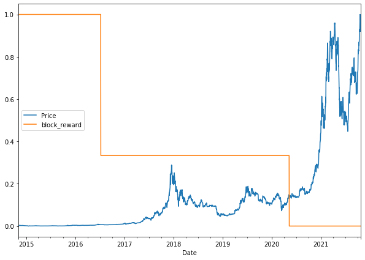
    


### Preparing data for multivariate model

Our current functions won't work because we have two variables

Let's use `pandas.DataFrame.shift()`


```python
# Setup dataset hyperparameters
HORIZON = 1
WINDOW_SIZE = 7
```


```python
# Make a copy of the Bitcoin historical data with block reward feature
bitcoin_prices_windowed = bitcoin_prices_block.copy()

# Add windowed columns
for i in range(WINDOW_SIZE): # Shift values for each step in WINDOW_SIZE
  bitcoin_prices_windowed[f"Price+{i+1}"] = bitcoin_prices_windowed["Price"].shift(periods=i+1)
bitcoin_prices_windowed.head(10)
```


<div>
<style scoped>
    .dataframe tbody tr th:only-of-type {
        vertical-align: middle;
    }

    .dataframe tbody tr th {
        vertical-align: top;
    }

    .dataframe thead th {
        text-align: right;
    }
</style>
<table border="1" class="dataframe">
  <thead>
    <tr style="text-align: right;">
      <th></th>
      <th>Price</th>
      <th>block_reward</th>
      <th>Price+1</th>
      <th>Price+2</th>
      <th>Price+3</th>
      <th>Price+4</th>
      <th>Price+5</th>
      <th>Price+6</th>
      <th>Price+7</th>
    </tr>
    <tr>
      <th>Date</th>
      <th></th>
      <th></th>
      <th></th>
      <th></th>
      <th></th>
      <th></th>
      <th></th>
      <th></th>
      <th></th>
    </tr>
  </thead>
  <tbody>
    <tr>
      <th>2014-11-04</th>
      <td>324.71833</td>
      <td>25</td>
      <td>NaN</td>
      <td>NaN</td>
      <td>NaN</td>
      <td>NaN</td>
      <td>NaN</td>
      <td>NaN</td>
      <td>NaN</td>
    </tr>
    <tr>
      <th>2014-11-05</th>
      <td>332.45666</td>
      <td>25</td>
      <td>324.71833</td>
      <td>NaN</td>
      <td>NaN</td>
      <td>NaN</td>
      <td>NaN</td>
      <td>NaN</td>
      <td>NaN</td>
    </tr>
    <tr>
      <th>2014-11-06</th>
      <td>336.58500</td>
      <td>25</td>
      <td>332.45666</td>
      <td>324.71833</td>
      <td>NaN</td>
      <td>NaN</td>
      <td>NaN</td>
      <td>NaN</td>
      <td>NaN</td>
    </tr>
    <tr>
      <th>2014-11-07</th>
      <td>346.77500</td>
      <td>25</td>
      <td>336.58500</td>
      <td>332.45666</td>
      <td>324.71833</td>
      <td>NaN</td>
      <td>NaN</td>
      <td>NaN</td>
      <td>NaN</td>
    </tr>
    <tr>
      <th>2014-11-08</th>
      <td>344.81166</td>
      <td>25</td>
      <td>346.77500</td>
      <td>336.58500</td>
      <td>332.45666</td>
      <td>324.71833</td>
      <td>NaN</td>
      <td>NaN</td>
      <td>NaN</td>
    </tr>
    <tr>
      <th>2014-11-09</th>
      <td>343.06500</td>
      <td>25</td>
      <td>344.81166</td>
      <td>346.77500</td>
      <td>336.58500</td>
      <td>332.45666</td>
      <td>324.71833</td>
      <td>NaN</td>
      <td>NaN</td>
    </tr>
    <tr>
      <th>2014-11-10</th>
      <td>358.50166</td>
      <td>25</td>
      <td>343.06500</td>
      <td>344.81166</td>
      <td>346.77500</td>
      <td>336.58500</td>
      <td>332.45666</td>
      <td>324.71833</td>
      <td>NaN</td>
    </tr>
    <tr>
      <th>2014-11-11</th>
      <td>368.07666</td>
      <td>25</td>
      <td>358.50166</td>
      <td>343.06500</td>
      <td>344.81166</td>
      <td>346.77500</td>
      <td>336.58500</td>
      <td>332.45666</td>
      <td>324.71833</td>
    </tr>
    <tr>
      <th>2014-11-12</th>
      <td>376.99666</td>
      <td>25</td>
      <td>368.07666</td>
      <td>358.50166</td>
      <td>343.06500</td>
      <td>344.81166</td>
      <td>346.77500</td>
      <td>336.58500</td>
      <td>332.45666</td>
    </tr>
    <tr>
      <th>2014-11-13</th>
      <td>442.10666</td>
      <td>25</td>
      <td>376.99666</td>
      <td>368.07666</td>
      <td>358.50166</td>
      <td>343.06500</td>
      <td>344.81166</td>
      <td>346.77500</td>
      <td>336.58500</td>
    </tr>
  </tbody>
</table>
</div>


Yay now we can have data like this:

```
[0, 1, 2, 3, 4, 5, 6, block_reward] -> [7]
[1 ,2 ,3, 4, 5, 6, 7, block_reward] -> [8]
```


```python
# Create X (windows) and y(horizons) features
X = bitcoin_prices_windowed.dropna().drop("Price", axis=1).astype(np.float32)
y = bitcoin_prices_windowed.dropna()["Price"].astype(np.float32)
X.head()
```


<div>
<style scoped>
    .dataframe tbody tr th:only-of-type {
        vertical-align: middle;
    }

    .dataframe tbody tr th {
        vertical-align: top;
    }

    .dataframe thead th {
        text-align: right;
    }
</style>
<table border="1" class="dataframe">
  <thead>
    <tr style="text-align: right;">
      <th></th>
      <th>block_reward</th>
      <th>Price+1</th>
      <th>Price+2</th>
      <th>Price+3</th>
      <th>Price+4</th>
      <th>Price+5</th>
      <th>Price+6</th>
      <th>Price+7</th>
    </tr>
    <tr>
      <th>Date</th>
      <th></th>
      <th></th>
      <th></th>
      <th></th>
      <th></th>
      <th></th>
      <th></th>
      <th></th>
    </tr>
  </thead>
  <tbody>
    <tr>
      <th>2014-11-11</th>
      <td>25.0</td>
      <td>358.501648</td>
      <td>343.065002</td>
      <td>344.811646</td>
      <td>346.774994</td>
      <td>336.584991</td>
      <td>332.456665</td>
      <td>324.718323</td>
    </tr>
    <tr>
      <th>2014-11-12</th>
      <td>25.0</td>
      <td>368.076660</td>
      <td>358.501648</td>
      <td>343.065002</td>
      <td>344.811646</td>
      <td>346.774994</td>
      <td>336.584991</td>
      <td>332.456665</td>
    </tr>
    <tr>
      <th>2014-11-13</th>
      <td>25.0</td>
      <td>376.996674</td>
      <td>368.076660</td>
      <td>358.501648</td>
      <td>343.065002</td>
      <td>344.811646</td>
      <td>346.774994</td>
      <td>336.584991</td>
    </tr>
    <tr>
      <th>2014-11-14</th>
      <td>25.0</td>
      <td>442.106659</td>
      <td>376.996674</td>
      <td>368.076660</td>
      <td>358.501648</td>
      <td>343.065002</td>
      <td>344.811646</td>
      <td>346.774994</td>
    </tr>
    <tr>
      <th>2014-11-15</th>
      <td>25.0</td>
      <td>389.003326</td>
      <td>442.106659</td>
      <td>376.996674</td>
      <td>368.076660</td>
      <td>358.501648</td>
      <td>343.065002</td>
      <td>344.811646</td>
    </tr>
  </tbody>
</table>
</div>


This looks like a basic setup for a regression model!


```python
# Make train and test sets
split_size = int(len(X) * 0.8)
X_train, y_train = X[:split_size], y[:split_size]
X_test, y_test = X[split_size:], y[split_size:]
len(X_train), len(y_train), len(X_test), len(y_test)
```


    (2032, 2032, 509, 509)


### Creating model


```python
tf.random.set_seed(42)

# Make multivariate time series model
model_6 = tf.keras.Sequential([
  layers.Dense(128, activation="relu"),
  layers.Dense(128, activation="relu"), # adding an extra layer here should lead to beating the naive model
  layers.Dense(HORIZON)
], name="model_6_dense_multivariate")

# Compile
model_6.compile(loss="mae",
                optimizer=tf.keras.optimizers.Adam())

# Fit
model_6.fit(X_train, y_train,
            epochs=100,
            batch_size=128,
            verbose=0, # only print 1 line per epoch
            validation_data=(X_test, y_test),
            callbacks=[create_model_checkpoint(model_name=model_6.name)])
```

    INFO:tensorflow:Assets written to: model_experiments/model_6_dense_multivariate/assets


    INFO:tensorflow:Assets written to: model_experiments/model_6_dense_multivariate/assets


    INFO:tensorflow:Assets written to: model_experiments/model_6_dense_multivariate/assets


    INFO:tensorflow:Assets written to: model_experiments/model_6_dense_multivariate/assets


    INFO:tensorflow:Assets written to: model_experiments/model_6_dense_multivariate/assets


    INFO:tensorflow:Assets written to: model_experiments/model_6_dense_multivariate/assets


    INFO:tensorflow:Assets written to: model_experiments/model_6_dense_multivariate/assets


    INFO:tensorflow:Assets written to: model_experiments/model_6_dense_multivariate/assets


    INFO:tensorflow:Assets written to: model_experiments/model_6_dense_multivariate/assets


    INFO:tensorflow:Assets written to: model_experiments/model_6_dense_multivariate/assets


    INFO:tensorflow:Assets written to: model_experiments/model_6_dense_multivariate/assets


    INFO:tensorflow:Assets written to: model_experiments/model_6_dense_multivariate/assets


    INFO:tensorflow:Assets written to: model_experiments/model_6_dense_multivariate/assets


    INFO:tensorflow:Assets written to: model_experiments/model_6_dense_multivariate/assets


    INFO:tensorflow:Assets written to: model_experiments/model_6_dense_multivariate/assets


    INFO:tensorflow:Assets written to: model_experiments/model_6_dense_multivariate/assets


    INFO:tensorflow:Assets written to: model_experiments/model_6_dense_multivariate/assets


    INFO:tensorflow:Assets written to: model_experiments/model_6_dense_multivariate/assets


    INFO:tensorflow:Assets written to: model_experiments/model_6_dense_multivariate/assets


    INFO:tensorflow:Assets written to: model_experiments/model_6_dense_multivariate/assets


    INFO:tensorflow:Assets written to: model_experiments/model_6_dense_multivariate/assets


    INFO:tensorflow:Assets written to: model_experiments/model_6_dense_multivariate/assets


    INFO:tensorflow:Assets written to: model_experiments/model_6_dense_multivariate/assets


    INFO:tensorflow:Assets written to: model_experiments/model_6_dense_multivariate/assets


    INFO:tensorflow:Assets written to: model_experiments/model_6_dense_multivariate/assets


    INFO:tensorflow:Assets written to: model_experiments/model_6_dense_multivariate/assets


    INFO:tensorflow:Assets written to: model_experiments/model_6_dense_multivariate/assets


    INFO:tensorflow:Assets written to: model_experiments/model_6_dense_multivariate/assets


    INFO:tensorflow:Assets written to: model_experiments/model_6_dense_multivariate/assets


    INFO:tensorflow:Assets written to: model_experiments/model_6_dense_multivariate/assets


    INFO:tensorflow:Assets written to: model_experiments/model_6_dense_multivariate/assets


    INFO:tensorflow:Assets written to: model_experiments/model_6_dense_multivariate/assets


    INFO:tensorflow:Assets written to: model_experiments/model_6_dense_multivariate/assets


    INFO:tensorflow:Assets written to: model_experiments/model_6_dense_multivariate/assets


    INFO:tensorflow:Assets written to: model_experiments/model_6_dense_multivariate/assets


    INFO:tensorflow:Assets written to: model_experiments/model_6_dense_multivariate/assets


    <keras.callbacks.History at 0x7f9e77455b90>


## Evaluate


```python
model_6 = tf.keras.models.load_model("model_experiments/model_6_dense_multivariate/")
model_6.evaluate(X_test, y_test)
```

    16/16 [==============================] - 0s 2ms/step - loss: 922.8585


    922.8585205078125


```python
# Get forecast predictions
model_6_preds = make_preds(model_6,
                           input_data=X_test)
```


```python
y_test.shape, model_6_preds.shape
```


    ((509,), TensorShape([509]))


```python
model_6_results = evaluate_preds(y_true=y_test, y_pred=model_6_preds)
model_6_results
```


    {'mae': 922.85846,
     'mape': 2.6030893,
     'mase': 0.9967801,
     'mse': 2067919.0,
     'rmse': 1438.0261}


```python
naive_results
```


    {'mae': 924.30414,
     'mape': 2.6047938,
     'mase': 0.99834156,
     'mse': 2055079.2,
     'rmse': 1433.5548}


# Model 7: N-BEATS algorithm <a name="model7"></a>

Let's build the biggest model based on 2020's state-of-the-art [N-BEATS model](https://arxiv.org/pdf/1905.10437.pdf)

Let's see how it performs!

### Building and testing the 'Block Input' Layer

It doesn't exist in TF so we need to create it: https://www.tensorflow.org/guide/keras/custom_layers_and_models


```python
# Create NBeatBlock custom layer

class NBeatsBlock(tf.keras.layers.Layer):
  def __init__(self,
               input_size: int,
               theta_size: int,
               horizon: int,
               n_neurons: int,
               n_layers: int,
               **kwargs): # **kwargs has the tf.keras.layers arguments such as name
    super().__init__(**kwargs)
    self.input_size = input_size # WINDOW_SIZE
    self.theta_size = theta_size
    self.horizon = horizon
    self.n_neurons = n_neurons
    self.n_layers = n_layers

    # Block contains stack of 4 fully connected layers each has ReLU activation
    self.hidden = [tf.keras.layers.Dense(n_neurons, activation='relu') for _ in range(n_layers)]
    # Output of block is theta layer with linear activation
    self.theta_layer = tf.keras.layers.Dense(theta_size, activation='linear', name="theta")

  def call(self, inputs):
    x = inputs
    for layer in self.hidden:
      x = layer(x)
    theta = self.theta_layer(x)

    # Output the backcast and forecast from the theta
    backcast, forecast = theta[:, :self.input_size], theta[:, -self.horizon]
    return backcast, forecast
```

Let's test this class


```python
# Set up dummy NBeatsBlock layer to represent inputs and outputs
dummy_nbeats_block_layer = NBeatsBlock(input_size=WINDOW_SIZE,
                                       theta_size=WINDOW_SIZE+HORIZON, # backcast + forecast
                                       n_neurons = 128,
                                       horizon=HORIZON,
                                       n_layers=4)
```


```python
# Create dummy inputs (have to be same size as input_size)
dummy_inputs = tf.expand_dims(tf.range(WINDOW_SIZE) + 1, axis=0)
dummy_inputs
```


    <tf.Tensor: shape=(1, 7), dtype=int32, numpy=array([[1, 2, 3, 4, 5, 6, 7]], dtype=int32)>


```python
# Pass dummy inputs to dummy NBeatsBlock layer
backcast, forecast = dummy_nbeats_block_layer(dummy_inputs)
# These are the activation outputs of the theta layer (they'll be random due to no training of the model)
print(f"Backcast: {tf.squeeze(backcast.numpy())}")
print(f"Forecast: {tf.squeeze(forecast.numpy())}")
```

    Backcast: [-0.4634872   0.10944451 -0.4335534   0.93602407 -0.35703534 -0.17927621
     -0.34048355]
    Forecast: -0.4397900700569153


So far so good

## Data Pipeline

Using `tf.data`: https://www.tensorflow.org/guide/data_performance


```python
HORIZON = 1
WINDOW_SIZE = 7
```


```python
# Create NBEATS data inputs (N-BEATS works with univariate time series)
bitcoin_prices.head()
```


<div>
<style scoped>
    .dataframe tbody tr th:only-of-type {
        vertical-align: middle;
    }

    .dataframe tbody tr th {
        vertical-align: top;
    }

    .dataframe thead th {
        text-align: right;
    }
</style>
<table border="1" class="dataframe">
  <thead>
    <tr style="text-align: right;">
      <th></th>
      <th>Price</th>
    </tr>
    <tr>
      <th>Date</th>
      <th></th>
    </tr>
  </thead>
  <tbody>
    <tr>
      <th>2014-11-04</th>
      <td>324.71833</td>
    </tr>
    <tr>
      <th>2014-11-05</th>
      <td>332.45666</td>
    </tr>
    <tr>
      <th>2014-11-06</th>
      <td>336.58500</td>
    </tr>
    <tr>
      <th>2014-11-07</th>
      <td>346.77500</td>
    </tr>
    <tr>
      <th>2014-11-08</th>
      <td>344.81166</td>
    </tr>
  </tbody>
</table>
</div>


```python
# Add windowed columns
bitcoin_prices_nbeats = bitcoin_prices.copy()

for i in range(WINDOW_SIZE):
  bitcoin_prices_nbeats[f"Price+{i+1}"] = bitcoin_prices_nbeats["Price"].shift(periods=i+1)
bitcoin_prices_nbeats.head()
```


<div>
<style scoped>
    .dataframe tbody tr th:only-of-type {
        vertical-align: middle;
    }

    .dataframe tbody tr th {
        vertical-align: top;
    }

    .dataframe thead th {
        text-align: right;
    }
</style>
<table border="1" class="dataframe">
  <thead>
    <tr style="text-align: right;">
      <th></th>
      <th>Price</th>
      <th>Price+1</th>
      <th>Price+2</th>
      <th>Price+3</th>
      <th>Price+4</th>
      <th>Price+5</th>
      <th>Price+6</th>
      <th>Price+7</th>
    </tr>
    <tr>
      <th>Date</th>
      <th></th>
      <th></th>
      <th></th>
      <th></th>
      <th></th>
      <th></th>
      <th></th>
      <th></th>
    </tr>
  </thead>
  <tbody>
    <tr>
      <th>2014-11-04</th>
      <td>324.71833</td>
      <td>NaN</td>
      <td>NaN</td>
      <td>NaN</td>
      <td>NaN</td>
      <td>NaN</td>
      <td>NaN</td>
      <td>NaN</td>
    </tr>
    <tr>
      <th>2014-11-05</th>
      <td>332.45666</td>
      <td>324.71833</td>
      <td>NaN</td>
      <td>NaN</td>
      <td>NaN</td>
      <td>NaN</td>
      <td>NaN</td>
      <td>NaN</td>
    </tr>
    <tr>
      <th>2014-11-06</th>
      <td>336.58500</td>
      <td>332.45666</td>
      <td>324.71833</td>
      <td>NaN</td>
      <td>NaN</td>
      <td>NaN</td>
      <td>NaN</td>
      <td>NaN</td>
    </tr>
    <tr>
      <th>2014-11-07</th>
      <td>346.77500</td>
      <td>336.58500</td>
      <td>332.45666</td>
      <td>324.71833</td>
      <td>NaN</td>
      <td>NaN</td>
      <td>NaN</td>
      <td>NaN</td>
    </tr>
    <tr>
      <th>2014-11-08</th>
      <td>344.81166</td>
      <td>346.77500</td>
      <td>336.58500</td>
      <td>332.45666</td>
      <td>324.71833</td>
      <td>NaN</td>
      <td>NaN</td>
      <td>NaN</td>
    </tr>
  </tbody>
</table>
</div>


```python
# Make features and labels
X = bitcoin_prices_nbeats.dropna().drop("Price", axis=1)
y = bitcoin_prices_nbeats.dropna()["Price"]

# Make train and test sets
split_size = int(len(X) * 0.8)
X_train, y_train = X[:split_size], y[:split_size]
X_test, y_test = X[split_size:], y[split_size:]
len(X_train), len(y_train), len(X_test), len(y_test)
```


    (2032, 2032, 509, 509)


```python
# Time to use tf.data API
train_features_dataset = tf.data.Dataset.from_tensor_slices(X_train)
train_labels_dataset = tf.data.Dataset.from_tensor_slices(y_train)

test_features_dataset = tf.data.Dataset.from_tensor_slices(X_test)
test_labels_dataset = tf.data.Dataset.from_tensor_slices(y_test)

# Combine labels and features
train_dataset = tf.data.Dataset.zip((train_features_dataset, train_labels_dataset))
test_dataset = tf.data.Dataset.zip((test_features_dataset, test_labels_dataset))

# Batch and prefetch
BATCH_SIZE = 1024 # see paper
train_dataset = train_dataset.batch(BATCH_SIZE).prefetch(tf.data.AUTOTUNE)
test_dataset = test_dataset.batch(BATCH_SIZE).prefetch(tf.data.AUTOTUNE)

train_dataset, test_dataset
```


    (<PrefetchDataset shapes: ((None, 7), (None,)), types: (tf.float64, tf.float64)>,
     <PrefetchDataset shapes: ((None, 7), (None,)), types: (tf.float64, tf.float64)>)


## Hyperparameters for the model

See table 18 in the paper (we are doing N-BEATS-G)


```python
N_EPOCHS = 5000
N_NEURONS = 512
N_LAYERS = 4 # they used 4 layers in figure 1
N_STACKS = 30

INPUT_SIZE = WINDOW_SIZE * HORIZON
THETA_SIZE = INPUT_SIZE + HORIZON # backcast + forecast

INPUT_SIZE, THETA_SIZE
```


    (7, 8)


## Preparing for Residual Connections (see the diagram with the stacks)

The N-BEATS algorithm uses double residual stacking (3.2) because the architecture is pretty deep (vanishing gradient issues in deep models)

See https://paperswithcode.com/method/resnet


```python
# Make tensors
tensor_1 = tf.range(10) + 10
tensor_2 = tf.range(10)
```


```python
subtracted = layers.subtract([tensor_1, tensor_2])

added = layers.add([tensor_1, tensor_2])

print(f"Input tensors: {tensor_1.numpy()} & {tensor_2.numpy()}")
print(f"Subtracted: {subtracted.numpy()}")
print(f"Added: {added.numpy()}")
```

    Input tensors: [10 11 12 13 14 15 16 17 18 19] & [0 1 2 3 4 5 6 7 8 9]
    Subtracted: [10 10 10 10 10 10 10 10 10 10]
    Added: [10 12 14 16 18 20 22 24 26 28]


## Building, Compiling, and Fitting N-BEATS

1. Setup an instance of the N-BEATS block layer (this will be first block, and then will set up a loop to create stacks)
2. Create an input layer for the N-BEATS stack (using Functional API)
3. Make the initial backcast and forecast for the model using (1.)
4. Use for loop to create stacks of block layers
5. Use the `NBeatsBlock` class within the for loop in (4.) to create blocks which return backcasts and block-level forecasts
6. Create the double residual stacking using subtract and add layers
7. Put the model inputs and outputs together in `tf.keras.Model()`
8. Compile the model with MAE loss (the paper uses multiple losses but we'll use MAE to be consistent) and Adam optimizer (paper used it)
9. Fit the N-BEATS for 5000 epochs and use some callbacks:
  * Early Stopping
  * Reduce LR on plateau


```python
# 1.
nbeats_initial_layer = NBeatsBlock(input_size=WINDOW_SIZE,
                                       theta_size=THETA_SIZE, # backcast + forecast
                                       n_neurons = N_NEURONS,
                                       horizon=HORIZON,
                                       n_layers=N_LAYERS,
                                       name='InitialBlock')

nbeats_layer = NBeatsBlock(input_size=WINDOW_SIZE,
                                       theta_size=THETA_SIZE, # backcast + forecast
                                       n_neurons = N_NEURONS,
                                       horizon=HORIZON,
                                       n_layers=N_LAYERS,
                                       name='Block')
```


```python
# Rough draft

# tf.random.set_seed(42)
# from tensorflow.keras import layers

# # 2.
# inputs = layers.Input(shape=(INPUT_SIZE), name='input layer')
# # 3. 
# backcast, forecast = nbeats_initial_layer(inputs)


# stack = [nbeats_layer for _ in range(N_STACKS-1)]

# all_forecast = forecast
# for block in stack:
#   inputs = tf.subtract(inputs, backcast, name='subtract')
#   backcast, forecast = block(inputs)
#   all_forecast = tf.add(all_forecast, forecast)


```


```python
%%time

tf.random.set_seed(42)

# 1. Setup N-BEATS Block layer
nbeats_block_layer = NBeatsBlock(input_size=INPUT_SIZE,
                                 theta_size=THETA_SIZE,
                                 horizon=HORIZON,
                                 n_neurons=N_NEURONS,
                                 n_layers=N_LAYERS,
                                 name="InitialBlock")

# 2. Create input to stacks
stack_input = layers.Input(shape=(INPUT_SIZE), name="stack_input")

# 3. Create initial backcast and forecast input (backwards predictions are referred to as residuals in the paper)
backcast, forecast = nbeats_block_layer(stack_input)
# Add in subtraction residual link, thank you to: https://github.com/mrdbourke/tensorflow-deep-learning/discussions/174 
residuals = layers.subtract([stack_input, backcast], name=f"subtract_00") 

# 4. Create stacks of blocks
for i, _ in enumerate(range(N_STACKS-1)): # first stack is already created in (3)

  # 5. Use the NBeatsBlock to calculate the backcast as well as block forecast
  backcast, block_forecast = NBeatsBlock(
      input_size=INPUT_SIZE,
      theta_size=THETA_SIZE,
      horizon=HORIZON,
      n_neurons=N_NEURONS,
      n_layers=N_LAYERS,
      name=f"NBeatsBlock_{i}"
  )(residuals) # pass it in residuals (the backcast)

  # 6. Create the double residual stacking
  residuals = layers.subtract([residuals, backcast], name=f"subtract_{i}") 
  forecast = layers.add([forecast, block_forecast], name=f"add_{i}")

# 7. Put the stack model together
model_7 = tf.keras.Model(inputs=stack_input, 
                         outputs=forecast, 
                         name="model_7_N-BEATS")

# 8. Compile with MAE loss and Adam optimizer
model_7.compile(loss="mae",
                optimizer=tf.keras.optimizers.Adam(0.001),
                metrics=["mae", "mse"])

# 9. Fit the model with EarlyStopping and ReduceLROnPlateau callbacks
model_7.fit(train_dataset,
            epochs=N_EPOCHS,
            validation_data=test_dataset,
            verbose=0, # prevent large amounts of training outputs
            # callbacks=[create_model_checkpoint(model_name=stack_model.name)] # saving model every epoch consumes far too much time
            callbacks=[tf.keras.callbacks.EarlyStopping(monitor="val_loss", patience=200, restore_best_weights=True),
                      tf.keras.callbacks.ReduceLROnPlateau(monitor="val_loss", patience=100, verbose=1)])
```

    
    Epoch 00246: ReduceLROnPlateau reducing learning rate to 0.00010000000474974513.
    
    Epoch 00346: ReduceLROnPlateau reducing learning rate to 1.0000000474974514e-05.
    CPU times: user 1min 50s, sys: 2.65 s, total: 1min 53s
    Wall time: 2min 23s


```python
# Make predictions with N-BEATS model
model_7_preds = make_preds(model_7, test_dataset)

# Evaluate N-BEATS model predictions
model_7_results = evaluate_preds(y_true=y_test,
                                 y_pred=model_7_preds)
model_7_results
```


    {'mae': 952.4994,
     'mape': 2.6837056,
     'mase': 1.0287952,
     'mse': 2230253.8,
     'rmse': 1493.4036}


```python
# compare to model_1_results
model_1_results
```


    {'mae': 933.08374,
     'mape': 2.6302116,
     'mase': 1.0078244,
     'mse': 2106266.2,
     'rmse': 1451.2981}


```python
# Plot the N-BEATS model and inspect the architecture
from tensorflow.keras.utils import plot_model
plot_model(model_7)
```


    

    


# Model 8: Creating an Ensemble <a name="model8"></a>

An ensemble leverages the wisdom of the crowd effect

It combines many _different_ models to predict a common goal


```python
HORIZON, WINDOW_SIZE
```


    (1, 7)


```python
## Constructing and fitting multiple models

def get_ensemble_models(horizon=HORIZON,
                        train_data=train_dataset,
                        test_data=test_dataset,
                        num_iter=10,
                        num_epochs=1000,
                        loss_fn=['mae','mse','mape']):
  """
  Returns a list of num_iter models each trained on MAE, MSE, and MAPE loss
  
  For example, if num_iter = 10 it'll return 30 models
  """  

  ensemble_models = []

  for i in range(num_iter):
    # Build and fit a new model with different loss function
    for loss_function in loss_fn:
      print(f"Optimizing model by reducing: {loss_function} for {num_epochs}, model number {i}")

      # construct a simple model (similar to model_1)
      model = tf.keras.Sequential([
        # using he_normal for prediction intervals later
        layers.Dense(128, kernel_initializer='he_normal', activation='relu'),
        layers.Dense(128, kernel_initializer='he_normal', activation='relu'),
        layers.Dense(HORIZON)
      ])

      # Compile simple model
      model.compile(loss=loss_function,
                    optimizer=tf.keras.optimizers.Adam(),
                    metrics=['mae','mse'])
      
      # Fit the current model
      model.fit(train_data,
                epochs=num_epochs,
                verbose=0,
                validation_data=test_data,
                callbacks=[tf.keras.callbacks.EarlyStopping(monitor='val_loss',
                                                            patience=200,
                                                            restore_best_weights=True),
                           tf.keras.callbacks.ReduceLROnPlateau(monitor='val_loss',
                                                                patience=100,
                                                                verbose=1)])
      
      ensemble_models.append(model)
  return ensemble_models
```


```python
%%time
# Get list of trained ensemble models
ensemble_models = get_ensemble_models(num_iter=5,
                                      num_epochs=1000)
```

    Optimizing model by reducing: mae for 1000, model number 0
    Optimizing model by reducing: mse for 1000, model number 0
    
    Epoch 00641: ReduceLROnPlateau reducing learning rate to 0.00010000000474974513.
    
    Epoch 00741: ReduceLROnPlateau reducing learning rate to 1.0000000474974514e-05.
    Optimizing model by reducing: mape for 1000, model number 0
    
    Epoch 00129: ReduceLROnPlateau reducing learning rate to 0.00010000000474974513.
    Optimizing model by reducing: mae for 1000, model number 1
    Optimizing model by reducing: mse for 1000, model number 1
    
    Epoch 00424: ReduceLROnPlateau reducing learning rate to 0.00010000000474974513.
    
    Epoch 00524: ReduceLROnPlateau reducing learning rate to 1.0000000474974514e-05.
    Optimizing model by reducing: mape for 1000, model number 1
    
    Epoch 00539: ReduceLROnPlateau reducing learning rate to 0.00010000000474974513.
    
    Epoch 00661: ReduceLROnPlateau reducing learning rate to 1.0000000474974514e-05.
    Optimizing model by reducing: mae for 1000, model number 2
    
    Epoch 00726: ReduceLROnPlateau reducing learning rate to 0.00010000000474974513.
    Optimizing model by reducing: mse for 1000, model number 2
    
    Epoch 00900: ReduceLROnPlateau reducing learning rate to 0.00010000000474974513.
    
    Epoch 01000: ReduceLROnPlateau reducing learning rate to 1.0000000474974514e-05.
    Optimizing model by reducing: mape for 1000, model number 2
    
    Epoch 00497: ReduceLROnPlateau reducing learning rate to 0.00010000000474974513.
    
    Epoch 00597: ReduceLROnPlateau reducing learning rate to 1.0000000474974514e-05.
    Optimizing model by reducing: mae for 1000, model number 3
    
    Epoch 00640: ReduceLROnPlateau reducing learning rate to 0.00010000000474974513.
    Optimizing model by reducing: mse for 1000, model number 3
    
    Epoch 00385: ReduceLROnPlateau reducing learning rate to 0.00010000000474974513.
    
    Epoch 00485: ReduceLROnPlateau reducing learning rate to 1.0000000474974514e-05.
    Optimizing model by reducing: mape for 1000, model number 3
    
    Epoch 00316: ReduceLROnPlateau reducing learning rate to 0.00010000000474974513.
    
    Epoch 00429: ReduceLROnPlateau reducing learning rate to 1.0000000474974514e-05.
    
    Epoch 00529: ReduceLROnPlateau reducing learning rate to 1.0000000656873453e-06.
    Optimizing model by reducing: mae for 1000, model number 4
    
    Epoch 00601: ReduceLROnPlateau reducing learning rate to 0.00010000000474974513.
    Optimizing model by reducing: mse for 1000, model number 4
    Optimizing model by reducing: mape for 1000, model number 4
    
    Epoch 00774: ReduceLROnPlateau reducing learning rate to 0.00010000000474974513.
    CPU times: user 7min 30s, sys: 50.3 s, total: 8min 20s
    Wall time: 9min 14s


```python
len(ensemble_models)
```


    15


```python
ensemble_models
```


    [<keras.engine.sequential.Sequential at 0x7f9e78c60610>,
     <keras.engine.sequential.Sequential at 0x7f9e78b33a10>,
     <keras.engine.sequential.Sequential at 0x7f9e75b77e50>,
     <keras.engine.sequential.Sequential at 0x7f9e752cb3d0>,
     <keras.engine.sequential.Sequential at 0x7f9e79152190>,
     <keras.engine.sequential.Sequential at 0x7f9dff702e10>,
     <keras.engine.sequential.Sequential at 0x7f9dff58ced0>,
     <keras.engine.sequential.Sequential at 0x7f9dff39dc90>,
     <keras.engine.sequential.Sequential at 0x7f9dff1f3290>,
     <keras.engine.sequential.Sequential at 0x7f9df98539d0>,
     <keras.engine.sequential.Sequential at 0x7f9df9805810>,
     <keras.engine.sequential.Sequential at 0x7f9df9554f50>,
     <keras.engine.sequential.Sequential at 0x7f9df93dedd0>,
     <keras.engine.sequential.Sequential at 0x7f9df9253e10>,
     <keras.engine.sequential.Sequential at 0x7f9df90ee4d0>]


## Make predictions with ensemble model


```python
# Create a function to return a list of predictions

def make_ensemble_preds(ensemble_models,data):
  ensemble_preds = []
  for model in ensemble_models:
    preds = model.predict(data)
    ensemble_preds.append(preds)
  return tf.constant(tf.squeeze(ensemble_preds))
```


```python
%%time 
ensemble_preds = make_ensemble_preds(ensemble_models=ensemble_models,
                                     data=test_dataset)
```

    WARNING:tensorflow:5 out of the last 20 calls to <function Model.make_predict_function.<locals>.predict_function at 0x7f9e78b42dd0> triggered tf.function retracing. Tracing is expensive and the excessive number of tracings could be due to (1) creating @tf.function repeatedly in a loop, (2) passing tensors with different shapes, (3) passing Python objects instead of tensors. For (1), please define your @tf.function outside of the loop. For (2), @tf.function has experimental_relax_shapes=True option that relaxes argument shapes that can avoid unnecessary retracing. For (3), please refer to https://www.tensorflow.org/guide/function#controlling_retracing and https://www.tensorflow.org/api_docs/python/tf/function for  more details.


    WARNING:tensorflow:5 out of the last 20 calls to <function Model.make_predict_function.<locals>.predict_function at 0x7f9e78b42dd0> triggered tf.function retracing. Tracing is expensive and the excessive number of tracings could be due to (1) creating @tf.function repeatedly in a loop, (2) passing tensors with different shapes, (3) passing Python objects instead of tensors. For (1), please define your @tf.function outside of the loop. For (2), @tf.function has experimental_relax_shapes=True option that relaxes argument shapes that can avoid unnecessary retracing. For (3), please refer to https://www.tensorflow.org/guide/function#controlling_retracing and https://www.tensorflow.org/api_docs/python/tf/function for  more details.


    WARNING:tensorflow:6 out of the last 21 calls to <function Model.make_predict_function.<locals>.predict_function at 0x7f9e752818c0> triggered tf.function retracing. Tracing is expensive and the excessive number of tracings could be due to (1) creating @tf.function repeatedly in a loop, (2) passing tensors with different shapes, (3) passing Python objects instead of tensors. For (1), please define your @tf.function outside of the loop. For (2), @tf.function has experimental_relax_shapes=True option that relaxes argument shapes that can avoid unnecessary retracing. For (3), please refer to https://www.tensorflow.org/guide/function#controlling_retracing and https://www.tensorflow.org/api_docs/python/tf/function for  more details.


    WARNING:tensorflow:6 out of the last 21 calls to <function Model.make_predict_function.<locals>.predict_function at 0x7f9e752818c0> triggered tf.function retracing. Tracing is expensive and the excessive number of tracings could be due to (1) creating @tf.function repeatedly in a loop, (2) passing tensors with different shapes, (3) passing Python objects instead of tensors. For (1), please define your @tf.function outside of the loop. For (2), @tf.function has experimental_relax_shapes=True option that relaxes argument shapes that can avoid unnecessary retracing. For (3), please refer to https://www.tensorflow.org/guide/function#controlling_retracing and https://www.tensorflow.org/api_docs/python/tf/function for  more details.


    CPU times: user 1.09 s, sys: 55.1 ms, total: 1.14 s
    Wall time: 1.13 s


```python
# Evaluate ensemble model predictions
ensemble_results = evaluate_preds(y_true=y_test,
                                  y_pred=ensemble_preds)
ensemble_results
```


    {'mae': 941.8538,
     'mape': 2.6583095,
     'mase': 1.017297,
     'mse': 2135938.8,
     'rmse': 1461.3636}


```python
# Or we can do this
ensemble_results = evaluate_preds(y_true=y_test,
                                  y_pred=tf.reduce_mean(ensemble_preds, axis=0))
ensemble_results
```


    {'mae': 924.18054,
     'mape': 2.6091447,
     'mase': 0.99820805,
     'mse': 2087776.1,
     'rmse': 1444.914}


```python
# Or we can do this - median performed best here!
ensemble_results = evaluate_preds(y_true=y_test,
                                  y_pred=np.median(ensemble_preds, axis=0))
ensemble_results
```


    {'mae': 922.4596,
     'mape': 2.603472,
     'mase': 0.9963493,
     'mse': 2083582.8,
     'rmse': 1443.462}


```python
# Performed better than model_1! 
model_1_results
```


    {'mae': 933.08374,
     'mape': 2.6302116,
     'mase': 1.0078244,
     'mse': 2106266.2,
     'rmse': 1451.2981}


## Plotting the prediction intervals

One benefit of using an ensemble is the ability to get prediction intervals

Bootstrap method:

1. Take the predictions from a number of randomly initialized models (ensemble models)
2. Measure the standard deviation of the predictions
3. Mulitiply the standard deviation by 1.96 (assuming the distribution is Gaussian/Normal)
4. To get the prediction interval upper and lower bounds, add and subtract the value obtained in (3.) to the mean/median of the predictions made in (1.)

See: https://eng.uber.com/neural-networks-uncertainty-estimation/


```python
# Find upper and lower bounds of ensemble predictions
def get_upper_lower(preds): # 1. Take the predictions of multiple randomly initialized deep learning neural networks
  
  # 2. Measure the standard deviation of the predictions
  std = tf.math.reduce_std(preds, axis=0)
  
  # 3. Multiply the standard deviation by 1.96
  interval = 1.96 * std # https://en.wikipedia.org/wiki/1.96 

  # 4. Get the prediction interval upper and lower bounds
  preds_mean = tf.reduce_mean(preds, axis=0)
  lower, upper = preds_mean - interval, preds_mean + interval
  return lower, upper

# Get the upper and lower bounds of the 95% 
lower, upper = get_upper_lower(preds=ensemble_preds)
```


```python
# Get the median values of our ensemble preds
ensemble_median = np.median(ensemble_preds, axis=0)

# Plot the median of our ensemble preds along with the prediction intervals (where the predictions fall between)
offset=475
plt.figure(figsize=(10, 7))
plt.plot(X_test.index[offset:], y_test[offset:], "g", label="Test Data")
plt.plot(X_test.index[offset:], ensemble_median[offset:], "k-", label="Ensemble Median")
plt.xlabel("Date")
plt.ylabel("BTC Price")
plt.fill_between(X_test.index[offset:], 
                 (lower)[offset:], 
                 (upper)[offset:], label="Prediction Intervals")
plt.legend(loc="upper left", fontsize=14);
```


    
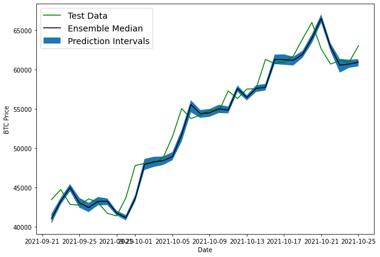
    


So far all the models predictions are lagging behind the test data, essentially doing the same thing as the naive model - predicting the prev timestep as the next timestep

Potential Problems:

* Overfitting
* Model might be copying the naive model
* Data isn't predictable (I believe this is the main problem)


Note: the prediction intervals were made assuming the model's data is normally distributed


# Model 9 - predicting into the future by training on full data <a name="model9"></a>


```python
bitcoin_prices_windowed.head()
```


<div>
<style scoped>
    .dataframe tbody tr th:only-of-type {
        vertical-align: middle;
    }

    .dataframe tbody tr th {
        vertical-align: top;
    }

    .dataframe thead th {
        text-align: right;
    }
</style>
<table border="1" class="dataframe">
  <thead>
    <tr style="text-align: right;">
      <th></th>
      <th>Price</th>
      <th>block_reward</th>
      <th>Price+1</th>
      <th>Price+2</th>
      <th>Price+3</th>
      <th>Price+4</th>
      <th>Price+5</th>
      <th>Price+6</th>
      <th>Price+7</th>
    </tr>
    <tr>
      <th>Date</th>
      <th></th>
      <th></th>
      <th></th>
      <th></th>
      <th></th>
      <th></th>
      <th></th>
      <th></th>
      <th></th>
    </tr>
  </thead>
  <tbody>
    <tr>
      <th>2014-11-04</th>
      <td>324.71833</td>
      <td>25</td>
      <td>NaN</td>
      <td>NaN</td>
      <td>NaN</td>
      <td>NaN</td>
      <td>NaN</td>
      <td>NaN</td>
      <td>NaN</td>
    </tr>
    <tr>
      <th>2014-11-05</th>
      <td>332.45666</td>
      <td>25</td>
      <td>324.71833</td>
      <td>NaN</td>
      <td>NaN</td>
      <td>NaN</td>
      <td>NaN</td>
      <td>NaN</td>
      <td>NaN</td>
    </tr>
    <tr>
      <th>2014-11-06</th>
      <td>336.58500</td>
      <td>25</td>
      <td>332.45666</td>
      <td>324.71833</td>
      <td>NaN</td>
      <td>NaN</td>
      <td>NaN</td>
      <td>NaN</td>
      <td>NaN</td>
    </tr>
    <tr>
      <th>2014-11-07</th>
      <td>346.77500</td>
      <td>25</td>
      <td>336.58500</td>
      <td>332.45666</td>
      <td>324.71833</td>
      <td>NaN</td>
      <td>NaN</td>
      <td>NaN</td>
      <td>NaN</td>
    </tr>
    <tr>
      <th>2014-11-08</th>
      <td>344.81166</td>
      <td>25</td>
      <td>346.77500</td>
      <td>336.58500</td>
      <td>332.45666</td>
      <td>324.71833</td>
      <td>NaN</td>
      <td>NaN</td>
      <td>NaN</td>
    </tr>
  </tbody>
</table>
</div>


```python
HORIZON = 1
WINDOW_SIZE = 7
```


```python
# Train model on entire data to make predictions for the next day
X_all = bitcoin_prices_windowed.dropna().drop(['Price', 'block_reward'], axis=1).to_numpy()
y_all = bitcoin_prices_windowed.dropna()['Price'].to_numpy()

len(X_all), len(y_all)
```


    (2541, 2541)


```python
# Turn data into efficient running tensors
features_dataset_all = tf.data.Dataset.from_tensor_slices(X_all)
labels_dataset_all = tf.data.Dataset.from_tensor_slices(y_all)

dataset_all = tf.data.Dataset.zip((features_dataset_all, labels_dataset_all))

BATCH_SIZE = 1024
dataset_all = dataset_all.batch(BATCH_SIZE).prefetch(tf.data.AUTOTUNE)

dataset_all
```


    <PrefetchDataset shapes: ((None, 7), (None,)), types: (tf.float64, tf.float64)>


```python
tf.random.set_seed(42)

# create simple model
model_9 = tf.keras.Sequential([
  layers.Dense(128, activation='relu'),
  layers.Dense(128, activation='relu'),
  layers.Dense(HORIZON)
], name='model_9_future_model')

model_9.compile(loss=tf.keras.losses.mae,
                optimizer=tf.keras.optimizers.Adam())

model_9.fit(dataset_all,
            epochs = 100,
            verbose=0)
```


    <keras.callbacks.History at 0x7f9e7a326810>


## Make predictions into the future


```python
# How many timesteps to predict into the future?
INTO_FUTURE = 14
```

To make predictions into the future we want a function which:

1. Takes as an input:

* a list of values (Bitcoin historical)
* a trained model
* a window into the future to predict (`INTO_FUTURE`)
* window size a model was trained (`WINDOW_SIZE`)

2. Creates an empty list for future forecasts which we will fill up and extracts the last `WINDOW SIZE` values from the input values

3. Loop `INTO_FUTURE` times making a prediction on `WINDOW_SIZE` sequences which update to remove the first value and append the latest prediction


```python
def make_forecast(data, model, into_future, window_size):
  forecasts = []
  inputs = data[-window_size:]

  for i in range(0, into_future):
    pred = model.predict(tf.data.Dataset.from_tensor_slices(inputs.reshape((1,7))).batch(BATCH_SIZE))
    print(f"Predicting on: \n {inputs} -> Prediction: {pred[0][0]}\n")
    forecasts.append(pred[0][0])
    inputs = np.append(inputs, pred)
    inputs = inputs[-window_size:]
  
  return forecasts
```


```python
make_forecast(y_all, model_9, INTO_FUTURE, WINDOW_SIZE)
```

    Predicting on: 
     [63901.07308021 65972.86312976 62603.57506991 60689.23826486
     61124.34712562 60936.15085142 63004.38111467] -> Prediction: 64438.8203125
    
    Predicting on: 
     [65972.86312976 62603.57506991 60689.23826486 61124.34712562
     60936.15085142 63004.38111467 64438.8203125 ] -> Prediction: 63827.90625
    
    Predicting on: 
     [62603.57506991 60689.23826486 61124.34712562 60936.15085142
     63004.38111467 64438.8203125  63827.90625   ] -> Prediction: 61270.8984375
    
    Predicting on: 
     [60689.23826486 61124.34712562 60936.15085142 63004.38111467
     64438.8203125  63827.90625    61270.8984375 ] -> Prediction: 60892.890625
    
    Predicting on: 
     [61124.34712562 60936.15085142 63004.38111467 64438.8203125
     63827.90625    61270.8984375  60892.890625  ] -> Prediction: 61533.6796875
    
    Predicting on: 
     [60936.15085142 63004.38111467 64438.8203125  63827.90625
     61270.8984375  60892.890625   61533.6796875 ] -> Prediction: 62313.30859375
    
    Predicting on: 
     [63004.38111467 64438.8203125  63827.90625    61270.8984375
     60892.890625   61533.6796875  62313.30859375] -> Prediction: 63516.15234375
    
    Predicting on: 
     [64438.8203125  63827.90625    61270.8984375  60892.890625
     61533.6796875  62313.30859375 63516.15234375] -> Prediction: 63653.12890625
    
    Predicting on: 
     [63827.90625    61270.8984375  60892.890625   61533.6796875
     62313.30859375 63516.15234375 63653.12890625] -> Prediction: 62261.9921875
    
    Predicting on: 
     [61270.8984375  60892.890625   61533.6796875  62313.30859375
     63516.15234375 63653.12890625 62261.9921875 ] -> Prediction: 61014.31640625
    
    Predicting on: 
     [60892.890625   61533.6796875  62313.30859375 63516.15234375
     63653.12890625 62261.9921875  61014.31640625] -> Prediction: 61434.3984375
    
    Predicting on: 
     [61533.6796875  62313.30859375 63516.15234375 63653.12890625
     62261.9921875  61014.31640625 61434.3984375 ] -> Prediction: 62239.453125
    
    Predicting on: 
     [62313.30859375 63516.15234375 63653.12890625 62261.9921875
     61014.31640625 61434.3984375  62239.453125  ] -> Prediction: 62905.96484375
    
    Predicting on: 
     [63516.15234375 63653.12890625 62261.9921875  61014.31640625
     61434.3984375  62239.453125   62905.96484375] -> Prediction: 63236.1484375
    


    [64438.82,
     63827.906,
     61270.9,
     60892.89,
     61533.68,
     62313.31,
     63516.152,
     63653.13,
     62261.992,
     61014.316,
     61434.4,
     62239.453,
     62905.965,
     63236.15]


```python
future_forecast = make_forecast(y_all, model_9, INTO_FUTURE, WINDOW_SIZE)
```

    Predicting on: 
     [63901.07308021 65972.86312976 62603.57506991 60689.23826486
     61124.34712562 60936.15085142 63004.38111467] -> Prediction: 64438.8203125
    
    Predicting on: 
     [65972.86312976 62603.57506991 60689.23826486 61124.34712562
     60936.15085142 63004.38111467 64438.8203125 ] -> Prediction: 63827.90625
    
    Predicting on: 
     [62603.57506991 60689.23826486 61124.34712562 60936.15085142
     63004.38111467 64438.8203125  63827.90625   ] -> Prediction: 61270.8984375
    
    Predicting on: 
     [60689.23826486 61124.34712562 60936.15085142 63004.38111467
     64438.8203125  63827.90625    61270.8984375 ] -> Prediction: 60892.890625
    
    Predicting on: 
     [61124.34712562 60936.15085142 63004.38111467 64438.8203125
     63827.90625    61270.8984375  60892.890625  ] -> Prediction: 61533.6796875
    
    Predicting on: 
     [60936.15085142 63004.38111467 64438.8203125  63827.90625
     61270.8984375  60892.890625   61533.6796875 ] -> Prediction: 62313.30859375
    
    Predicting on: 
     [63004.38111467 64438.8203125  63827.90625    61270.8984375
     60892.890625   61533.6796875  62313.30859375] -> Prediction: 63516.15234375
    
    Predicting on: 
     [64438.8203125  63827.90625    61270.8984375  60892.890625
     61533.6796875  62313.30859375 63516.15234375] -> Prediction: 63653.12890625
    
    Predicting on: 
     [63827.90625    61270.8984375  60892.890625   61533.6796875
     62313.30859375 63516.15234375 63653.12890625] -> Prediction: 62261.9921875
    
    Predicting on: 
     [61270.8984375  60892.890625   61533.6796875  62313.30859375
     63516.15234375 63653.12890625 62261.9921875 ] -> Prediction: 61014.31640625
    
    Predicting on: 
     [60892.890625   61533.6796875  62313.30859375 63516.15234375
     63653.12890625 62261.9921875  61014.31640625] -> Prediction: 61434.3984375
    
    Predicting on: 
     [61533.6796875  62313.30859375 63516.15234375 63653.12890625
     62261.9921875  61014.31640625 61434.3984375 ] -> Prediction: 62239.453125
    
    Predicting on: 
     [62313.30859375 63516.15234375 63653.12890625 62261.9921875
     61014.31640625 61434.3984375  62239.453125  ] -> Prediction: 62905.96484375
    
    Predicting on: 
     [63516.15234375 63653.12890625 62261.9921875  61014.31640625
     61434.3984375  62239.453125   62905.96484375] -> Prediction: 63236.1484375
    


## Plotting the predictions into the future


```python
def get_future_dates(start_date, into_future, offset=1):
  """
  Returns array of datetime values from ranging from start_date to start_date+horizon.

  start_date: date to start range (np.datetime64)
  into_future: number of days to add onto start date for range (int)
  offset: number of days to offset start_date by (default 1)
  """
  start_date = start_date + np.timedelta64(offset, "D") # specify start date, "D" stands for day
  end_date = start_date + np.timedelta64(into_future, "D") # specify end date
  return np.arange(start_date, end_date, dtype="datetime64[D]") # return a date range between start date and end date
```


```python
# Last timestep of timesteps (currently in np.datetime64 format)
last_timestep = bitcoin_prices.index[-1]
last_timestep
```


    Timestamp('2021-10-25 00:00:00')


```python
# Get next two weeks of timesteps
next_time_steps = get_future_dates(start_date=last_timestep, 

                                   into_future=INTO_FUTURE)
next_time_steps
```


    array(['2021-10-26', '2021-10-27', '2021-10-28', '2021-10-29',
           '2021-10-30', '2021-10-31', '2021-11-01', '2021-11-02',
           '2021-11-03', '2021-11-04', '2021-11-05', '2021-11-06',
           '2021-11-07', '2021-11-08'], dtype='datetime64[D]')


```python
# Insert last timestep/final price so the graph doesn't look messed
next_time_steps = np.insert(next_time_steps, 0, last_timestep)
future_forecast = np.insert(future_forecast, 0, prices[-1])
next_time_steps, future_forecast
```


    (array(['2021-10-25', '2021-10-26', '2021-10-27', '2021-10-28',
            '2021-10-29', '2021-10-30', '2021-10-31', '2021-11-01',
            '2021-11-02', '2021-11-03', '2021-11-04', '2021-11-05',
            '2021-11-06', '2021-11-07', '2021-11-08'], dtype='datetime64[D]'),
     array([63004.383, 64438.82 , 63827.906, 61270.9  , 60892.89 , 61533.68 ,
            62313.31 , 63516.152, 63653.13 , 62261.992, 61014.316, 61434.4  ,
            62239.453, 62905.965, 63236.15 ], dtype=float32))


```python
# Plot future price predictions of Bitcoin
plt.figure(figsize=(10, 7))
plot_time_series(bitcoin_prices.index, prices, start=2500, format="-", label="Actual BTC Price")
plot_time_series(next_time_steps, future_forecast, format="-", label="Predicted BTC Price")
```


    
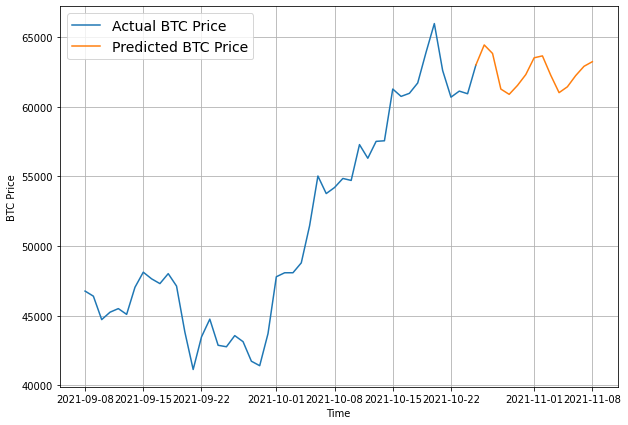
    


# Model 10 - turkey data <a name="model10"></a>

Showing why forecasting is BS

One single unpredictable datapoint can ruin everything


```python
# Let's introduce a Turkey problem to our BTC data (price BTC falls 100x in one day)
btc_price_turkey = prices.copy()
btc_price_turkey[-1] = btc_price_turkey[-1] / 100
```


```python
# Manufacture an extra price on the end (to showcase the Turkey problem)
btc_price_turkey[-10:]
```


    [60744.9849380446,
     60965.4654336171,
     61707.4813118213,
     63901.0730802098,
     65972.8631297649,
     62603.5750699116,
     60689.2382648626,
     61124.3471256221,
     60936.1508514192,
     630.043811146675]


```python
# Get the timesteps for the turkey problem 
btc_timesteps_turkey = np.array(bitcoin_prices.index)
btc_timesteps_turkey[-10:]
```


    array(['2021-10-16T00:00:00.000000000', '2021-10-17T00:00:00.000000000',
           '2021-10-18T00:00:00.000000000', '2021-10-19T00:00:00.000000000',
           '2021-10-20T00:00:00.000000000', '2021-10-21T00:00:00.000000000',
           '2021-10-22T00:00:00.000000000', '2021-10-23T00:00:00.000000000',
           '2021-10-24T00:00:00.000000000', '2021-10-25T00:00:00.000000000'],
          dtype='datetime64[ns]')


```python
plt.figure(figsize=(10, 7))
plot_time_series(timesteps=btc_timesteps_turkey, 
                 values=btc_price_turkey, 
                 format="-", 
                 label="BTC Price + Turkey Problem", 
                 start=2500)
```


    
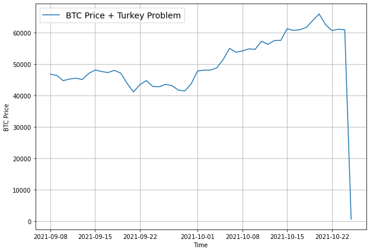
    


```python
# Create train and test sets for turkey problem data
full_windows, full_labels = make_windows(np.array(btc_price_turkey), window_size=WINDOW_SIZE, horizon=HORIZON)
len(full_windows), len(full_labels)

X_train, X_test, y_train, y_test = make_train_test_splits(full_windows, full_labels)
len(X_train), len(X_test), len(y_train), len(y_test)
```


    (2032, 509, 2032, 509)


```python
# Clone model 1 architecture for turkey model and fit the turkey model on the turkey data
turkey_model = tf.keras.models.clone_model(model_1)
turkey_model._name = "Turkey_Model"
turkey_model.compile(loss="mae",
                     optimizer=tf.keras.optimizers.Adam())
turkey_model.fit(X_train, y_train,
                 epochs=100,
                 verbose=0,
                 validation_data=(X_test, y_test),
                 callbacks=[create_model_checkpoint(turkey_model.name)])
```

    INFO:tensorflow:Assets written to: model_experiments/Turkey_Model/assets


    INFO:tensorflow:Assets written to: model_experiments/Turkey_Model/assets


    INFO:tensorflow:Assets written to: model_experiments/Turkey_Model/assets


    INFO:tensorflow:Assets written to: model_experiments/Turkey_Model/assets


    INFO:tensorflow:Assets written to: model_experiments/Turkey_Model/assets


    INFO:tensorflow:Assets written to: model_experiments/Turkey_Model/assets


    INFO:tensorflow:Assets written to: model_experiments/Turkey_Model/assets


    INFO:tensorflow:Assets written to: model_experiments/Turkey_Model/assets


    INFO:tensorflow:Assets written to: model_experiments/Turkey_Model/assets


    INFO:tensorflow:Assets written to: model_experiments/Turkey_Model/assets


    INFO:tensorflow:Assets written to: model_experiments/Turkey_Model/assets


    INFO:tensorflow:Assets written to: model_experiments/Turkey_Model/assets


    INFO:tensorflow:Assets written to: model_experiments/Turkey_Model/assets


    INFO:tensorflow:Assets written to: model_experiments/Turkey_Model/assets


    INFO:tensorflow:Assets written to: model_experiments/Turkey_Model/assets


    INFO:tensorflow:Assets written to: model_experiments/Turkey_Model/assets


    INFO:tensorflow:Assets written to: model_experiments/Turkey_Model/assets


    INFO:tensorflow:Assets written to: model_experiments/Turkey_Model/assets


    INFO:tensorflow:Assets written to: model_experiments/Turkey_Model/assets


    INFO:tensorflow:Assets written to: model_experiments/Turkey_Model/assets


    INFO:tensorflow:Assets written to: model_experiments/Turkey_Model/assets


    INFO:tensorflow:Assets written to: model_experiments/Turkey_Model/assets


    INFO:tensorflow:Assets written to: model_experiments/Turkey_Model/assets


    INFO:tensorflow:Assets written to: model_experiments/Turkey_Model/assets


    INFO:tensorflow:Assets written to: model_experiments/Turkey_Model/assets


    INFO:tensorflow:Assets written to: model_experiments/Turkey_Model/assets


    INFO:tensorflow:Assets written to: model_experiments/Turkey_Model/assets


    INFO:tensorflow:Assets written to: model_experiments/Turkey_Model/assets


    INFO:tensorflow:Assets written to: model_experiments/Turkey_Model/assets


    INFO:tensorflow:Assets written to: model_experiments/Turkey_Model/assets


    INFO:tensorflow:Assets written to: model_experiments/Turkey_Model/assets


    INFO:tensorflow:Assets written to: model_experiments/Turkey_Model/assets


    INFO:tensorflow:Assets written to: model_experiments/Turkey_Model/assets


    INFO:tensorflow:Assets written to: model_experiments/Turkey_Model/assets


    INFO:tensorflow:Assets written to: model_experiments/Turkey_Model/assets


    INFO:tensorflow:Assets written to: model_experiments/Turkey_Model/assets


    INFO:tensorflow:Assets written to: model_experiments/Turkey_Model/assets


    INFO:tensorflow:Assets written to: model_experiments/Turkey_Model/assets


    INFO:tensorflow:Assets written to: model_experiments/Turkey_Model/assets


    INFO:tensorflow:Assets written to: model_experiments/Turkey_Model/assets


    INFO:tensorflow:Assets written to: model_experiments/Turkey_Model/assets


    INFO:tensorflow:Assets written to: model_experiments/Turkey_Model/assets


    INFO:tensorflow:Assets written to: model_experiments/Turkey_Model/assets


    INFO:tensorflow:Assets written to: model_experiments/Turkey_Model/assets


    <keras.callbacks.History at 0x7f9dfcec6850>


```python
# Load best model and evaluate on test data
turkey_model = tf.keras.models.load_model("model_experiments/Turkey_Model/")
turkey_model.evaluate(X_test, y_test)
```

    16/16 [==============================] - 0s 3ms/step - loss: 1034.4946


    1034.49462890625


```python
# Make predictions with Turkey model
turkey_preds = make_preds(turkey_model, X_test)
turkey_preds[:10]
```


    <tf.Tensor: shape=(10,), dtype=float32, numpy=
    array([9660.122, 9827.668, 9672.227, 9759.875, 9710.475, 9807.82 ,
           9819.334, 9879.259, 9335.341, 9451.662], dtype=float32)>


```python
# Evaluate turkey preds
turkey_results = evaluate_preds(y_true=y_test,
                                y_pred=turkey_preds)
turkey_results
```


    {'mae': 20278.744,
     'mape': 108.450264,
     'mase': 19.489779,
     'mse': 633565600.0,
     'rmse': 24717.24}


And with just one value change, our error metrics go through the roof.

To make sure, let's remind ourselves of how model_1 went on unmodified Bitcoin data (no turkey problem).


```python
# Comparing to model 1
model_1_results
```


    {'mae': 933.08374,
     'mape': 2.6302116,
     'mase': 1.0078244,
     'mse': 2106266.2,
     'rmse': 1451.2981}


```python
plt.figure(figsize=(10, 7))
# plot_time_series(timesteps=btc_timesteps_turkey[:split_size], values=btc_price_turkey[:split_size], label="Train Data")
offset=300
plot_time_series(timesteps=btc_timesteps_turkey[-len(X_test):], 
                 values=btc_price_turkey[-len(y_test):], 
                 format="-", 
                 label="Turkey Test Data", start=offset)
plot_time_series(timesteps=btc_timesteps_turkey[-len(X_test):],
                 values=turkey_preds, 
                 label="Turkey Preds", 
                 start=offset);
```


    

    


Highly unlikely price movements (based on historical movements), upward or downward will likely never be part of a forecast.

However, as we've seen, despite their unlikeliness, these events can happen and will have huuuuuuuuge impacts to the performance of our models.

# Comparing the models <a name="comparing"></a>


```python
# Compare different model results (w = window, h = horizon, e.g. w=7 means a window size of 7)
model_results = pd.DataFrame({"naive_model": naive_results,
                              "model_1_dense_w7_h1": model_1_results,
                              "model_2_dense_w30_h1": model_2_results,
                              "model_3_dense_w30_h7": model_3_results,
                              "model_4_CONV1D": model_4_results,
                              "model_5_LSTM": model_5_results,
                              "model_6_multivariate": model_6_results,
                              "model_8_NBEATs": model_7_results,
                              "model_9_ensemble": ensemble_results,
                              "model_10_turkey": turkey_results}).T
model_results.head(10)
```


<div>
<style scoped>
    .dataframe tbody tr th:only-of-type {
        vertical-align: middle;
    }

    .dataframe tbody tr th {
        vertical-align: top;
    }

    .dataframe thead th {
        text-align: right;
    }
</style>
<table border="1" class="dataframe">
  <thead>
    <tr style="text-align: right;">
      <th></th>
      <th>mae</th>
      <th>mse</th>
      <th>rmse</th>
      <th>mape</th>
      <th>mase</th>
    </tr>
  </thead>
  <tbody>
    <tr>
      <th>naive_model</th>
      <td>924.304138</td>
      <td>2.055079e+06</td>
      <td>1433.554810</td>
      <td>2.604794</td>
      <td>0.998342</td>
    </tr>
    <tr>
      <th>model_1_dense_w7_h1</th>
      <td>933.083740</td>
      <td>2.106266e+06</td>
      <td>1451.298096</td>
      <td>2.630212</td>
      <td>1.007824</td>
    </tr>
    <tr>
      <th>model_2_dense_w30_h1</th>
      <td>990.399170</td>
      <td>2.314996e+06</td>
      <td>1521.510986</td>
      <td>2.788899</td>
      <td>1.059855</td>
    </tr>
    <tr>
      <th>model_3_dense_w30_h7</th>
      <td>2047.885620</td>
      <td>1.015826e+07</td>
      <td>2338.837646</td>
      <td>5.766706</td>
      <td>2.206674</td>
    </tr>
    <tr>
      <th>model_4_CONV1D</th>
      <td>923.650879</td>
      <td>2.076426e+06</td>
      <td>1440.981079</td>
      <td>2.604802</td>
      <td>0.997636</td>
    </tr>
    <tr>
      <th>model_5_LSTM</th>
      <td>998.500732</td>
      <td>2.332680e+06</td>
      <td>1527.311401</td>
      <td>2.825422</td>
      <td>1.078481</td>
    </tr>
    <tr>
      <th>model_6_multivariate</th>
      <td>922.858459</td>
      <td>2.067919e+06</td>
      <td>1438.026123</td>
      <td>2.603089</td>
      <td>0.996780</td>
    </tr>
    <tr>
      <th>model_8_NBEATs</th>
      <td>952.499390</td>
      <td>2.230254e+06</td>
      <td>1493.403564</td>
      <td>2.683706</td>
      <td>1.028795</td>
    </tr>
    <tr>
      <th>model_9_ensemble</th>
      <td>922.459595</td>
      <td>2.083583e+06</td>
      <td>1443.462036</td>
      <td>2.603472</td>
      <td>0.996349</td>
    </tr>
    <tr>
      <th>model_10_turkey</th>
      <td>20278.744141</td>
      <td>6.335656e+08</td>
      <td>24717.240234</td>
      <td>108.450264</td>
      <td>19.489779</td>
    </tr>
  </tbody>
</table>
</div>


```python
# Sort model results by MAE and plot them
model_results[["mae"]].sort_values(by="mae").plot(figsize=(10, 7), kind="bar");
```


    
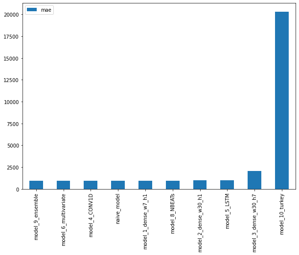
    

